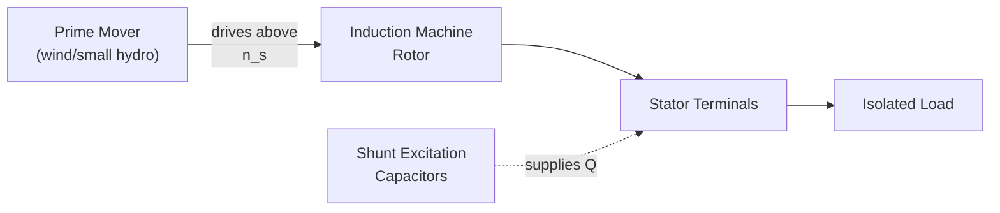
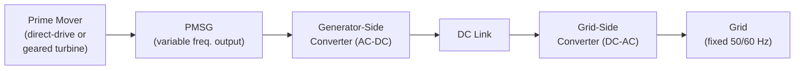

## Induction and Permanent-Magnet Generators

### Overview

Induction generators (IG) and permanent-magnet synchronous generators (PMSG) are the two dominant non-wound-field-synchronous alternatives for electromechanical power generation, particularly prevalent in wind energy conversion systems, small hydro, and distributed generation. Unlike the wound-field synchronous generator, neither requires a separate DC field excitation winding, though their operating principles and grid-interaction characteristics differ substantially from each other and from the conventional synchronous machine.

### Induction Generators

#### Principle of Operation

An induction machine operates as a generator when driven above synchronous speed by an external prime mover, reversing the direction of rotor slip and, consequently, the direction of real power flow at the stator terminals.

Slip is defined as:

$$s = \frac{n_s - n_r}{n_s}$$

where $n_s$ is synchronous speed ($n_s = 120f/P$) and $n_r$ is actual rotor mechanical speed.

**Key Points**

- $s > 0$ (rotor slower than $n_s$): motoring — machine draws real power from the electrical system.
- $s = 0$: rotor at exact synchronous speed — zero torque, zero power transfer.
- $s < 0$ (rotor driven faster than $n_s$ by prime mover): generating — machine delivers real power to the electrical system.

**[Inference]** This sign reversal occurs because the induced rotor currents, and the resulting torque, always act to oppose the relative motion between rotor and stator field (Lenz's law); driving the rotor faster than the field reverses the torque direction from driving to braking (from the prime mover's perspective), which corresponds to electrical power delivery rather than absorption.

#### Reactive Power Requirement

**Key Points**

- Induction generators have no independent field winding/DC excitation — the magnetizing flux is established entirely by reactive current drawn from the stator terminals (from the grid, or from an external/local reactive source).
- Consequently, an induction generator **always absorbs reactive power** (unlike a synchronous generator, whose excitation can be adjusted to supply, absorb, or hold zero $Q$).
- Grid-connected induction generators rely on the grid (or shunt capacitor banks, or power-electronic converters in modern designs) to supply this magnetizing reactive power — they cannot operate as a standalone voltage source without an external reactive supply.

#### Self-Excited Induction Generator (SEIG)

For isolated (off-grid) operation, shunt capacitors connected across the stator terminals supply the magnetizing reactive power, allowing the machine to build up voltage from residual rotor magnetism (similar in concept to self-excitation in DC generators).

**Key Points**

- Voltage buildup requires sufficient residual magnetism in the rotor core and a capacitance value above a minimum threshold determined by the machine's magnetization characteristic and rotor speed.
- Output voltage and frequency in a SEIG are load- and speed-dependent (not rigidly fixed as in a grid-connected synchronous machine), making voltage/frequency regulation more complex — often requiring power-electronic conditioning for loads sensitive to voltage/frequency variation.
- **[Unverified]** Minimum capacitance and voltage-buildup conditions are machine-specific, depending on the magnetization curve and rotor speed, and are typically determined via the machine's no-load magnetization test data rather than a generic formula.

#### Squirrel-Cage vs. Wound-Rotor / Doubly-Fed Induction Generator

| Type | Rotor Construction | Speed Range | Typical Application |
| --- | --- | --- | --- |
| Squirrel-cage induction generator (SCIG) | Cast/fabricated bars, shorted rings | Narrow (near-synchronous, small negative slip) | Fixed-speed wind turbines, small hydro |
| Doubly-fed induction generator (DFIG) | Wound rotor with slip rings, connected to a back-to-back power converter | Wide (variable speed, roughly ±30% of synchronous) | Variable-speed wind turbines (widely deployed configuration) |

**Key Points**

- In a DFIG, the stator connects directly to the grid while the rotor is fed via a partially-rated (typically ~25–30% of machine rating) back-to-back AC-AC converter, allowing independent control of rotor frequency/current and, consequently, decoupled real and reactive power control over a wide speed range.
- **[Unverified]** The exact converter sizing fraction and speed range vary by turbine manufacturer and design generation; commonly cited figures should be treated as typical/illustrative rather than fixed values.
- The partially-rated converter is a key economic advantage of the DFIG configuration relative to a fully-rated converter system, since converter cost scales with its power rating.

#### Advantages and Disadvantages

**Key Points**

Advantages:

- Simple, rugged construction (especially SCIG) — no rotor winding, no slip rings/brushes on the power path (SCIG case), lower maintenance than wound-field synchronous machines.
- Self-synchronizing to grid frequency (no synchronization procedure required for grid-connected SCIG — the machine naturally settles near synchronous speed).
- Lower cost per unit capacity for basic SCIG configurations.

Disadvantages:

- Cannot control terminal voltage independently — no field excitation control; always absorbs reactive power (SCIG) unless paired with an external reactive source or converter (DFIG).
- Cannot provide voltage support to a weak grid the way a synchronous generator can.
- Vulnerable to voltage instability ("self-excitation" runaway, or conversely voltage collapse) if disconnected from the grid without proper protection, since sudden loss of grid-supplied reactive power can cause severe transients.

### Permanent-Magnet Synchronous Generators (PMSG)

#### Principle of Operation

A PMSG replaces the wound field winding (and its DC excitation supply, slip rings/brushes, and associated losses) with permanent magnets mounted on or within the rotor, producing a fixed rotor magnetic field without any electrical excitation input.

**Key Points**

- Operates on the same fundamental synchronous machine principle ($f = Pn_s/120$) as a wound-field synchronous generator, but with $E_A$ (internal EMF) essentially fixed by magnet strength and rotor speed rather than being independently controllable via field current.
- No field copper losses and no excitation power requirement, improving efficiency relative to wound-field machines, particularly at partial load.
- No brushes or slip rings (for the field circuit) — reduced maintenance.

#### Rotor Magnet Configurations

| Configuration | Description |
| --- | --- |
| Surface-mounted PM (SPM) | Magnets bonded to rotor surface; simpler construction, near-uniform air gap |
| Interior PM (IPM) | Magnets embedded within rotor laminations; enables additional reluctance torque component, more robust mechanically at high speed |

**[Inference]** IPM designs are generally favored in variable-speed, high-torque-density applications (such as direct-drive wind turbines) because embedding the magnets provides better mechanical retention at speed and allows the reluctance-torque term to supplement magnet torque, whereas SPM designs are simpler to manufacture and analyze but more exposed to demagnetization risk and mechanical stress at the rotor surface.

#### Grid Interface

Because rotor field strength (and thus $E_A$) cannot be actively regulated, PMSGs are almost universally interfaced to the grid via a **fully-rated power electronic converter** (back-to-back AC-DC-AC, or generator-side rectifier plus grid-side inverter):

**Key Points**

- The fully-rated converter decouples generator-side frequency/voltage (which varies with prime-mover speed, since PMSG output frequency directly tracks rotor speed) from fixed grid frequency, enabling true variable-speed operation across the full speed range.
- The grid-side converter also provides independent real and reactive power control at the point of common coupling, similar in capability to a synchronous generator's $P$/$Q$ control but implemented through power-electronic control loops rather than a governor/AVR pair.
- This full decoupling is the key structural difference from a DFIG, where only a fraction of power flows through the converter.

#### Advantages and Disadvantages

**Key Points**

Advantages:

- High efficiency (no field losses), particularly beneficial at partial load and low speed.
- No slip rings/brushes on the field circuit.
- Enables direct-drive (gearless) turbine architectures when designed with a high pole count, eliminating the mechanical gearbox and its associated maintenance/reliability concerns.
- Full independent $P$/$Q$ controllability via the grid-side converter, similar in flexibility to a synchronous generator, without requiring a physical exciter.

Disadvantages:

- Permanent magnet material cost (particularly rare-earth magnets such as NdFeB) is a significant cost driver and subject to raw-material price/supply volatility.
- Fixed excitation means no direct field-current-based voltage/fault-current control — fault behavior and voltage support are entirely dependent on converter control and protection schemes.
- Risk of magnet demagnetization under sustained high temperature or severe fault-current conditions if not properly protected by converter current limiting.
- Requires a fully-rated converter (higher converter cost than a DFIG's partial-rated converter) for the same machine rating.

### Comparison Summary

| Characteristic | Induction Generator (SCIG) | DFIG | PMSG |
| --- | --- | --- | --- |
| Field excitation source | Grid/capacitors (reactive) | Rotor-side converter | Permanent magnets (fixed) |
| Speed range | Narrow (near-sync) | Wide (~±30%, typical) | Full variable speed |
| Converter rating | None (or none, SCIG) | Partial (~25–30% typical) | Full (100%) |
| Independent voltage/Q control | No | Yes (via rotor converter) | Yes (via grid-side converter) |
| Brushes/slip rings | No (SCIG) / Yes (DFIG rotor) | Yes | No |
| Typical application | Fixed-speed wind, small hydro | Variable-speed wind (geared) | Direct-drive wind, small variable-speed hydro |

### Common Pitfalls

**Key Points**

- Assuming an induction generator can regulate its own terminal voltage — without a field winding, it fundamentally cannot; voltage support requires the grid, external capacitors, or a converter.
- Confusing DFIG partial-converter operation with PMSG full-converter operation when discussing fault ride-through behavior — the two respond very differently during grid faults due to differing converter power fractions and rotor-side exposure to grid transients.
- Treating PMSG output frequency as fixed — since there is no separate rectification/conversion stage assumed, generator-side frequency varies directly with rotor speed and must be decoupled from grid frequency by the power converter.
- Overlooking self-excited induction generator (SEIG) voltage/frequency instability in isolated operation — unlike grid-connected operation, SEIG behavior is highly sensitive to load and capacitance, and is not a drop-in substitute for a synchronous generator in standalone applications without additional power-electronic conditioning.

### Related Topics

- Synchronous generator construction and operation (baseline comparison)
- Generator excitation systems and voltage regulation
- Wind energy conversion system topologies (fixed-speed, DFIG, direct-drive)
- Power electronic converter control for grid-connected generation (back-to-back converters, grid-side control)
- Fault ride-through (FRT) / low-voltage ride-through (LVRT) requirements for renewable generators
- Slip and torque-speed characteristics of induction machines
- Reluctance and hybrid PM machine topologies