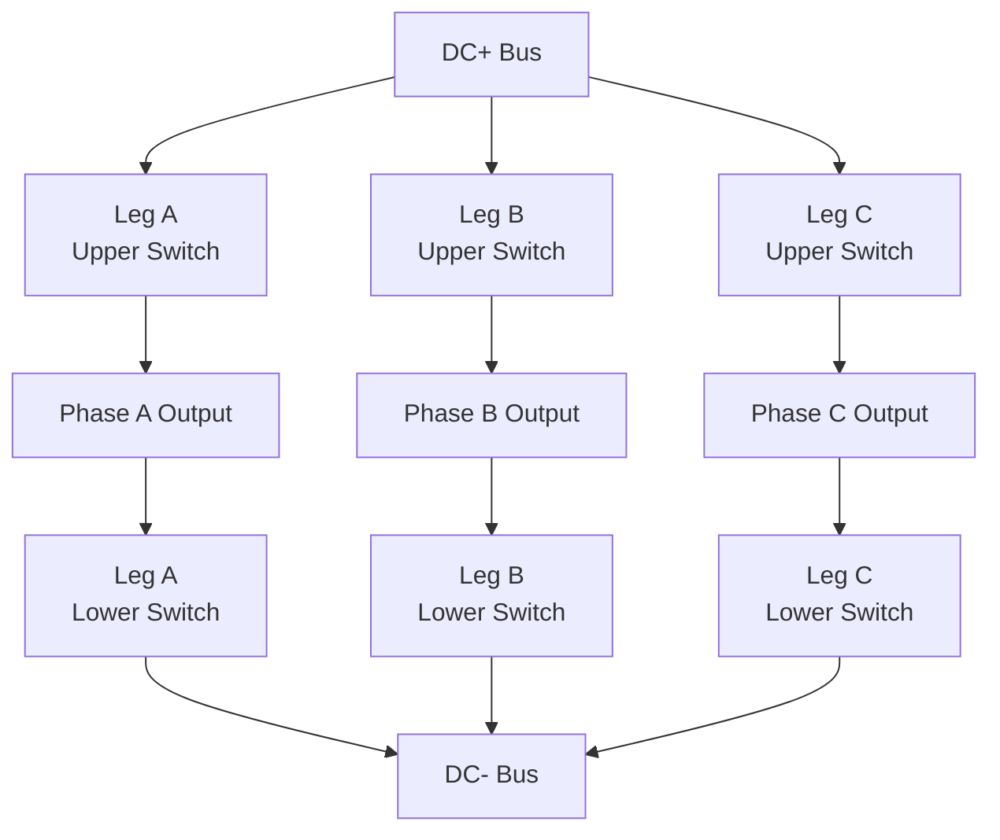
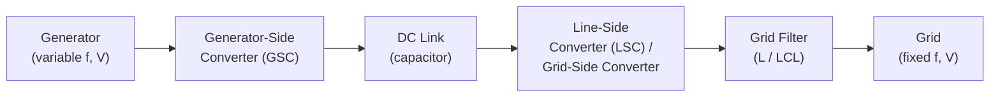
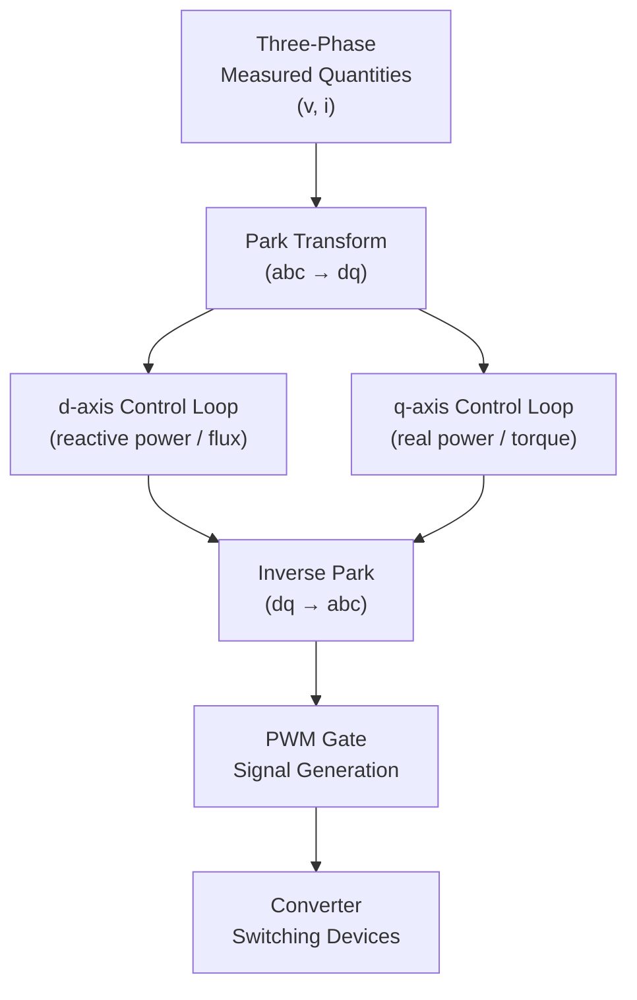

## Power Electronic Converters for Variable-Speed Generation

### Overview

Variable-speed generation systems—wind turbines, small hydro, and other renewable or distributed sources—require power electronic converters to interface a generator whose electrical frequency varies with prime-mover speed to a grid that demands fixed frequency and regulated voltage. This item covers the converter topologies, control structures, and design considerations that enable this frequency/voltage decoupling, building on the induction and permanent-magnet generator concepts from the prior item.

### Why Power Electronics Are Required

**Key Points**

- A generator driven at variable speed (to capture maximum energy across varying wind/water flow conditions) produces electrical output at a frequency that tracks rotor speed — incompatible with direct connection to a fixed-frequency grid.
- Power electronic converters decouple generator-side electrical quantities (variable frequency/voltage) from grid-side quantities (fixed frequency/voltage), while also enabling independent control of real and reactive power delivered to the grid.
- Variable-speed operation with power electronics allows operation near the maximum power point of the prime mover across a range of speeds (e.g., maximum power point tracking in wind turbines), which is not achievable with a fixed-speed, directly grid-coupled generator.

### Core Converter Building Blocks

#### The Two-Level Voltage Source Converter (VSC)

The fundamental building block for most variable-speed generation converters is the three-phase, two-level voltage source converter, built from semiconductor switching devices (commonly IGBTs for medium-voltage/medium-power applications) arranged in three half-bridge legs.

**Key Points**

- Each leg's two switches operate complementarily (with a dead-time gap to prevent shoot-through), synthesizing an AC waveform from the DC bus via pulse-width modulation (PWM).
- Switching frequency, DC bus voltage, and filter design (typically an LCL or L filter on the grid side) determine harmonic content and compliance with grid codes.
- **[Unverified]** Specific switching frequencies range widely by power level and device technology (from roughly 2–20 kHz for IGBT-based systems); exact values are design- and manufacturer-specific.

### Back-to-Back Converter Architecture

The dominant topology for both DFIG (partial-rated) and PMSG (fully-rated) variable-speed generation is the back-to-back voltage source converter: two VSCs sharing a common DC link, one facing the generator and one facing the grid.

**Key Points**

- The DC link capacitor decouples the two converter stages, allowing each side to be controlled largely independently subject to maintaining DC bus voltage balance (power in ≈ power out, neglecting losses and capacitor dynamics).
- **Generator-side converter (GSC):** Controls generator electrical torque (hence extracted mechanical power) and, in DFIG rotor-side application, rotor excitation/magnetizing conditions.
- **Grid-side (line-side) converter (LSC):** Regulates DC link voltage and controls real/reactive power exchange with the grid.

### DFIG Converter Configuration (Partial-Scale)

**Key Points**

- In a DFIG, the back-to-back converter connects to the **rotor** circuit (via slip rings), while the **stator** connects directly to the grid.
- Converter rating is only a fraction of total machine rating (commonly cited around 25–30% of machine rating, though this varies by design and target speed range) because it only needs to handle rotor slip power, not total machine power.
- Rotor-side converter (RSC) controls rotor currents to regulate stator-side real power (via torque) and reactive power (via rotor excitation, functionally similar to field current in a wound-field synchronous machine).
- Grid-side converter (GSC, on the rotor circuit's grid-facing side) primarily maintains DC bus voltage and can provide additional reactive power support, though typically with less capacity than the RSC due to its smaller rating.

**[Inference]** The reduced converter rating is the central economic advantage of the DFIG topology, since converter cost (semiconductors, cooling, control hardware) scales roughly with the power the converter must process — a partial-rated converter is significantly cheaper than a full-rated one for the same machine capacity, at the cost of narrower speed range and rotor-side exposure to grid disturbances via the slip rings.

### PMSG Converter Configuration (Full-Scale)

**Key Points**

- In a PMSG system, the converter must process the machine's **entire** power output, since the stator (the only electrical port) connects through the converter rather than directly to the grid.
- Generator-side converter (rectifier stage) controls generator torque/speed, typically implementing maximum power point tracking (MPPT) logic by adjusting torque reference to match the prime mover's optimal operating curve.
- Grid-side converter provides full independent control of real and reactive power injected to the grid, DC-link voltage regulation, and typically implements grid-code-required functions such as low-voltage ride-through (LVRT) and voltage/frequency support.
- Full decoupling means generator speed can range across the entire operating envelope (from near-zero to rated) without any direct electrical constraint from the grid side, unlike the DFIG's narrower speed range tied to converter rating.

### Control Structure: Vector (Field-Oriented) Control

Most modern variable-speed generation converters use vector control, transforming three-phase AC quantities into a synchronously rotating reference frame (d-q frame) where real and reactive power (or torque and flux) become independently controllable via DC-like quantities.

**Key Points**

- The Park transformation converts three-phase ($a$-$b$-$c$) quantities into two orthogonal DC-frame quantities ($d$, $q$) referenced to a rotating frame, typically aligned with either the stator voltage vector (grid-side control) or rotor flux vector (generator-side control in DFIG applications).
- **d-axis current** typically controls reactive power (or field/flux-related quantity).
- **q-axis current** typically controls real power (or torque-related quantity).
- This decoupling enables independent, fast (typically tens of milliseconds or faster inner-loop response) control of $P$ and $Q$, analogous in function—though very different in implementation—to the governor/AVR decoupling in a directly grid-coupled synchronous generator.

**[Unverified]** Specific control-loop bandwidths, tuning parameters, and reference-frame alignment conventions vary by manufacturer and application; the structure shown represents standard, widely documented practice rather than a single universal implementation.

### Maximum Power Point Tracking (MPPT)

For variable-speed wind/hydro applications, the generator-side converter typically implements a speed-power (or torque-speed) optimal tracking curve so the prime mover operates near its maximum available power for the current wind speed/flow condition.

**Key Points**

- Common MPPT approaches include a predetermined optimal torque-speed lookup curve (based on known turbine aerodynamic/hydraulic characteristics) or perturb-and-observe search algorithms.
- MPPT operation is distinct from, but coordinated with, grid-side real power control — the generator-side converter regulates how much mechanical power is extracted and converted to DC-link power, while the grid-side converter regulates how much of that power (net of DC-link balance) is delivered to the grid.

### DC Link Design Considerations

**Key Points**

- DC link voltage must exceed the peak line-to-line grid voltage (for the grid-side converter to synthesize a controllable AC waveform via PWM) — a general boost-type requirement inherent to VSC operation.
- DC link capacitor size affects voltage ripple, transient response, and the converter's ability to ride through brief power imbalances between generator-side and grid-side stages.
- Some designs include a chopper/braking resistor across the DC link to dissipate excess energy during grid faults (when the grid-side converter cannot export power but the generator-side converter continues supplying it), protecting the DC link from overvoltage.

### Grid Code Compliance Functions

Modern grid codes impose specific dynamic performance requirements on converter-interfaced generation, implemented in the grid-side converter control:

**Key Points**

- **Low-voltage ride-through (LVRT) / fault ride-through (FRT):** Requirement to remain connected and often continue supplying reactive current support during and after nearby grid voltage sags, rather than tripping offline.
- **Reactive power / power factor requirements:** Many grid codes require converter-interfaced generation to supply reactive power support within a specified range, similar in intent to synchronous generator capability curve requirements.
- **Frequency response:** Some grid codes require converter-based generation to provide synthetic inertia or frequency-droop response, emulating characteristics naturally present in directly-coupled synchronous machines.
- **[Unverified]** Specific LVRT voltage/time profiles and reactive current injection requirements vary significantly by jurisdiction and grid code (e.g., differing requirements across different countries' transmission system operators); compliance requirements must be verified against the applicable local grid code rather than assumed generic.

### Comparison: Partial-Scale vs. Full-Scale Converter Systems

| Characteristic | Partial-Scale (DFIG) | Full-Scale (PMSG or fully-converted induction/synchronous) |
| --- | --- | --- |
| Converter power rating | ~25–30% of machine rating (typical) | 100% of machine rating |
| Speed range | Limited (~±30% of synchronous, typical) | Full range (zero to rated) |
| Converter cost | Lower | Higher |
| Fault exposure | Rotor circuit exposed to stator-side grid transients via magnetic coupling | Generator largely decoupled from grid transients by full converter |
| Grid-code compliance flexibility | Constrained by smaller converter headroom | Greater flexibility (full converter authority over all power) |

### Common Pitfalls

**Key Points**

- Assuming all variable-speed converters are equivalently sized — partial-scale (DFIG) and full-scale (PMSG/full-converter) systems differ substantially in converter rating, cost, and fault behavior.
- Treating generator-side and grid-side converter control as fully independent — they are coupled through the DC link, and grid-side power export must track generator-side power input (net of DC-link dynamics) to maintain DC bus voltage stability.
- Overlooking DC-link overvoltage risk during grid faults — without adequate chopper/braking resistor capacity or fast control action, a sudden inability to export power to a faulted grid can rapidly overcharge the DC link.
- Assuming grid code requirements (LVRT profiles, reactive support obligations) are universal — these are jurisdiction-specific and must be verified against the applicable local interconnection standard.

### Related Topics

- Induction and permanent-magnet generators (generator-side machine characteristics)
- Vector (field-oriented) control theory for AC machines
- Pulse-width modulation (PWM) techniques and harmonic performance
- Grid code requirements for renewable/converter-interfaced generation
- Synthetic inertia and grid-forming converter control (emerging topic)
- Maximum power point tracking algorithms for wind and hydro systems
- DC-link and braking chopper protection design