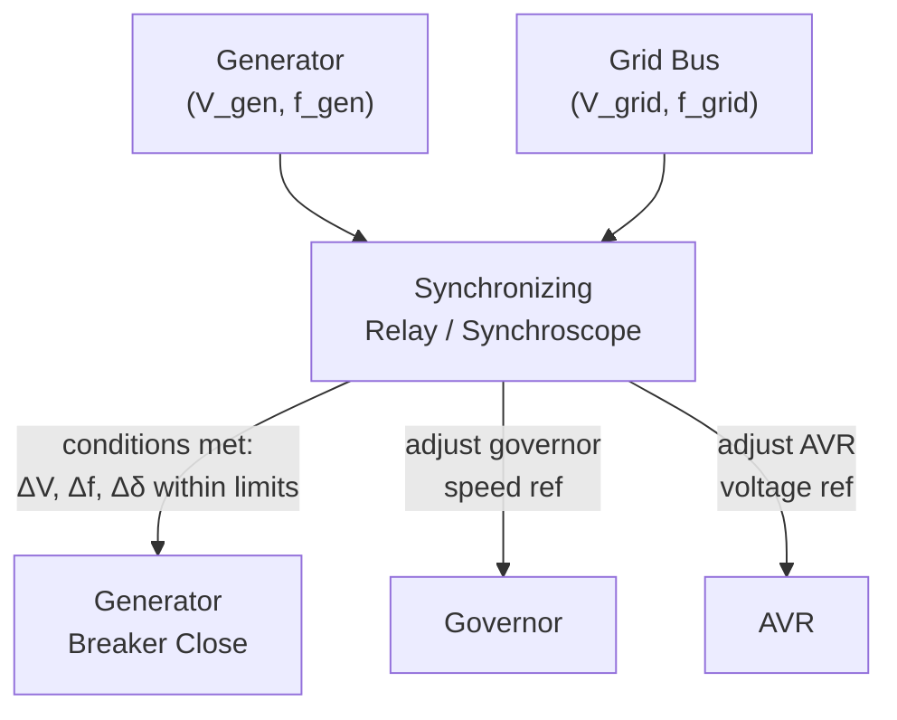
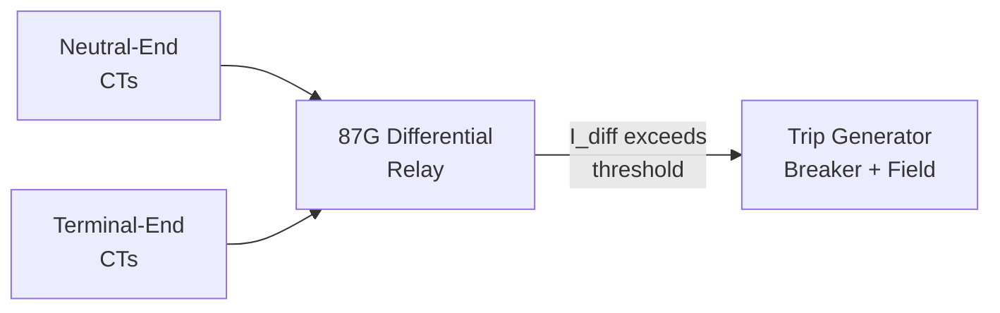

## Generator Protection and Synchronization to the Grid

### Overview

Generator protection encompasses the relaying schemes that detect abnormal electrical and mechanical conditions and isolate the machine before damage occurs, while synchronization covers the procedures and equipment required to safely connect a generator to a live grid or bus. Both are essential operational safeguards distinct from, but closely interacting with, the excitation and power control topics covered previously in this chapter.

### Synchronization to the Grid

#### The Four Synchronization Conditions

Before closing the breaker connecting a generator to an energized bus/grid, four conditions must be satisfied:

1. **Equal RMS voltage magnitude** between generator terminals and the bus/grid.
2. **Equal frequency** between generator output and the bus/grid.
3. **Same phase sequence** (phase rotation order, e.g., A-B-C vs. A-C-B) — a wiring/connection check verified once during commissioning and typically not re-checked each synchronization event.
4. **Matching phase angle** (voltage phasors aligned) at the instant of breaker closure.

**Key Points**

- Phase sequence mismatch, if present, is a wiring error (not a dynamic condition) and would cause severe transients on every synchronization attempt if uncorrected — it is verified once during installation/commissioning.
- Voltage magnitude and frequency are actively adjusted (via field excitation and governor speed reference respectively) prior to closing the breaker.
- Phase angle alignment is the most time-critical condition, since frequency is rarely exactly identical between generator and grid prior to synchronization — the generator's phase angle continuously drifts relative to the grid at a rate proportional to the frequency difference.

#### Synchronizing Equipment

**Key Points**

- **Synchroscope:** An instrument (traditionally electromechanical, now often digital/virtual on modern relay/HMI displays) indicating the relative phase angle and whether generator frequency is faster or slower than the bus, guiding the operator toward the correct closing instant.
- **Synchronizing lamps:** A simpler, older method using lamps connected across the open breaker contacts — lamps dim/brighten in a pattern reflecting the beat frequency between generator and bus, with darkest (or "lights bright" in some connection schemes) indicating phase alignment.
- **Automatic synchronizer:** Modern installations typically use an automatic synchronizing relay/controller that monitors voltage, frequency, and phase angle, adjusts governor and AVR references as needed, and issues the breaker close command at the precise instant of alignment (accounting for breaker closing time).

#### Consequences of Improper Synchronization

**Key Points**

- **Phase angle mismatch at closure:** Produces a large transient current and torque shock proportional to the angle error; can cause winding/insulation stress and severe mechanical shaft torque, particularly damaging to the shaft/coupling system with repeated occurrences.
- **Frequency mismatch:** If breaker closes with generator noticeably faster or slower than the bus, the machine experiences a sudden torque transient as it is pulled into synchronism (or, in severe cases, fails to pull in and trips).
- **Voltage magnitude mismatch:** Causes a reactive current transient at closure, generally less severe than angle or frequency mismatch but still undesirable.
- **[Unverified]** Acceptable tolerance bands for voltage, frequency, and angle deviation at closure are typically defined by utility interconnection standards or manufacturer guidance (commonly cited illustrative ranges exist in textbooks, e.g., angle within a few degrees) and should be verified against the specific applicable standard rather than assumed universal.

### Generator Protection Fundamentals

#### Why Dedicated Generator Protection Is Required

**Key Points**

- Generators are high-value, often unique/long-lead-time assets — protection schemes are typically more extensive and redundant than for simpler loads or feeders.
- Internal faults must be cleared extremely quickly to limit damage, since a generator continues to feed its own internal fault from residual magnetism/field current even after the main breaker opens (unlike load equipment, which is simply de-energized by opening a feeding breaker).
- Both electrical faults (winding faults, external system faults) and non-electrical abnormal conditions (loss of excitation, overspeed, loss of prime mover, out-of-step operation) require distinct protection functions.

#### Common Generator Protection Functions (by ANSI/IEEE Device Number)

| Device No. | Protection Function | Purpose |
| --- | --- | --- |
| 87G | Generator differential protection | Detects internal stator winding phase faults by comparing current entering and leaving the winding |
| 40 | Loss-of-excitation (field failure) protection | Detects loss of field current, which causes the machine to slip poles and operate as an induction generator, drawing excessive reactive power and risking rotor heating/instability |
| 32 | Reverse power protection | Detects motoring condition (generator absorbing real power, e.g., after loss of prime mover), protecting the turbine from potential mechanical damage |
| 78 | Out-of-step (pole-slip) protection | Detects loss of synchronism during severe system disturbances |
| 59 / 27 | Overvoltage / undervoltage protection | Detects abnormal terminal voltage conditions |
| 81O / 81U | Over-frequency / under-frequency protection | Detects abnormal speed/frequency conditions |
| 24 | Volts-per-hertz (overfluxing) protection | Detects core overfluxing risk, particularly during startup/shutdown or abnormal voltage/frequency combinations |
| 46 | Negative-sequence (unbalance) protection | Detects unbalanced loading, which causes rotor surface heating from induced negative-sequence currents |
| 51V / 51 | Voltage-restrained/controlled overcurrent | Backup protection for external system faults, with voltage restraint to maintain sensitivity during faults with reduced generator terminal voltage |
| 64 | Stator/rotor ground fault protection | Detects ground faults in stator or rotor (field) windings |
| 49 | Thermal (overload) protection | Detects sustained overload conditions via thermal replica or temperature monitoring |

**[Unverified]** ANSI/IEEE device numbers are a standardized industry convention (per IEEE C37.2), but the specific protection functions applied, their settings, and coordination with other system protection are engineering-design decisions specific to each installation and must be determined by a qualified protection engineer for any real application.

#### Generator Differential Protection (87G)

Compares current entering the winding (from the neutral end CTs) against current leaving the winding (from the terminal end CTs) for each phase — under normal (external fault or load) conditions these currents are equal; an internal winding fault creates a differential (mismatch) that triggers instantaneous tripping.

**Key Points**

- Differential protection is inherently fast and highly selective (restricted to the zone between the two sets of CTs), making it the primary protection for internal stator phase faults.
- Typically set with a percentage restraint/bias characteristic to avoid false tripping from CT saturation or mismatch during heavy external fault currents.

#### Loss-of-Excitation Protection (40)

**Key Points**

- Without field current, a synchronous generator cannot maintain synchronism and begins to slip poles, operating similarly to an induction generator — drawing large reactive current from the system to self-magnetize.
- This condition is typically detected via an impedance (mho-type) relay monitoring the apparent impedance seen at the generator terminals, which moves into a characteristic region on the R-X plane distinct from normal operation when excitation is lost.
- Rapid detection is important both to protect the machine (rotor surface heating from induced currents) and to prevent excessive reactive power drain from the system, which can contribute to voltage instability in a weakened grid.

#### Out-of-Step (Pole-Slip) Protection (78)

**Key Points**

- Detects loss of synchronism following a severe disturbance (e.g., a nearby transmission fault not cleared quickly enough), where the rotor angle $\delta$ swings beyond the stability limit and the machine "slips a pole" relative to the system.
- Typically implemented via impedance-trajectory monitoring (the apparent impedance traverses a characteristic swing pattern across the R-X plane during a pole slip, distinguishable from a simple fault).
- Tripping strategy generally aims to separate the machine at a favorable point in the swing cycle to minimize mechanical and electrical stress, rather than tripping instantaneously at first detection.

#### Reverse Power Protection (32)

**Key Points**

- Detects the generator absorbing real power from the grid (motoring), which occurs if the prime mover fails or its output drops below the machine's no-load/friction losses while still electrically connected.
- Primary concern is mechanical, not electrical: motoring a steam or gas turbine without adequate steam/gas flow can cause blade overheating or other prime-mover-specific mechanical damage; the exact risk and sensitivity requirement depends on prime-mover type.
- **[Unverified]** Sensitivity and time-delay settings vary substantially by prime-mover type (e.g., steam turbines are generally more sensitive to motoring damage than diesel engines) and are set according to manufacturer guidance for the specific prime mover.

### Interaction Between Protection and Excitation/Governor Systems

**Key Points**

- Protection relays typically initiate a coordinated trip sequence: opening the generator breaker, tripping the field breaker (or initiating field suppression/de-excitation), and often signaling the governor/turbine control to close valves or reduce fuel — sequencing and timing vary by fault severity and type.
- For severe internal faults (differential trip), field suppression is critical because the generator continues to supply fault current from its own excitation even after the main breaker opens; rapidly reducing field current limits fault energy and consequent damage.
- Excitation limiter functions (OEL, UEL, discussed in the excitation systems item) operate in normal control timescales to keep the machine within thermal/stability limits, while protection relays operate as a backstop for conditions that exceed those limits or occur too fast for the AVR to correct.

### Common Pitfalls

**Key Points**

- Treating synchronization phase-sequence checking as a routine per-event step — it is a wiring verification performed once (at commissioning or after any rewiring), not part of the normal per-synchronization sequence.
- Confusing loss-of-excitation protection (40) with out-of-step protection (78) — both can involve impedance-trajectory analysis and machine "slipping," but loss-of-excitation stems from a field-circuit fault/failure while out-of-step stems from a system-side stability event with excitation intact; they require different relay characteristics and settings.
- Assuming reverse-power protection is purely electrical — its primary purpose is protecting the prime mover from mechanical damage during motoring, and its settings are driven by prime-mover characteristics, not generator electrical ratings.
- Neglecting field suppression as part of the trip sequence for internal faults — opening only the main breaker is insufficient, since the generator can continue to feed a stator winding fault from its own excitation.

### Related Topics

- Generator excitation systems and voltage regulation (AVR limiter interaction with protection)
- Synchronous generator construction and operation (equivalent circuit basis for fault current behavior)
- Equal-area criterion and transient stability (basis for out-of-step behavior)
- Power system protection coordination and relay setting philosophy
- Current transformer (CT) and voltage transformer (VT) fundamentals for protection applications
- IEEE C37.2 standard device numbering
- Automatic synchronizing relay design and breaker closing-time compensation