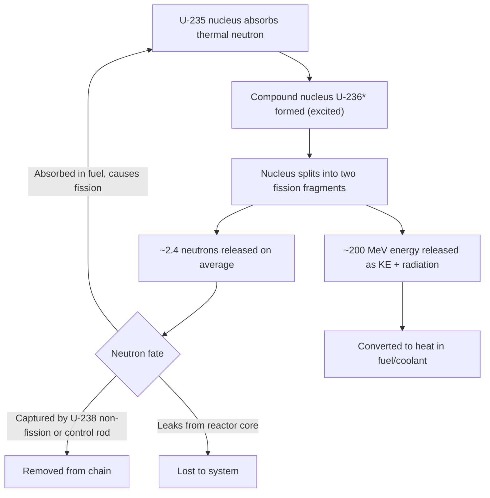

## Nuclear Fission and Chain Reactions

### Overview

Nuclear fission is the process by which a heavy atomic nucleus splits into two or more lighter nuclei, releasing substantial energy in the process. This energy release forms the physical basis for nuclear power generation, where controlled fission chain reactions produce heat that is converted into electricity through conventional thermodynamic cycles (typically Rankine cycles using steam turbines).

### Physical Basis of Fission

**Nuclear Binding Energy**

The binding energy per nucleon curve peaks around iron-56 (mass number ≈ 56) and decreases for both very light and very heavy nuclei. Heavy nuclei such as uranium-235 or plutonium-239 have lower binding energy per nucleon than mid-mass fission products. When a heavy nucleus splits, the resulting fragments have higher total binding energy, and the difference is released as energy according to:

$$E = \Delta m c^2$$

where $\Delta m$ is the mass defect between the parent nucleus (plus incident neutron) and the sum of the product masses.

**Typical Energy Release**

A single fission event of U-235 releases approximately 200 MeV, distributed approximately as:

| Energy Component | Approximate Share |
| --- | --- |
| Kinetic energy of fission fragments | ~168 MeV |
| Prompt neutron kinetic energy | ~5 MeV |
| Prompt gamma rays | ~7 MeV |
| Beta decay of fission products | ~8 MeV |
| Gamma decay of fission products | ~7 MeV |
| Antineutrinos (largely unrecoverable) | ~10 MeV |

The recoverable energy (excluding neutrinos, which escape the reactor) is approximately 195–200 MeV per fission, which is roughly 50 million times the energy released per molecule in chemical combustion.

### The Fission Reaction

**Induced Fission of U-235**

The dominant reaction in most commercial thermal reactors:

$$^{235}_{92}\text{U} + n \rightarrow ^{236}_{92}\text{U}^* \rightarrow \text{FP}_1 + \text{FP}_2 + \nu n + \text{energy}$$

where $\text{FP}_1$ and $\text{FP}_2$ are fission products (typically asymmetric mass split, e.g., around mass 95 and 140), $\nu$ is the number of neutrons released per fission (average ≈ 2.4 for U-235 thermal fission), and $n$ denotes a free neutron.

A representative fission path:

$$^{235}_{92}\text{U} + n \rightarrow ^{141}_{56}\text{Ba} + ^{92}_{36}\text{Kr} + 3n + \text{energy}$$

**Fissile vs. Fertile Materials**

- **Fissile nuclides**: capable of sustaining fission with neutrons of any energy, including thermal (slow) neutrons — U-235, Pu-239, U-233.
- **Fertile nuclides**: not readily fissile themselves but can be converted into fissile material via neutron capture — U-238 (→ Pu-239 via Np-239), Th-232 (→ U-233 via Pa-233).
- **Fissionable but not fissile**: U-238 can fission but only with fast neutrons above a threshold energy (~1 MeV); its fission cross-section at thermal energies is negligible.

### Neutron Cross-Sections and Energy Dependence

The probability of an interaction is quantified by the microscopic cross-section $\sigma$, measured in barns ($1\ \text{barn} = 10^{-24}\ \text{cm}^2$). For U-235:

- Thermal (0.025 eV) fission cross-section: ~585 barns
- Cross-section generally increases at lower neutron energy (roughly $1/v$ dependence in the thermal region, where $v$ is neutron velocity)
- Resonance region (1 eV – 1 keV): sharp resonance peaks, especially pronounced in U-238 capture cross-section, which strongly influences reactor design (resonance escape)

This inverse relationship between cross-section and neutron speed is a primary reason thermal reactors use moderators to slow neutrons down, increasing the likelihood of fission.

### The Chain Reaction

**Mechanism**

Each fission event releases 2–3 neutrons. If, on average, one of these neutrons goes on to cause another fission event, the reaction becomes self-sustaining. The **multiplication factor** $k$ describes this:

$$k = \frac{\text{neutrons produced in one generation}}{\text{neutrons produced in the preceding generation}}$$

- $k < 1$: **subcritical** — reaction dies out
- $k = 1$: **critical** — reaction is self-sustaining at constant power
- $k > 1$: **supercritical** — reaction power increases over time

**Six-Factor Formula**

For a finite reactor, $k_{eff}$ is determined by:

$$k_{eff} = \eta \cdot f \cdot p \cdot \varepsilon \cdot P_{FNL} \cdot P_{TNL}$$

| Factor | Symbol | Meaning |
| --- | --- | --- |
| Reproduction factor | $\eta$ | Fission neutrons produced per thermal neutron absorbed in fuel |
| Thermal utilization factor | $f$ | Fraction of thermal neutrons absorbed in fuel (vs. moderator/structure) |
| Resonance escape probability | $p$ | Probability a neutron slows past resonance capture region without absorption |
| Fast fission factor | $\varepsilon$ | Extra fissions caused by fast neutrons (mainly in U-238) |
| Fast non-leakage probability | $P_{FNL}$ | Probability a fast neutron doesn't leak from the reactor |
| Thermal non-leakage probability | $P_{TNL}$ | Probability a thermal neutron doesn't leak from the reactor |

For an infinite medium (no leakage), this reduces to the **four-factor formula**: $k_\infty = \eta \cdot f \cdot p \cdot \varepsilon$.

### Diagram: Chain Reaction Propagation

### Criticality Control

**Delayed Neutrons and Reactor Control**

While ~99.35% of neutrons from U-235 fission are **prompt** (emitted within $10^{-14}$ s of fission), approximately 0.65% are **delayed neutrons**, emitted seconds to minutes later from the beta decay of certain fission products (delayed neutron precursors, e.g., Br-87, I-137). This delayed fraction $\beta$ is critical to reactor control:

- Without delayed neutrons, reactor period changes would occur on the prompt neutron lifetime timescale (~$10^{-4}$–$10^{-5}$ s), far too fast for mechanical control systems.
- Delayed neutrons stretch the effective response time to seconds, enabling control rod movement to regulate $k_{eff}$ practically.
- **Prompt criticality** ($k_{eff} > 1$ using prompt neutrons alone, i.e., reactivity exceeding $\beta$) is avoided by design and represents a severe safety threshold.

**Reactivity**

$$\rho = \frac{k_{eff} - 1}{k_{eff}}$$

Reactivity is often expressed in units of dollars, where $1\ \text{\$} = \beta$ (the delayed neutron fraction, ≈ 0.0065 for U-235). Operating margins are kept well below prompt criticality (1$).

**Control Mechanisms**

- **Control rods**: neutron-absorbing materials (boron carbide, hafnium, silver-indium-cadmium) inserted/withdrawn to adjust $k_{eff}$
- **Chemical shim**: dissolved boric acid in coolant (used in PWRs) for coarse, distributed reactivity control
- **Burnable poisons**: absorbers (gadolinium, boron) that deplete over core life to offset fuel burnup and flatten power distribution
- **Negative temperature/void coefficients**: inherent feedback mechanisms where rising temperature or coolant voiding reduces reactivity, providing passive stability

### Moderation

Fast neutrons released by fission (~2 MeV) must be slowed to thermal energies (~0.025 eV) to sustain a thermal chain reaction efficiently, since fissile cross-sections are much higher at thermal energies. Moderators slow neutrons via elastic scattering.

**Moderator Comparison**

| Moderator | Moderating Ratio | Notes |
| --- | --- | --- |
| Light water (H₂O) | ~72 | Common, but absorbs some neutrons; requires enriched fuel |
| Heavy water (D₂O) | ~12,000 | Low absorption; enables natural uranium fuel (e.g., CANDU) |
| Graphite | ~170 | Used in early/gas-cooled/RBMK reactors |

The moderating ratio balances slowing-down power (energy loss per collision) against macroscopic absorption cross-section — a good moderator slows neutrons quickly without capturing them.

### Fission Product Considerations

**Xenon-135 Poisoning**

Xe-135 is a fission product (via I-135 decay) with an exceptionally large thermal neutron absorption cross-section (~2.6 million barns), making it a significant "reactor poison."

- Builds up after reactor startup and following power increases
- After a shutdown or power reduction, Xe-135 concentration can *increase* temporarily (since its main removal pathway, neutron absorption, ceases) before decaying — this is the **xenon transient** or "iodine pit," which can prevent reactor restart for many hours
- Governed by the balance between production (fission yield + I-135 decay) and removal (radioactive decay, $t_{1/2} \approx 9.2\ \text{h}$, and neutron absorption/burnout)

**Samarium-149 Poisoning**

Sm-149 (via Pm-149 decay) is a stable poison with a large cross-section (~40,000 barns) that does not decay away, requiring compensation via control rod withdrawal or fuel design margin over core life.

### Diagram: Neutron Life Cycle (svg_diagram)

<svg xmlns="http://www.w3.org/2000/svg" viewBox="0 0 800 420">
<text x="400" y="30" font-size="18" font-weight="bold" text-anchor="middle" fill="#1a1a2e">Neutron Life Cycle in a Thermal Reactor (svg_diagram)</text>
<rect x="30" y="70" width="150" height="60" rx="8" fill="#e8f0fe" stroke="#1a73e8" stroke-width="2" />
<text x="105" y="95" font-size="13" text-anchor="middle" fill="#1a1a2e">1000 Fast</text>
<text x="105" y="112" font-size="13" text-anchor="middle" fill="#1a1a2e">Neutrons Born</text>
<line x1="180" y1="100" x2="240" y2="100" stroke="#333" stroke-width="2" marker-end="url(#arrow)" />
<text x="205" y="90" font-size="11" text-anchor="middle">ε</text>
<rect x="240" y="70" width="150" height="60" rx="8" fill="#fef7e0" stroke="#f9ab00" stroke-width="2" />
<text x="315" y="95" font-size="13" text-anchor="middle" fill="#1a1a2e">Fast Fission</text>
<text x="315" y="112" font-size="13" text-anchor="middle" fill="#1a1a2e">Boost</text>
<line x1="315" y1="130" x2="315" y2="170" stroke="#333" stroke-width="2" marker-end="url(#arrow)" />
<text x="345" y="155" font-size="11" text-anchor="middle">P_FNL</text>
<rect x="240" y="170" width="150" height="60" rx="8" fill="#fce8e6" stroke="#d93025" stroke-width="2" />
<text x="315" y="195" font-size="13" text-anchor="middle" fill="#1a1a2e">Fast Leakage</text>
<text x="315" y="212" font-size="13" text-anchor="middle" fill="#1a1a2e">Loss</text>
<line x1="315" y1="70" x2="315" y2="30" stroke="#333" stroke-width="0" />
<line x1="390" y1="100" x2="450" y2="100" stroke="#333" stroke-width="2" marker-end="url(#arrow)" />
<text x="420" y="90" font-size="11" text-anchor="middle">p</text>
<rect x="450" y="70" width="150" height="60" rx="8" fill="#e6f4ea" stroke="#188038" stroke-width="2" />
<text x="525" y="95" font-size="13" text-anchor="middle" fill="#1a1a2e">Resonance</text>
<text x="525" y="112" font-size="13" text-anchor="middle" fill="#1a1a2e">Escape (slowing)</text>
<line x1="525" y1="130" x2="525" y2="170" stroke="#333" stroke-width="2" marker-end="url(#arrow)" />
<text x="555" y="155" font-size="11" text-anchor="middle">P_TNL</text>
<rect x="450" y="170" width="150" height="60" rx="8" fill="#fce8e6" stroke="#d93025" stroke-width="2" />
<text x="525" y="195" font-size="13" text-anchor="middle" fill="#1a1a2e">Thermal</text>
<text x="525" y="212" font-size="13" text-anchor="middle" fill="#1a1a2e">Leakage Loss</text>
<line x1="600" y1="100" x2="660" y2="100" stroke="#333" stroke-width="2" marker-end="url(#arrow)" />
<text x="630" y="90" font-size="11" text-anchor="middle">f</text>
<rect x="450" y="260" width="150" height="60" rx="8" fill="#e8f0fe" stroke="#1a73e8" stroke-width="2" />
<text x="525" y="285" font-size="13" text-anchor="middle" fill="#1a1a2e">Thermal Neutrons</text>
<text x="525" y="302" font-size="13" text-anchor="middle" fill="#1a1a2e">Diffusing</text>
<line x1="525" y1="230" x2="525" y2="260" stroke="#333" stroke-width="2" marker-end="url(#arrow)" />
<line x1="525" y1="320" x2="525" y2="350" stroke="#333" stroke-width="2" marker-end="url(#arrow)" />
<text x="555" y="340" font-size="11" text-anchor="middle">f</text>
<rect x="450" y="350" width="150" height="55" rx="8" fill="#fef7e0" stroke="#f9ab00" stroke-width="2" />
<text x="525" y="373" font-size="13" text-anchor="middle" fill="#1a1a2e">Absorbed in Fuel</text>
<text x="525" y="390" font-size="13" text-anchor="middle" fill="#1a1a2e">→ η new neutrons</text>
<line x1="660" y1="100" x2="660" y2="378" stroke="#333" stroke-width="2" />
<line x1="660" y1="378" x2="605" y2="378" stroke="#333" stroke-width="2" marker-end="url(#arrow)" />

<text x="700" y="250" font-size="12" text-anchor="middle" fill="`#5f6368`">k_eff = product</text>

<text x="700" y="268" font-size="12" text-anchor="middle" fill="`#5f6368`">of all six factors</text>

</svg>

### Comparison: Fission vs. Fusion (Context)

| Aspect | Fission | Fusion |
| --- | --- | --- |
| Process | Heavy nucleus splits | Light nuclei combine |
| Typical fuel | U-235, Pu-239 | Deuterium, Tritium |
| Energy per reaction | ~200 MeV | ~17.6 MeV (D-T) |
| Commercial status | Mature, widely deployed | Not yet commercially deployed for power [Inference: based on current global development status as of early 2026] |
| Chain reaction | Self-sustaining via neutron multiplication | Requires sustained confinement/ignition, not a neutron chain reaction |

### Worked Example: Estimating Reactor Thermal Power

**Problem**: A reactor core contains an average of $3 \times 10^{18}$ fissions per second. Estimate the thermal power output.

**Solution**:

Recoverable energy per fission ≈ 200 MeV = $200 \times 1.602 \times 10^{-13}\ \text{J} = 3.204 \times 10^{-11}\ \text{J}$

$$P = (3 \times 10^{18}\ \text{fissions/s}) \times (3.204 \times 10^{-11}\ \text{J/fission})$$

$$P \approx 9.6 \times 10^{7}\ \text{W} \approx 96\ \text{MW}_{th}$$

This thermal power would then pass through the secondary thermodynamic cycle (steam generator, turbine, condenser) at a typical thermal efficiency of 30–35% for PWRs to yield net electrical output.

### Key Points

- Fission splits heavy nuclei (U-235, Pu-239) into lighter fragments, releasing ~200 MeV per event, primarily as fragment kinetic energy converted to heat.
- A self-sustaining chain reaction requires $k_{eff} = 1$; deviations are described by reactivity $\rho$.
- Delayed neutrons (~0.65% of total for U-235) are essential for practical mechanical reactor control.
- Moderators slow fast neutrons to thermal energies to exploit higher fission cross-sections.
- Xenon-135 and Samarium-149 are critical fission-product poisons affecting operational flexibility.
- The six-factor (or four-factor) formula provides the standard framework for analyzing neutron balance and criticality.

### Related Topics

- Nuclear Reactor Types (PWR, BWR, CANDU, RBMK, Gas-Cooled)
- Reactor Kinetics and Point Kinetics Equations
- Nuclear Fuel Cycle and Enrichment
- Thermal Hydraulics of Reactor Cores
- Rankine Cycle Integration in Nuclear Power Plants
- Reactor Safety Systems and Defense-in-Depth
- Radioactive Decay and Fission Product Inventory
- Breeder Reactors and Fuel Conversion Ratio