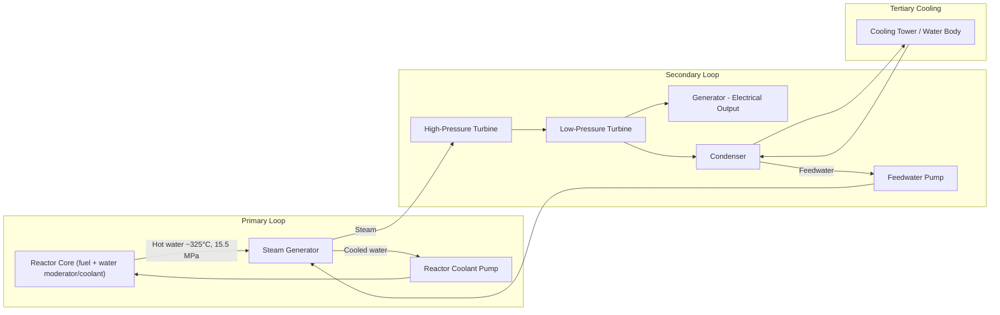
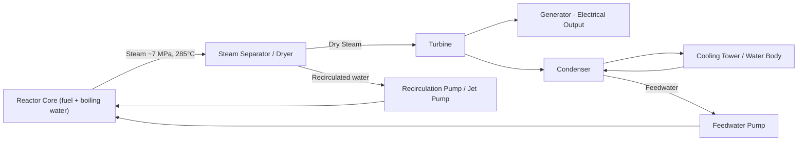
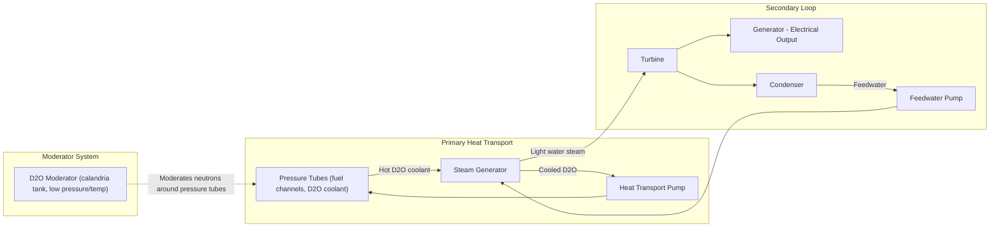
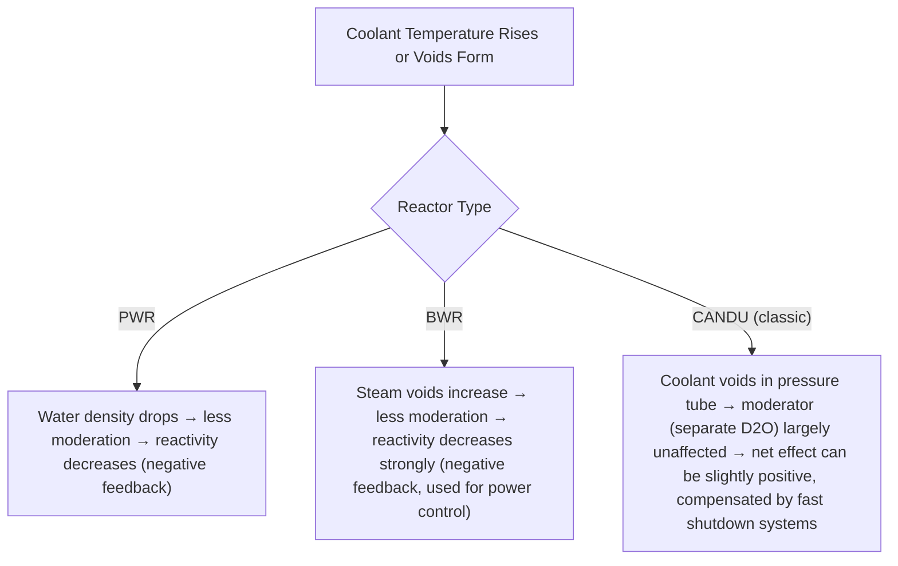

## Reactor Types: PWR, BWR, and Heavy-Water Reactors

### Overview

Commercial nuclear power reactors convert fission heat into electricity through a coolant/moderator system that transports thermal energy to a power conversion cycle. The three dominant thermal reactor families — Pressurized Water Reactors (PWR), Boiling Water Reactors (BWR), and Heavy-Water Reactors (HWR, notably CANDU) — differ primarily in coolant/moderator choice, primary-to-secondary loop configuration, and fuel enrichment requirements, which cascade into distinct design, safety, and operational characteristics.

### Pressurized Water Reactor (PWR)

**Core Concept**

PWRs use ordinary (light) water as both coolant and moderator, maintained at high pressure (~15.5 MPa / 2,250 psi) to prevent bulk boiling in the primary loop. Heat is transferred to a separate secondary loop via steam generators, producing steam that drives the turbine.

**System Architecture**

**Key Characteristics**

- **Moderator/Coolant**: Light water (H₂O), single-phase liquid in the primary loop
- **Fuel**: Low-enriched uranium (LEU), typically 3–5% U-235
- **Operating pressure**: ~15.5 MPa (primary loop, kept subcooled)
- **Loop separation**: Radioactive primary coolant is physically isolated from the turbine (secondary loop is non-radioactive under normal operation), simplifying turbine maintenance and reducing contamination spread
- **Pressurizer**: A dedicated component maintaining primary system pressure via electric heaters and spray, accommodating coolant volume changes
- **Control**: Control rods inserted from the top; boric acid dissolved in coolant provides distributed reactivity control (chemical shim)
- **Negative moderator temperature coefficient**: As water heats and expands (density decreases), moderation efficiency drops, reducing reactivity — an inherent negative feedback safety characteristic

**Advantages**

- Mature technology with the largest global operating fleet
- Simple, well-understood single-phase primary coolant behavior
- Radioactivity confined to primary loop, easing turbine hall maintenance
- Strong negative feedback coefficients aid inherent stability

**Challenges**

- Requires thick-walled, high-pressure reactor pressure vessel and piping
- Requires enrichment infrastructure (LEU fuel)
- Boric acid chemistry requires careful water chemistry control (corrosion management)

### Boiling Water Reactor (BWR)

**Core Concept**

BWRs allow water to boil directly within the reactor core, generating steam that flows directly to the turbine — eliminating the separate steam generator loop used in PWRs.

**System Architecture**

**Key Characteristics**

- **Moderator/Coolant**: Light water, allowed to boil (~12–15% steam quality by mass at core exit)
- **Fuel**: Low-enriched uranium, typically similar to PWR (2–5% U-235), though core power distribution management differs
- **Operating pressure**: Lower than PWR, ~7.2 MPa, since water is meant to boil
- **Direct cycle**: Steam generated in the core flows directly to the turbine (single-loop design), which simplifies plant layout but means the turbine and steam system carry some radioactivity (primarily short-lived N-16) during operation
- **Void coefficient**: Reactivity control partly achieved via coolant flow rate (recirculation), since steam voids reduce moderation and lower reactivity — a strong inherent negative feedback mechanism used operationally
- **Control rods**: Inserted from the bottom (due to the top region already having reduced moderation from steam voids)
- **No pressurizer required**: Pressure is set by the saturation conditions of boiling water

**Advantages**

- Simpler primary system (no steam generators, no pressurizer) — potentially lower capital cost per design complexity
- Lower operating pressure than PWR primary loop
- Strong inherent negative void feedback aids power self-regulation

**Challenges**

- Turbine/steam system exposed to primary coolant activation products (mainly short-lived N-16, requiring shielding/access restrictions during operation, decaying rapidly after shutdown, $t_{1/2} \approx 7.1\ \text{s}$)
- Two-phase flow (steam-water) is more complex to model and control than single-phase PWR flow
- Core power distribution more sensitive to coolant density variation, requiring more sophisticated in-core instrumentation

### Heavy-Water Reactors (HWR) — CANDU Design

**Core Concept**

Heavy-water reactors use deuterium oxide (D₂O) as moderator (and often coolant), exploiting D₂O's very low neutron absorption cross-section. This allows the use of **natural (unenriched) uranium** as fuel, since neutron economy is high enough without enrichment.

**System Architecture (CANDU-style)**

**Key Characteristics**

- **Moderator**: Heavy water (D₂O) in a low-pressure, low-temperature calandria tank surrounding pressure tubes — moderator is largely decoupled thermally from the high-pressure coolant
- **Coolant**: Heavy water (in classic CANDU) circulated at high pressure/temperature through separate pressure tubes; some HWR variants use light water or gas coolant with heavy-water moderation
- **Fuel**: Natural uranium (~0.7% U-235, no enrichment required), typically in short fuel bundles
- **Pressure tube design**: Unlike PWR/BWR's single large pressure vessel, CANDU uses many individual horizontal pressure tubes, each containing fuel bundles, running through the low-pressure calandria
- **On-power refueling**: Fuel channels can be refueled while the reactor operates at full power, using a fueling machine, avoiding extended refueling outages
- **Positive void coefficient consideration**: Classic CANDU designs have a small positive void coefficient (coolant voiding can increase reactivity), which is compensated by fast-acting shutdown systems (distinct from moderator, since moderator remains cool D₂O) — [Inference: exact coefficient magnitude and safety system response times are design- and generation-specific and vary between CANDU variants]

**Advantages**

- No enrichment infrastructure required — reduced fuel cycle cost and proliferation-sensitive enrichment dependency
- On-power refueling improves capacity factor (no extended refueling shutdown)
- Excellent neutron economy allows fuel cycle flexibility (natural uranium, recovered uranium, or even thorium cycles)
- Separated low-pressure moderator provides a large heat sink and additional passive safety margin (moderator can act as a backup heat removal path in some accident scenarios)

**Challenges**

- Heavy water production is costly and energy-intensive (isotopic separation of deuterium)
- Larger reactor core/vessel footprint due to lower neutron flux moderation efficiency requiring more fuel volume
- Tritium production in the D₂O moderator/coolant (via neutron activation of deuterium) requires management and creates a tritium byproduct/hazard stream
- Positive void coefficient in some designs requires robust, fast shutdown systems as a design compensation

### Comparative Summary

| Parameter | PWR | BWR | HWR (CANDU) |
| --- | --- | --- | --- |
| Moderator | Light water | Light water | Heavy water (D₂O) |
| Coolant | Light water (single-phase) | Light water (boiling, two-phase) | Heavy water (typically) |
| Fuel enrichment | 3–5% U-235 | 2–5% U-235 | Natural U (~0.7% U-235) |
| Primary pressure | ~15.5 MPa | ~7.2 MPa | ~10 MPa (coolant channels) |
| Loops | 2 (primary + secondary via SG) | 1 (direct cycle) | 2 (primary + secondary via SG) |
| Refueling | Outage-based (shutdown) | Outage-based (shutdown) | On-power (online) |
| Pressure boundary | Single large RPV | Single large RPV | Multiple pressure tubes |
| Global fleet share | Largest (~65%+ of operating reactors) [Unverified: exact current percentage] | Second largest | Predominantly Canada, also India, others |

### Void/Temperature Coefficient Behavior (Conceptual Comparison)

### Practical Example: Fuel Enrichment Impact on Fuel Cycle Cost

**Scenario**: Compare relative front-end fuel cycle complexity between a PWR (4% enriched) and a CANDU (natural uranium).

- PWR requires: mining → conversion (UF₆) → enrichment (centrifuge/diffusion, separative work units, SWU) → fuel fabrication
- CANDU requires: mining → conversion → fuel fabrication (no enrichment step)

The omission of the enrichment step in CANDU fuel cycles removes both the capital-intensive enrichment infrastructure dependency and the associated separative work cost, at the expense of heavy water production cost and a larger reactor core for equivalent power output. [Inference: net fuel-cycle economics depend on regional heavy water production costs, enrichment market prices, and reactor-specific design factors, and can vary significantly by country and era]

### Key Points

- PWR: two-loop, pressurized single-phase light water, enriched fuel, radioactivity confined to primary loop.
- BWR: single-loop, boiling light water, direct steam-to-turbine cycle, simpler primary system but turbine-side activation products.
- HWR/CANDU: heavy-water moderated, natural uranium fuel, on-power refueling, pressure-tube (not vessel) design.
- Moderator/coolant choice drives fuel enrichment requirements, safety feedback coefficients, and overall plant architecture.
- All three reactor types ultimately couple to a Rankine steam cycle for electricity generation, differing mainly in how the primary heat source loop is arranged.

### Related Topics

- Nuclear Fission and Chain Reactions
- Rankine Cycle Thermodynamics in Power Plants
- Reactor Safety Systems and Defense-in-Depth
- Nuclear Fuel Cycle and Enrichment (SWU, UF₆ Conversion)
- Gas-Cooled and Fast Breeder Reactor Designs
- Reactor Pressure Vessel Materials and Embrittlement
- Small Modular Reactors (SMRs)
- Steam Generator Design and Thermal-Hydraulic Analysis