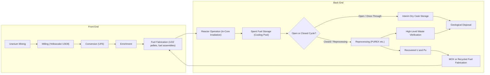
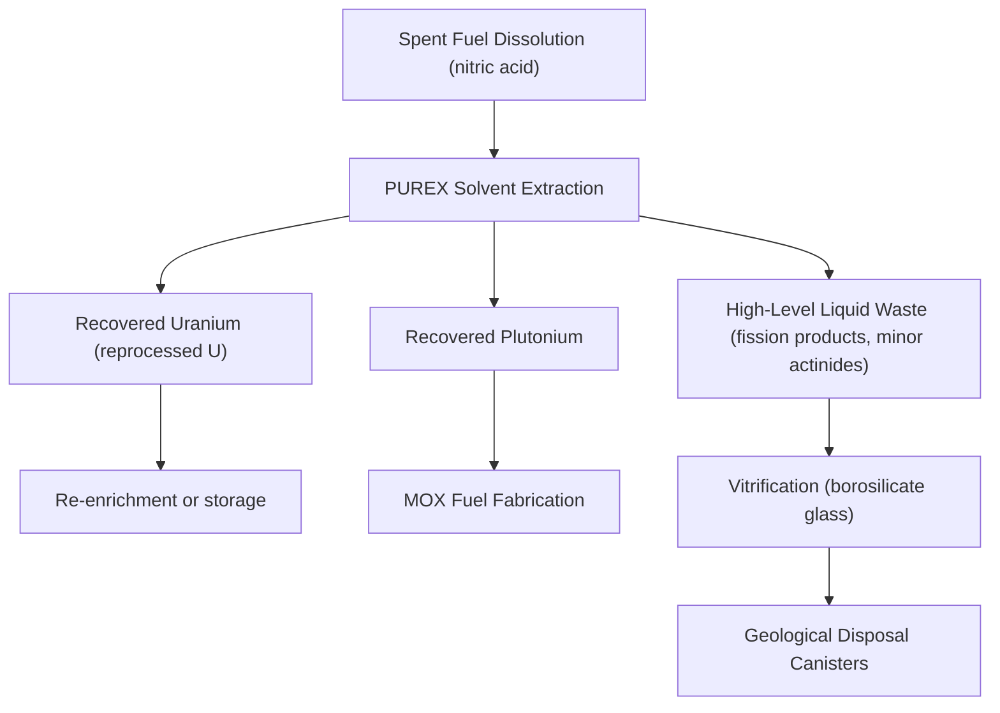

## The Nuclear Fuel Cycle

### Overview

The nuclear fuel cycle encompasses all industrial processes involved in producing usable fuel for nuclear reactors and managing the material afterward, from raw ore extraction through enrichment, fuel fabrication, in-reactor use, and either reprocessing or disposal of spent fuel. It is conventionally divided into the **front end** (pre-irradiation), the **in-reactor stage**, and the **back end** (post-irradiation), and can be operated as either an **open (once-through)** or **closed (recycling)** cycle.

### Fuel Cycle Overview Diagram

### Front End: Mining and Milling

**Uranium Mining**

Uranium ore is extracted via conventional open-pit/underground mining or **in-situ leaching (ISL)**, where a leaching solution is injected into ore-bearing aquifers to dissolve uranium in place, then pumped to the surface — increasingly the dominant method for suitable ore bodies due to lower cost and reduced surface disturbance.

**Milling**

Mined ore (typically 0.05–0.3% U₃O₈ by mass) is crushed, leached (acid or alkaline), and chemically processed to produce **yellowcake** (U₃O₈ concentrate, ~80–90% purity), the standard tradeable intermediate product of the front end.

### Front End: Conversion

Yellowcake is converted to **uranium hexafluoride (UF₆)**, the chemical form required for enrichment because UF₆ sublimates near room temperature/pressure into a gas suitable for isotope separation processes:

$$\text{U}_3\text{O}_8 \rightarrow \text{UO}_2 \rightarrow \text{UF}_4 \rightarrow \text{UF}_6$$

UF₆ is reactive with moisture and is handled in sealed cylinders; it is solid at ambient conditions and sublimes upon mild heating.

### Front End: Enrichment

**Purpose**

Natural uranium contains ~0.711% U-235 (the fissile isotope) and ~99.28% U-238. Most reactor types (PWR, BWR) require **low-enriched uranium (LEU)**, typically 3–5% U-235, necessitating isotope separation.

**Separative Work Units (SWU)**

Enrichment effort is quantified in **Separative Work Units (SWU)**, a measure independent of the specific technology used, capturing the "work" needed to separate a feed stream into enriched product and depleted tails:

$$\text{SWU} = P \cdot V(x_p) + T \cdot V(x_t) - F \cdot V(x_f)$$

where $P$, $T$, $F$ are product, tails, and feed masses; $x_p$, $x_t$, $x_f$ are their respective U-235 assays; and $V(x)$ is the value function:

$$V(x) = (1 - 2x)\ln\left(\frac{1-x}{x}\right)$$

**Enrichment Technologies**

| Method | Principle | Status |
| --- | --- | --- |
| Gaseous diffusion | UF₆ gas diffuses through porous membranes; lighter U-235F₆ diffuses marginally faster | Largely phased out, energy-intensive (historical U.S./France plants) |
| Gas centrifuge | High-speed rotation creates centrifugal separation of isotopes by mass | Dominant modern technology; far lower energy consumption per SWU |
| Laser enrichment (e.g., SILEX/GLE) | Selective laser excitation of U-235 compounds for separation | Emerging/limited commercial deployment [Unverified: deployment scale varies by country and licensing status] |

**Depleted Uranium (Tails)**

The enrichment process yields depleted uranium (typically ~0.2–0.3% U-235) as a byproduct, used in radiation shielding, counterweights, armor-piercing munitions, and as feedstock for future re-enrichment or fast-reactor fuel if economics permit.

### Front End: Fuel Fabrication

Enriched UF₆ is reconverted to **uranium dioxide (UO₂)** powder, pressed and sintered into ceramic pellets (~1 cm diameter), which are loaded into zirconium-alloy (Zircaloy) cladding tubes to form fuel rods, bundled into fuel assemblies matching the specific reactor design (PWR/BWR assembly geometries differ).

For heavy-water reactors (CANDU), fabrication uses **natural uranium** UO₂ directly, skipping enrichment entirely (see prior "Reactor Types" material).

### In-Reactor Stage: Burnup

**Burnup** measures energy extracted per unit mass of fuel, typically expressed in gigawatt-days per metric ton of heavy metal (GWd/tHM or MWd/kgHM):

$$B = \frac{\text{Energy released}}{\text{Initial mass of heavy metal}}$$

Typical LWR discharge burnup is in the range of 40–60 GWd/tHM [Inference: exact operational limits vary by fuel design, licensing, and utility practice]. Higher burnup extracts more energy per fuel assembly, reducing fuel cycle cost per unit energy but requiring materials capable of withstanding longer irradiation (cladding integrity, fission gas release management).

During irradiation, U-238 undergoes neutron capture to form Pu-239 (via Np-239), which itself fissions and contributes a significant fraction (often 30%+ by end of cycle) of total reactor power in typical LWR operation — an important secondary fuel resource generated in situ.

### Back End: Spent Fuel Characteristics

Spent fuel is highly radioactive and thermally hot, containing:

- **Unfissioned uranium**: typically ~95% of original mass, mostly U-238, with U-235 depleted to ~0.8–1%
- **Plutonium**: ~1% (mixture of Pu-239, 240, 241, 242 isotopes)
- **Fission products**: ~4%, including both short-lived (e.g., I-131, Xe-135) and long-lived (e.g., Cs-137, Sr-90, Tc-99) isotopes
- **Minor actinides**: trace Np, Am, Cm — significant contributors to long-term radiotoxicity

### Back End: Interim Storage

**Spent Fuel Pools**

Freshly discharged fuel is stored underwater in pools adjacent to the reactor for several years, providing both radiation shielding and cooling for residual decay heat removal.

**Dry Cask Storage**

After sufficient cooling (typically 5+ years), fuel may be transferred to sealed dry casks (steel/concrete) for longer-term interim storage, relying on passive convective air cooling and shielding — widely used where permanent disposal facilities are not yet operational.

### Back End: Open vs. Closed Fuel Cycle

**Open (Once-Through) Cycle**

Spent fuel is treated as waste after interim storage and sent to permanent geological disposal without reprocessing. This is the current dominant approach in the United States and several other countries.

**Closed (Reprocessing) Cycle**

Spent fuel is chemically reprocessed to recover usable uranium and plutonium for fabrication into new fuel, most commonly **Mixed Oxide (MOX) fuel** (a blend of PuO₂ and UO₂). The dominant industrial reprocessing method is **PUREX** (Plutonium-URanium EXtraction), using solvent extraction (tributyl phosphate) to separate U and Pu from fission products.

**Comparison**

| Aspect | Open Cycle | Closed Cycle |
| --- | --- | --- |
| Resource utilization | Lower (uses ~0.7% of natural U energy content) | Higher (recovers Pu, reprocessed U) |
| Waste volume | Larger (entire spent fuel treated as waste) | Smaller high-level waste volume, but additional intermediate waste streams |
| Proliferation consideration | No separated plutonium stream | Separated plutonium requires additional safeguards [Inference: safeguards approaches vary significantly by national policy and international agreements] |
| Cost | Avoids reprocessing capital cost | Higher front-end reprocessing/MOX fabrication cost, potentially offset by fuel savings depending on uranium market prices |
| Countries (representative) | United States, Sweden, Finland | France, Russia, Japan (partial) |

### Back End: High-Level Waste Disposal

**Vitrification**

Liquid high-level waste from reprocessing (or, in some open-cycle disposal concepts, treated spent fuel) is immobilized in borosilicate glass matrices poured into stainless steel canisters, providing chemical durability for long-term isolation.

**Geological Disposal**

The internationally favored long-term solution is deep geological repositories (typically 300–1000 m depth) in stable rock formations (granite, clay, salt), using multiple engineered and natural barriers:

- Waste form (glass or spent fuel ceramic matrix)
- Metal canister/overpack
- Engineered backfill (e.g., bentonite clay buffer)
- Host geology

As of the mid-2020s, Finland's Onkalo repository is the furthest along toward operational deep geological disposal for spent fuel [Unverified: operational status subject to ongoing licensing and construction progress].

### Fuel Cycle Material Flow Example

**Scenario**: A 1000 MWe PWR operating at typical burnup requires approximately 20–25 tonnes of fresh enriched fuel annually [Inference: figure varies by reactor design, capacity factor, and fuel management strategy], which corresponds to roughly 150–200 tonnes of natural uranium feed and on the order of 100,000–120,000 SWU of enrichment effort per year, depending on tails assay chosen.

This illustrates the front-end material multiplication: natural uranium feed mass substantially exceeds final fuel mass due to the tails stream discarded during enrichment.

### Key Points

- The fuel cycle divides into front end (mining → milling → conversion → enrichment → fabrication), in-reactor irradiation, and back end (storage → reprocessing or disposal).
- Enrichment effort is measured in SWU, independent of the specific separation technology.
- In-situ plutonium production (from U-238) contributes significantly to reactor energy output over a fuel cycle.
- Open (once-through) and closed (reprocessing/MOX) cycles represent distinct national strategic choices with different resource, waste, and proliferation trade-offs.
- Geological disposal with multiple engineered barriers is the internationally favored approach for final high-level waste isolation.

### Related Topics

- Nuclear Fission and Chain Reactions
- Reactor Types: PWR, BWR, and Heavy-Water Reactors
- Radioactive Waste Classification and Management
- Nuclear Non-Proliferation and Safeguards
- Breeder Reactors and Fuel Conversion Ratio
- Thorium Fuel Cycle
- Decommissioning of Nuclear Facilities
- Radiation Shielding and Dosimetry