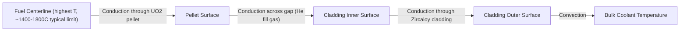
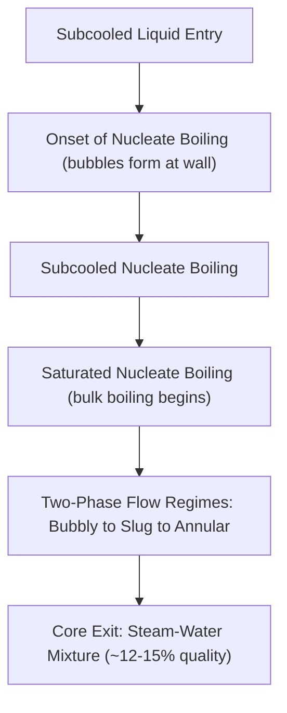
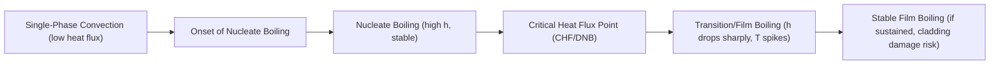

## Reactor Thermal-Hydraulics and Heat Removal

### Overview

Reactor thermal-hydraulics governs how fission heat generated in nuclear fuel is transferred to the coolant and ultimately removed from the core, both during normal operation and under accident conditions. It integrates heat conduction within fuel pellets and cladding, convective heat transfer to the coolant, and coolant flow dynamics, with a central design objective of preventing fuel damage by maintaining adequate margins to critical heat flux and fuel temperature limits.

### Heat Generation and Radial Temperature Profile

**Volumetric Heat Generation**

Heat is generated volumetrically within the fuel pellet due to fission fragment slowing-down and other energy deposition mechanisms, approximated as roughly uniform or with a mild radial peaking depending on neutron flux distribution.

**Radial Conduction Through the Fuel Rod**

Heat must conduct from the pellet centerline, across the pellet radius, across the pellet-cladding gap, through the cladding, and finally convect into the coolant. For a solid cylindrical fuel pellet with uniform volumetric heat generation $q'''$, the steady-state temperature difference between centerline and surface is:

$$T_{center} - T_{surface} = \frac{q''' r_f^2}{4k_f}$$

where $r_f$ is the pellet radius and $k_f$ is fuel thermal conductivity (notably, UO₂ has relatively low thermal conductivity, ~2–3 W/m·K at operating temperatures, which is a key limiting factor in fuel design).

**Temperature Profile Diagram**

The **pellet-cladding gap**, typically filled with helium gas (chosen for its high thermal conductivity relative to other gases and inertness), represents a significant thermal resistance, especially early in fuel life before gap closure from pellet swelling and cladding creep occurs.

### Convective Heat Transfer to Coolant

**Newton's Law of Cooling**

$$q'' = h(T_{surface} - T_{coolant})$$

where $h$ is the convective heat transfer coefficient, dependent on flow regime, coolant properties, and geometry, typically correlated via dimensionless groups:

$$Nu = f(Re, Pr)$$

For single-phase turbulent flow in PWR fuel bundles, correlations such as the Dittus-Boelter equation are commonly applied:

$$Nu = 0.023\, Re^{0.8} Pr^{0.4}$$

where $Nu$ is the Nusselt number, $Re$ is the Reynolds number, and $Pr$ is the Prandtl number of the coolant.

### Single-Phase vs. Two-Phase Heat Transfer Regimes

**PWR (Single-Phase, Subcooled)**

Primary coolant remains liquid throughout the core (pressure maintained well above saturation pressure at operating temperature), so heat transfer is dominated by forced convection, with a heat transfer coefficient dependent primarily on flow velocity and coolant properties.

**BWR (Two-Phase, Boiling)**

Coolant is intentionally allowed to boil, transitioning through several regimes along the flow path:

Nucleate boiling significantly enhances heat transfer coefficients compared to single-phase convection alone, which is advantageous for heat removal efficiency but introduces the risk of **boiling crisis** at high heat flux.

### Critical Heat Flux (CHF) and Departure from Nucleate Boiling

**The Boiling Crisis**

As heat flux increases, nucleate boiling eventually transitions to an unstable regime where a vapor film can form and insulate the heated surface from the liquid coolant, causing a sharp drop in heat transfer coefficient and corresponding spike in surface temperature. This phenomenon is termed:

- **Departure from Nucleate Boiling (DNB)**: primarily relevant in PWRs (subcooled/low-quality conditions), where a vapor blanket abruptly forms on the fuel rod surface
- **Dryout**: primarily relevant in BWRs (higher-quality annular flow), where the liquid film on the rod surface thins and evaporates completely, exposing the surface to a lower heat-transfer vapor core

**Departure from Nucleate Boiling Ratio (DNBR)**

A key safety design parameter in PWRs:

$$DNBR = \frac{q''_{CHF}}{q''_{actual}}$$

Reactor protection systems are designed to ensure $DNBR$ remains above a specified minimum (commonly a limit such as 1.3, though exact regulatory/design limits vary by fuel vendor and licensing basis) [Inference: specific DNBR acceptance criteria depend on fuel design methodology, correlation used (e.g., W-3, WRB-1), and regulatory approval] under all anticipated operational occurrences, preventing sustained film boiling and consequent cladding damage.

**Consequence of Exceeding CHF**

If CHF is exceeded, cladding surface temperature can rise rapidly (potentially hundreds of degrees within seconds) due to the collapse of efficient nucleate boiling heat transfer, risking cladding damage if sustained. Reactor protection systems (RPS) are designed with trip setpoints and margins specifically to avoid this condition during normal operation and anticipated transients.

### Flow Boiling Curve

### Decay Heat and Post-Shutdown Cooling

**Decay Heat Generation**

Even after reactor shutdown (control rod insertion halting the fission chain reaction), radioactive decay of accumulated fission products continues to generate significant heat, following an approximate decay curve (Way-Wigner or ANS-5.1 standard correlations are commonly used for licensing calculations):

$$\frac{P(t)}{P_0} \approx 0.066 \left[ t^{-0.2} - (t + t_{op})^{-0.2} \right]$$

(a simplified representative form; actual standards use more detailed multi-group formulations) — immediately after shutdown, decay heat is typically around 5–7% of pre-shutdown power, decaying to roughly 1% within about an hour and continuing to decrease over subsequent days [Inference: exact percentages depend on prior operating history/burnup and the specific correlation applied].

**Decay Heat Removal Systems**

Because decay heat continues indefinitely at a diminishing rate, reactors require assured heat removal capability even when shut down:

- **Residual Heat Removal (RHR) / Shutdown Cooling System**: active pumped cooling loops engaged once primary system pressure/temperature are reduced sufficiently
- **Emergency Core Cooling Systems (ECCS)**: engineered safety systems (high/low-pressure injection, accumulators) designed to provide makeup water and cooling in loss-of-coolant accident (LOCA) scenarios
- **Passive decay heat removal**: some advanced/Generation III+ designs incorporate gravity-driven or natural-circulation passive cooling systems that function without active pumping or AC power, relying on natural convection and elevation-driven flow

### Loss-of-Coolant Accident (LOCA) Thermal-Hydraulic Considerations

A LOCA (e.g., pipe break in the primary system) results in rapid depressurization and potential loss of core cooling flow, requiring:

1. Reactor trip (rapid shutdown of chain reaction)
2. ECCS actuation for emergency coolant injection
3. Management of decay heat removal despite potentially degraded primary system integrity
4. Prevention of fuel cladding oxidation reactions (notably the exothermic zirconium-steam reaction at high temperatures, which becomes significant above approximately 1200°C and is a key licensing-basis temperature limit for LOCA analysis)

$$\text{Zr} + 2\text{H}_2\text{O} \rightarrow \text{ZrO}_2 + 2\text{H}_2 + \text{heat}$$

This reaction is both a heat source (compounding the thermal challenge) and a hydrogen generation concern (as demonstrated in historical severe accident events).

### Thermal-Hydraulic Design Margins Summary Table

| Parameter | PWR Consideration | BWR Consideration |
| --- | --- | --- |
| Limiting phenomenon | DNB | Dryout |
| Governing ratio | DNBR | Critical Power Ratio (CPR) |
| Coolant state at core exit | Subcooled/slightly saturated liquid | Two-phase mixture (~12-15% quality) |
| Peak fuel centerline temp limit | ~2800°C (UO₂ melting point margin) | Similar UO₂-based limit |
| Key margin parameter | Minimum DNBR during transients | Minimum Critical Power Ratio (MCPR) |

### Worked Example: Convective Heat Transfer Estimate

**Problem**: Estimate the surface heat transfer coefficient for PWR coolant flowing through a fuel bundle sub-channel, given Reynolds number $Re = 5 \times 10^5$, Prandtl number $Pr = 1.0$, thermal conductivity $k = 0.55\ \text{W/m·K}$, and hydraulic diameter $D_h = 0.012\ \text{m}$.

**Solution** using Dittus-Boelter:

$$Nu = 0.023 (5 \times 10^5)^{0.8} (1.0)^{0.4}$$

$$Nu \approx 0.023 \times 43{,}087 \approx 991$$

$$h = \frac{Nu \cdot k}{D_h} = \frac{991 \times 0.55}{0.012} \approx 45{,}440\ \text{W/m}^2\text{K}$$

This illustrates the high heat transfer coefficients characteristic of forced-convection water cooling in reactor cores, enabling the high volumetric power densities (~100 kW/L) typical of LWR cores. [Behavior may vary depending on actual sub-channel geometry, spacer grid effects, and local flow conditions not captured in this simplified correlation.]

### Key Points

- Heat conducts radially from fuel centerline through pellet, gap, and cladding before convecting into coolant; UO₂'s low thermal conductivity is a key design constraint.
- Critical Heat Flux (DNB in PWRs, dryout in BWRs) represents the fundamental thermal-hydraulic safety limit, protected against via DNBR/CPR margins.
- Decay heat persists after shutdown and requires assured active or passive cooling systems (RHR, ECCS) indefinitely at a diminishing rate.
- Two-phase flow in BWRs enhances heat transfer via nucleate boiling but introduces additional flow-regime complexity compared to PWR single-phase flow.
- Zirconium-steam reactions become a significant concern at high cladding temperatures during severe accident/LOCA scenarios, both as a heat and hydrogen source.

### Related Topics

- Nuclear Fission and Chain Reactions
- Reactor Types: PWR, BWR, and Heavy-Water Reactors
- Loss-of-Coolant Accident (LOCA) Analysis and ECCS Design
- Rankine Cycle Thermodynamics in Power Plants
- Fuel Rod Design and Cladding Materials (Zircaloy)
- Severe Accident Phenomenology (Core Melt Progression)
- Two-Phase Flow Regimes and Boiling Heat Transfer
- Nuclear Reactor Instrumentation and Control Systems