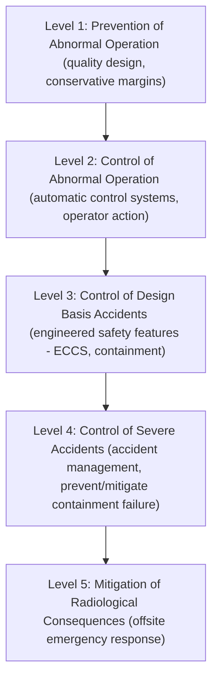
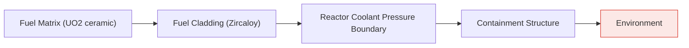
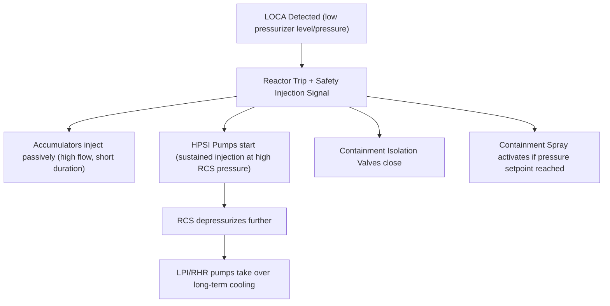

## Nuclear Safety Systems and Containment

### Overview

Nuclear plant safety is engineered through the principle of **defense-in-depth**: multiple independent, redundant layers of protection ensure that no single failure — whether equipment malfunction, human error, or external event — can lead to uncontrolled release of radioactive material. This spans reactor shutdown systems, emergency cooling, and ultimately physical containment barriers designed to retain fission products even under severe accident conditions.

### Defense-in-Depth Framework

**Five Levels (IAEA Framework)**

Each level assumes the previous level may fail, providing independent backup rather than relying on any single barrier.

### Physical Barriers to Fission Product Release

**The Barrier Concept**

Four sequential physical barriers separate fission products from the environment:

1. **Fuel matrix (UO₂ ceramic)**: retains most fission products within the crystal structure itself, especially non-volatile species
2. **Fuel cladding (Zircaloy)**: hermetically seals fuel pellets, retaining volatile fission gases (Xe, Kr, I) released from the fuel matrix
3. **Reactor coolant pressure boundary (RCS)**: the primary system piping and reactor vessel, retaining any fission products that escape a breached cladding
4. **Containment structure**: the final engineered barrier, designed to retain radioactive material even if the preceding three barriers are compromised

### Reactor Trip / Scram Systems

**Function**

The **Reactor Protection System (RPS)** monitors key parameters (neutron flux, coolant temperature, pressure, flow rate, level) and automatically initiates a **reactor trip (scram)** — rapid, gravity-assisted or spring-driven insertion of all control rods — when any monitored parameter exceeds a predetermined setpoint.

**Design Principles**

- **Redundancy**: multiple independent instrument channels (commonly 2-out-of-4 or similar coincidence logic) prevent single-sensor failures from causing spurious trips or missed trips
- **Diversity**: different physical parameters and, in some designs, different technology (analog vs. digital) provide backup detection paths for the same underlying accident condition
- **Fail-safe design**: loss of power or signal to the trip mechanism is designed to cause rod insertion (de-energize-to-trip logic), rather than requiring active power to trip
- **Independence from control systems**: the protection system is physically and functionally separated from normal reactor control systems to prevent common-mode failures from disabling both control and protection

### Emergency Core Cooling System (ECCS)

**Purpose**

The ECCS provides emergency makeup water and cooling to the reactor core during postulated accidents, particularly Loss-of-Coolant Accidents (LOCA), preventing fuel cladding from exceeding safety limits.

**Typical ECCS Components (PWR Example)**

| Subsystem | Function | Actuation |
| --- | --- | --- |
| Accumulators | Passive, pressurized tanks of borated water that inject automatically when RCS pressure drops below a threshold (check valves open passively) | Passive (no power/signal required) |
| High-Pressure Injection (HPI/HPSI) | Pumped injection for small-break LOCAs where RCS remains at elevated pressure | Active (pump start on safety signal) |
| Low-Pressure Injection (LPI/RHR) | Pumped injection for large-break LOCAs after RCS depressurizes | Active |
| Containment Spray System | Sprays borated water into containment atmosphere to reduce pressure/temperature and scrub airborne fission products | Active |

### Containment Structures

**Function**

Containment is the final engineered barrier, designed to withstand the maximum internal pressure and temperature from a postulated worst-case accident (design basis accident) while limiting leakage of radioactive material to the environment to regulatory-acceptable levels.

**Containment Types**

| Type | Description | Common Association |
| --- | --- | --- |
| Large Dry Containment | Large-volume steel or concrete containment relying on free volume to absorb pressure from steam release | Most Western PWRs |
| Ice Condenser Containment | Smaller volume; uses ice baskets to condense steam and suppress pressure rise, allowing smaller/cheaper containment structure | Some PWR designs |
| Mark I/II/III (BWR) | Pressure suppression design using a wetwell (torus or pool) to condense steam via a connected drywell | Most BWRs |
| Double-Wall / Dual Containment | Separate primary (leak-tight) and secondary (structural/missile shield) containment shells | Some newer designs |

**Containment Design Features**

- **Pressure/leak-tight boundary**: steel liner and/or prestressed reinforced concrete, designed for a specific design pressure with margin
- **Containment isolation valves**: automatically close penetrations (piping, ventilation) upon accident signal to prevent direct pathways to the environment
- **Pressure suppression pools** (BWR): condense steam released during a LOCA, limiting peak containment pressure
- **Hydrogen recombiners/igniters**: manage hydrogen generated from zirconium-steam reactions to prevent flammable/detonable concentrations
- **External missile shield**: outer structure (in dual-containment designs) protects against external hazards (aircraft impact, tornado-borne debris) — [Inference: specific external hazard design basis varies significantly by country, era of construction, and regulatory requirements]

### Passive Safety Features (Generation III+ Designs)

Modern reactor designs increasingly incorporate passive safety systems that function via natural forces (gravity, natural circulation, compressed gas) rather than requiring active pumps, AC power, or operator action for a specified coping period:

- **Gravity-driven core cooling**: elevated water tanks that drain into the core via gravity upon valve actuation
- **Natural circulation decay heat removal**: passive containment cooling systems relying on convective air/water circulation
- **Passive containment cooling**: external water films or air convection loops that remove heat from the containment shell without active systems

These designs aim to extend the "coping time" during which no operator or AC power intervention is required, improving resilience to prolonged station blackout scenarios.

### Severe Accident Management

**Beyond Design Basis**

Level 4 defense-in-depth addresses scenarios beyond the design basis, where core damage may have already occurred, focusing on:

- **Core melt retention/cooling**: core catchers or in-vessel retention strategies to arrest molten core material and prevent containment basemat penetration ("melt-through")
- **Hydrogen management**: passive autocatalytic recombiners (PARs) to control hydrogen buildup without requiring ignition sources
- **Containment venting (filtered)**: last-resort controlled, filtered release pathways to prevent uncontrolled containment failure while minimizing radiological release, incorporating filtration to remove the majority of aerosol-bound radioactivity
- **Accident management guidelines (SAMGs)**: procedures guiding operator response once design-basis accident procedures are exceeded

### Historical Accident Context (Illustrative, Not Exhaustive)

| Event | Key Thermal-Hydraulic/Safety Factor | Containment Outcome |
| --- | --- | --- |
| Three Mile Island (1979) | Partial core melt from prolonged loss of cooling combined with operator misdiagnosis | Containment held; minimal offsite radiological release [Unverified: precise release quantities are subject to varying published estimates] |
| Chernobyl (1986) | Reactor design lacked a Western-style full containment structure; positive void coefficient contributed to power excursion | No robust containment; significant atmospheric release |
| Fukushima Daiichi (2011) | Tsunami-induced loss of all AC power (station blackout) exceeding design basis, leading to loss of cooling and hydrogen explosions | Containment integrity partially compromised at some units; some venting/release occurred |

These events historically informed regulatory and design evolution, including enhanced station blackout coping strategies, passive safety system adoption, and hydrogen management requirements. [Inference: the specific regulatory changes and their scope varied by country and are still evolving as of the available knowledge base.]

### Key Points

- Defense-in-depth layers multiple independent safety levels so no single failure leads to radiological release.
- Four sequential physical barriers (fuel matrix, cladding, RCS boundary, containment) retain fission products.
- RPS/scram systems use redundant, diverse, fail-safe logic to ensure reliable automatic shutdown.
- ECCS combines passive (accumulators) and active (HPSI/LPI) injection systems to manage LOCA scenarios.
- Containment design varies (large dry, ice condenser, pressure suppression) but always serves as the final barrier against environmental release.
- Modern Generation III+ designs emphasize passive safety systems to extend coping time without AC power or operator action.

### Related Topics

- Nuclear Fission and Chain Reactions
- Reactor Types: PWR, BWR, and Heavy-Water Reactors
- Reactor Thermal-Hydraulics and Heat Removal
- Loss-of-Coolant Accident (LOCA) Analysis
- Severe Accident Phenomenology (Core Melt Progression)
- Generation III+ and Small Modular Reactor Safety Design
- Nuclear Regulatory Frameworks and Licensing
- Radiological Emergency Planning and Response