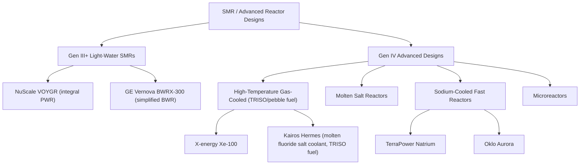

## Small Modular Reactors and Advanced Reactor Designs

### Overview

Small Modular Reactors (SMRs) are nuclear reactors with electrical output typically under 300 MWe, designed for factory fabrication and modular assembly rather than bespoke on-site construction. They span both "evolutionary" Generation III+ light-water designs that iterate on proven PWR/BWR technology, and "revolutionary" Generation IV designs using different fuels, coolants, and thermodynamic cycles. As of 2026, interest has accelerated substantially, driven partly by data center and AI-related electricity demand growth alongside government support programs. SMR designs in the industry split into two categories: "evolutionary" Gen III+ designs which iterate on the successes of widely deployed nuclear reactor types active today, and "revolutionary" Gen IV designs which use different fuel formats and thermodynamic cycles to offer improvements in performance, new capabilities, or enhanced passive safety features. [IDTechEx](https://www.idtechex.com/en/research-report/nuclear-small-modular-reactors-smrs-market/1153)

### Defining Characteristics of SMRs

**Core Design Philosophy**

- **Modularity**: components/modules manufactured in a factory setting and transported to site, reducing on-site construction time and quality-control variability compared to conventional stick-built large reactors
- **Scalability**: multiple modules can be deployed incrementally at a single site to match load growth, rather than requiring the full capital outlay of a large single-unit plant upfront
- **Enhanced passive safety**: many designs emphasize passive/inherent safety systems (natural circulation, gravity-driven injection) to reduce reliance on active systems and operator action, aided partly by lower power density and higher surface-area-to-volume ratio, which can improve passive decay heat removal
- **Reduced siting footprint**: smaller emergency planning zones are sought for some designs, though this remains subject to ongoing regulatory determination [Inference: exact emergency planning zone requirements are design- and jurisdiction-specific and continue to evolve through 2026 licensing proceedings]

### SMR/Advanced Reactor Technology Landscape

### Evolutionary Gen III+ Light-Water SMRs

**NuScale VOYGR (Integral PWR)**

NuScale's design integrates the reactor core, steam generators, and pressurizer within a single vessel, submerged in a below-grade pool that provides passive cooling. NuScale Power remains the only SMR developer to have received NRC design approval, initially for its 50 MWe module in 2023, and subsequently for its uprated 77 MWe design in May 2025, a milestone reached ahead of schedule. Multiple modules can be arranged in a single facility (referred to as a VOYGR plant) to reach larger aggregate capacity. In September 2025, the Tennessee Valley Authority, the largest public power provider in the United States, and ENTRA1 Energy announced an agreement to deploy up to six gigawatts of new nuclear power using NuScale's SMR technology. [Clean Energy Forum](https://cleanenergyforum.yale.edu/2026/04/26/an-analysis-of-small-modular-reactors-smrs-for-commercial-electricity-generation-in-the)[American Bar Association](https://www.americanbar.org/groups/environment_energy_resources/resources/trends/2026-mar-apr/pressure-to-succeed-small-modular-nuclear/)

**GE Vernova BWRX-300**

A simplified, smaller-capacity evolution of the BWR product line (~300 MWe), designed to reduce plant complexity and construction cost relative to large conventional BWRs by leveraging decades of licensed BWR operating experience while removing or simplifying several traditional systems.

### Revolutionary Gen IV Designs

**High-Temperature Gas-Cooled Reactors (HTGR)**

High-temperature gas reactor (HTGR) designs use graphite as a moderator and helium as coolant, paired with **TRISO (TRi-structural ISOtropic) fuel particles** — small fuel kernels individually coated in multiple ceramic/carbon layers that provide inherent fission product containment even at very high temperatures, without relying on a conventional metal cladding tube. [U.S. Energy Information Administration](https://www.eia.gov/todayinenergy/detail.php?id=67584)

- **X-energy Xe-100**: a pebble-bed or prismatic HTGR design using TRISO fuel; Long Mott Energy, LLC, a subsidiary of the Dow Chemical Company, selected Maryland-based X-energy, LLC's Xe-100 SMR design for an industrial site deployment. [American Bar Association](https://www.americanbar.org/groups/environment_energy_resources/resources/trends/2026-mar-apr/pressure-to-succeed-small-modular-nuclear/)

**Molten Salt / Fluoride-Salt-Cooled Reactors**

Kairos Power's design uses advanced fuel and coolant: "pebble type" TRISO fuel and molten fluoride salt as coolant rather than water, operating at low pressure with high thermal margin (since the salt's boiling point is far above operating temperature, eliminating high-pressure operation as a design driver). Kairos has received 10 C.F.R. part 50 construction permits to build two test reactor facilities in Tennessee, and has entered into an agreement with Google to "enable up to 500 MW" of nuclear power by 2035. Kairos also finalized a contract with DOE to receive high-assay low-enriched uranium (HALEU) TRISO fuel, sourced from DOE material, for the startup and operation of the Hermes 1 plant. [Pressure to succeed: Small modular (nuclear) reactor approvals on the horizon? +2](https://www.americanbar.org/groups/environment_energy_resources/resources/trends/2026-mar-apr/pressure-to-succeed-small-modular-nuclear/)

**Sodium-Cooled Fast Reactors**

- **TerraPower Natrium**: a liquid-sodium-cooled design capable of supplying up to 500 MWe, backed by Bill Gates, which has begun non-nuclear construction at a retiring coal plant in Kemmerer, Wyoming. The Natrium design pairs the reactor with a molten-salt thermal energy storage system, allowing the plant to decouple steady reactor thermal output from variable electrical dispatch — storing heat to boost power output during peak demand periods, complementing variable renewable generation. [Clean Energy Forum](https://cleanenergyforum.yale.edu/2026/04/26/an-analysis-of-small-modular-reactors-smrs-for-commercial-electricity-generation-in-the)
- **Oklo Aurora**: a sodium-cooled fast reactor design from Oklo, targeting a compact microreactor form factor. [SMR.INTEL](https://smrintel.com/state-of-smr-2026/)

**Microreactors**

A further sub-category of very small (typically single-digit to tens of MWe) transportable reactors aimed at remote/off-grid, military, or industrial applications. The Department of the Army announced the launch of the Janus Program in October 2025, aimed at building microreactors, building upon Project Pele, a transportable nuclear reactor intended for electricity production. [U.S. Energy Information Administration](https://www.eia.gov/todayinenergy/detail.php?id=67584)

### Fuel Considerations: HALEU

Many Gen IV designs require **High-Assay Low-Enriched Uranium (HALEU)**, enriched to a higher level than conventional LWR fuel while remaining below weapons-usable thresholds. HALEU is uranium enriched to between 5% and 20% U-235, compared to standard LEU at 3-5%. HALEU enables higher power density and longer core life in compact advanced reactor designs but currently faces supply chain constraints, since Centrus Energy is the only US HALEU producer at meaningful reported commercial scale. [SMR.INTEL](https://smrintel.com/state-of-smr-2026/)[SMR.INTEL](https://smrintel.com/state-of-smr-2026/)

### Regulatory and Licensing Landscape (as of 2026)

The regulatory environment for SMRs in the United States has evolved rapidly and accelerated meaningfully in 2025 and 2026. The NRC is expected to issue licensing decisions on the first two commercial SMR construction permits during 2026, a major milestone for the industry. A new "Part 53" licensing framework, intended as a more flexible, technology-inclusive regulatory pathway for advanced reactors, was finalized in March 2026. The White House has also pursued nuclear-focused executive orders designed to accelerate domestic deployment, including a Department of Energy pilot program targeting at least three pilot reactors achieving criticality by July 4, 2026. [An Analysis of Small Modular Reactors (SMRs) for Commercial Electricity Generation in the United States | Clean Energy Forum +3](https://cleanenergyforum.yale.edu/2026/04/26/an-analysis-of-small-modular-reactors-smrs-for-commercial-electricity-generation-in-the)

### Industry Scale and Commercial Status

As of May 2026, at least 66 companies across 15 countries are actively building the SMR and advanced nuclear industry, spanning reactor developers, fuel fabricators, uranium miners, and enrichment providers. NuScale Power remains the only company with full NRC design certification, Oklo is the largest SMR pure-play by market cap, TerraPower broke ground on the first US advanced reactor at Kemmerer, Wyoming, and Kairos Power holds the first NRC construction permit for an advanced reactor. [Smrintel](https://smrintel.com/smr-companies-complete-list/)[Smrintel](https://smrintel.com/smr-companies-complete-list/)

Commercialization has increasingly involved corporate offtake and investment arrangements beyond traditional utility procurement: public-private partnership has evolved from cost-sharing toward demand-side anchoring by corporate offtakers, streamlined testing frameworks on federal land, and co-located demonstration projects that directly serve AI infrastructure, exemplified by NuScale's TVA agreement, TerraPower's NRC progress, Kairos Power's Google partnership, and Amazon's X-energy investment. [Clean Energy Forum](https://cleanenergyforum.yale.edu/2026/04/26/an-analysis-of-small-modular-reactors-smrs-for-commercial-electricity-generation-in-the)[Clean Energy Forum](https://cleanenergyforum.yale.edu/2026/04/26/an-analysis-of-small-modular-reactors-smrs-for-commercial-electricity-generation-in-the)

### Challenges and Risks

Building the massive assembly lines needed for serial production requires substantial upfront capital and large order books, creating a startup problem. SMR designs also raise issues with waste retrieval, reactor repair, and decommissioning. Historically, project cancellations have occurred despite technical progress: the industry's rush to market, driven by the urgent need to address climate change, risks insufficient testing and may lead to cost overruns or cancellations, as demonstrated by NuScale's cancelled Idaho project in late 2023. [Clean Energy Forum](https://cleanenergyforum.yale.edu/2026/04/26/an-analysis-of-small-modular-reactors-smrs-for-commercial-electricity-generation-in-the)[Clean Energy Forum](https://cleanenergyforum.yale.edu/2026/04/26/an-analysis-of-small-modular-reactors-smrs-for-commercial-electricity-generation-in-the)

**Cost Reduction Strategy**

SMR economics depend on modular factory construction rather than bespoke site builds, targeting "N-th of a kind" (NOAK) cost reductions of 30-50% relative to first-of-a-kind unit costs — reflecting the general industrial learning-curve principle that repeated, standardized factory production reduces unit costs compared to unique, one-off construction projects. [Inference: actual achieved cost reduction percentages depend on order book size, supply chain maturity, and regulatory stability, and remain unproven at full commercial scale as of this writing.] [SMR.INTEL](https://smrintel.com/state-of-smr-2026/)

**Global Competitive Context**

The race to deploy commercial SMRs is a global competition with China in the lead, alongside active programs in the United States, Canada, the United Kingdom, and other countries. [SMR.INTEL](https://smrintel.com/state-of-smr-2026/)

### Comparative Table: Selected Advanced Reactor Concepts

| Design | Developer | Coolant | Fuel | Approx. Power | Key Distinguishing Feature |
| --- | --- | --- | --- | --- | --- |
| VOYGR | NuScale | Light water | LEU | 77 MWe/module | NRC-certified integral PWR, pool-submerged passive cooling |
| BWRX-300 | GE Vernova | Light water (boiling) | LEU | ~300 MWe | Simplified evolution of licensed BWR technology |
| Xe-100 | X-energy | Helium | TRISO (HALEU) | ~80 MWe/unit | High-temperature gas-cooled, pebble/prismatic TRISO fuel |
| Hermes/KP-FHR | Kairos Power | Molten fluoride salt | TRISO (HALEU) | Test reactor scale initially | Low-pressure operation, high thermal margin |
| Natrium | TerraPower | Liquid sodium | HALEU | ~345 MWe (500 MWe peak with storage) | Integrated molten-salt thermal energy storage |
| Aurora | Oklo | Liquid sodium | HALEU | Microreactor scale | Compact fast reactor, long refueling interval |

### Key Points

- SMRs divide into evolutionary Gen III+ light-water designs (NuScale, BWRX-300) and revolutionary Gen IV designs using alternative coolants/fuels (HTGR, molten salt, sodium-fast).
- TRISO fuel provides inherent fission-product containment at the particle level, relevant to several Gen IV designs.
- HALEU fuel (5–20% U-235) is required by many advanced designs but faces near-term supply constraints tied to limited domestic enrichment capacity.
- As of 2026, NuScale is the only design with full NRC certification, while Kairos holds the first advanced-reactor construction permit; a new Part 53 licensing framework aims to streamline future approvals.
- Corporate offtake agreements (notably from technology/data-center companies) have become a significant commercialization driver alongside traditional utility procurement.
- Serial factory manufacturing is central to SMR cost economics, though NOAK cost-reduction targets remain largely unproven at commercial scale.

### Related Topics

- Nuclear Fission and Chain Reactions
- Reactor Types: PWR, BWR, and Heavy-Water Reactors
- Nuclear Safety Systems and Containment
- TRISO Fuel Technology and Fabrication
- HALEU Supply Chain and Enrichment
- Molten Salt Reactor Chemistry and Materials
- Sodium-Cooled Fast Reactor Design and Safety
- Nuclear Regulatory Frameworks (NRC Part 53)