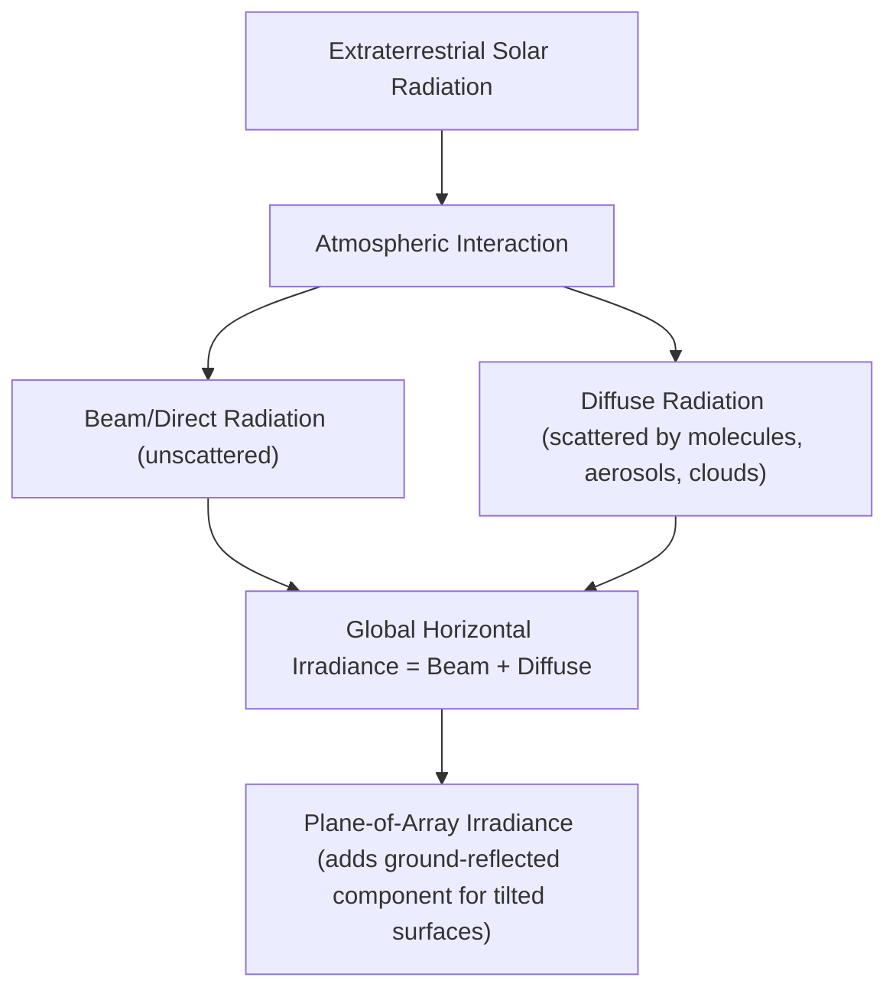
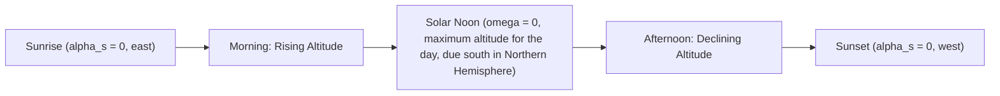

## Solar Radiation Fundamentals and Solar Geometry

### Overview

Solar radiation is the electromagnetic energy emitted by the sun that reaches Earth's surface, forming the primary energy input for all solar conversion technologies (photovoltaic, thermal, concentrated solar power). Understanding solar radiation's spectral composition, intensity, and the geometric relationships governing sun-earth positioning is foundational to sizing, orienting, and predicting the performance of any solar energy system.

### The Solar Constant and Extraterrestrial Radiation

**Solar Constant**

The **solar constant** $G_{sc}$ is the average extraterrestrial solar irradiance measured perpendicular to the sun's rays at the mean Earth-Sun distance (1 astronomical unit), with a standard accepted value of:

$$G_{sc} \approx 1367\ \text{W/m}^2$$

[Unverified: some current references cite slightly revised values around 1361 W/m² based on updated satellite radiometry; the exact accepted value depends on the measurement standard/era cited]

**Variation with Earth-Sun Distance**

Because Earth's orbit is elliptical, extraterrestrial irradiance varies slightly (~±3.3%) over the year, approximated by:

$$G_{on} = G_{sc}\left[1 + 0.033\cos\left(\frac{360n}{365}\right)\right]$$

where $n$ is the day of the year (1–365).

### Solar Spectrum and Atmospheric Attenuation

**Spectral Distribution**

The sun radiates approximately as a blackbody at ~5778 K, with the extraterrestrial spectrum spanning ultraviolet (~5%), visible (~43%), and infrared (~52%) wavelength bands by energy content [Inference: exact percentage breakdowns vary slightly depending on the specific spectral reference/band definitions used].

**Atmospheric Effects**

As sunlight passes through the atmosphere, it is attenuated by:

- **Absorption**: ozone (UV absorption), water vapor and CO₂ (infrared absorption bands)
- **Scattering**: Rayleigh scattering (by air molecules, wavelength-dependent, responsible for sky's blue color and diffuse radiation) and Mie scattering (by aerosols/particulates)
- **Reflection**: by clouds, which can substantially reduce direct-beam irradiance while increasing diffuse fraction

**Air Mass**

**Air Mass (AM)** quantifies the relative path length of sunlight through the atmosphere compared to a sun directly overhead:

$$AM = \frac{1}{\cos\theta_z}$$

where $\theta_z$ is the solar zenith angle. Standard reference spectra include AM0 (extraterrestrial, no atmosphere), AM1 (sun directly overhead), and **AM1.5** (zenith angle ≈ 48.2°), the standard reference spectrum used for terrestrial photovoltaic testing and rating, corresponding to a standard total irradiance of 1000 W/m².

### Direct, Diffuse, and Global Radiation Components

**Beam (Direct) Radiation**

Radiation received from the sun without scattering, traveling in a straight line — the dominant component on clear days and the only component usable by concentrating solar technologies.

**Diffuse Radiation**

Radiation scattered by atmospheric molecules, aerosols, and clouds, arriving from the entire sky dome rather than a single direction — becomes the dominant (or sole) component under overcast conditions.

**Global (Total) Radiation**

The sum of direct and diffuse components received on a horizontal surface:

$$G = G_b + G_d$$

where $G_b$ is beam and $G_d$ is diffuse irradiance. On a tilted surface, a third component — **ground-reflected radiation** — is also included, dependent on ground albedo.

### Solar Geometry: Key Angles

**Declination Angle**

The **solar declination** $\delta$ is the angular position of the sun relative to the plane of the equator, varying from approximately +23.45° (summer solstice, Northern Hemisphere) to −23.45° (winter solstice) due to Earth's axial tilt:

$$\delta = 23.45° \sin\left[\frac{360(284 + n)}{365}\right]$$

**Hour Angle**

The **hour angle** $\omega$ represents the angular displacement of the sun east or west of the local meridian due to Earth's rotation, at 15° per hour (360°/24h), with solar noon defined as $\omega = 0°$:

$$\omega = 15° \times (\text{Solar Time} - 12)$$

**Latitude**

The observer's **latitude** $\phi$ (positive for Northern Hemisphere) is the third fundamental angle needed to fully specify sun position.

### Solar Position Angles

**Solar Altitude and Zenith Angle**

The **solar altitude angle** $\alpha_s$ (angle above the horizon) and **zenith angle** $\theta_z$ (angle from vertical, $\theta_z = 90° - \alpha_s$) are given by:

$$\sin\alpha_s = \cos\theta_z = \sin\phi\sin\delta + \cos\phi\cos\delta\cos\omega$$

**Solar Azimuth Angle**

The **solar azimuth angle** $\gamma_s$ (measured from true south, positive toward west in common convention) describes the compass direction of the sun:

$$\sin\gamma_s = \frac{\cos\delta\sin\omega}{\cos\alpha_s}$$

### Solar Geometry Diagram (svg_diagram)

<svg xmlns="http://www.w3.org/2000/svg" viewBox="0 0 700 450">
<text x="350" y="30" font-size="18" font-weight="bold" text-anchor="middle" fill="#1a1a2e">Solar Position Angles (svg_diagram)</text>
<line x1="100" y1="380" x2="600" y2="380" stroke="#333" stroke-width="2" />
<text x="620" y="385" font-size="13" fill="#333">Horizon</text>
<line x1="350" y1="380" x2="350" y2="80" stroke="#999" stroke-width="1" stroke-dasharray="4,4" />
<text x="360" y="90" font-size="12" fill="#666">Zenith</text>
<line x1="350" y1="380" x2="550" y2="150" stroke="#f9ab00" stroke-width="3" />
<circle cx="550" cy="150" r="18" fill="#f9ab00" />
<text x="575" y="145" font-size="13" fill="#1a1a2e">Sun</text>
<path d="M 350 340 A 40 40 0 0 0 388 371" fill="none" stroke="#1a73e8" stroke-width="2" />
<text x="395" y="355" font-size="12" fill="#1a73e8">alpha_s (altitude)</text>
<path d="M 350 120 A 260 260 0 0 1 522 163" fill="none" stroke="#188038" stroke-width="2" />
<text x="480" y="120" font-size="12" fill="#188038">theta_z (zenith)</text>
<line x1="100" y1="380" x2="600" y2="380" stroke="#333" stroke-width="0" />
<text x="120" y="400" font-size="12" fill="#333">South</text>
<text x="580" y="400" font-size="12" fill="#333">West</text>
<path d="M 350 380 A 40 40 0 0 1 385 355" fill="none" stroke="#d93025" stroke-width="2" />
<text x="390" y="405" font-size="12" fill="#d93025">gamma_s (azimuth)</text>
</svg>

### Incidence Angle on Tilted Surfaces

For a fixed tilted collector (tilt angle $\beta$ from horizontal, surface azimuth $\gamma$), the **angle of incidence** $\theta$ between the sun's rays and the surface normal is:

$$\cos\theta = \sin\delta\sin\phi\cos\beta - \sin\delta\cos\phi\sin\beta\cos\gamma + \cos\delta\cos\phi\cos\beta\cos\omega + \cos\delta\sin\phi\sin\beta\cos\gamma\cos\omega + \cos\delta\sin\beta\sin\gamma\sin\omega$$

For the common simplified case of a south-facing surface in the Northern Hemisphere ($\gamma = 0$):

$$\cos\theta = \sin(\phi - \beta)\sin\delta + \cos(\phi - \beta)\cos\delta\cos\omega$$

This equation underlies optimal tilt-angle selection: a common rule-of-thumb design guideline sets fixed-tilt collectors near the local latitude to approximately maximize annual average incidence angle performance, though optimal tilt varies by season and specific site if seasonal adjustment or tracking is used. [Inference: "optimal" tilt is application- and load-profile dependent — e.g., winter-weighted loads favor steeper tilt than latitude alone would suggest]

### Sunrise, Sunset, and Day Length

**Sunset Hour Angle**

The hour angle at sunset ($\alpha_s = 0$) on a horizontal surface:

$$\cos\omega_s = -\tan\phi\tan\delta$$

**Day Length**

$$N = \frac{2}{15}\cos^{-1}(-\tan\phi\tan\delta)\ \text{hours}$$

This explains seasonal day-length variation: at the summer solstice, high-latitude locations experience extended daylight (up to 24 hours poleward of the Arctic/Antarctic circles), while winter solstice produces the shortest days.

### Solar Path Diagram Concept

### Extraterrestrial Radiation on a Horizontal Surface

The daily extraterrestrial irradiation on a horizontal surface, integrated over daylight hours, is used as a reference baseline for computing **clearness index** $K_T$:

$$K_T = \frac{H}{H_o}$$

where $H$ is measured global horizontal irradiation and $H_o$ is the calculated extraterrestrial irradiation for the same location/day — a widely used metric for characterizing local atmospheric clarity and correlating with diffuse fraction in solar resource models.

### Worked Example: Solar Altitude at Solar Noon

**Problem**: Calculate the solar altitude angle at solar noon on the summer solstice ($\delta = 23.45°$) for a location at latitude $\phi = 40°N$.

**Solution**: At solar noon, $\omega = 0°$, so:

$$\sin\alpha_s = \sin\phi\sin\delta + \cos\phi\cos\delta\cos(0°) = \sin\phi\sin\delta + \cos\phi\cos\delta = \cos(\phi - \delta)$$

$$\alpha_s = 90° - (\phi - \delta) = 90° - (40° - 23.45°) = 90° - 16.55° = 73.45°$$

This confirms the general relation that solar noon altitude equals $90° - |\phi - \delta|$, giving the sun a high position in the sky during Northern Hemisphere summer at mid-latitudes.

### Key Points

- The solar constant (~1361–1367 W/m²) sets the extraterrestrial irradiance baseline, modulated by Earth's elliptical orbit.
- AM1.5 is the standard terrestrial reference spectrum (1000 W/m²) used for PV testing and rating.
- Global irradiance splits into beam (direct), diffuse, and (for tilted surfaces) ground-reflected components.
- Solar position is fully determined by declination $\delta$, hour angle $\omega$, and latitude $\phi$, yielding altitude and azimuth angles.
- The incidence angle equation connects sun position to collector orientation, underlying tilt/tracking design decisions.
- Clearness index $K_T$ relates measured to theoretical extraterrestrial irradiation, a key input to solar resource modeling.

### Related Topics

- Photovoltaic Cell Operating Principles
- Solar Thermal Collectors (Flat-Plate and Evacuated Tube)
- Concentrated Solar Power (CSP) Systems
- Solar Tracking Systems (Single- and Dual-Axis)
- PV System Sizing and Energy Yield Estimation
- Solar Resource Assessment and TMY Data
- Photovoltaic Module Efficiency and Temperature Coefficients
- Solar Array Tilt and Orientation Optimization