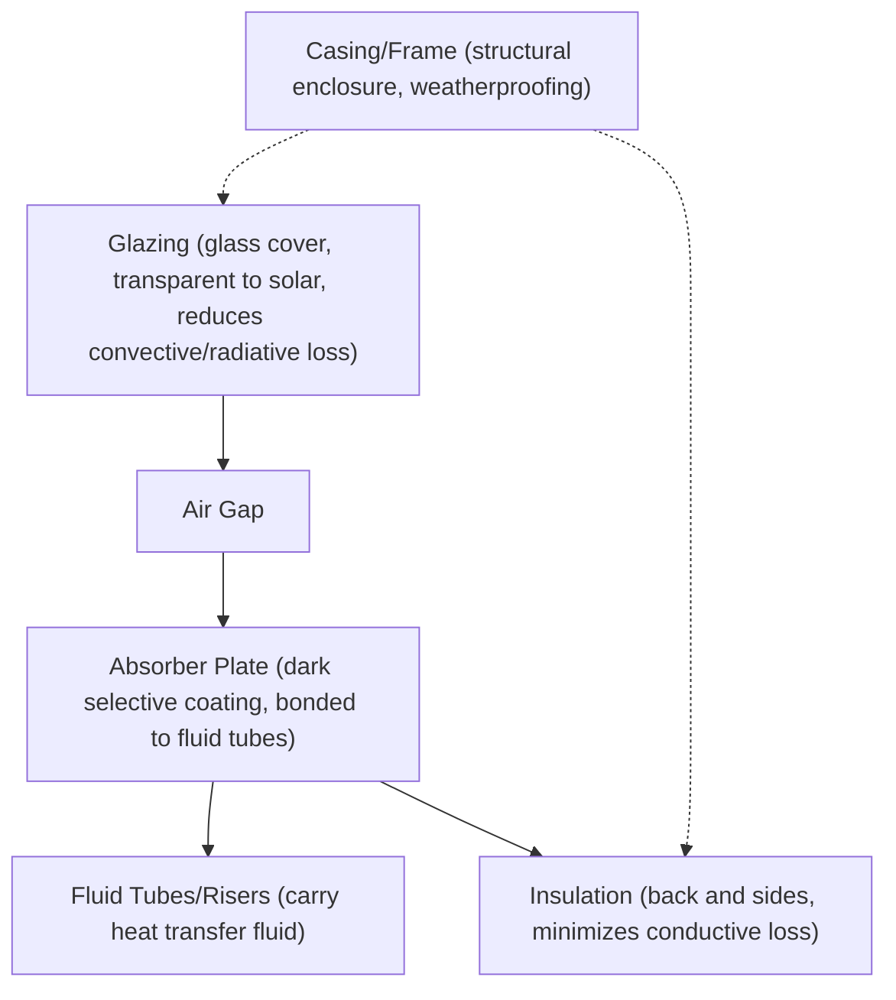
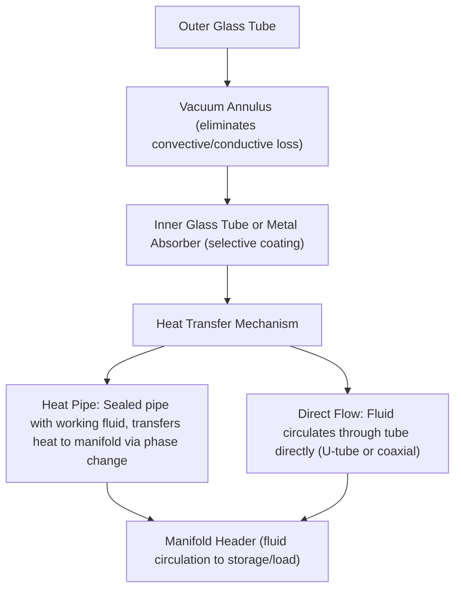
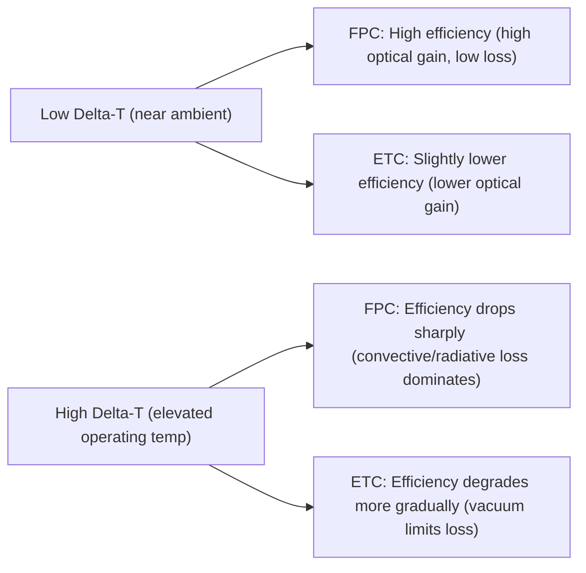
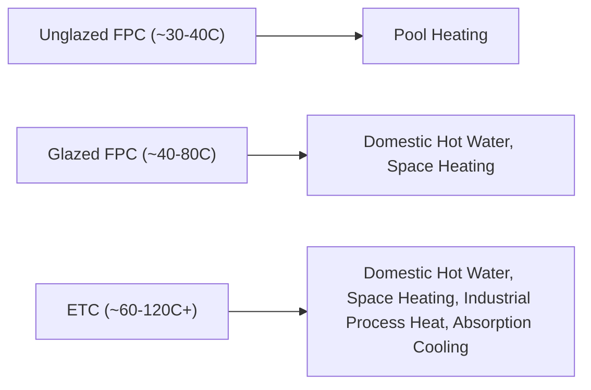

## Flat-Plate and Evacuated-Tube Solar Collectors

### Overview

Solar thermal collectors convert incident solar radiation into usable heat by absorbing sunlight on a dark surface and transferring the collected thermal energy to a working fluid (typically water, water-glycol mixture, or air). Flat-plate and evacuated-tube collectors are the two dominant technologies for low-to-medium temperature applications such as domestic hot water, space heating, and industrial process heat, distinguished primarily by their thermal loss mechanisms and achievable operating temperature ranges.

### Flat-Plate Collectors (FPC)

**Construction**

- **Glazing**: typically low-iron tempered glass, providing high solar transmittance (~90%+) while trapping heat via the greenhouse effect and shielding the absorber from wind convection
- **Absorber plate**: a metal plate (copper or aluminum, high thermal conductivity) coated with a **selective surface coating** designed to maximize solar absorptance (α, typically >0.90) in the solar spectrum while minimizing thermal emittance (ε, typically <0.10) in the infrared, reducing radiative heat loss compared to plain black paint
- **Fluid channels**: tubes bonded (soldered, ultrasonically welded, or roll-bonded) to the absorber plate, carrying the heat transfer fluid in a parallel-riser or serpentine configuration
- **Insulation**: mineral wool or rigid foam behind and around the absorber, minimizing conductive heat loss to the environment
- **Frame/casing**: aluminum or galvanized steel enclosure providing structural support and weather sealing

**Thermal Performance Characteristics**

Flat-plate collectors are unglazed (no glass cover, lowest cost, lowest performance, suited to low-temperature applications like pool heating) or glazed (single or double glazing, suited to domestic hot water and space heating). Operating temperatures for glazed FPCs typically range up to approximately 80°C, with efficiency dropping as the temperature difference between absorber and ambient increases due to rising convective and radiative losses.

### Evacuated-Tube Collectors (ETC)

**Construction**

**Vacuum Insulation Principle**

The defining feature of ETCs is the vacuum maintained in the annular space between the outer and inner glass tubes (similar in principle to a vacuum (Dewar) flask), which nearly eliminates conductive and convective heat losses from the absorber to the environment, leaving radiative loss as the dominant loss mechanism.

**Heat Pipe Configuration**

Many ETC designs use a sealed **heat pipe** inside each tube containing a small quantity of working fluid (often water, methanol, or a proprietary mixture) at reduced pressure:

1. Solar heat vaporizes the working fluid at the tube's lower (absorber) end
2. Vapor rises to a condenser bulb at the top of the tube
3. Heat is transferred to the manifold fluid (typically via a dry connection or wet direct contact) as the vapor condenses
4. Condensed liquid returns via gravity to the absorber end, repeating the cycle

This design allows individual tube replacement without draining the entire system and provides a degree of freeze protection (since the heat pipe's working fluid, not the main system fluid, is directly exposed at the tube tip in dry-connection designs).

**Direct-Flow Configuration**

Alternative ETC designs circulate the working fluid directly through the tube (via a U-tube or coaxial inner/outer tube arrangement) rather than using a heat pipe, providing more direct heat transfer but requiring the entire fluid loop to be freeze-protected.

### Comparative Thermal Efficiency

**Collector Efficiency Equation**

Both collector types follow the standard thermal efficiency model:

$$\eta = \eta_0 - a_1\frac{(T_m - T_a)}{G} - a_2\frac{(T_m - T_a)^2}{G}$$

where $\eta_0$ is optical (zero-loss) efficiency, $a_1$ and $a_2$ are linear and quadratic heat loss coefficients, $T_m$ is mean fluid temperature, $T_a$ is ambient temperature, and $G$ is incident irradiance.

| Parameter | Flat-Plate Collector | Evacuated-Tube Collector |
| --- | --- | --- |
| Optical efficiency $\eta_0$ | Typically higher (~0.75–0.85) [Inference: exact values are product-specific and vary by glazing/coating quality] | Typically somewhat lower due to tube geometry and curved surface losses (~0.65–0.75) [Inference: values vary significantly by manufacturer and design] |
| Heat loss coefficient $a_1$ | Higher (more loss at elevated $\Delta T$) | Lower (vacuum insulation substantially reduces loss) |
| Performance at low $\Delta T$ | Comparable or better (higher optical efficiency dominates) | Comparable |
| Performance at high $\Delta T$ / cold climates | Degrades more rapidly | Maintains efficiency better due to lower loss coefficient |
| Typical usable temperature range | Up to ~80°C | Up to ~120–150°C achievable in favorable conditions [Inference: practical achievable temperature depends on flow rate, load, and ambient conditions] |

**Efficiency Curve Comparison**

This crossover behavior means flat-plate collectors are often more cost-effective for near-ambient applications (pool heating, mild-climate domestic hot water), while evacuated-tube collectors offer an advantage in cold climates, high-temperature applications, or where consistent performance across variable ambient conditions is prioritized. [Behavior may vary depending on specific product selective coatings, glazing quality, and system design; generalized efficiency comparisons should be validated against certified performance data (e.g., SRCC or Solar Keymark ratings) for specific products.]

### Stagnation Temperature and Overheat Protection

**Stagnation Condition**

When fluid flow stops (pump failure, controller fault, or system full of hot water with no load demand) under high solar irradiance, collectors reach **stagnation temperature** — the equilibrium temperature at which absorbed solar energy equals thermal losses at zero net heat extraction.

- Flat-plate collectors typically stagnate around 150–200°C [Inference: exact stagnation temperature is design-specific, dependent on glazing, coating, and insulation]
- Evacuated-tube collectors, due to superior insulation, can reach substantially higher stagnation temperatures, sometimes exceeding 250–300°C [Inference: values vary by manufacturer and vacuum integrity]

**Design Implications**

- System components (piping, fluid, seals, expansion tank) downstream of the collector must be rated for stagnation conditions
- Heat pipe ETC designs offer an inherent partial protection mechanism, since heat pipe dry-out at extreme temperatures can self-limit heat transfer to the manifold in some designs [Inference: this behavior is heat-pipe-fluid and design specific, and should not be assumed without manufacturer confirmation]
- Drainback systems (draining fluid from the collector loop when not actively heating) are a common overheat/freeze protection strategy for both collector types

### Freeze Protection Strategies

| Method | Description | Applicability |
| --- | --- | --- |
| Antifreeze (glycol) loop | Closed loop with propylene glycol/water mixture, heat exchanged to potable water via a heat exchanger | Both FPC and direct-flow ETC |
| Drainback system | Fluid drains from collector to an indoor reservoir when the pump stops, using gravity | Both, requires proper piping slope |
| Heat pipe isolation | Heat pipe working fluid is isolated from main loop; main loop only exposed to ambient at the dry-connect manifold | ETC-specific advantage |
| Direct circulation with freeze valve/controller | Circulates warm water through collector during freeze risk conditions | Both, energy penalty |

### Applications by Temperature Range

### Worked Example: Useful Heat Gain Calculation

**Problem**: A flat-plate collector with area $A = 4\ \text{m}^2$ has $\eta_0 = 0.80$, $a_1 = 4.0\ \text{W/m}^2\text{K}$, operating with mean fluid temperature $T_m = 50°C$, ambient $T_a = 20°C$, and incident irradiance $G = 800\ \text{W/m}^2$. Estimate the useful heat output (neglecting the quadratic loss term for simplicity).

**Solution**:

$$\eta = 0.80 - 4.0 \times \frac{(50 - 20)}{800} = 0.80 - 4.0 \times 0.0375 = 0.80 - 0.15 = 0.65$$

$$Q_{useful} = \eta \times G \times A = 0.65 \times 800 \times 4 = 2080\ \text{W} \approx 2.08\ \text{kW}$$

This demonstrates how rising $\Delta T$ (fluid-to-ambient temperature difference) directly reduces collector efficiency and useful heat output via the linear loss term.

### Certification and Standards

Collector performance is typically certified against standardized test methods (e.g., ISO 9806, ASHRAE 93, or regional equivalents such as SRCC OG-100 in the US or Solar Keymark in Europe), which measure $\eta_0$, $a_1$, $a_2$ under controlled conditions, allowing objective comparison across products and technologies. [Inference: specific standard applicability depends on region and certification body, and testing protocols may be updated over time]

### Key Points

- Flat-plate collectors use a simple glazed absorber-plate design with insulation; evacuated-tube collectors use vacuum-insulated tubes (often with heat pipes) to nearly eliminate convective/conductive loss.
- FPCs generally have higher optical efficiency but higher heat loss coefficients; ETCs have somewhat lower optical efficiency but superior high-temperature and cold-climate performance.
- Stagnation temperature (no-flow equilibrium) is a critical design consideration for component ratings and overheat protection, and is generally higher for ETCs.
- Freeze protection strategies include glycol loops, drainback systems, and (for ETCs) inherent heat-pipe isolation.
- Selection between FPC and ETC depends on target operating temperature, climate, and application (pool heating vs. industrial process heat).

### Related Topics

- Solar Radiation Fundamentals and Solar Geometry
- Concentrated Solar Power (CSP) Systems
- Solar Water Heating System Design (Direct, Indirect, Drainback)
- Thermal Energy Storage for Solar Systems
- Solar Absorption Cooling
- Selective Surface Coatings and Materials
- Collector Testing Standards (ISO 9806, SRCC, Solar Keymark)
- Heat Exchanger Design for Solar Thermal Loops