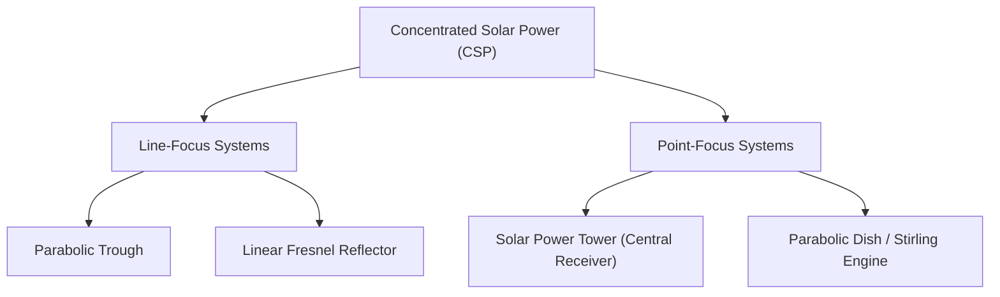
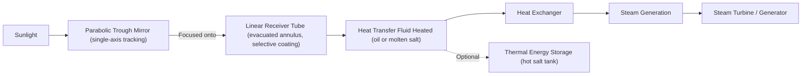
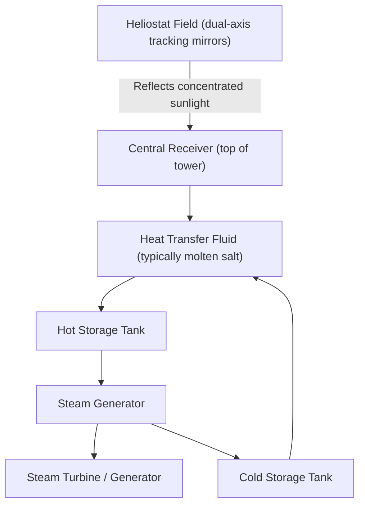
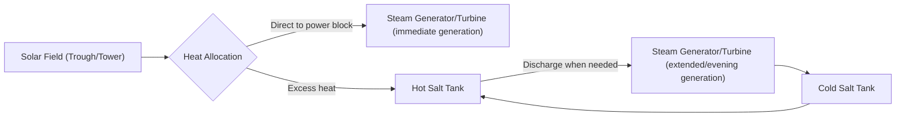

## Concentrated Solar Power Systems

### Overview

Concentrated Solar Power (CSP) systems use mirrors or lenses to focus direct-beam solar radiation onto a small receiver area, generating high-temperature heat that drives a conventional thermodynamic power cycle (typically Rankine, sometimes Brayton or Stirling) to produce electricity. Unlike photovoltaics, which directly convert photons to electricity, CSP is fundamentally a thermal generation technology, which enables an important advantage: integration with thermal energy storage to provide dispatchable power beyond daylight hours.

### Fundamental Requirement: Direct Normal Irradiance (DNI)

CSP systems can only concentrate the **beam (direct) component** of solar radiation, since diffuse radiation arrives from the entire sky dome and cannot be focused to a point or line by optical concentration. This makes CSP economically viable primarily in regions with high **Direct Normal Irradiance (DNI)** — typically arid, low-cloud, low-aerosol climates such as desert regions — in contrast to PV, which can still utilize diffuse radiation with reduced but non-zero output under cloudy conditions.

### CSP Technology Families

### Parabolic Trough Systems

**Configuration**

Long, curved parabolic mirrors (troughs) concentrate sunlight onto a linear receiver tube (heat collection element, HCE) running along the trough's focal line. The receiver tube typically contains a heat transfer fluid (HTF) — historically synthetic thermal oil, though molten salt direct systems are increasingly deployed.

**Key Characteristics**

- **Tracking**: single-axis tracking (typically north-south axis, tracking east-west sun movement)
- **Operating temperature**: HTF outlet temperatures commonly in the range of 350–400°C for oil-based systems
- **Receiver design**: evacuated annular glass envelope around a metal absorber tube (conceptually similar to evacuated-tube solar thermal collectors, but engineered for much higher operating temperatures and using a selective coating optimized for high-temperature performance)
- **Maturity**: the most commercially mature and widely deployed CSP technology globally, with extensive operating experience

### Linear Fresnel Reflector Systems

**Configuration**

Uses flat or slightly curved mirror strips arranged in rows, each individually tracking the sun on a single axis, to reflect sunlight onto a fixed linear receiver mounted above the mirror field — approximating a parabolic trough's optical function using segmented flat mirrors.

**Trade-offs vs. Parabolic Trough**

- Simpler, potentially lower-cost mirror and structural design (flat/lightly curved mirrors, fixed receiver reduces piping flexure requirements)
- Generally lower optical efficiency and concentration ratio than parabolic troughs due to the segmented approximation of the parabolic curve
- Reduced land-use footprint and lower wind loading due to lower mirror profile

### Solar Power Tower (Central Receiver) Systems

**Configuration**

A field of individually sun-tracking flat mirrors (**heliostats**) reflects sunlight onto a fixed receiver mounted atop a central tower, achieving much higher concentration ratios and operating temperatures than trough systems.

**Key Characteristics**

- **Tracking**: heliostats use dual-axis tracking to continuously redirect sunlight onto the fixed receiver as the sun moves
- **Operating temperature**: substantially higher than trough systems, commonly 500–565°C with molten salt as both heat transfer fluid and storage medium, enabling higher steam cycle efficiency
- **Molten salt storage integration**: because molten salt can serve simultaneously as HTF and storage medium, tower systems are particularly well-suited to integrated multi-hour thermal energy storage
- **Receiver types**: external cylindrical receivers (heated on all sides by the surrounding heliostat field) or cavity receivers (heliostats reflect into an enclosed aperture, reducing convective/radiative losses)

### Parabolic Dish / Stirling Engine Systems

**Configuration**

A dish-shaped parabolic mirror concentrates sunlight onto a receiver at the focal point, typically mounted directly at the receiver with a **Stirling engine** generator integrated at the focus (rather than transporting heat via fluid to a separate turbine).

**Key Characteristics**

- Highest achievable concentration ratios and operating temperatures among CSP technologies, since the point focus of a dual-axis tracked dish achieves very high flux concentration
- Modular, distributed generation (each dish-engine unit is an independent generating unit, unlike trough/tower systems that aggregate to a shared power block)
- Historically limited in large-scale commercial deployment relative to trough and tower technologies, due in part to Stirling engine cost/reliability and lack of straightforward thermal storage integration at the unit level [Inference: deployment scale and specific commercial status are subject to change and should be verified against current project data]

### Thermal Energy Storage (TES) — The Key CSP Differentiator

**Two-Tank Molten Salt Storage**

The most widely deployed CSP storage architecture uses two tanks (hot and cold) containing molten nitrate salt (commonly a mixture of sodium nitrate and potassium nitrate, "solar salt"):

1. During sunny periods, excess thermal energy heats salt pumped from the cold tank to the hot tank
2. During cloudy periods or after sunset, hot salt is drawn down to generate steam via a heat exchanger, extending generation hours
3. Cooled salt returns to the cold tank, ready for re-heating

**Storage Capacity Metric**

CSP plant storage capacity is commonly described in **hours of full-load generation** (e.g., "6 hours of storage"), representing how long the plant can operate at rated capacity using only stored thermal energy with no incident solar input — a key differentiator enabling CSP to shift generation to evening peak demand periods or provide continuous baseload-like output when paired with sufficient storage and solar field oversizing.

### CSP vs. Photovoltaic Comparison

| Aspect | CSP | Photovoltaic (PV) |
| --- | --- | --- |
| Conversion mechanism | Thermal (concentrated heat → thermodynamic cycle) | Direct photon-to-electron (semiconductor) |
| Usable radiation | Direct/beam only (DNI-dependent) | Direct + diffuse |
| Storage | Thermal storage (cost-effective at scale, well-integrated) | Requires separate battery storage |
| Dispatchability | High, with adequate storage/oversizing | Low without paired storage |
| Site suitability | High-DNI regions only (arid/desert climates) | Broader range of climates viable |
| Typical scale | Large utility-scale plants (economies of scale in power block) | Scalable from residential to utility scale |
| Water use | Can be significant for wet-cooled steam cycles (a consideration in arid siting locations) [Inference: dry-cooling alternatives exist but with an efficiency/cost trade-off] | Minimal (mainly panel cleaning) |

### Power Cycle Integration

CSP plants ultimately couple their concentrated heat source to a conventional power cycle:

- **Rankine cycle (steam)**: the dominant choice, essentially identical in principle to the secondary loop of a nuclear or fossil steam plant, benefiting from decades of turbine technology maturity
- **Brayton cycle (gas turbine)**: explored for higher-temperature receiver concepts (e.g., using supercritical CO₂ or air as the working fluid), potentially offering higher cycle efficiency [Inference: commercial deployment of advanced Brayton/sCO2 CSP cycles remains largely in demonstration/pilot stages as of the available knowledge base]
- **Stirling cycle**: used specifically in dish-Stirling configurations, direct engine integration at the receiver focus

### Worked Example: Storage Duration Estimation

**Problem**: A CSP tower plant has a hot salt tank storing $E_{stored} = 3000\ \text{MWh}_{th}$ of thermal energy. The power block has a rated electrical output of 100 MWe at a thermal-to-electric conversion efficiency of 40%. Estimate the hours of full-load generation available from storage alone.

**Solution**:

Thermal power required for 100 MWe at 40% efficiency:

$$P_{th} = \frac{P_e}{\eta} = \frac{100\ \text{MW}}{0.40} = 250\ \text{MW}_{th}$$

$$\text{Storage duration} = \frac{E_{stored}}{P_{th}} = \frac{3000\ \text{MWh}_{th}}{250\ \text{MW}_{th}} = 12\ \text{hours}$$

This demonstrates how thermal storage capacity directly translates into extended dispatchable generation hours, a capability not inherently available to standalone PV systems.

### Key Points

- CSP concentrates only direct-beam radiation, restricting economically viable siting to high-DNI (arid/desert) regions.
- Four primary technology families exist: parabolic trough and linear Fresnel (line-focus), and solar tower and parabolic dish (point-focus), with tower systems achieving the highest temperatures.
- Molten salt two-tank thermal energy storage is CSP's key differentiating advantage over PV, enabling dispatchable, storage-extended generation.
- CSP couples to conventional Rankine (steam) power cycles in nearly all commercial deployments, with Brayton/sCO2 cycles as an emerging higher-efficiency direction.
- Storage capacity is typically expressed in hours of full-load generation, directly calculable from stored thermal energy and power block thermal demand.

### Related Topics

- Solar Radiation Fundamentals and Solar Geometry
- Flat-Plate and Evacuated-Tube Solar Collectors
- Rankine Cycle Thermodynamics in Power Plants
- Thermal Energy Storage Materials and Design
- Photovoltaic Cell Operating Principles
- Supercritical CO2 Brayton Cycle Power Generation
- Solar Field Optical Design and Heliostat Control
- Hybrid Solar-Fossil and Solar-Thermal Storage Integration