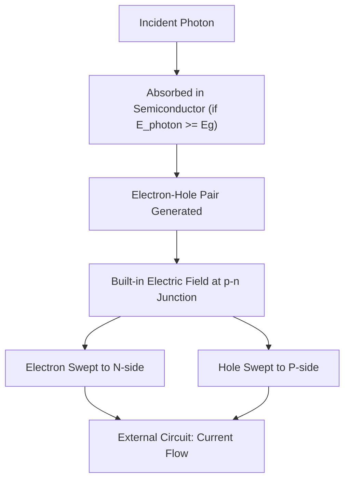
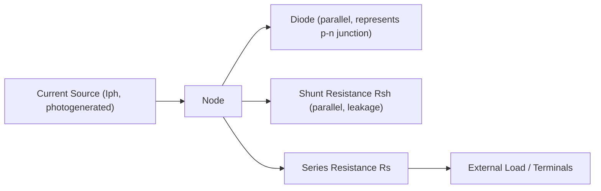

## Photovoltaic Cell Principles and Materials

### Overview

Photovoltaic (PV) cells directly convert solar radiation into electricity through the photovoltaic effect, a quantum phenomenon occurring at a semiconductor p-n junction. Unlike solar thermal or CSP systems, PV involves no moving parts or working fluid at the cell level, converting photons directly to electron flow. Understanding the underlying semiconductor physics and the landscape of competing cell materials is fundamental to PV system design, performance prediction, and technology selection.

### The Photovoltaic Effect

**Photon Absorption and Carrier Generation**

When a photon with energy equal to or exceeding the semiconductor's **bandgap energy** $E_g$ is absorbed, it excites an electron from the valence band to the conduction band, creating an electron-hole pair:

$$E_{photon} = h\nu = \frac{hc}{\lambda} \geq E_g$$

where $h$ is Planck's constant, $\nu$ is photon frequency, $c$ is the speed of light, and $\lambda$ is wavelength. Photons with energy below $E_g$ are not absorbed (pass through or are lost as heat via lattice vibration if absorbed by other mechanisms), while photons with energy above $E_g$ lose their excess energy as heat (thermalization) rather than contributing additional useful energy per absorbed photon.

**The p-n Junction**

A PV cell is fundamentally a **p-n junction diode**: a semiconductor (commonly silicon) is doped to create a p-type region (excess holes, via boron doping in silicon) adjacent to an n-type region (excess electrons, via phosphorus doping). At the junction, diffusion of carriers across the interface establishes a **depletion region** with a built-in electric field.

When light generates electron-hole pairs near or within the depletion region, the built-in field separates them before recombination can occur, driving electrons toward the n-side and holes toward the p-side. This charge separation creates a voltage difference across the junction and, when connected to an external circuit, drives current flow.

### Equivalent Circuit Model

**Single-Diode Model**

A PV cell is commonly modeled electrically as a current source (representing photogenerated current) in parallel with a diode, plus series and shunt resistances representing internal losses:

$$I = I_{ph} - I_0\left[\exp\left(\frac{q(V + IR_s)}{nkT}\right) - 1\right] - \frac{V + IR_s}{R_{sh}}$$

where $I_{ph}$ is photogenerated current, $I_0$ is diode saturation current, $q$ is electron charge, $n$ is diode ideality factor, $k$ is Boltzmann's constant, $T$ is cell temperature, $R_s$ is series resistance (wiring, contact resistance), and $R_{sh}$ is shunt resistance (leakage paths).

**Key Performance Parameters**

- **Short-circuit current ($I_{sc}$)**: current when $V = 0$, approximately equal to $I_{ph}$
- **Open-circuit voltage ($V_{oc}$)**: voltage when $I = 0$, determined by the diode saturation current and photogenerated current
- **Maximum power point (MPP)**: the operating point $(V_{mp}, I_{mp})$ on the I-V curve that maximizes power output $P = V \times I$
- **Fill factor (FF)**: a measure of I-V curve "squareness":

$$FF = \frac{V_{mp} \times I_{mp}}{V_{oc} \times I_{sc}}$$

- **Efficiency**: ratio of maximum electrical power output to incident solar power:

$$\eta = \frac{V_{oc} \times I_{sc} \times FF}{P_{in}}$$

### I-V and P-V Curve Characteristics

Maximum Power Point Tracking (MPPT) in inverters continuously adjusts the operating voltage to track this maximum power point as irradiance and temperature conditions change throughout the day.

### Temperature and Irradiance Effects

**Temperature Dependence**

- $V_{oc}$ decreases with increasing cell temperature (typically by roughly 0.3–0.5%/°C for crystalline silicon) [Inference: exact coefficient is material- and product-specific]
- $I_{sc}$ increases very slightly with temperature (a much smaller effect than the $V_{oc}$ decrease)
- Net effect: PV module power output decreases with increasing cell temperature, making thermal management (ventilation, mounting standoff) relevant to system design

**Irradiance Dependence**

$I_{sc}$ scales approximately linearly with incident irradiance, while $V_{oc}$ increases only logarithmically with irradiance — meaning module power output at reduced irradiance (e.g., cloudy conditions) drops roughly proportionally to irradiance, but voltage remains relatively more stable.

### Crystalline Silicon Technologies

**Monocrystalline Silicon**

Grown as a single continuous crystal structure (typically via the Czochralski process), monocrystalline cells offer the highest efficiencies among mainstream commercial silicon technologies (commercial module efficiencies commonly in the range of 20–22%+) [Inference: leading-edge commercial efficiencies continue to improve over time and specific figures should be checked against current datasheets], recognizable by their uniform dark appearance and characteristic rounded/chamfered cell corners.

**Polycrystalline (Multicrystalline) Silicon**

Cast from multiple silicon crystals solidifying together, resulting in a visible grain structure and slightly lower efficiency than monocrystalline (historically a lower-cost alternative), though this technology has become less dominant in new manufacturing as monocrystalline production costs have declined. [Inference: relative market share continues to shift and should be verified against current industry data]

**Passivated Emitter and Rear Cell (PERC) and Advanced Silicon Architectures**

Modern high-efficiency silicon cells commonly incorporate architectural improvements beyond basic p-n junction design:

- **PERC**: adds a rear-side passivation layer and localized rear contacts, reducing rear-surface recombination and improving light capture via internal reflection
- **TOPCon (Tunnel Oxide Passivated Contact)**: uses an ultra-thin tunnel oxide layer with heavily doped polysilicon to reduce recombination at contacts, increasingly common in high-efficiency commercial modules
- **HJT (Heterojunction Technology)**: combines crystalline silicon with thin amorphous silicon layers, achieving high efficiency and good temperature coefficient performance
- **Bifacial cells**: designed to capture light from both front and rear surfaces (rear capturing ground-reflected albedo light), increasing energy yield per module area in appropriate installation configurations

### Thin-Film PV Technologies

**Cadmium Telluride (CdTe)**

A thin-film technology using cadmium telluride as the absorber layer, offering lower material usage and manufacturing cost per module area compared to crystalline silicon, with commercial module efficiencies generally somewhat lower than leading crystalline silicon but improving over time. [Inference: relative efficiency gap between CdTe and crystalline silicon has narrowed and current figures should be checked against manufacturer data]

**Copper Indium Gallium Selenide (CIGS)**

A thin-film technology with a tunable bandgap (adjustable via the gallium/indium ratio), offering good absorption characteristics and some flexibility in substrate options (rigid or flexible), though historically representing a smaller market share than silicon or CdTe technologies.

**Amorphous Silicon (a-Si)**

An early thin-film technology using non-crystalline silicon, offering lower efficiency but historically useful for applications requiring flexibility or very low-cost, low-power applications (e.g., small consumer electronics); largely a niche/declining technology relative to crystalline and other thin-film options in mainstream utility/rooftop applications. [Inference: current market position should be verified against recent industry data]

### Emerging and Advanced PV Technologies

**Perovskite Solar Cells**

A rapidly developing PV technology using perovskite-structured crystalline materials as the absorber layer, notable for rapid efficiency improvements in research settings and potential for low-cost solution-based manufacturing. Key challenges include long-term stability/degradation under heat, humidity, and UV exposure, and scaling from lab-cell to commercial-module size while maintaining efficiency and stability. [Unverified: commercial deployment scale and durability performance continue to evolve rapidly; current status should be checked against up-to-date sources given the pace of development in this area]

**Tandem/Multi-Junction Cells**

Stack multiple semiconductor layers with different bandgaps to capture a broader portion of the solar spectrum than a single-junction cell can, with each layer absorbing photons most efficiently matched to its bandgap. **Perovskite-silicon tandem cells** are a particularly active area of development, aiming to exceed the theoretical efficiency limits of silicon alone by combining a high-bandgap perovskite top cell with a silicon bottom cell. Multi-junction III-V cells (e.g., GaAs-based) achieve very high efficiencies but at high cost, historically reserved for space and concentrated PV applications.

### Theoretical Efficiency Limits

**Shockley-Queisser Limit**

For a single-junction solar cell, the **Shockley-Queisser limit** defines the maximum theoretical efficiency as a function of bandgap, accounting for fundamental losses (sub-bandgap photon non-absorption, thermalization of excess photon energy, and radiative recombination), yielding a theoretical peak of roughly 33% for an optimally chosen single-junction bandgap under standard (AM1.5) illumination conditions. Multi-junction/tandem designs are a primary strategy for exceeding this single-junction limit.

### Bandgap Comparison Table

| Material | Bandgap (eV) | Approx. Absorbed Spectrum Region |
| --- | --- | --- |
| Crystalline Silicon | ~1.1 | Broad visible/near-IR |
| CdTe | ~1.5 | Visible-weighted |
| CIGS | ~1.0–1.7 (tunable) | Adjustable via composition |
| Perovskite (typical) | ~1.5–2.3 (tunable) | Adjustable, often used as tandem top cell |
| GaAs | ~1.4 | High-efficiency, high-cost applications |

### Worked Example: Cell Efficiency Calculation

**Problem**: A PV cell has $V_{oc} = 0.65\ \text{V}$, $I_{sc} = 8.5\ \text{A}$, fill factor $FF = 0.78$, cell area $= 0.0243\ \text{m}^2$, under standard test conditions ($G = 1000\ \text{W/m}^2$).

**Solution**:

$$P_{max} = V_{oc} \times I_{sc} \times FF = 0.65 \times 8.5 \times 0.78 = 4.31\ \text{W}$$

$$P_{in} = G \times A = 1000 \times 0.0243 = 24.3\ \text{W}$$

$$\eta = \frac{P_{max}}{P_{in}} = \frac{4.31}{24.3} \approx 0.177 = 17.7\%$$

This illustrates the standard efficiency calculation framework used to rate PV cells under Standard Test Conditions (STC: 1000 W/m², AM1.5 spectrum, 25°C cell temperature).

### Key Points

- The photovoltaic effect relies on photon absorption at a p-n junction generating electron-hole pairs, separated by a built-in electric field.
- Cell performance is characterized by $I_{sc}$, $V_{oc}$, fill factor, and efficiency, derivable from the single-diode equivalent circuit model.
- Increasing cell temperature reduces efficiency primarily via decreased $V_{oc}$, making thermal management a system design consideration.
- Crystalline silicon (mono/poly, with PERC/TOPCon/HJT enhancements) dominates commercial deployment; thin-film (CdTe, CIGS) and emerging perovskite/tandem technologies offer alternative cost-efficiency trade-offs.
- The Shockley-Queisser limit (~33% for single-junction cells) motivates multi-junction/tandem approaches to exceed single-material efficiency ceilings.

### Related Topics

- Solar Radiation Fundamentals and Solar Geometry
- PV Module and Array Configuration (Series/Parallel, Mismatch Losses)
- Maximum Power Point Tracking (MPPT) Algorithms
- PV System Balance-of-System Components (Inverters, Racking)
- Perovskite and Tandem Cell Manufacturing Challenges
- Bifacial Module Design and Albedo Considerations
- PV Degradation Mechanisms and Long-Term Reliability
- Concentrated Solar Power Systems