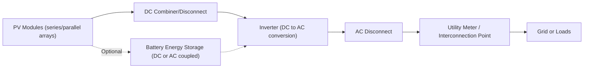
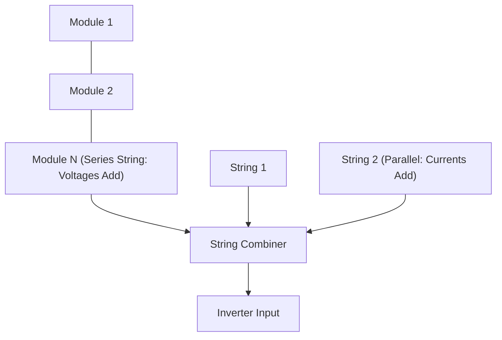
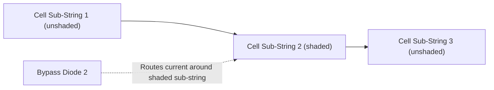
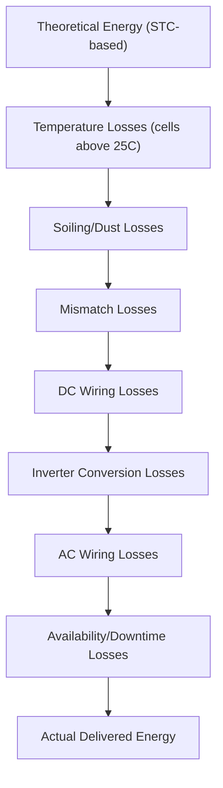
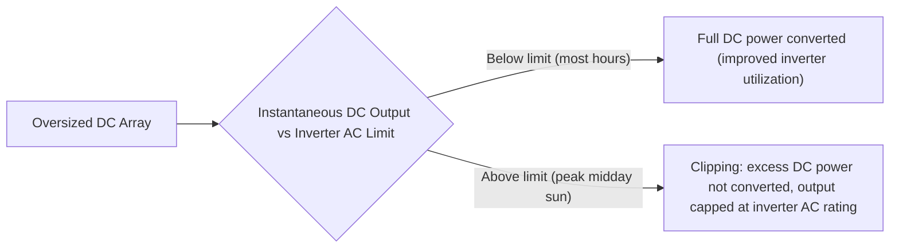

## Solar PV System Design and Performance

### Overview

Solar PV system design translates individual cell/module performance characteristics into a complete, functioning power generation system — encompassing module interconnection strategy, balance-of-system components, energy yield estimation, and loss accounting. Effective system design balances electrical compatibility, energy production optimization, and economic/regulatory constraints across residential, commercial, and utility-scale applications.

### System Architecture Overview

### Module Interconnection: Series and Parallel Configuration

**Series Strings**

Connecting modules in series adds their voltages while current remains that of a single module (assuming matched modules):

$$V_{string} = N_s \times V_{mp,module}$$

$$I_{string} = I_{mp,module}$$

where $N_s$ is the number of modules in series. String voltage must remain within the inverter's operating voltage window across the full expected temperature range (accounting for $V_{oc}$ increase at low temperatures, which sets the maximum string length to avoid exceeding inverter/equipment voltage ratings).

**Parallel Strings**

Connecting multiple strings in parallel adds currents while voltage remains that of a single string:

$$I_{array} = N_p \times I_{string}$$

$$V_{array} = V_{string}$$

where $N_p$ is the number of parallel strings.

### Mismatch Losses and Shading Effects

**Cell/Module Mismatch**

When modules in a series string have slightly different current-producing capability (due to manufacturing tolerance, soiling, or partial shading), the string current is limited by the weakest module — a mismatch loss that reduces total string output below the simple sum of individual module capabilities.

**Partial Shading and Bypass Diodes**

Partial shading on a single cell within a module can severely restrict current through the entire series string of cells unless mitigated. **Bypass diodes**, wired in parallel across sub-strings of cells within a module, allow current to route around a shaded sub-string rather than forcing the shaded cells to limit the entire module's output — a standard protective and performance feature in virtually all commercial modules.

Without bypass diodes, a single significantly shaded cell can also become reverse-biased and dissipate power as heat (the "hot-spot" effect), posing a potential module damage/fire risk — bypass diodes mitigate this by limiting the reverse voltage/current a shaded sub-string must withstand.

### Inverter Types and Topologies

**Central/String Inverters**

A single inverter serves an entire array (central) or a subset of series strings (string inverter), performing DC-to-AC conversion and MPPT for the combined string(s) — cost-effective for arrays without significant shading or orientation variation, since MPPT is applied across the whole connected string/array rather than per-module.

**Microinverters**

An inverter integrated at each individual module, performing independent MPPT and DC-AC conversion per module — mitigates the impact of partial shading or module mismatch on overall system output (since one underperforming module no longer constrains an entire string), at higher per-watt hardware cost and increased component count (more electronics distributed across the roof/array).

**DC Power Optimizers**

A hybrid approach: per-module DC-to-DC power optimizers perform module-level MPPT and voltage/current conditioning, but a single central/string inverter still performs final DC-to-AC conversion — combining much of microinverters' mismatch-mitigation benefit with some of string inverters' cost/simplicity advantage.

| Topology | Module-Level MPPT | Shading Tolerance | Relative Cost | Failure Impact |
| --- | --- | --- | --- | --- |
| String/Central Inverter | No (string-level) | Lower | Lowest | Single inverter failure affects entire string/array |
| Power Optimizer + Inverter | Yes | Higher | Moderate | Optimizer failure affects one module; inverter failure affects whole system |
| Microinverter | Yes | Highest | Highest | Failure isolated to single module |

### Energy Yield Estimation

**Nameplate to Actual Yield: The Performance Ratio**

Actual annual energy yield is always less than the theoretical maximum implied by nameplate capacity and available irradiance, captured by the **Performance Ratio (PR)**:

$$PR = \frac{E_{actual}}{E_{theoretical}} = \frac{E_{actual}}{\frac{H}{G_{STC}} \times P_{nameplate}}$$

where $H$ is plane-of-array irradiation (kWh/m²), $G_{STC} = 1\ \text{kW/m}^2$ (Standard Test Condition reference), and $P_{nameplate}$ is the array's rated DC capacity. Well-designed modern systems commonly achieve PR values in the range of 0.75–0.85 [Inference: actual achieved PR is highly system- and climate-specific and depends on the cumulative loss factors below].

**Cumulative Loss Factors**

Each loss factor is typically expressed as a percentage reduction and multiplied cumulatively to derive overall system performance ratio; typical illustrative loss factor ranges include temperature losses (a few percent to ~10%+ depending on climate), soiling (1–5%+ depending on cleaning frequency and local dust conditions), and inverter losses (2–4% for modern inverters) [Inference: all specific loss percentages are highly site- and technology-dependent and should be modeled with local climate/soiling data rather than assumed generically].

### Degradation Over System Lifetime

PV modules experience gradual power output decline over operational life, commonly modeled as an initial slightly higher first-year degradation (light-induced degradation, LID) followed by a steady linear annual degradation rate — commonly assumed in industry practice around 0.5%/year for crystalline silicon modules, though warranty-guaranteed rates and actual field performance vary by manufacturer and technology. [Inference: specific degradation rates are product- and technology-dependent and should be verified against manufacturer warranty documentation for accurate long-term yield projections]

### Tilt, Orientation, and Tracking Impact on Yield

**Fixed-Tilt Systems**

As established in solar geometry fundamentals, fixed-tilt array orientation (tilt angle and azimuth) determines the annual energy capture pattern, with a tilt near local latitude commonly used as a simplified starting design guideline for annual-average optimization, adjusted for specific seasonal load-matching priorities.

**Tracking Systems**

- **Single-axis tracking**: rotates modules about one axis (typically north-south, tracking east-west sun movement), commonly providing an energy yield increase over an equivalent fixed-tilt system, particularly beneficial in high-DNI locations [Inference: specific yield gain percentage depends heavily on latitude, local climate, and system design, and should not be treated as a universal fixed figure]
- **Dual-axis tracking**: tracks both azimuth and elevation, maximizing direct capture but at higher mechanical complexity and cost, more commonly associated with CSP heliostats or high-value concentrating PV than standard flat-plate PV due to the added cost relative to incremental yield gain for standard PV modules

### System Sizing Considerations

**DC-to-AC Ratio (Inverter Loading Ratio)**

Modern PV system design commonly intentionally oversizes the DC array relative to inverter AC nameplate capacity (a DC-to-AC ratio greater than 1.0), since the array rarely produces its full nameplate DC output simultaneously across all conditions (off-peak sun angles, non-STC temperatures) — this oversizing improves inverter utilization and overall energy harvest per inverter dollar spent, at the cost of some clipping losses during peak irradiance periods when array DC output exceeds inverter AC capacity.

### Worked Example: Annual Energy Yield Estimate

**Problem**: A 10 kW$_{DC}$ fixed-tilt PV system is installed at a site with annual plane-of-array irradiation $H = 1800\ \text{kWh/m}^2/\text{year}$, and an assumed performance ratio $PR = 0.80$.

**Solution**:

$$E_{annual} = P_{nameplate} \times \frac{H}{G_{STC}} \times PR$$

$$E_{annual} = 10\ \text{kW} \times \frac{1800\ \text{kWh/m}^2}{1\ \text{kW/m}^2} \times 0.80$$

$$E_{annual} = 10 \times 1800 \times 0.80 = 14{,}400\ \text{kWh/year}$$

This demonstrates the standard simplified annual yield estimation approach commonly used in preliminary system sizing, though detailed hourly simulation tools (e.g., using typical meteorological year data) provide more accurate loss-by-loss modeling for final system design.

### Key Points

- Series connections add module voltages; parallel connections add module currents, with string voltage windows constrained by inverter specifications and temperature extremes.
- Bypass diodes mitigate partial shading impacts by allowing current to route around shaded cell sub-strings, also protecting against hot-spot damage.
- Inverter topology choice (string, optimizer-based, microinverter) trades off cost against shading/mismatch tolerance and failure isolation.
- Performance Ratio (PR) captures the cumulative effect of all real-world loss factors between theoretical STC output and actual delivered energy.
- Intentional DC oversizing (DC/AC ratio > 1.0) improves inverter utilization economics at the cost of some clipping losses during peak irradiance.

### Related Topics

- Photovoltaic Cell Principles and Materials
- Solar Radiation Fundamentals and Solar Geometry
- Maximum Power Point Tracking (MPPT) Algorithms
- Battery Energy Storage System Integration with PV
- Solar Resource Assessment and TMY Data
- Grid Interconnection Standards for Distributed PV
- PV Degradation Mechanisms and Long-Term Reliability
- Utility-Scale Solar Plant Design and O&M