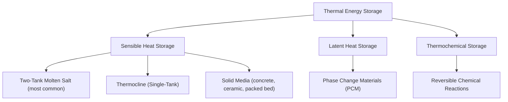
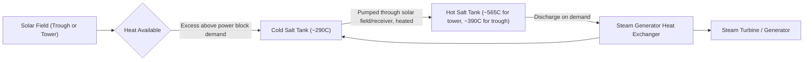

## Thermal Energy Storage for Solar Power Plants

### Overview

Thermal Energy Storage (TES) enables solar power plants — primarily Concentrated Solar Power (CSP) facilities — to decouple electricity generation from the instantaneous availability of sunlight, storing collected thermal energy during peak solar hours and discharging it to extend generation into evening hours, overnight, or cloudy periods. TES is a fundamental enabler of CSP's dispatchability advantage over standalone photovoltaic generation.

### TES Classification by Storage Mechanism

### Sensible Heat Storage: Fundamental Principle

**Basic Energy Storage Relation**

Sensible heat storage relies on raising and lowering a storage medium's temperature, with stored energy given by:

$$Q = m \cdot c_p \cdot \Delta T$$

where $m$ is the mass of storage medium, $c_p$ is specific heat capacity, and $\Delta T$ is the temperature swing between charged (hot) and discharged (cold) states. This straightforward relationship makes sensible heat storage technically simple and currently the dominant commercial approach for CSP TES.

### Two-Tank Molten Salt Storage (Dominant Commercial Approach)

**System Configuration**

**Operating Principle**

- During periods of solar availability exceeding immediate power block demand, hot salt is pumped from the cold tank through the solar field/receiver, heated, and stored in the hot tank
- During periods of insufficient solar input (evening, cloudy periods), hot salt is drawn from the hot tank through a steam generator heat exchanger to produce steam for the turbine, with the cooled salt returned to the cold tank
- The two tanks maintain the entire storage inventory at two discrete temperature levels, avoiding the thermal mixing/stratification challenges of single-tank approaches

**Storage Medium: Solar Salt**

The most widely used molten salt storage medium is "solar salt," a binary mixture of approximately 60% sodium nitrate (NaNO₃) and 40% potassium nitrate (KNO₃) by mass, chosen for:

- Relatively low melting point (~220°C) among molten salt candidates, though still requiring freeze-protection heat tracing on piping during shutdown/low-flow periods to prevent solidification
- High thermal stability at operating temperatures (up to ~565–600°C before significant decomposition)
- Relatively low cost and material availability compared to more exotic heat transfer/storage fluids
- Compatibility with standard tank/piping materials at these temperature ranges

**Design Metric: Storage Duration**

As established in CSP fundamentals, storage capacity is typically expressed in hours of full-load power block operation:

$$\text{Storage Duration (hours)} = \frac{E_{stored,thermal}}{P_{block,thermal}}$$

Commercial CSP plants with integrated storage commonly target storage durations in the range of several hours up to roughly 10+ hours, depending on desired dispatch profile (e.g., extending generation to cover evening peak demand vs. near-continuous baseload-like operation with sufficiently oversized solar field and storage). [Inference: specific storage duration targets are project- and market-specific, driven by local electricity pricing/demand patterns and plant economics]

### Thermocline (Single-Tank) Storage

**Concept**

An alternative sensible heat approach uses a single tank containing both hot and cold fluid, relying on natural buoyancy-driven density stratification to maintain a distinct thermal gradient (the "thermocline") between a hot layer at the top and cold layer at the bottom, rather than physically separating hot and cold fluid into separate tanks.

**Filler Material Enhancement**

To reduce the volume (and cost) of expensive molten salt or heat transfer fluid required, thermocline systems commonly incorporate a lower-cost solid filler material (such as quartzite rock and sand) within the tank, which stores a significant fraction of the sensible heat while the fluid primarily serves as the heat transfer medium moving through the packed filler bed.

**Trade-offs vs. Two-Tank**

- Reduced tank count and total fluid inventory can lower capital cost relative to two-tank systems
- Requires careful thermocline (stratification boundary) management to prevent mixing/degradation of the temperature gradient over repeated charge-discharge cycles, which would reduce effective usable storage capacity
- Less commercially mature/widely deployed at utility scale compared to two-tank molten salt systems [Inference: relative commercial deployment status should be verified against current project data]

### Solid Media Sensible Storage

**Concept**

Uses solid materials (concrete blocks, ceramic bricks, or packed rock/gravel beds) as the storage medium, with heat transfer fluid (often air, oil, or steam) circulated through embedded channels or a packed bed to charge and discharge thermal energy.

**Characteristics**

- Lower material cost per unit thermal mass compared to molten salts in some configurations, and avoids molten salt freezing/handling concerns entirely
- Generally lower heat transfer rates and effective thermal conductivity compared to a liquid medium directly serving as both HTF and storage fluid, potentially requiring larger heat exchange surface area or longer charge/discharge times
- Concrete-based storage in particular has been explored for lower-temperature or smaller-scale CSP/industrial process heat applications given its low cost and simple engineering [Inference: specific commercial deployment scale and cost-competitiveness vary by application and should be checked against current project data]

### Latent Heat Storage: Phase Change Materials (PCM)

**Concept**

Latent heat storage exploits the large energy absorbed or released during a material's phase change (typically solid-to-liquid melting/freezing) at a nearly constant temperature, rather than relying solely on temperature swing:

$$Q = m \cdot L$$

where $L$ is the latent heat of fusion of the PCM, generally providing much higher energy density per unit mass/volume at the phase-change temperature compared to sensible heat storage over an equivalent temperature range.

**Advantages and Challenges**

- Near-isothermal charge/discharge can be advantageous for matching steam generator operating conditions (constant-temperature heat delivery, similar to how a boiler benefits from consistent steam temperature)
- PCMs generally suffer from relatively low thermal conductivity, requiring enhanced heat exchanger designs (finned tubes, encapsulation, or embedded conductive matrices) to achieve adequate charge/discharge rates
- Higher material and system complexity cost has limited large-scale commercial deployment relative to two-tank molten salt sensible storage as of the available knowledge base [Inference: PCM-based TES remains predominantly in demonstration/niche deployment status and specific current commercial scale should be verified]

### Thermochemical Storage (Emerging)

**Concept**

Stores energy via a reversible chemical reaction, where thermal energy drives an endothermic reaction during charging (storing energy as chemical potential in the reaction products) and the reverse exothermic reaction releases the stored energy during discharge, potentially offering very high energy density and the possibility of long-duration or even seasonal storage without the parasitic heat losses inherent in maintaining a hot sensible/latent storage medium over time.

**Status**

Thermochemical storage remains predominantly at the research and pilot demonstration stage for CSP applications, without significant utility-scale commercial deployment as of the available knowledge base. [Unverified: given the active research pace in this area, current development status should be checked against recent sources for any pilot-to-commercial progress]

### Comparative Summary Table

| Storage Type | Mechanism | Energy Density | Maturity | Key Challenge |
| --- | --- | --- | --- | --- |
| Two-Tank Molten Salt | Sensible heat | Moderate | High (dominant commercial approach) | Freeze protection, tank/fluid cost |
| Thermocline (Single-Tank) | Sensible heat | Moderate (improved by filler) | Moderate | Thermocline stability management |
| Solid Media | Sensible heat | Lower-moderate | Moderate (niche/emerging at scale) | Lower heat transfer rates |
| Phase Change Material | Latent heat | Higher (at phase-change point) | Low-moderate (demonstration stage) | Low thermal conductivity |
| Thermochemical | Chemical reaction | Highest (potential) | Low (research/pilot stage) | System complexity, reaction kinetics |

### Round-Trip Efficiency and Thermal Losses

**Storage Losses**

Even well-insulated TES systems experience some thermal losses during storage (heat leakage through tank insulation over time) and during charge/discharge cycling (heat exchanger approach temperature losses, pumping parasitic loads). Round-trip thermal efficiency for well-designed molten salt two-tank systems is generally high (commonly cited in the range of 95%+ for the storage cycle itself, excluding subsequent power block conversion losses) [Inference: exact round-trip efficiency figures are system- and operating-condition-specific].

**Distinction from Power Cycle Efficiency**

TES round-trip efficiency (thermal energy in vs. thermal energy recoverable) should not be confused with the overall plant thermal-to-electric conversion efficiency, which is governed separately by the power block's Rankine (or other) cycle efficiency, as covered in general thermodynamic cycle analysis.

### Worked Example: Molten Salt Mass Requirement

**Problem**: Estimate the mass of solar salt required to store 1000 MWh$_{th}$ of thermal energy, given a temperature swing $\Delta T = 275°C$ (cold tank 290°C, hot tank 565°C) and specific heat capacity $c_p \approx 1.5\ \text{kJ/kg·K}$ for solar salt [Inference: exact specific heat value varies slightly with salt composition and temperature and should be confirmed against material property data for detailed engineering calculations].

**Solution**:

Convert stored energy to consistent units:

$$Q = 1000\ \text{MWh} \times 3.6 \times 10^{9}\ \text{J/MWh} = 3.6 \times 10^{12}\ \text{J}$$

Using $Q = m \cdot c_p \cdot \Delta T$:

$$m = \frac{Q}{c_p \cdot \Delta T} = \frac{3.6 \times 10^{12}\ \text{J}}{1500\ \text{J/kg·K} \times 275\ \text{K}}$$

$$m = \frac{3.6 \times 10^{12}}{412{,}500} \approx 8.73 \times 10^{6}\ \text{kg} \approx 8730\ \text{tonnes of salt}$$

This illustrates why molten salt storage systems at utility scale require very large tank volumes and salt inventories, representing a significant fraction of overall CSP plant capital cost.

### Key Points

- TES enables CSP dispatchability by storing thermal energy during solar-rich periods for discharge during low-sun or peak-demand periods.
- Two-tank molten salt sensible heat storage (using "solar salt," a NaNO₃/KNO₃ mixture) is the dominant commercial approach, offering high round-trip thermal efficiency.
- Thermocline single-tank and solid-media storage offer potential cost reductions but with stratification management or heat-transfer-rate trade-offs.
- Latent heat (PCM) and thermochemical storage offer higher theoretical energy density but remain less commercially mature due to thermal conductivity and system complexity challenges.
- Storage duration (hours of full-load generation) is the standard sizing metric, directly calculable from stored thermal energy and power block thermal demand.

### Related Topics

- Concentrated Solar Power Systems
- Solar Radiation Fundamentals and Solar Geometry
- Rankine Cycle Thermodynamics in Power Plants
- Molten Salt Chemistry and Materials Compatibility
- Grid-Scale Energy Storage Technologies Comparison
- Solar Field Optical Design and Heliostat Control
- Battery Energy Storage System Integration with PV
- Utility-Scale Solar Plant Design and O&M