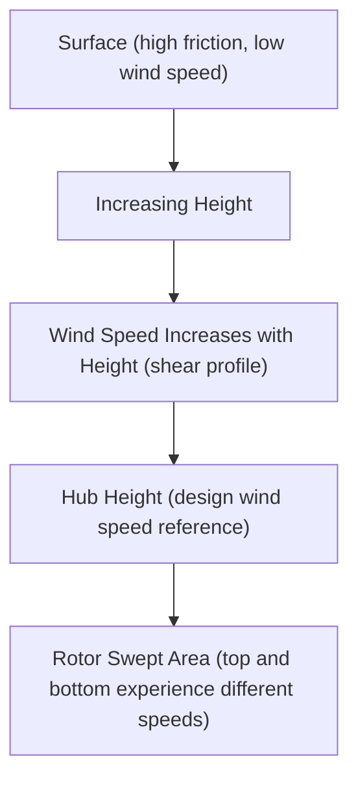
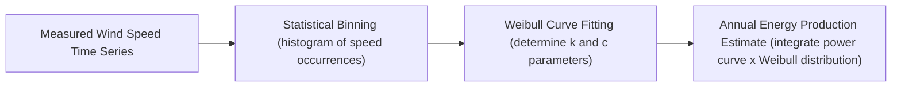
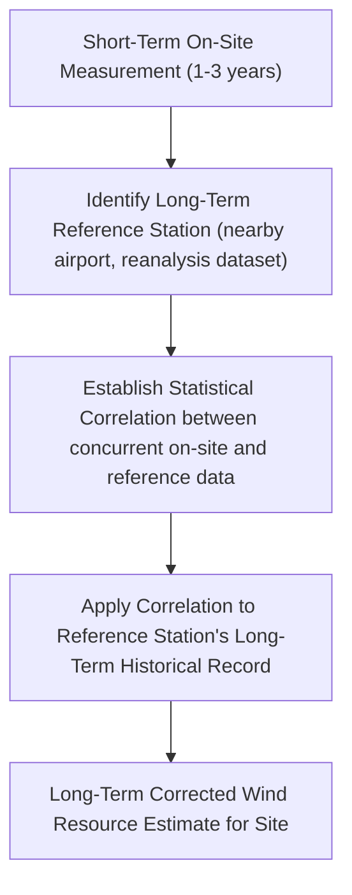
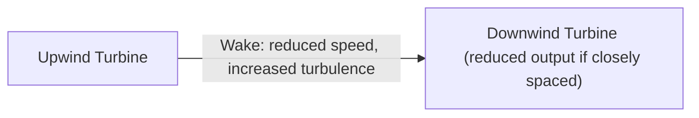

## Wind Resource Assessment and Site Selection

### Overview

Wind resource assessment is the process of characterizing the wind regime at a candidate site to estimate energy production potential, evaluate technical feasibility, and inform turbine selection before committing to wind farm development. Because wind power scales with the cube of wind speed, even modest errors in wind speed estimation translate into substantial energy yield prediction errors, making rigorous, multi-year measurement and statistical analysis essential to project financing and technical design.

### Wind Power Fundamentals

**Available Power in Wind**

The kinetic power available in an airstream passing through a given cross-sectional area is:

$$P = \frac{1}{2}\rho A v^3$$

where $\rho$ is air density, $A$ is the swept area, and $v$ is wind speed. The cubic dependence on velocity means a doubling of wind speed yields an eight-fold increase in available power, underscoring why accurate wind speed characterization (rather than simple averages alone) is critical to yield prediction.

**Air Density Considerations**

Air density varies with altitude, temperature, and humidity:

$$\rho = \frac{P_{atm}}{RT}$$

Sites at higher elevation or higher average temperature have lower air density and correspondingly lower power for a given wind speed, requiring site-specific density correction in energy yield calculations rather than assuming standard sea-level density universally.

### Wind Speed Variation with Height

**Wind Shear**

Wind speed generally increases with height above ground due to reduced surface friction effects, commonly modeled using the **power law**:

$$\frac{v(h)}{v(h_{ref})} = \left(\frac{h}{h_{ref}}\right)^{\alpha}$$

where $\alpha$ is the wind shear exponent (commonly around 0.10–0.25 depending on terrain roughness and atmospheric stability) [Inference: exact shear exponent is highly site- and condition-specific and must be measured rather than assumed for accurate assessment], $h$ is the height of interest (e.g., hub height), and $h_{ref}$ is the reference measurement height.

An alternative **logarithmic wind profile** is also commonly used, particularly in flatter/simpler terrain:

$$v(h) = \frac{v_*}{\kappa}\ln\left(\frac{h}{z_0}\right)$$

where $v_*$ is friction velocity, $\kappa$ is the von Kármán constant (≈0.4), and $z_0$ is the surface roughness length (dependent on terrain type: open water, grassland, forest, urban areas each having characteristic roughness values).

### Wind Speed Frequency Distribution: Weibull Statistics

**The Weibull Distribution**

Wind speed at a site is statistically characterized not by a single average value alone, but by its full frequency distribution, most commonly fitted to a **Weibull distribution**:

$$f(v) = \frac{k}{c}\left(\frac{v}{c}\right)^{k-1}\exp\left[-\left(\frac{v}{c}\right)^k\right]$$

where $k$ is the shape parameter (typically 1.5–3, with higher values indicating a narrower, more consistent wind speed distribution) and $c$ is the scale parameter (closely related to mean wind speed).

**Why Distribution Matters More Than Average Speed**

Because power scales with $v^3$, two sites with identical average wind speed but different distribution shapes (different $k$ values) can yield substantially different energy production — a site with a wider distribution (lower $k$) that includes more high-wind-speed hours will generally produce more energy than a narrower distribution concentrated near the mean, due to the cubic weighting of higher wind speeds. This is why energy yield assessment integrates the full Weibull distribution against the turbine's specific power curve, rather than relying on mean wind speed as a standalone proxy.

### Measurement Campaign Methodologies

**Meteorological (Met) Masts**

Traditional ground-based towers instrumented with anemometers (wind speed) and wind vanes (direction) at multiple heights, providing high-accuracy, continuous point measurements over a typical assessment period of one or more years to capture seasonal and interannual variability.

**Remote Sensing: LiDAR and SoDAR**

- **LiDAR (Light Detection and Ranging)**: measures wind speed/direction by analyzing the Doppler shift of laser light backscattered from aerosols in the air, capable of profiling wind speed continuously across a full range of heights (including above typical met mast height) from a single ground-based unit
- **SoDAR (Sonic Detection and Ranging)**: analogous technique using sound waves rather than laser light, also providing vertical wind profiles from a ground-based unit

**Advantages of Remote Sensing vs. Met Masts**

- Faster deployment and lower installation cost/complexity (no tall tower construction required), particularly valuable at increasingly taller modern hub heights where met mast construction becomes disproportionately expensive
- Full vertical profile measurement from a single unit rather than requiring multiple discrete instrument heights
- Historically some measurement uncertainty and validation considerations relative to mechanical anemometers, though remote sensing technology has matured considerably and is now widely accepted in bankable wind resource assessments when properly validated [Inference: specific industry acceptance standards and validation protocols continue to evolve and should be checked against current best-practice guidelines, e.g., IEC standards]

### Measure-Correlate-Predict (MCP)

**Purpose**

Since on-site measurement campaigns are typically limited to 1–3 years due to cost and project timeline constraints, but wind resource assessment ultimately requires estimating long-term (typically 20+ year project lifetime) average conditions, the **Measure-Correlate-Predict (MCP)** methodology is used to extrapolate short-term on-site data to a long-term climatological reference.

**Process**

Long-term reference data sources commonly include nearby long-running meteorological stations or global/regional atmospheric reanalysis datasets, used to correct the short-term on-site measurement period for any anomalously high or low wind years relative to the long-term climatological average.

### Terrain and Siting Considerations

**Terrain Complexity**

- **Simple/flat terrain**: relatively uniform wind flow, more straightforward to model and extrapolate from limited measurement points
- **Complex terrain** (hills, ridges, escarpments): wind flow can accelerate over ridge crests (favorable for siting) or experience turbulence, flow separation, and wake effects in valleys/lee sides, requiring more sophisticated computational fluid dynamics (CFD) modeling in addition to statistical extrapolation methods to accurately characterize spatial wind speed variation across the site

**Wake Effects and Turbine Spacing**

Downwind turbines experience reduced wind speed and increased turbulence in the wake of upwind turbines, requiring careful micro-siting (turbine placement layout) to balance land-use efficiency against wake-induced energy losses:

- Turbines are commonly spaced several rotor diameters apart in the prevailing wind direction (and a smaller multiple in the crosswind direction) to reduce wake interaction, with exact spacing optimized via wake modeling software balancing land constraints against energy loss
- **Wake loss** is typically quantified as a percentage reduction in gross energy yield and is a standard component of the overall energy yield loss assessment

### Environmental and Regulatory Siting Constraints

Beyond raw wind resource quality, practical site selection must account for:

- **Grid interconnection proximity**: distance and capacity of nearby transmission infrastructure significantly affects project economics
- **Environmental impact**: avian/bat mortality risk, protected habitat areas, and required environmental impact assessments
- **Noise and setback requirements**: minimum distance regulations from residential structures, varying significantly by jurisdiction
- **Land use and access**: land lease/ownership arrangements, road access for turbine component transport (particularly challenging for increasingly large modern blade lengths)
- **Aviation and radar considerations**: potential interference with aviation flight paths or radar installations near airports/military facilities

### Uncertainty and P50/P90 Energy Estimates

**Probabilistic Energy Yield Metrics**

Given inherent uncertainty in wind resource measurement, long-term correlation, and energy yield modeling, wind project financing commonly relies on probabilistic energy production estimates rather than a single deterministic value:

- **P50**: the energy production level expected to be exceeded in 50% of years (i.e., the median/expected-value estimate)
- **P90**: the energy production level expected to be exceeded in 90% of years (a more conservative, lower estimate commonly used by lenders for debt-sizing purposes, since it represents a higher-confidence "worst reasonable case" scenario)

The gap between P50 and P90 estimates reflects the cumulative uncertainty from measurement accuracy, long-term correlation confidence, and energy production modeling assumptions — projects with longer, higher-quality measurement campaigns and lower model uncertainty exhibit a narrower P50/P90 spread.

### Worked Example: Weibull-Based Energy Density Estimate

**Problem**: Estimate relative average power density for a site with Weibull parameters $k = 2.0$ and $c = 8\ \text{m/s}$, given standard air density $\rho = 1.225\ \text{kg/m}^3$.

**Solution**: For a Weibull distribution, the mean of $v^3$ (relevant to average power density, since power scales as $v^3$) is given by:

$$\overline{v^3} = c^3 \Gamma\left(1 + \frac{3}{k}\right)$$

For $k = 2.0$: $\Gamma(1 + 3/2) = \Gamma(2.5) \approx 1.329$

$$\overline{v^3} = 8^3 \times 1.329 = 512 \times 1.329 \approx 680.5\ \text{m}^3/\text{s}^3$$

$$\overline{P/A} = \frac{1}{2}\rho \overline{v^3} = \frac{1}{2} \times 1.225 \times 680.5 \approx 416.8\ \text{W/m}^2$$

This average power density estimate (before turbine power curve and Betz limit considerations, covered separately in wind turbine aerodynamics) illustrates how Weibull parameters directly translate into a site's average wind power resource classification.

### Key Points

- Available wind power scales with the cube of wind speed, making the full statistical wind speed distribution (not just the average) critical to accurate yield estimation.
- The Weibull distribution (shape $k$, scale $c$) is the standard statistical model for site wind speed characterization.
- Wind shear (power law or logarithmic profile) governs how wind speed varies with height, directly relevant to hub-height wind speed estimation.
- LiDAR/SoDAR remote sensing increasingly complements or replaces traditional met masts, particularly valuable for tall modern hub heights.
- Measure-Correlate-Predict (MCP) extrapolates short-term site measurements to long-term climatological estimates using correlated reference stations.
- P50/P90 probabilistic yield estimates quantify resource assessment uncertainty for project financing purposes.

### Related Topics

- Wind Turbine Aerodynamics and the Betz Limit
- Wind Turbine Power Curves and Capacity Factor
- Wind Farm Layout Optimization and Wake Modeling
- Offshore Wind Resource Characteristics
- Grid Interconnection for Wind Power Plants
- Wind Turbine Types: Horizontal vs. Vertical Axis
- Energy Yield Uncertainty Analysis (P50/P90/P99)
- Atmospheric Boundary Layer Meteorology