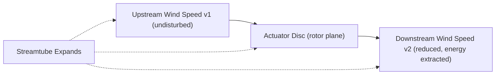
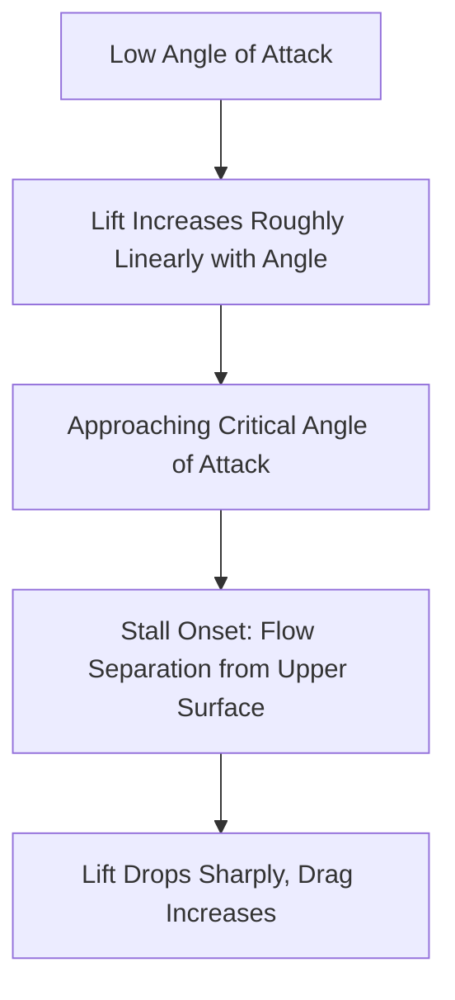
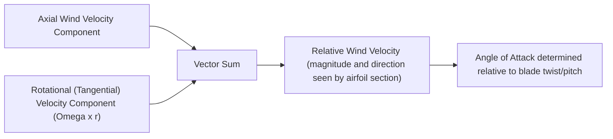
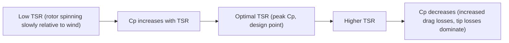
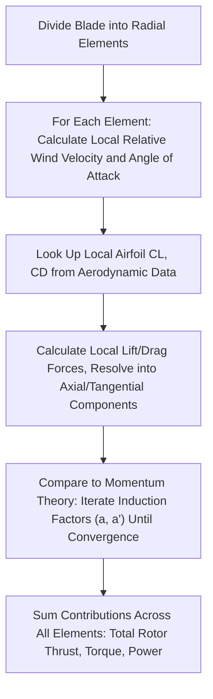

## Aerodynamics of Wind Turbine Blades

### Overview

Wind turbine blade aerodynamics governs how kinetic energy in moving air is converted into rotational mechanical energy at the turbine rotor. This encompasses the fundamental physical limit on extractable wind energy (the Betz limit), the airfoil lift/drag mechanisms that generate rotor torque, and the blade element theory used to design and analyze blade geometry along the span.

### The Betz Limit: Theoretical Maximum Extraction

**Actuator Disc Theory**

The Betz limit derives from modeling the turbine rotor as an idealized "actuator disc" that extracts kinetic energy from an air stream, applying conservation of mass and momentum across the disc.

As the actuator disc extracts energy, the air must slow down, and by mass conservation, the streamtube of air passing through the disc must expand (since a lower-velocity, equal-mass airflow requires greater cross-sectional area).

**Derivation Outcome**

Defining the **axial induction factor** $a$ as the fractional velocity reduction at the rotor plane relative to freestream velocity $v_1$:

$$v_{disc} = v_1(1-a)$$

$$v_2 = v_1(1-2a)$$

The power extracted is maximized when $a = 1/3$, yielding the maximum theoretical power coefficient:

$$C_{p,max} = \frac{16}{27} \approx 0.593$$

This is the **Betz limit**: no wind turbine, regardless of design sophistication, can extract more than approximately 59.3% of the kinetic energy available in the wind passing through its swept area, since extracting more energy would require slowing the downstream air excessively, causing the streamtube to divert around the disc rather than pass through it (violating the underlying momentum/continuity assumptions).

**Power Coefficient Definition**

$$C_p = \frac{P_{extracted}}{\frac{1}{2}\rho A v_1^3}$$

Real turbines achieve power coefficients below the Betz limit due to additional real-world losses (aerodynamic drag, wake rotation, finite blade number/tip losses, and mechanical/generator losses not captured in the idealized actuator disc model), with modern utility-scale turbines commonly achieving peak $C_p$ values in the range of 0.45–0.50 [Inference: exact achieved values are turbine-design-specific and vary with operating conditions].

### Airfoil Lift and Drag Fundamentals

**Lift Generation**

Wind turbine blades use airfoil cross-sections (similar in principle to aircraft wings) that generate **lift** — a force perpendicular to the oncoming relative wind direction — through pressure differences created by the airfoil shape and angle relative to the airflow.

$$L = \frac{1}{2}\rho v^2 A_{ref} C_L$$

$$D = \frac{1}{2}\rho v^2 A_{ref} C_D$$

where $C_L$ and $C_D$ are lift and drag coefficients (functions of airfoil shape and **angle of attack**), $v$ is the relative wind speed at the blade section, and $A_{ref}$ is the reference blade area.

**Angle of Attack**

The **angle of attack** $\alpha$ is the angle between the airfoil chord line and the relative wind direction. Lift coefficient generally increases with angle of attack up to a critical point, beyond which **stall** occurs — flow separation from the airfoil upper surface causes a sharp drop in lift and increase in drag.

### Relative Wind and Blade Element Velocity Triangle

**Combining Rotational and Wind Velocity**

Unlike a stationary airfoil, a wind turbine blade section experiences a **relative wind velocity** that combines the incoming wind speed with the blade's own rotational velocity at that radial position:

The tangential velocity component at radius $r$ is $\Omega r$ (where $\Omega$ is rotor angular velocity), meaning blade sections farther from the hub experience a much higher relative wind speed dominated by rotational motion, while sections near the hub experience relative wind more dominated by the axial wind component — this is a primary reason blades are **twisted** along their span (higher pitch angle near the root, progressively less twist toward the tip) to maintain a favorable angle of attack across the full blade length despite the changing velocity triangle.

### Tip Speed Ratio (TSR)

**Definition**

The **Tip Speed Ratio** $\lambda$ relates rotor rotational speed to wind speed:

$$\lambda = \frac{\Omega R}{v_1}$$

where $R$ is rotor radius and $v_1$ is freestream wind speed. TSR is a critical design and control parameter because power coefficient $C_p$ varies characteristically with TSR for a given blade design.

**Cp-Lambda Curve**

Modern variable-speed wind turbines use active control systems to maintain rotor speed near the optimal TSR across varying wind speeds (below rated wind speed), maximizing energy capture — a key motivation for variable-speed (as opposed to fixed-speed) turbine designs.

### Blade Element Momentum (BEM) Theory

**Purpose**

**Blade Element Momentum (BEM) theory** is the standard engineering method for analyzing and designing wind turbine blades, combining two complementary analytical frameworks:

1. **Blade element theory**: divides the blade into discrete radial sections ("elements"), each treated as a small 2D airfoil generating local lift and drag forces based on its local relative wind velocity and airfoil characteristics
2. **Momentum theory**: relates the axial and tangential momentum changes in the airflow (extending the simple actuator disc concept to include both axial and rotational wake effects) to the aggregate forces/torque the rotor must be producing

**Induction Factors**

BEM theory introduces both the axial induction factor $a$ (as in the simple Betz analysis) and a **tangential induction factor** $a'$, accounting for the rotational velocity imparted to the wake as a reaction to the torque extracted by the rotor (angular momentum conservation) — energy "lost" to wake rotation is one of the real-world loss mechanisms causing actual turbines to fall short of the idealized Betz limit.

**Correction Factors**

Practical BEM implementations commonly include additional correction factors beyond the basic theory:

- **Tip loss correction** (e.g., Prandtl tip loss factor): accounts for reduced lift generation near the blade tip due to pressure equalization/vortex shedding at the finite blade tip, an effect not captured by the idealized infinite-blade-number assumption of basic momentum theory
- **Hub loss correction**: analogous correction accounting for finite hub geometry effects near the blade root
- **High-induction corrections**: empirical corrections (e.g., Glauert correction) applied when axial induction factor exceeds the range where simple momentum theory remains valid (heavily loaded rotor conditions)

### Blade Design Implications

**Chord and Twist Distribution**

BEM-based design optimization typically produces blades with:

- **Wider chord near the root**, tapering toward the tip, partly reflecting structural/torque-carrying requirements and the lower relative wind speed (hence lower dynamic pressure available for lift generation) near the root
- **Significant twist from root to tip**, compensating for the changing ratio of rotational-to-axial velocity components along the span to maintain a near-optimal angle of attack at each radial station across the design tip speed ratio

**Stall-Regulated vs. Pitch-Regulated Control**

- **Stall regulation** (largely historical/smaller turbine designs): blades are fixed-pitch, designed so that at high wind speeds, sections progressively stall (naturally limiting power/lift) without active blade angle adjustment
- **Pitch regulation** (dominant in modern utility-scale turbines): blades actively rotate about their long axis via a pitch control system, adjusting angle of attack to regulate power output above rated wind speed and to feather blades (minimize lift/loads) for shutdown or extreme wind protection

### Worked Example: Tip Speed Ratio Calculation

**Problem**: A wind turbine rotor with blade radius $R = 40\ \text{m}$ rotates at $12\ \text{rpm}$ in a wind speed of $v_1 = 10\ \text{m/s}$. Calculate the tip speed ratio.

**Solution**:

Convert rotational speed to angular velocity:

$$\Omega = 12\ \text{rpm} \times \frac{2\pi}{60} = 1.257\ \text{rad/s}$$

$$\lambda = \frac{\Omega R}{v_1} = \frac{1.257 \times 40}{10} = \frac{50.27}{10} \approx 5.03$$

This tip speed ratio (~5) falls within the typical optimal design range for modern three-bladed horizontal-axis wind turbines [Inference: optimal TSR is blade-design-specific, commonly cited in a general range of roughly 6–8 for many modern three-blade designs, so this example value should be interpreted as illustrative rather than universally optimal], illustrating how rotor speed control targets a specific TSR range across varying wind speeds to maximize the power coefficient.

### Key Points

- The Betz limit (16/27 ≈ 59.3%) represents the absolute theoretical maximum fraction of wind kinetic energy extractable by any turbine rotor.
- Blade sections experience a relative wind velocity combining axial wind speed and rotational tangential velocity, necessitating spanwise blade twist to maintain favorable angle of attack.
- Tip Speed Ratio (TSR) is the key parameter governing power coefficient; variable-speed turbines actively control rotor speed to track optimal TSR below rated wind speed.
- Blade Element Momentum (BEM) theory combines local airfoil aerodynamics with momentum/angular-momentum conservation to predict rotor forces, torque, and power, including tip-loss and wake-rotation corrections.
- Pitch regulation (active blade angle control) is the dominant modern approach for power regulation above rated wind speed, superseding older stall-regulated designs.

### Related Topics

- Wind Resource Assessment and Site Selection
- Wind Turbine Power Curves and Capacity Factor
- Wind Turbine Types: Horizontal vs. Vertical Axis
- Wind Turbine Drivetrain and Generator Systems
- Wind Turbine Control Systems (Pitch, Yaw, Speed)
- Structural Loading and Fatigue in Wind Turbine Blades
- Wind Farm Layout Optimization and Wake Modeling
- Offshore Wind Turbine Foundation Types