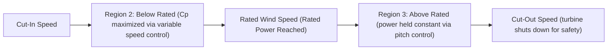
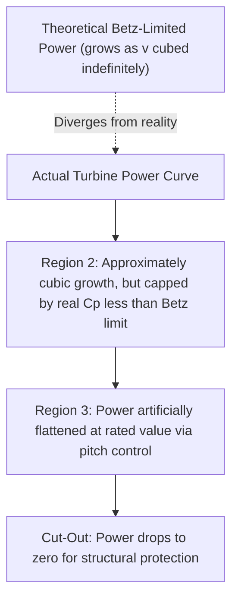

## The Betz Limit and Power Curve

### Overview

While the Betz limit defines the absolute theoretical ceiling on wind energy extraction efficiency (introduced in blade aerodynamics), the **power curve** is the practical engineering characterization of how a specific real turbine's electrical output varies across the full range of operating wind speeds. Together, these concepts bridge fundamental aerodynamic theory and the operational/economic performance metrics used to evaluate turbine and wind farm production.

### Revisiting the Betz Limit

**Core Result**

As established in blade aerodynamics, the Betz limit derives from actuator disc momentum theory, showing that the maximum fraction of kinetic energy extractable from an unconstrained wind stream is:

$$C_{p,max} = \frac{16}{27} \approx 0.593$$

occurring when the axial induction factor $a = 1/3$, meaning the wind speed at the rotor plane is reduced to two-thirds of its freestream value, and the far-wake speed is reduced to one-third of freestream value.

**Practical Significance**

The Betz limit is not a design target that engineers strive to reach exactly — rather, it establishes the theoretical ceiling against which real turbine performance ($C_p$, typically 0.45–0.50 at best for modern designs) is benchmarked, with the gap attributable to wake rotation losses, aerodynamic drag, finite blade number (tip losses), and mechanical/electrical conversion losses beyond the idealized aerodynamic rotor.

### The Power Curve: Definition and Regions

**Definition**

A wind turbine's **power curve** plots electrical power output (kW or MW) as a function of wind speed at hub height, serving as the fundamental performance specification used for energy yield prediction, turbine selection, and power purchase agreement (PPA) production guarantees.

### Power Curve Regions in Detail

**Region 1: Below Cut-In Speed**

Below the **cut-in wind speed** (commonly around 3–4 m/s) [Inference: exact cut-in speed is turbine-model-specific], available wind power is insufficient to overcome mechanical/electrical losses and generate useful net power; the turbine remains idle (rotor may be allowed to freewheel or is held stationary/parked).

**Region 2: Between Cut-In and Rated Wind Speed**

In this region, the turbine's control system operates to maximize the power coefficient $C_p$ by maintaining rotor speed at (or near) the optimal Tip Speed Ratio for the current wind speed — variable-speed turbines actively adjust generator torque/rotor speed as wind speed changes, tracking the peak of the turbine's $C_p$-$\lambda$ curve. Power output in this region follows approximately:

$$P = \frac{1}{2}\rho A v^3 C_{p,optimal}$$

closely tracking the cubic wind-power relationship, since $C_p$ is held nearly constant at its optimal value.

**Rated Wind Speed and Rated Power**

The **rated wind speed** is the wind speed at which the turbine first reaches its **rated (nameplate) power** output — the maximum power the generator/drivetrain is designed to produce continuously. Beyond this wind speed, the turbine can no longer simply increase power output proportionally with the cubic wind-power relationship, since doing so would exceed generator, gearbox, or structural design limits.

**Region 3: Between Rated and Cut-Out Speed**

Above rated wind speed, the control system actively limits power to the rated value (rather than allowing it to continue increasing with wind speed), predominantly via **pitch control** — rotating the blades to reduce their angle of attack (and thus lift/torque) as wind speed increases, holding power output approximately constant despite the growing available wind energy. This flat, constant-power region is a defining visual feature of the power curve.

**Cut-Out Speed**

At the **cut-out wind speed** (commonly around 25 m/s) [Inference: exact cut-out speed is turbine-model- and site-specific, sometimes with a "soft cut-out" ramping mechanism in modern designs rather than an abrupt cutoff], the turbine control system stops the rotor entirely (feathering blades to near-zero lift and applying mechanical/aerodynamic braking) to protect the structure from excessive loads at extreme wind speeds, resulting in zero power output above this threshold despite high wind energy availability.

### Idealized vs. Actual Power Curve Shape

The actual power curve deviates from a simple continuation of the cubic relationship specifically because rated power is a hard engineering constraint (generator/gearbox/tower design limits), not an aerodynamic one — the rotor could theoretically extract more power at high wind speeds if the drivetrain and structure were oversized accordingly, but doing so is not economically justified given the relatively few hours per year at very high wind speeds.

### Capacity Factor

**Definition**

**Capacity factor (CF)** relates actual energy production over a period to the theoretical maximum if the turbine operated continuously at rated power:

$$CF = \frac{E_{actual}}{P_{rated} \times T}$$

where $T$ is the time period (e.g., 8760 hours for a full year). Modern utility-scale wind turbines commonly achieve annual capacity factors in the range of 35–50%, with onshore sites typically at the lower end and high-quality offshore sites at the higher end [Inference: exact achieved capacity factors are highly site- and turbine-specific and vary significantly year to year with wind resource variability].

**Relationship to Power Curve and Wind Distribution**

Capacity factor is fundamentally the integral of the power curve weighted by the site's Weibull wind speed distribution, divided by rated power:

$$CF = \frac{\int_0^\infty P(v) f(v)\, dv}{P_{rated}}$$

This integral formulation explains why capacity factor depends jointly on turbine power curve shape (particularly cut-in speed and the wind speed at which rated power is reached) and the specific site's wind speed distribution — the same turbine can exhibit substantially different capacity factors at different sites, and different turbine models can exhibit different capacity factors at the identical site depending on how well their power curve characteristics match the local wind regime.

### Specific Power and Turbine Design Trade-offs

**Specific Power Concept**

**Specific power** (rated power divided by rotor swept area, W/m²) is a key design parameter reflecting the trade-off between rotor size and generator capacity:

$$\text{Specific Power} = \frac{P_{rated}}{A_{swept}}$$

- **Low specific power** (relatively large rotor for a given rated generator capacity): reaches rated power at a lower wind speed, producing more energy at typical low-to-moderate wind sites and generally yielding higher capacity factors, though potentially underutilizing the larger, more expensive rotor at higher wind speeds
- **High specific power** (relatively smaller rotor for a given rated generator capacity): historically more common in early utility-scale designs and high-wind-speed sites, reaching rated power only at higher wind speeds

**Industry Trend**

Modern wind turbine design, particularly for onshore markets and lower-wind-speed sites, has trended toward progressively lower specific power (larger rotor diameter relative to rated generator capacity) to improve capacity factor and energy capture at typical site wind speed distributions, reflecting the industry's broader shift toward maximizing annual energy production per turbine even at some cost of higher relative rotor investment. [Inference: specific design trend magnitude and current typical specific power values continue to evolve with turbine model generations and should be checked against current manufacturer specifications for precise figures.]

### Worked Example: Capacity Factor from Simplified Power Curve

**Problem**: A turbine has rated power $P_{rated} = 3\ \text{MW}$, reaching rated power at $v_{rated} = 12\ \text{m/s}$, with cut-in at 3 m/s and cut-out at 25 m/s. Given a site Weibull distribution with $k=2$, $c=8\ \text{m/s}$, and assuming (for simplification) the turbine operates at rated power for all wind speeds between 12 and 25 m/s and follows an idealized cubic relationship below rated speed scaled to match 3 MW at 12 m/s, estimate whether the site's mean wind speed suggests a favorable or unfavorable match to this turbine.

**Solution**: For the given Weibull parameters, mean wind speed is:

$$\bar{v} = c \cdot \Gamma\left(1 + \frac{1}{k}\right) = 8 \times \Gamma(1.5) \approx 8 \times 0.886 = 7.09\ \text{m/s}$$

Since the mean wind speed (~7.1 m/s) is well below the rated wind speed (12 m/s), the turbine would spend the large majority of operating hours in Region 2 (below rated), rarely reaching full rated power — suggesting this particular turbine's power curve (rated at 12 m/s) may be a relatively high-specific-power design poorly matched to this moderate-wind site, and a lower specific-power turbine (reaching rated power at a lower wind speed) might achieve a higher capacity factor at this same site. [Inference: this qualitative conclusion follows from the illustrative simplified assumptions stated in the problem and would require full power-curve integration against the Weibull distribution for a precise capacity factor calculation.]

### Key Points

- The Betz limit (16/27 ≈ 0.593) sets the absolute theoretical ceiling on extractable wind power fraction, against which real turbine $C_p$ values (typically 0.45–0.50) are benchmarked.
- The power curve has four characteristic regions: idle (below cut-in), variable-speed optimal-$C_p$ growth (Region 2), constant rated power via pitch control (Region 3), and shutdown (above cut-out).
- Rated power is an engineering (drivetrain/structural) constraint, not an aerodynamic one, causing the actual power curve to deviate from continued cubic growth at high wind speeds.
- Capacity factor is the power-curve/Weibull-distribution integral divided by rated power, jointly dependent on turbine design and site wind resource.
- Specific power (rated power per swept area) is a key design trade-off parameter, with industry trends favoring lower specific power (larger rotors) to improve capacity factor at typical wind sites.

### Related Topics

- Aerodynamics of Wind Turbine Blades
- Wind Resource Assessment and Site Selection
- Wind Turbine Control Systems (Pitch, Yaw, Speed)
- Wind Turbine Drivetrain and Generator Systems
- Wind Farm Layout Optimization and Wake Modeling
- Energy Yield Uncertainty Analysis (P50/P90/P99)
- Offshore Wind Turbine Foundation Types
- Wind Turbine Types: Horizontal vs. Vertical Axis