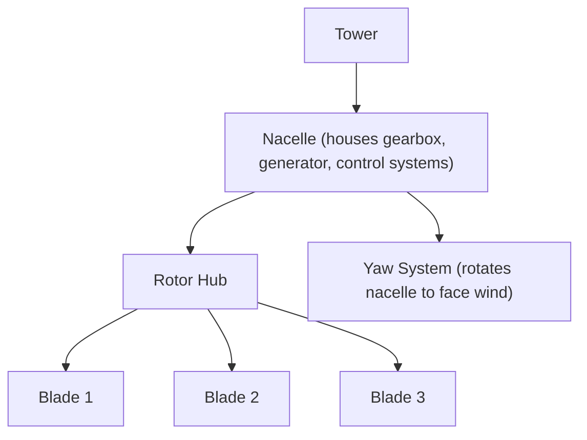
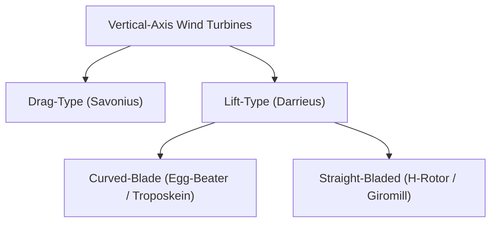

## Horizontal- and Vertical-Axis Wind Turbines

### Overview

Wind turbines are classified by rotor orientation relative to the wind direction and ground into two fundamental architectures: **Horizontal-Axis Wind Turbines (HAWT)**, where the rotor shaft is parallel to the ground and aligned with the wind, and **Vertical-Axis Wind Turbines (VAWT)**, where the rotor shaft is perpendicular to the ground. HAWT designs dominate utility-scale commercial deployment, while VAWT designs occupy specific niches and continue to see renewed interest for particular applications including offshore and distributed generation.

### Horizontal-Axis Wind Turbines (HAWT)

**Configuration**

**Key Characteristics**

- **Rotor orientation**: shaft parallel to ground, rotor plane perpendicular to wind direction
- **Blade number**: modern utility-scale turbines almost universally use **three blades**, balancing aerodynamic efficiency, structural/dynamic balance, visual/noise considerations, and cost, compared to historical one- or two-blade designs that offered material savings but suffered from greater dynamic imbalance and higher noise/visual flicker
- **Yaw system**: since HAWT rotors must face directly into the wind for optimal energy capture, an active yaw system (motors and gearing in the nacelle, guided by wind direction sensors) continuously rotates the entire nacelle/rotor assembly to track changing wind direction
- **Upwind vs. downwind configuration**: nearly all modern utility-scale HAWTs are **upwind** designs (rotor faces into the wind, positioned in front of the tower), avoiding the "tower shadow" aerodynamic disturbance and associated blade load cycling that downwind configurations experience as each blade passes behind the tower

**Advantages**

- Highest achieved power coefficients ($C_p$) among wind turbine architectures, benefiting from decades of extensive aerodynamic optimization and blade element momentum theory refinement (as covered in blade aerodynamics)
- Elevated hub height accesses stronger, less turbulent wind resource higher above ground-level friction effects (as covered in wind resource assessment)
- Mature, extensively field-proven technology at all scales from small distributed generation to multi-megawatt utility/offshore installations

**Disadvantages**

- Requires an active yaw mechanism, adding mechanical complexity and a component subject to wear/maintenance
- Heavy drivetrain components (gearbox, generator) mounted high in the nacelle, requiring robust tower structural design and complicating major component maintenance/replacement (requiring cranes capable of reaching hub height)
- Blade transport and installation logistics become increasingly challenging as blade length grows with turbine scale-up

### Vertical-Axis Wind Turbines (VAWT)

**Configuration Types**

**Savonius (Drag-Type) Rotors**

Uses curved, scoop-shaped blades (typically S-shaped cross-section when viewed from above) that capture wind primarily through **drag** — the concave side of the blade experiences higher drag than the convex side as the rotor turns, driving rotation.

- Simple construction, low cost, self-starting (does not require external torque to begin rotating from rest)
- Fundamentally limited to relatively low power coefficients (well below the Betz limit and well below lift-based designs), since drag-based energy capture is inherently less aerodynamically efficient than lift-based capture
- Common applications: small-scale/low-power applications (ventilation, anemometers, small distributed power) rather than utility-scale electricity generation

**Darrieus (Lift-Type) Rotors**

Uses airfoil-shaped blades (similar aerodynamic principle to HAWT blades) that generate lift as they rotate through the air, achieving higher potential power coefficients than drag-based Savonius designs, though still generally below equivalent HAWT performance in practice.

- **Curved-blade ("egg-beater") configuration**: the original Darrieus design, with blades curved into a troposkein (natural catenary-like) shape to minimize bending stress from centrifugal loading
- **Straight-bladed (H-rotor/giromill) configuration**: uses straight vertical blades connected to the central shaft via horizontal struts, offering simpler manufacturing than curved blades at the cost of some additional structural bending load management

**VAWT Advantages**

- **Omnidirectional operation**: no yaw mechanism required, since the vertical rotor axis captures wind equally from any horizontal direction — a potentially significant simplification, particularly valuable in sites with highly variable or turbulent wind direction
- **Ground-level drivetrain placement**: generator and gearbox (where present) can be mounted at the base of the turbine rather than atop a tower, simplifying maintenance access and potentially reducing tower structural loading requirements
- Some designs proposed as potentially advantageous for closely spaced wind farm arrays or floating offshore applications, where the different wake characteristics and lower center of gravity may offer siting/stability benefits [Inference: these potential advantages remain areas of active research and demonstration rather than established, widely commercialized utility-scale practice as of the available knowledge base]

**VAWT Disadvantages**

- Generally lower achieved power coefficients than modern HAWT designs in equivalent utility-scale applications, historically limiting large-scale commercial adoption
- Not self-starting for most lift-type (Darrieus) designs at low wind speeds (insufficient initial torque from airfoil lift at very low rotational speed), often requiring an auxiliary starting mechanism or motor
- Blades operate at cyclically varying angle of attack throughout each rotation (as they rotate through upwind and downwind positions relative to the wind direction), creating fluctuating aerodynamic loads and associated fatigue considerations distinct from the more steady-state loading experienced by HAWT blades
- Lower hub-height wind exposure compared to a HAWT tower of similar total height, since the VAWT's own rotor extends from near ground level up to the design height (rather than a full-height tower supporting a rotor positioned entirely near the top)

### Comparative Summary

| Aspect | HAWT | VAWT (general) |
| --- | --- | --- |
| Yaw mechanism | Required (active tracking) | Not required (omnidirectional) |
| Typical power coefficient | Higher (established utility-scale performance) | Generally lower |
| Drivetrain location | Nacelle (elevated) | Can be ground-level |
| Self-starting | Yes | Savonius: yes; Darrieus: often no |
| Utility-scale market dominance | Dominant | Niche/emerging applications |
| Wind exposure | Full elevated hub height | Lower average height for given total structure height |
| Blade loading pattern | Relatively steady per rotation (upwind config) | Cyclically varying per rotation |

### Application Niches and Emerging Interest

**Small-Scale and Distributed Generation**

VAWTs (both Savonius and small Darrieus designs) retain relevance in small-scale, building-integrated, or off-grid applications where omnidirectional wind capture, lower noise, and simpler ground-level maintenance access can outweigh their lower aerodynamic efficiency relative to a comparably sized HAWT.

**Offshore Floating Applications**

Some ongoing research and demonstration efforts explore VAWT designs for floating offshore wind platforms, motivated by the potential for a lower turbine center of gravity (potentially improving floating platform stability) and ground-level (or platform-level) drivetrain placement simplifying offshore maintenance logistics — though this remains a comparatively early-stage development direction relative to the dominant floating HAWT platform designs currently being commercially deployed. [Unverified: given the active and evolving nature of offshore VAWT research, current development and deployment status should be checked against recent sources.]

### Worked Example: Qualitative Power Coefficient Comparison

**Illustrative Comparison**: A utility-scale three-blade HAWT achieving $C_p \approx 0.47$ at its optimal tip speed ratio, compared against a Darrieus VAWT design achieving $C_p \approx 0.35$ under otherwise comparable idealized wind and swept-area conditions [Inference: these are illustrative representative figures; actual achieved values are highly design-specific for both architectures].

For an identical swept area $A$ and wind speed $v_1$:

$$\frac{P_{HAWT}}{P_{VAWT}} = \frac{C_{p,HAWT}}{C_{p,VAWT}} = \frac{0.47}{0.35} \approx 1.34$$

This illustrates why, for equivalent swept area, a well-optimized modern HAWT design would be expected to produce roughly one-third more power than a representative Darrieus VAWT under the same wind conditions — a primary driver of HAWT's dominant market position at utility scale, despite VAWT's mechanical simplicity advantages in yaw elimination and ground-level drivetrain access.

### Key Points

- HAWT (rotor shaft parallel to ground) dominates utility-scale wind power due to higher achieved power coefficients and decades of aerodynamic/engineering optimization.
- VAWT (rotor shaft perpendicular to ground) divides into drag-based Savonius (simple, self-starting, low efficiency) and lift-based Darrieus (higher efficiency than Savonius, generally not self-starting) designs.
- VAWT's key structural advantages are omnidirectional operation (no yaw system) and ground-level drivetrain placement, at the cost of generally lower power coefficient and cyclic blade loading.
- Modern HAWTs are almost universally three-bladed, upwind-facing designs to avoid tower shadow effects and balance efficiency, dynamics, and cost.
- VAWT technology retains relevance in small-scale/distributed applications and is an area of ongoing research interest for floating offshore applications.

### Related Topics

- Aerodynamics of Wind Turbine Blades
- The Betz Limit and Power Curve
- Wind Turbine Drivetrain and Generator Systems
- Wind Turbine Control Systems (Pitch, Yaw, Speed)
- Offshore Wind Turbine Foundation Types
- Wind Resource Assessment and Site Selection
- Structural Loading and Fatigue in Wind Turbine Blades
- Small-Scale and Distributed Wind Power Systems