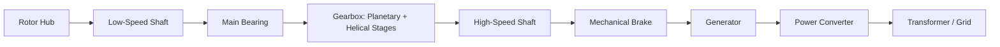
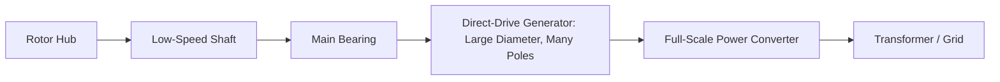
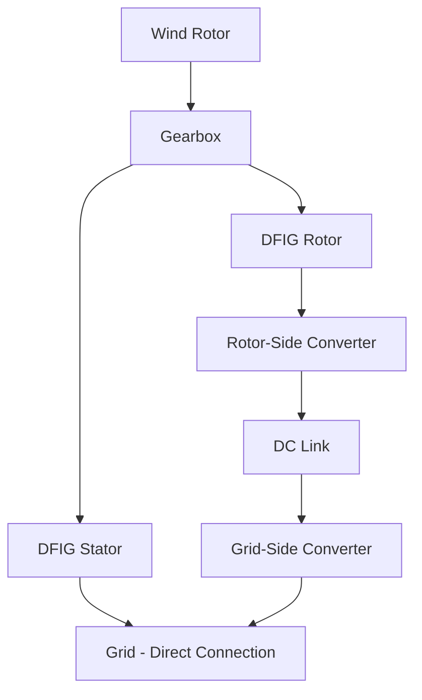
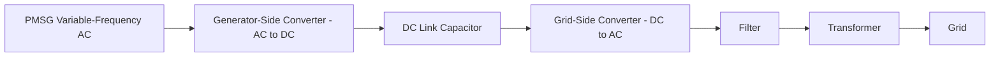

## Wind Turbine Drivetrains and Generator Systems

### Overview

A wind turbine drivetrain is the mechanical and electromechanical chain that converts the low-speed, high-torque rotation of the rotor into electrical energy compatible with the grid. It comprises the low-speed shaft, gearbox (if present), high-speed shaft, generator, and the power electronic conversion equipment. Drivetrain architecture is the single largest differentiator between wind turbine platforms and drives decisions on generator type, converter rating, reliability, weight, and cost.

The rotor of a utility-scale turbine typically rotates at 8–20 rpm, while conventional synchronous generators are efficient at 1000–1800 rpm. The drivetrain must either mechanically step up this speed (geared) or use a generator design tolerant of low-speed, high-torque operation (direct-drive).

### Functional Requirements of the Drivetrain

- **Torque transmission**: Convert aerodynamic torque from the rotor into a form usable by the generator
- **Speed matching**: Bridge the mismatch between rotor speed and generator's optimal electrical speed
- **Torsional damping**: Absorb transient torque fluctuations from wind gusts, tower shadow, and yaw misalignment
- **Load path**: Support rotor weight and transmit thrust/bending loads to the nacelle bedplate
- **Braking interface**: House or interface with mechanical brakes for shutdown and maintenance lockout

### Drivetrain Architectures

#### 1. Geared Drivetrain (High-Speed)

Uses a multi-stage gearbox to step up rotor speed to generator speed (typically 1200–1800 rpm).

**Typical configuration:**

**Gearbox staging (typical 3-stage design):**

- Stage 1: Low-speed planetary stage (highest torque, largest gears)
- Stage 2: Intermediate planetary or parallel-shaft stage
- Stage 3: High-speed parallel-shaft helical stage (lowest torque, highest speed)

Overall gear ratios commonly range from 1:60 to 1:120 depending on rotor speed and generator pole count.

**Key Points:**

- Enables use of compact, lightweight, high-speed induction or synchronous generators
- Gearbox is historically the highest-failure-rate major component in geared turbines, driven by variable torque loading, bearing micropitting, and lubrication issues [Inference: failure statistics vary significantly by OEM, vintage, and operating conditions]
- Requires oil lubrication, cooling, and filtration subsystems, adding auxiliary complexity
- Lower generator/converter cost partially offsets higher gearbox maintenance cost

#### 2. Direct-Drive (Gearless)

Eliminates the gearbox; the generator rotor is rigidly coupled to the turbine rotor and rotates at the same low speed.

**Key Points:**

- Generator must have a high pole count (often 100+ poles) to produce grid-frequency-compatible output at low rotational speed, since electrical frequency $f = \frac{p \cdot n}{120}$ where $p$ is pole count and $n$ is rpm
- Large generator diameter (several meters) and mass compared to geared equivalents
- Removes gearbox failure mode entirely, generally improving reliability and reducing maintenance downtime [Inference: reliability comparisons depend on generator design maturity and specific failure mode data]
- Requires a full-scale power converter rated for total generator output, since output frequency/voltage does not match grid characteristics directly

#### 3. Hybrid / Medium-Speed Drivetrain

Uses a single or two-stage gearbox (lower ratio, e.g., 1:10 to 1:30) paired with a medium-speed permanent magnet generator.

**Key Points:**

- Compromise design: smaller, simpler gearbox than high-speed designs (fewer stages, lower ratio, reduced failure exposure) combined with a smaller, lighter generator than full direct-drive
- Adopted by several multi-MW offshore platforms to balance nacelle mass and reliability

### Generator Types

#### Squirrel-Cage Induction Generator (SCIG)

- Fixed-speed or narrow slip-range operation
- Directly grid-coupled (historically via soft-starter and capacitor bank for reactive power compensation)
- Simple, robust, low-cost, but cannot support variable-speed operation, limiting aerodynamic efficiency (Cp) tracking across wind speeds
- Largely obsolete for new utility-scale installations but relevant historically and in some small-wind applications

#### Doubly-Fed Induction Generator (DFIG)

- Stator directly connected to the grid; rotor connected to grid via a partial-scale back-to-back power converter (typically rated ~25–30% of generator capacity)
- Enables variable-speed operation over a slip range of roughly ±30% around synchronous speed
- Converter handles only rotor (slip) power, significantly reducing converter cost and losses compared to full-scale conversion

**Key Points:**

- Requires slip rings and brushes to feed rotor circuit, introducing a maintenance item absent in cage or PM designs
- Vulnerable to grid faults; rotor-side converter can see high induced currents during voltage dips, requiring crowbar protection circuits for fault ride-through
- Dominant architecture in the 2000s–2010s due to converter cost savings; still widely deployed

#### Permanent Magnet Synchronous Generator (PMSG)

- Rotor field created by permanent magnets (commonly rare-earth NdFeB) rather than field windings, eliminating rotor excitation losses and slip rings
- Almost always paired with a **full-scale power converter** (100% of rated power passes through power electronics), since generator output frequency varies continuously with wind speed and rotor speed
- Used in both medium-speed geared and direct-drive configurations

**Key Points:**

- Higher efficiency and power density than induction machines due to absence of rotor copper losses
- No brushes/slip rings in the generator itself, improving reliability
- Full-scale converter provides complete decoupling from the grid, enabling full control over reactive power, fault ride-through, and grid code compliance
- Rare-earth magnet supply and cost exposure is a recognized industry consideration [Inference: material cost/availability is market-dependent and fluctuates over time]

#### Electrically Excited Synchronous Generator (EESG)

- Uses wound rotor field windings with slip rings and brushes (or brushless exciter) instead of permanent magnets
- Common in some direct-drive platforms as an alternative to PMSG, avoiding rare-earth material dependency
- Requires field excitation power supply and has slightly lower efficiency than PMSG due to rotor winding losses

### Power Converter Topologies

#### Partial-Scale Converter (DFIG)

- Back-to-back voltage source converter (rotor-side converter + grid-side converter) connected via a DC link
- Rated at fractional generator power, reducing converter cost and switching losses

#### Full-Scale Converter (PMSG, EESG, Direct-Drive)

- Generator-side converter (active rectifier) converts variable-frequency AC to DC
- Grid-side inverter converts DC to grid-frequency AC, typically with LCL or L filters for harmonic suppression
- Common topologies: two-level VSC, three-level neutral-point-clamped (NPC), modular multilevel for higher voltage platforms

**Key Points:**

- Full-scale conversion allows independent control of active and reactive power, low-voltage ride-through (LVRT), and grid code compliance (voltage/frequency support) without direct dependency on generator electromagnetic behavior during faults
- Converter switching devices (IGBTs, and increasingly SiC MOSFETs in newer designs) are rated to handle full turbine current and voltage

### Torque and Power Relationships

Rotor mechanical power:

$$P_{mech} = \frac{1}{2} \rho A v^3 C_p(\lambda, \beta)$$

where $\rho$ is air density, $A$ is swept area, $v$ is wind speed, and $C_p$ is the power coefficient dependent on tip-speed ratio $\lambda$ and blade pitch $\beta$.

Shaft torque:

$$T = \frac{P_{mech}}{\omega}$$

For a geared drivetrain with gear ratio $N$:

$$\omega_{HSS} = N \cdot \omega_{LSS}, \quad T_{HSS} = \frac{T_{LSS}}{N}$$

This inverse relationship is why gearboxes allow smaller, lighter, cheaper generators: torque is reduced by the gear ratio while speed is increased proportionally, keeping power constant (minus mechanical losses).

### Comparison of Drivetrain/Generator Combinations

| Configuration | Gearbox | Generator | Converter Rating | Maintenance Profile | Typical Application |
| --- | --- | --- | --- | --- | --- |
| High-speed geared | 3-stage | SCIG or DFIG | Partial (DFIG) or none (SCIG) | Higher gearbox maintenance | Onshore, legacy/current fleets |
| Medium-speed hybrid | 1–2 stage | PMSG | Full | Reduced gearbox risk | Offshore, modern platforms |
| Direct-drive | None | PMSG or EESG | Full | No gearbox risk, heavier nacelle | Offshore, high-reliability requirements |

### Auxiliary Drivetrain Systems

- **Main bearings**: Support rotor loads; common types include spherical roller bearings and, in newer large platforms, fluid or hybrid bearings
- **Mechanical brake**: Disc brake on high-speed or low-speed shaft for parking and emergency stop, supplementing aerodynamic braking (pitch-to-feather)
- **Lubrication system**: Forced-oil circulation with filtration and cooling for geared drivetrains
- **Condition monitoring system (CMS)**: Vibration and oil-debris sensors on gearbox/bearings for predictive maintenance, since gearbox failures are historically costly and disruptive [Inference: CMS effectiveness varies by sensor placement and analytics maturity]
- **Slip ring assembly**: Present in DFIG and EESG designs for rotor circuit access; subject to brush wear

### Example: Sizing Illustration

For a 3 MW turbine with rotor speed of 15 rpm and a target generator speed of 1500 rpm (4-pole, 50 Hz synchronous generator):

$$N = \frac{n_{gen}}{n_{rotor}} = \frac{1500}{15} = 100$$

A gear ratio of 100:1 is required. Low-speed shaft torque:

$$T_{LSS} = \frac{P}{\omega_{LSS}} = \frac{3{,}000{,}000 \text{ W}}{15 \times \frac{2\pi}{60} \text{ rad/s}} \approx 1.91 \times 10^6 \text{ N·m}$$

High-speed shaft torque (ideal, lossless):

$$T_{HSS} = \frac{T_{LSS}}{N} \approx 1.91 \times 10^4 \text{ N·m}$$

This nearly two-orders-of-magnitude torque reduction is what permits a compact 1500 rpm generator instead of a massive low-speed machine — illustrating the core trade-off geared designs exploit and direct-drive designs forgo in exchange for eliminating the gearbox.

### Reliability and Trends

- Gearbox reliability issues in early 2000s fleets drove significant industry investment in direct-drive and medium-speed hybrid architectures, particularly for offshore wind where access for repair is costly and weather-limited [Inference: this is a widely cited industry narrative; specific failure rate figures vary by study and turbine generation]
- PMSG adoption has grown due to full converter control benefits for grid code compliance, though rare-earth magnet cost/supply chain considerations continue to influence OEM design choices between PMSG and EESG
- SiC-based power electronics are an emerging trend for converter efficiency and power density improvements in newer platforms [Unverified: adoption rate and specific model integration vary by manufacturer and are evolving]

### Diagram: Generator Type Decision Overview (svg_diagram)

<svg xmlns="http://www.w3.org/2000/svg" viewBox="0 0 900 460">
\<style\>
.box { fill: #eef2f7; stroke: #33475b; stroke-width: 1.5; }
.lbl { font-family: sans-serif; font-size: 14px; fill: #1a1a1a; }
.title { font-family: sans-serif; font-size: 16px; font-weight: bold; fill: #1a1a1a; }
.arrow { stroke: #33475b; stroke-width: 1.5; fill: none; marker-end: url(#arrow); }
\</style\>
<text x="300" y="30" class="title">Wind Turbine Drivetrain/Generator Selection (svg_diagram)</text>
<rect x="370" y="50" width="160" height="45" class="box" />
<text x="450" y="77" class="lbl" text-anchor="middle">Rotor Speed Input</text>
<path d="M420,95 L250,140" class="arrow" />
<path d="M480,95 L650,140" class="arrow" />
<rect x="160" y="140" width="180" height="50" class="box" />
<text x="250" y="165" class="lbl" text-anchor="middle">Geared</text>
<text x="250" y="182" class="lbl" text-anchor="middle">(High/Medium Speed)</text>
<rect x="560" y="140" width="180" height="50" class="box" />
<text x="650" y="165" class="lbl" text-anchor="middle">Direct-Drive</text>
<text x="650" y="182" class="lbl" text-anchor="middle">(No Gearbox)</text>
<path d="M200,190 L130,240" class="arrow" />
<path d="M300,190 L330,240" class="arrow" />
<path d="M650,190 L650,240" class="arrow" />
<rect x="40" y="240" width="180" height="50" class="box" />
<text x="130" y="265" class="lbl" text-anchor="middle">SCIG / DFIG</text>
<text x="130" y="282" class="lbl" text-anchor="middle">(Fixed/Variable Speed)</text>
<rect x="240" y="240" width="180" height="50" class="box" />
<text x="330" y="265" class="lbl" text-anchor="middle">PMSG</text>
<text x="330" y="282" class="lbl" text-anchor="middle">(Medium-Speed Hybrid)</text>
<rect x="560" y="240" width="180" height="50" class="box" />
<text x="650" y="265" class="lbl" text-anchor="middle">PMSG / EESG</text>
<text x="650" y="282" class="lbl" text-anchor="middle">(Full-Scale Converter)</text>
<path d="M130,290 L130,340" class="arrow" />
<path d="M330,290 L330,340" class="arrow" />
<path d="M650,290 L650,340" class="arrow" />
<rect x="40" y="340" width="180" height="50" class="box" />
<text x="130" y="365" class="lbl" text-anchor="middle">Partial/No Converter</text>
<text x="130" y="382" class="lbl" text-anchor="middle">(SCIG: none, DFIG: ~30%)</text>
<rect x="240" y="340" width="180" height="50" class="box" />
<text x="330" y="365" class="lbl" text-anchor="middle">Full-Scale Converter</text>
<text x="330" y="382" class="lbl" text-anchor="middle">100% Rated Power</text>
<rect x="560" y="340" width="180" height="50" class="box" />
<text x="650" y="365" class="lbl" text-anchor="middle">Full-Scale Converter</text>
<text x="650" y="382" class="lbl" text-anchor="middle">100% Rated Power</text>

<text x="450" y="430" class="lbl" text-anchor="middle">Trade-off: Gearbox maintenance risk vs. generator/converter size and cost</text>

</svg>

**Related Topics:**

- Aerodynamic Rotor Design and Blade Pitch Control
- Grid Code Compliance and Low-Voltage Ride-Through (LVRT)
- Offshore Wind Turbine Foundations and Nacelle Access Considerations
- Power Electronic Converter Control Strategies (Vector Control, MPPT)
- Wind Turbine Condition Monitoring and Predictive Maintenance
- Comparative Levelized Cost of Energy (LCOE) Across Drivetrain Architectures