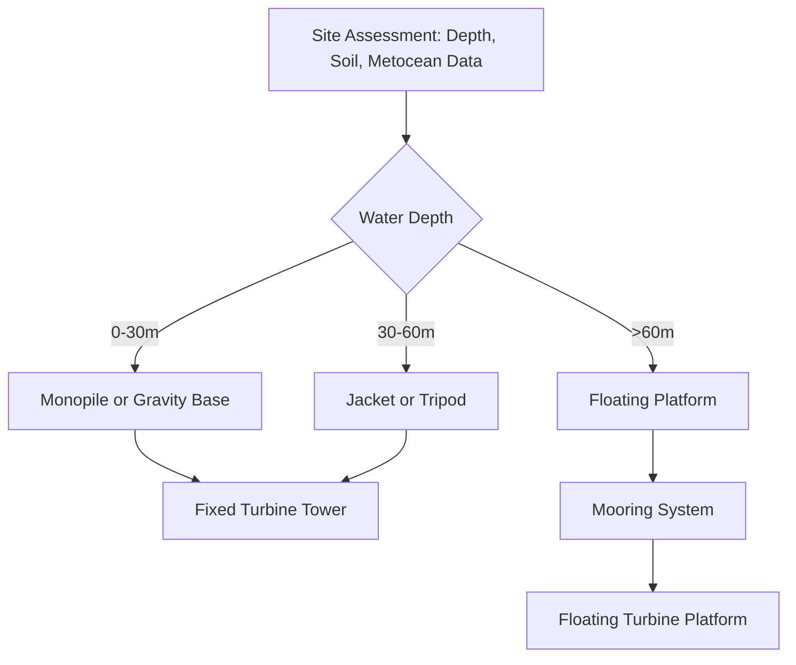
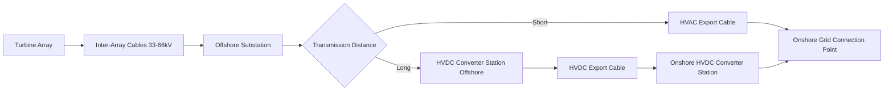

## Offshore Wind Energy Systems

### Overview

Offshore wind energy systems harness wind resources over open water using turbines mounted on fixed or floating foundations, connected to shore via subsea electrical infrastructure. Offshore sites offer higher and more consistent wind speeds, lower turbulence, and reduced visual/noise constraints compared to onshore sites, enabling larger turbines and higher capacity factors. The engineering scope extends well beyond the turbine itself to include foundations, marine operations, subsea cabling, offshore substations, and specialized installation vessels.

### Why Offshore Wind

- **Higher wind speeds**: Open-water surfaces have lower roughness than land, producing higher mean wind speeds and lower wind shear
- **Lower turbulence intensity**: Reduces fatigue loading on turbine components, extending component life
- **Larger turbine feasibility**: Absence of road/rail transport constraints on land allows much larger rotor diameters and nacelle masses (turbines exceeding 14–15 MW rated capacity are in commercial deployment) [Unverified: exact largest commercially deployed rating shifts as new models enter service]
- **Reduced land-use conflict**: Avoids many siting conflicts around noise, shadow flicker, and visual impact present onshore

### Site Classification by Water Depth

| Category | Typical Depth | Foundation Approach |
| --- | --- | --- |
| Shallow water | 0–30 m | Fixed-bottom (monopile, gravity base) |
| Transitional | 30–60 m | Fixed-bottom (jacket, tripod) |
| Deep water | >60 m | Floating platforms |

### Fixed-Bottom Foundation Types

#### Monopile

- Single large-diameter steel tube (commonly 6–10 m diameter) driven into the seabed
- Simplest and most widely deployed foundation type for shallow-to-moderate depths
- Installation via pile driving (impact hammer) or vibratory methods; underwater noise during pile driving is a recognized environmental consideration requiring mitigation (e.g., bubble curtains)

#### Jacket Foundation

- Lattice steel structure with multiple legs (typically 3–4), similar to offshore oil/gas platforms
- Suited to transitional depths and higher loading conditions
- More steel-intensive and complex to fabricate/install than monopiles, but offers better structural efficiency at greater depth

#### Gravity-Base Foundation

- Large concrete or steel caisson resting on the seabed under its own weight, sometimes with ballast
- Avoids pile driving noise; requires seabed preparation and is sensitive to soil-bearing capacity
- Typically used in shallower, calmer sites

#### Tripod

- Three-legged steel structure with a central column, transferring loads through three foundation piles
- Intermediate option between monopile simplicity and jacket load capacity

### Floating Offshore Wind Platforms

Floating platforms enable deployment in deep water where fixed foundations become structurally or economically impractical.

#### Spar-Buoy

- Long, slender cylindrical hull extending deep below the waterline, with ballast concentrated low for stability
- Low motion response due to deep draft, but requires deep water for construction/towing and a substantial mooring system
- Example reference concept: Hywind (Equinor)

#### Semi-Submersible

- Multiple buoyant columns connected by a structural frame, providing stability through waterplane area
- Shallower draft than spar designs, allowing quayside assembly and simpler port logistics
- Widely favored for near-term commercial floating projects due to fabrication/assembly flexibility [Inference: platform preference trends are evolving as the floating wind industry matures]

#### Tension-Leg Platform (TLP)

- Buoyant platform held in position by taut vertical tendons anchored to the seabed
- Minimal heave motion due to taut mooring, but sensitive to tendon tension management and anchor design
- Less commercially mature at scale compared to spar and semi-submersible designs [Unverified: deployment scale and commercial maturity are actively evolving]

#### Mooring and Anchoring Systems

- **Catenary mooring**: Chain/wire rope lying in a curve under its own weight, providing restoring force through weight and geometry
- **Taut-leg mooring**: Straighter mooring lines under tension, requiring less seabed footprint but more precise anchor holding capacity
- **Anchor types**: Drag-embedment anchors, suction caissons, driven piles — selected based on seabed geotechnical conditions

### Electrical Infrastructure

#### Turbine-Level and Array Cabling

- Inter-array cables (typically 33–66 kV AC) connect individual turbines in strings to an offshore substation
- Subsea cables use cross-linked polyethylene (XLPE) insulation and are typically buried or protected against seabed abrasion and anchor strikes

#### Offshore Substation

- Steps up array voltage to transmission-level voltage (commonly 132–275 kV) for efficient long-distance transmission to shore
- Houses transformers, switchgear, and (for HVDC schemes) converter equipment
- For very large or distant projects, HVDC offshore converter stations may be used instead of HVAC

#### Transmission to Shore: HVAC vs. HVDC

| Factor | HVAC | HVDC |
| --- | --- | --- |
| Distance suitability | Shorter distances (typically under ~80–100 km) [Inference: exact break-even distance depends on cable rating, voltage, and project economics] | Longer distances |
| Reactive power / cable charging losses | Significant over long AC cable runs | Not applicable (DC has no reactive charging current) |
| Converter station cost | Lower (transformers only) | Higher (AC/DC converter stations both ends) |
| Typical application | Near-shore projects | Deep, far-offshore projects |

### Marine Operations and Installation

- **Site survey vessels**: Conduct geotechnical (soil borings) and geophysical (seabed mapping, bathymetry) surveys prior to foundation design
- **Jack-up installation vessels**: Self-elevating platforms that jack legs down to the seabed to provide a stable installation platform for turbine and foundation components in fixed-bottom projects
- **Heavy-lift vessels**: Used for jacket/floating substructure installation and offshore substation placement
- **Cable-laying vessels**: Specialized vessels with cable carousels and burial tools (plows, jetting, or trenching ROVs) for inter-array and export cable installation
- **Weather windows**: Installation activities are highly sensitive to wave height, wind speed, and visibility limits, creating scheduling constraints and cost exposure from weather downtime

### Operations and Maintenance (O&M) Considerations

- **Access vessels**: Crew transfer vessels (CTVs) for near-shore sites; service operation vessels (SOVs) with motion-compensated gangways for longer offshore stays and rougher conditions
- **Helicopter access**: Used for time-critical maintenance or when sea states prevent vessel-based transfer
- **Condition monitoring**: Remote monitoring is emphasized more heavily than onshore due to higher cost and weather-dependency of physical access
- **Corrosion protection**: Cathodic protection systems (sacrificial anodes or impressed current) and specialized coatings protect submerged and splash-zone structural steel from marine corrosion

### Environmental and Consenting Considerations

- Underwater noise during pile driving affects marine mammals and fish; mitigation includes bubble curtains and soft-start piling procedures
- Seabed disturbance from cable installation and foundation placement affects benthic habitats
- Avian collision and displacement studies are typically part of environmental impact assessments
- Cumulative impact assessments across multiple projects in a region are increasingly emphasized in permitting processes [Inference: regulatory frameworks vary substantially by country and are evolving]

### Capacity Factor and Energy Yield

Offshore wind farms typically achieve higher capacity factors than onshore due to superior wind resource quality:

$$CF = \frac{E_{actual}}{E_{rated} \times T}$$

where $E_{actual}$ is actual energy produced over period $T$, and $E_{rated}$ is the turbine's rated power. Offshore capacity factors commonly range higher than typical onshore values, though the specific figure depends heavily on site-specific wind resource, turbine technology, and wake losses within the array [Inference: capacity factor figures are highly site- and fleet-specific and should not be generalized without site data].

### Wake Effects and Array Layout

- Turbines extract kinetic energy from wind, creating a wake of reduced wind speed and increased turbulence downstream
- Array layout optimization balances maximizing turbine count per lease area against wake-induced energy losses between rows
- Common spacing guidance: 5–9 rotor diameters downstream, 3–5 rotor diameters crosswind, though optimal spacing is project- and wind-rose-specific

### Example: Simplified Export Cable Loss Estimation

For an HVAC export cable carrying current $I$ over resistance $R$, resistive power loss is:

$$P_{loss} = I^2 R$$

For a project exporting 500 MW at 220 kV over a 50 km cable with resistance $0.02\ \Omega/\text{km}$ (three-phase, per-phase resistance), total cable resistance $R = 0.02 \times 50 = 1\ \Omega$ per phase. Approximate per-phase current:

$$I = \frac{P}{\sqrt{3} \, V} = \frac{500 \times 10^6}{\sqrt{3} \times 220 \times 10^3} \approx 1312\ \text{A}$$

Approximate per-phase loss:

$$P_{loss} = I^2 R \approx (1312)^2 \times 1 \approx 1.72\ \text{MW per phase}$$

This illustrates why higher transmission voltages and, for longer distances, HVDC are favored to minimize resistive losses over long subsea cable runs. [Inference: this is a simplified illustrative calculation; real cable loss estimation includes reactive/capacitive effects, temperature-dependent resistance, and skin effect corrections.]

### Diagram: Offshore Wind Farm System Layout (svg_diagram)

<svg xmlns="http://www.w3.org/2000/svg" viewBox="0 0 900 420">
\<style\>
.box { fill: #e8f0fe; stroke: #1f3a5f; stroke-width: 1.5; }
.water { fill: #cfe3f5; }
.lbl { font-family: sans-serif; font-size: 13px; fill: #1a1a1a; }
.title { font-family: sans-serif; font-size: 16px; font-weight: bold; fill: #1a1a1a; }
.cable { stroke: #1f3a5f; stroke-width: 2; fill: none; stroke-dasharray: 4,3; }
\</style\>
<text x="300" y="25" class="title">Offshore Wind Farm System Layout (svg_diagram)</text>
<rect x="0" y="60" width="900" height="360" class="water" />
<circle cx="120" cy="130" r="10" fill="#1f3a5f" />
<line x1="120" y1="130" x2="120" y2="100" stroke="#1f3a5f" stroke-width="3" />
<text x="120" y="150" class="lbl" text-anchor="middle">Turbine 1</text>
<circle cx="220" cy="180" r="10" fill="#1f3a5f" />
<line x1="220" y1="180" x2="220" y2="150" stroke="#1f3a5f" stroke-width="3" />
<text x="220" y="200" class="lbl" text-anchor="middle">Turbine 2</text>
<circle cx="120" cy="230" r="10" fill="#1f3a5f" />
<line x1="120" y1="230" x2="120" y2="200" stroke="#1f3a5f" stroke-width="3" />
<text x="120" y="250" class="lbl" text-anchor="middle">Turbine 3</text>
<path d="M120,130 L220,180 L120,230" class="cable" />
<text x="130" y="185" class="lbl" font-style="italic">Inter-array cable</text>
<rect x="380" y="160" width="90" height="60" class="box" />
<text x="425" y="190" class="lbl" text-anchor="middle">Offshore</text>
<text x="425" y="205" class="lbl" text-anchor="middle">Substation</text>
<path d="M220,180 L380,190" class="cable" />
<path d="M470,190 L700,190" class="cable" />
<text x="580" y="180" class="lbl" font-style="italic">Export cable (HVAC/HVDC)</text>
<rect x="700" y="160" width="100" height="60" class="box" />
<text x="750" y="190" class="lbl" text-anchor="middle">Onshore</text>
<text x="750" y="205" class="lbl" text-anchor="middle">Substation</text>
<path d="M800,190 L870,190" stroke="#1f3a5f" stroke-width="2" />
<text x="835" y="180" class="lbl" text-anchor="middle">Grid</text>
<rect x="0" y="380" width="900" height="40" fill="#b0c4de" />
<text x="450" y="405" class="lbl" text-anchor="middle">Seabed / Foundations (monopile, jacket, or floating mooring)</text>
</svg>

**Related Topics:**

- Wind Turbine Drivetrains and Generator Systems
- HVDC Transmission Systems for Renewable Integration
- Marine Geotechnical Site Assessment for Offshore Foundations
- Floating Wind Platform Dynamics and Mooring Design
- Environmental Impact Assessment for Offshore Renewable Projects
- Grid Integration and Curtailment Management for Large-Scale Wind Farms