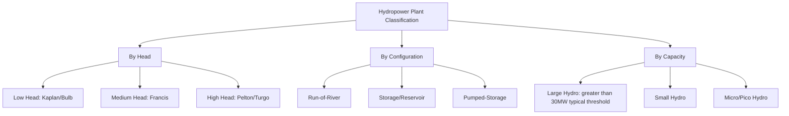
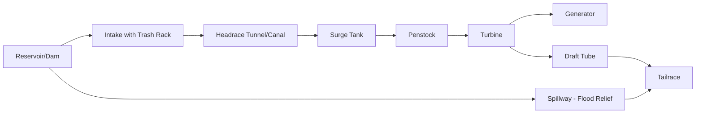

## Hydropower Plant Classification and Components

### Overview

Hydropower converts the gravitational potential energy of elevated water into electrical energy via a hydraulic turbine coupled to a generator. Plant classification is typically organized along three independent axes: head (height of water fall), plant configuration (how water is stored and routed), and capacity/scale. Understanding these classifications is foundational to selecting turbine type, civil works design, and operational strategy.

### Fundamental Energy Relationship

The theoretical hydraulic power available is:

$$P = \rho \, g \, Q \, H \, \eta$$

where $\rho$ is water density ($\approx 1000\ \text{kg/m}^3$), $g$ is gravitational acceleration ($9.81\ \text{m/s}^2$), $Q$ is volumetric flow rate ($\text{m}^3/\text{s}$), $H$ is net head (m), and $\eta$ is overall plant efficiency (turbine, generator, and hydraulic losses combined).

This equation is the basis for all hydropower plant sizing: power output scales linearly with both flow rate and head, meaning equivalent power can be achieved through a high-head/low-flow configuration or a low-head/high-flow configuration — a distinction that drives fundamentally different plant designs.

### Classification by Head

| Category | Head Range | Typical Turbine |
| --- | --- | --- |
| Low head | Less than 15 m | Kaplan, bulb/tubular |
| Medium head | 15–150 m | Francis |
| High head | Greater than 150 m | Pelton, Turgo |

**Key Points:**

- Head classification directly determines turbine selection since each turbine type is efficient only over a specific head range
- Low-head plants require large flow rates to generate significant power, necessitating large-diameter turbines/runners and large civil intake structures
- High-head plants can achieve high power with relatively modest flow, using smaller, high-speed turbines

### Classification by Plant Configuration

#### Run-of-River

- Little to no water storage; power output follows river flow variations directly
- Minimal reservoir means reduced flooding footprint and lower environmental/social displacement impact compared to storage plants
- Output is more variable and seasonally dependent, tracking river hydrology rather than dispatch needs [Inference: variability specifics depend on river hydrological regime and any minimal pondage provided]

#### Storage (Reservoir) Plants

- Dam impounds a reservoir, providing water storage that decouples power generation timing from natural inflow timing
- Enables dispatchable operation: generation can be increased during peak demand and reduced during low demand
- Requires larger civil works (dam, spillway) and typically larger environmental/social impact due to reservoir inundation

#### Pumped-Storage Hydropower (PSH)

- Two reservoirs at different elevations; water is pumped from lower to upper reservoir during periods of low electricity demand/price (often using surplus or off-peak generation) and released through turbines during high demand
- Functions as grid-scale energy storage rather than a net energy source, since pumping consumes more energy than generation recovers (round-trip efficiency typically in the range of 70–85%) [Inference: exact round-trip efficiency depends on specific plant design, pump-turbine type, and operating head]
- Increasingly valued for grid balancing services (frequency regulation, reserve capacity) as variable renewable generation (wind, solar) penetration increases

#### Diversion / Canal-Based Plants

- Water is diverted from a river through a canal or penstock to a powerhouse located at a lower elevation, then returned to the river downstream
- Common where river gradient over a short distance is exploited without requiring a large dam at the powerhouse site itself

### Classification by Capacity

| Category | Typical Capacity Range | Notes |
| --- | --- | --- |
| Large hydro | Greater than 30 MW (varies by jurisdiction) | Utility-scale, often storage-based |
| Small hydro | 1–30 MW (thresholds vary by country) | Often run-of-river |
| Mini hydro | 100 kW – 1 MW | Local/community-scale |
| Micro hydro | 5 kW – 100 kW | Off-grid or remote community supply |
| Pico hydro | Less than 5 kW | Very small isolated systems |

[Inference: capacity thresholds for these categories vary meaningfully across countries and regulatory frameworks; the ranges above represent commonly cited conventions rather than a universal standard.]

### Core Civil Works Components

#### Dam / Weir

- Impounds water to create head and/or storage; types include gravity dams, arch dams, embankment (earthfill/rockfill) dams, depending on site geology and head requirements
- For run-of-river plants, a low weir may suffice to divert flow without significant storage

#### Intake Structure

- Controls water entry into the conveyance system; equipped with trash racks to exclude debris and often fish screens for environmental protection
- Gates or valves regulate flow into the penstock/canal

#### Conveyance System

- **Penstock**: Pressurized pipe (steel, concrete, or occasionally composite) delivering water from intake or forebay to the turbine under pressure
- **Headrace canal/tunnel**: Open channel or tunnel conveying water from intake to a forebay/surge structure before the penstock, used in diversion-type plants
- **Surge tank**: Vertical shaft or chamber connected to the penstock that absorbs pressure transients (water hammer) caused by rapid turbine load changes, protecting the penstock from overpressure/underpressure damage

#### Powerhouse

- Structure housing the turbine-generator units, control systems, switchgear, and auxiliary equipment
- Can be surface-based, semi-underground, or fully underground depending on site topology and head arrangement

#### Tailrace

- Channel or conduit returning water from the turbine draft tube back to the river downstream of the powerhouse

#### Spillway

- Safety structure allowing excess reservoir water to be released without passing through turbines, preventing dam overtopping during flood events
- Types include ogee (overflow) spillways, chute spillways, and gated spillways for controlled release

### Electromechanical Components

#### Turbine

- Converts hydraulic energy into mechanical rotational energy; type selected based on head and flow characteristics (covered in depth under turbine-specific topics)

#### Generator

- Typically a synchronous generator directly coupled to the turbine shaft; converts mechanical rotation into electrical energy at grid-compatible frequency
- Speed is fixed by the required electrical frequency and generator pole count: $f = \dfrac{p \cdot n}{120}$

#### Governor System

- Regulates turbine gate/nozzle position to control flow and maintain speed/frequency stability under varying load, particularly critical for isolated or weak grid operation
- Modern governors are typically digital/electronic, replacing older mechanical-hydraulic governor designs

#### Draft Tube

- Diverging conduit below reaction turbines (Francis, Kaplan) that recovers residual kinetic energy from water leaving the runner by converting velocity head into pressure recovery, improving overall plant efficiency

#### Transformer and Switchyard

- Steps up generator output voltage to transmission-level voltage
- Switchyard houses protective relaying, circuit breakers, and metering for grid interconnection

### Example: Basic Power Calculation

For a small hydro plant with net head $H = 40\ \text{m}$, design flow $Q = 5\ \text{m}^3/\text{s}$, and overall efficiency $\eta = 0.85$:

$$P = \rho \, g \, Q \, H \, \eta = 1000 \times 9.81 \times 5 \times 40 \times 0.85 \approx 1.67 \times 10^6\ \text{W} \approx 1.67\ \text{MW}$$

This falls within the "small hydro" classification range under commonly used conventions, and given the head value, a Francis turbine would typically be the appropriate choice (medium-head range).

### Diagram: Head Classification vs. Turbine Selection (svg_diagram)

<svg xmlns="http://www.w3.org/2000/svg" viewBox="0 0 850 400">
\<style\>
.box { fill: #eef7ee; stroke: #2d5a2d; stroke-width: 1.5; }
.lbl { font-family: sans-serif; font-size: 13px; fill: #1a1a1a; }
.title { font-family: sans-serif; font-size: 16px; font-weight: bold; fill: #1a1a1a; }
.bar { stroke: #2d5a2d; stroke-width: 2; }
\</style\>
<text x="280" y="25" class="title">Head Range vs. Turbine Type (svg_diagram)</text>
<line x1="100" y1="350" x2="750" y2="350" stroke="#333" stroke-width="2" />
<text x="425" y="380" class="lbl" text-anchor="middle">Net Head (m) - increasing left to right</text>
<rect x="100" y="300" width="180" height="50" class="box" />
<text x="190" y="330" class="lbl" text-anchor="middle">0-15m: Kaplan/Bulb</text>
<rect x="300" y="230" width="220" height="50" class="box" />
<text x="410" y="260" class="lbl" text-anchor="middle">15-150m: Francis</text>
<rect x="540" y="160" width="210" height="50" class="box" />
<text x="645" y="190" class="lbl" text-anchor="middle">greater than 150m: Pelton/Turgo</text>
<line x1="190" y1="300" x2="190" y2="350" class="bar" />
<line x1="410" y1="230" x2="410" y2="350" class="bar" />
<line x1="645" y1="160" x2="645" y2="350" class="bar" />

<text x="190" y="100" class="lbl" text-anchor="middle">Low Head</text>

<text x="190" y="118" class="lbl" text-anchor="middle">High Flow</text>

<text x="190" y="136" class="lbl" text-anchor="middle">Large Runner</text>

<text x="410" y="80" class="lbl" text-anchor="middle">Medium Head</text>

<text x="410" y="98" class="lbl" text-anchor="middle">Moderate Flow</text>

<text x="645" y="60" class="lbl" text-anchor="middle">High Head</text>

<text x="645" y="78" class="lbl" text-anchor="middle">Low Flow</text>

<text x="645" y="96" class="lbl" text-anchor="middle">Compact Runner</text>

</svg>

**Related Topics:**

- Francis, Kaplan, and Pelton Turbine Design and Selection
- Pumped-Storage Hydropower Systems and Grid Balancing
- Water Hammer and Surge Tank Design
- Environmental and Social Impacts of Dam Construction
- Small and Micro Hydropower for Rural Electrification
- Tidal and Wave Energy Conversion Systems