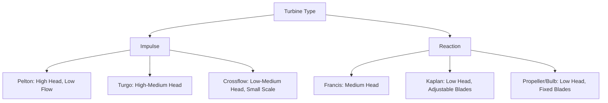
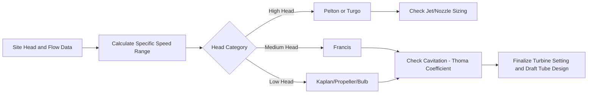

## Hydraulic Turbine Selection and Design

### Overview

Hydraulic turbine selection is governed primarily by site head and flow characteristics, with the goal of maximizing efficiency across the expected operating range while satisfying mechanical, cavitation, and cost constraints. Turbines are broadly divided into **impulse** turbines (which convert pressure energy entirely into kinetic energy before striking the runner) and **reaction** turbines (which extract energy from both pressure and velocity changes as water passes through the runner).

### Impulse vs. Reaction Turbines

| Characteristic | Impulse | Reaction |
| --- | --- | --- |
| Energy conversion | Pressure to velocity before runner (via nozzle) | Pressure and velocity both change across runner |
| Runner immersion | Operates in air, at atmospheric pressure | Fully submerged, operates under pressure |
| Casing requirement | Not required to be pressure-sealed | Requires pressure-sealed casing |
| Typical head range | High head | Low to medium head |
| Examples | Pelton, Turgo, Crossflow | Francis, Kaplan, propeller, bulb |

### Impulse Turbines

#### Pelton Turbine

- Consists of a runner with double-cupped buckets struck by one or more high-velocity jets emerging from nozzles
- Jet velocity is governed by the available head via $v = C_v\sqrt{2gH}$, where $C_v$ is a nozzle velocity coefficient (typically close to but slightly less than 1, reflecting nozzle losses)
- Flow rate is controlled by a spear valve (needle) within the nozzle, allowing smooth flow regulation without significantly affecting jet velocity or efficiency across a wide load range
- Best suited to high head (typically greater than 150 m) and relatively low flow
- Runner operates at atmospheric pressure in air; housed in a casing primarily to contain splashing water, not to maintain pressure

#### Turgo Turbine

- Similar operating principle to Pelton but with the jet striking the runner at an angle (typically around 20°), allowing water to pass through the runner rather than being turned back as in Pelton buckets
- Enables higher specific speed than Pelton for a given head, allowing a more compact, faster-spinning runner
- Suited to medium-to-high head applications where Pelton's specific speed range is too restrictive

#### Crossflow (Banki-Michell) Turbine

- Water flows through the runner blades twice — once entering and once exiting after crossing through the hollow drum-shaped runner
- Simple, low-cost construction; efficiency is somewhat lower than Pelton/Francis at design point, but efficiency remains relatively flat across a wide flow range
- Well suited to small-scale and micro-hydro applications, particularly where flow varies seasonally

### Reaction Turbines

#### Francis Turbine

- Radial-to-axial flow pattern: water enters radially through adjustable wicket gates and exits axially through the runner into the draft tube
- Most widely deployed turbine type globally due to broad applicability across medium head ranges (roughly 15–150 m) [Inference: exact head range boundaries vary somewhat by manufacturer and design refinement]
- Wicket gates (guide vanes) regulate flow rate and direction into the runner, providing load control
- Requires a draft tube to recover kinetic energy from water exiting the runner, since exit velocity remains significant

#### Kaplan Turbine

- Axial-flow reaction turbine with adjustable runner blades (analogous in principle to a ship's propeller with variable pitch)
- Adjustable blade pitch combined with adjustable wicket gates ("double regulation") maintains high efficiency across a wide range of flow and head conditions, which is particularly valuable for low-head run-of-river plants where flow varies seasonally
- Suited to low head (typically under 15 m) and high flow applications

#### Propeller and Bulb Turbines

- Propeller turbines are fixed-blade variants of the Kaplan design, offering lower cost but reduced part-load efficiency since only wicket gates (not blades) provide flow regulation
- Bulb turbines house the generator in a sealed, streamlined bulb submerged directly in the water flow, with the turbine and generator on a common horizontal shaft — commonly used in low-head run-of-river and tidal barrage applications where a compact, straight-through flow path is advantageous

### Turbine Selection Parameters

#### Specific Speed

Specific speed $N_s$ is a dimensionless (or dimensional, depending on convention) parameter used to characterize turbine type independent of absolute size, enabling comparison and selection based on head/flow/speed relationships:

$$N_s = \frac{N\sqrt{P}}{H^{5/4}}$$

where $N$ is rotational speed (rpm), $P$ is power output, and $H$ is net head. Each turbine type has a characteristic specific speed range:

| Turbine | Typical Specific Speed Range (metric convention) |
| --- | --- |
| Pelton (single jet) | Low ($N_s$ roughly 10–35) |
| Turgo | Low-medium |
| Francis | Medium (roughly 60–400) |
| Kaplan/Propeller | High (roughly 300–1000+) |

[Inference: numeric specific speed ranges vary depending on the exact unit convention used (metric vs. US customary) and source reference; the relative ordering across turbine types is the consistent, well-established takeaway.]

#### Cavitation and Suction Head

- Cavitation occurs when local pressure within the turbine drops below the vapor pressure of water, forming vapor bubbles that collapse violently upon reaching higher-pressure regions, causing pitting and erosion damage to runner surfaces
- Reaction turbines are particularly susceptible to cavitation near the runner exit and draft tube inlet where pressure is lowest
- The **Thoma cavitation coefficient** $\sigma$ is used to evaluate cavitation risk and determine appropriate turbine setting (elevation relative to tailwater):

$$\sigma = \frac{H_{atm} - H_v - H_s}{H}$$

where $H_{atm}$ is atmospheric pressure head, $H_v$ is vapor pressure head, $H_s$ is suction head (turbine setting above tailwater), and $H$ is net head. The calculated $\sigma$ must exceed a critical value $\sigma_c$ specific to the turbine design to avoid cavitation

- Practical design implication: higher specific speed turbines (Kaplan) are more cavitation-prone and typically require closer proximity to or submergence below tailwater level, while Pelton turbines, operating at atmospheric pressure, are largely immune to this failure mode

### Turbine Efficiency Characteristics

- Peak efficiency for well-designed hydraulic turbines is high, commonly in the 90–95% range at design flow [Inference: exact peak efficiency depends on specific design, manufacturer, and scale; smaller turbines generally achieve somewhat lower peak efficiency than large utility-scale units]
- Efficiency vs. flow curves differ meaningfully by type: Pelton and crossflow turbines maintain relatively flat efficiency across a wide flow range due to nozzle/valve flow control, while fixed-blade propeller turbines show sharper efficiency drop-off away from design flow
- Kaplan's double regulation (blade + gate) is specifically engineeared to flatten the efficiency curve across variable flow, at the cost of increased mechanical complexity

### Governing and Load Control

- **Impulse turbines**: Load regulated via spear valve (nozzle flow control) and deflector plates for rapid load rejection without inducing excessive water hammer in the penstock
- **Reaction turbines**: Load regulated primarily via wicket gate angle (Francis, Kaplan) and additionally via runner blade angle in Kaplan designs
- Rapid load rejection events require coordinated governor action to prevent overspeed and penstock pressure transients, often working in conjunction with surge tank design (see hydropower components topic)

### Example: Turbine Type Selection Calculation

For a site with net head $H = 25\ \text{m}$, design flow $Q = 8\ \text{m}^3/\text{s}$, target rotational speed $N = 375\ \text{rpm}$ (a common synchronous speed for a 16-pole generator at 50 Hz), and efficiency $\eta = 0.90$:

Power output:

$$P = \rho g Q H \eta = 1000 \times 9.81 \times 8 \times 25 \times 0.90 \approx 1.77\ \text{MW}$$

Specific speed:

$$N_s = \frac{N\sqrt{P_{kW}}}{H^{5/4}} = \frac{375 \times \sqrt{1766}}{25^{1.25}} \approx \frac{375 \times 42.02}{55.9} \approx 282$$

A specific speed of approximately 282 falls within the Francis turbine range, confirming Francis as the appropriate selection for this head and speed combination — consistent with the general head-based classification (25 m falls in the medium-head band).

### Diagram: Impulse vs. Reaction Flow Path (svg_diagram)

<svg xmlns="http://www.w3.org/2000/svg" viewBox="0 0 900 380">
\<style\>
.box { fill: #f0f4fa; stroke: #2a4d6e; stroke-width: 1.5; }
.lbl { font-family: sans-serif; font-size: 13px; fill: #1a1a1a; }
.title { font-family: sans-serif; font-size: 16px; font-weight: bold; fill: #1a1a1a; }
.flow { stroke: #2a4d6e; stroke-width: 2; fill: none; marker-end: url(#arrow2); }
\</style\>
<text x="280" y="25" class="title">Impulse vs Reaction Turbine Flow Path (svg_diagram)</text>

<text x="220" y="55" class="lbl" text-anchor="middle" font-weight="bold">Impulse (Pelton)</text>

<rect x="60" y="70" width="70" height="40" class="box" />

<text x="95" y="94" class="lbl" text-anchor="middle">Penstock</text>

<path d="M130,90 L180,90" class="flow" />

<rect x="180" y="70" width="70" height="40" class="box" />

<text x="215" y="94" class="lbl" text-anchor="middle">Nozzle</text>

<path d="M250,90 L300,90" class="flow" />

<rect x="300" y="70" width="80" height="40" class="box" />

<text x="340" y="94" class="lbl" text-anchor="middle">Runner (air)</text>

<text x="220" y="140" class="lbl" text-anchor="middle">Jet at atmospheric pressure strikes buckets</text>

<text x="220" y="158" class="lbl" text-anchor="middle">No draft tube required</text>

<text x="680" y="55" class="lbl" text-anchor="middle" font-weight="bold">Reaction (Francis)</text>

<rect x="540" y="70" width="70" height="40" class="box" />

<text x="575" y="94" class="lbl" text-anchor="middle">Penstock</text>

<path d="M610,90 L660,90" class="flow" />

<rect x="660" y="70" width="80" height="40" class="box" />

<text x="700" y="94" class="lbl" text-anchor="middle">Wicket Gates</text>

<path d="M740,90 L790,90" class="flow" />

<rect x="790" y="70" width="70" height="40" class="box" />

<text x="825" y="94" class="lbl" text-anchor="middle">Runner</text>

<path d="M700,110 L700,160" class="flow" />

<rect x="650" y="160" width="100" height="40" class="box" />

<text x="700" y="184" class="lbl" text-anchor="middle">Draft Tube</text>

<text x="700" y="220" class="lbl" text-anchor="middle">Fully submerged, pressurized system</text>

<text x="700" y="238" class="lbl" text-anchor="middle">Draft tube recovers exit kinetic energy</text>

<line x1="450" y1="40" x2="450" y2="260" stroke="#999" stroke-width="1" stroke-dasharray="3,3" />
</svg>

**Related Topics:**

- Hydropower Plant Classification and Components
- Cavitation Analysis and Draft Tube Design
- Pumped-Storage Turbine (Reversible Pump-Turbine) Design
- Small and Micro Hydropower Turbine Selection
- Turbine Governor Systems and Load Rejection Transients
- Tidal Stream and Wave Energy Converter Technologies