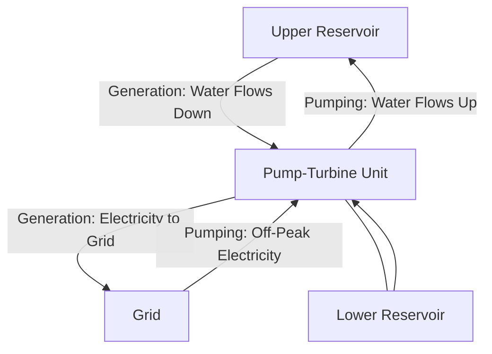

## Pumped-Storage Hydropower

### Overview

Pumped-storage hydropower (PSH) is a form of grid-scale mechanical energy storage that uses two water reservoirs at different elevations. During periods of low electricity demand or surplus generation, water is pumped from the lower reservoir to the upper reservoir, storing energy as gravitational potential energy. During periods of high demand, the stored water is released back down through turbines to generate electricity. PSH is currently the most widely deployed and mature form of grid-scale energy storage by installed capacity [Inference: relative ranking versus emerging battery storage capacity is shifting over time as battery deployment accelerates].

### Fundamental Operating Principle

Stored energy capacity is governed by the same fundamental hydropower relationship, applied to the volume of water stored rather than continuous flow:

$$E = \rho \, g \, V \, H \, \eta$$

where $V$ is the volume of water stored in the upper reservoir, $H$ is the effective head between reservoirs, and $\eta$ is round-trip efficiency. Because energy scales with both volume and head, PSH schemes favor sites with large elevation differences to minimize the reservoir volume (and associated land/environmental footprint) needed for a given energy storage capacity.

### Round-Trip Efficiency

Round-trip efficiency is the ratio of energy recovered during generation to energy consumed during pumping:

$$\eta_{RT} = \frac{E_{generated}}{E_{pumped}}$$

Modern pumped-storage plants typically achieve round-trip efficiencies in the range of roughly 70–85%, with losses occurring in the pump, turbine, motor/generator, and hydraulic conveyance (friction losses in penstocks/tunnels) [Inference: exact efficiency depends heavily on specific plant design, head, pump-turbine technology, and operating conditions, and published figures vary across sources].

### Plant Configurations

#### Conventional (Open-Loop) Pumped Storage

- Upper and/or lower reservoir is hydrologically connected to a natural waterway (river, lake)
- Can potentially provide conventional hydropower generation in addition to storage function, depending on natural inflow
- Subject to additional environmental permitting considerations related to the natural water body connection

#### Closed-Loop (Off-River) Pumped Storage

- Both reservoirs are isolated from natural waterways, with makeup water added only to offset evaporation/seepage losses
- Reduces environmental impact on river ecology and fish passage compared to open-loop systems
- Increasingly preferred for new projects due to more streamlined permitting and reduced hydrological impact [Inference: siting/permitting preference trends vary by jurisdiction and are evolving]

### Pump-Turbine Technology

#### Reversible Francis-Type Pump-Turbine

- Most common configuration: a single Francis-type runner operates in reverse for pumping mode and forward for generating mode
- Requires careful hydraulic design since optimal runner geometry for pumping and generating are not identical, involving an inherent efficiency trade-off between the two operating modes
- Direction reversal requires the motor-generator to also function as a motor during pumping, driven by grid power

#### Ternary Units

- Separate pump and turbine units mechanically coupled to a common shaft with a motor-generator, sometimes with a clutch allowing hydraulic short-circuit operation (simultaneous pumping and generating for fine power output control)
- Offers greater operational flexibility (faster mode transitions, ability to operate in "hydraulic short circuit" mode for grid frequency regulation) at the cost of increased mechanical complexity and capital cost
- More common in older or specialized installations requiring rapid response characteristics [Inference: adoption rate of ternary configurations in new projects is limited and varies by region and grid service requirements]

#### Variable-Speed Pump-Turbines

- Use doubly-fed induction machines or full-converter synchronous machines instead of fixed-speed synchronous generators, allowing rotational speed to vary during both pumping and generating
- Enables active power regulation during pumping mode (fixed-speed units can only pump at essentially constant power), improving grid frequency support capability
- Increasing adoption in newer PSH projects for enhanced grid services, though at higher capital and control system complexity [Unverified: exact market penetration figures are not well-established in this context]

### Grid Services Provided by PSH

- **Peak shaving / load shifting**: Generating during high-demand, high-price periods using energy stored during low-demand periods
- **Frequency regulation**: Fast-responding generation/pumping adjustments to help maintain grid frequency within tolerance
- **Spinning reserve**: Ability to rapidly increase generation output to cover unexpected generation shortfalls or demand spikes
- **Black start capability**: Some PSH plants can self-start without external grid power, valuable for grid restoration after a blackout
- **Renewable integration support**: Absorbing surplus wind/solar generation during high-output, low-demand periods (via pumping) and releasing it later, addressing the variability and non-dispatchability of these renewable sources

### Civil Engineering Considerations

- **Head and reservoir sizing trade-off**: Higher head reduces required reservoir volume for a given energy capacity, favoring mountainous terrain with significant elevation differential
- **Waterway design**: Penstocks/tunnels must be sized to handle bidirectional flow with acceptable friction losses in both pumping and generating directions
- **Surge protection**: Surge tanks or air cushion surge chambers are critical given the frequent, rapid flow reversals inherent to PSH operation, which impose more demanding transient conditions than conventional one-directional hydropower
- **Underground powerhouse**: Many modern PSH schemes, particularly closed-loop designs, locate the powerhouse underground to reduce surface footprint and take advantage of favorable rock conditions for high-pressure waterway construction

### Economic and Operational Considerations

- PSH economics depend heavily on the price spread between off-peak (pumping) and peak (generating) electricity prices, since the plant consumes more energy than it generates due to round-trip losses
- As variable renewable energy penetration increases, price volatility patterns are shifting (e.g., midday solar-driven low prices), influencing optimal PSH dispatch strategy and increasing focus on providing ancillary/balancing services rather than pure energy arbitrage alone [Inference: this represents an observed industry trend rather than a fixed rule, and specific dispatch economics are market- and region-dependent]
- Long asset lifetimes (often cited at 50+ years for civil works) [Unverified: specific lifetime figures depend on plant design, maintenance regime, and refurbishment cycles] contribute to PSH's role as a long-duration storage asset compared to shorter-duration battery storage technologies

### Example: Energy Storage Capacity Calculation

For a closed-loop PSH scheme with an upper reservoir storing a usable volume of $V = 5 \times 10^6\ \text{m}^3$, an effective head of $H = 300\ \text{m}$, and a round-trip efficiency of $\eta_{RT} = 0.78$ (applying the full round-trip loss to the generating-side calculation for illustrative purposes):

$$E = \rho g V H \eta = 1000 \times 9.81 \times (5 \times 10^6) \times 300 \times 0.78$$

$$E \approx 1.148 \times 10^{13}\ \text{J} \approx 3189\ \text{MWh}$$

This illustrates why high-head sites are strongly favored for PSH: achieving multi-GWh storage capacity at lower head would require proportionally much larger, more land- and construction-intensive reservoirs.

### Diagram: PSH Daily Operating Cycle (svg_diagram)

<svg xmlns="http://www.w3.org/2000/svg" viewBox="0 0 850 400">
\<style\>
.box { fill: #eef2fa; stroke: #2a3a5e; stroke-width: 1.5; }
.lbl { font-family: sans-serif; font-size: 13px; fill: #1a1a1a; }
.title { font-family: sans-serif; font-size: 16px; font-weight: bold; fill: #1a1a1a; }
.curve { stroke: #d4620a; stroke-width: 2.5; fill: none; }
\</style\>
<text x="280" y="25" class="title">Pumped-Storage Daily Operating Cycle (svg_diagram)</text>
<line x1="80" y1="330" x2="800" y2="330" stroke="#333" stroke-width="1.5" />
<line x1="80" y1="60" x2="80" y2="330" stroke="#333" stroke-width="1.5" />
<text x="440" y="360" class="lbl" text-anchor="middle">Time of Day (24h)</text>
<text x="35" y="200" class="lbl" text-anchor="middle" transform="rotate(-90 35 200)">Grid Power Exchange</text>
<line x1="80" y1="195" x2="800" y2="195" stroke="#999" stroke-dasharray="2,2" />
<text x="810" y="199" class="lbl">0</text>
<path d="M80,195 L200,195 L220,270 L380,270 L400,195 L560,195 L580,110 L720,110 L740,195 L800,195" class="curve" />

<text x="290" y="290" class="lbl" text-anchor="middle">Pumping (night, low demand)</text>

<text x="650" y="95" class="lbl" text-anchor="middle">Generating (peak demand)</text>

<rect x="150" y="60" width="180" height="30" class="box" />
<text x="240" y="80" class="lbl" text-anchor="middle">Off-Peak: Pump Water Up</text>
<rect x="550" y="60" width="180" height="30" fill="none" stroke="none" />
</svg>

**Related Topics:**

- Hydraulic Turbine Selection and Design
- Grid-Scale Battery Storage vs. Pumped-Storage Comparison
- Variable-Speed Pump-Turbine Control Systems
- Renewable Energy Integration and Grid Balancing
- Surge Tank and Water Hammer Analysis for Bidirectional Flow
- Site Selection and Environmental Permitting for Energy Storage Projects