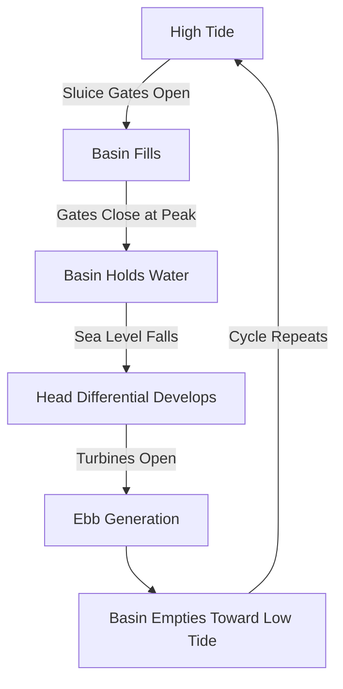
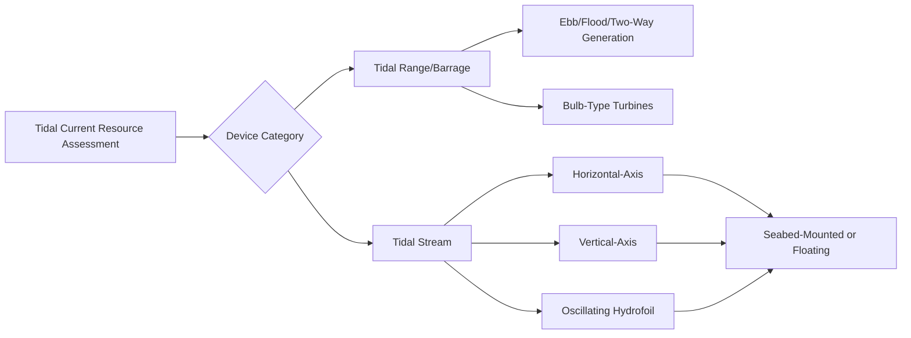

## Tidal Energy Conversion

### Overview

Tidal energy conversion harnesses the kinetic and/or potential energy of ocean tides, which are driven predictably by the gravitational interaction between the Earth, Moon, and Sun. Unlike wind and solar, tidal resource is highly predictable years in advance since it follows well-established astronomical cycles, though output is not constant and varies with the tidal cycle (typically twice-daily, semi-diurnal patterns in most locations). Two principal conversion approaches are used: **tidal range** (barrage) systems, which exploit the potential energy of height difference between high and low tide, and **tidal stream** systems, which extract kinetic energy from tidal currents.

### Tidal Range (Barrage) Systems

#### Operating Principle

A barrage (dam-like structure) is built across a tidal estuary or bay, impounding water at high tide and releasing it through turbines as the tide falls, generating electricity from the head difference between the impounded basin and the sea.

Potential energy available per tidal cycle is proportional to basin area and the square of the tidal range:

$$E \propto \rho \, g \, A \, R^2$$

where $A$ is basin surface area and $R$ is tidal range (height difference between high and low tide). This quadratic dependence on tidal range means sites with large tidal ranges are disproportionately more attractive, which is why viable barrage sites are geographically limited to locations with naturally large tidal ranges (funnel-shaped estuaries and bays amplify tidal range through resonance effects).

#### Operating Modes

- **Ebb generation**: Basin is filled at high tide (sluice gates open), then closed; as sea level falls, water is released through turbines from basin to sea, generating power during the ebb tide
- **Flood generation**: Reverse of ebb generation — turbines generate as the rising tide flows from sea into the basin
- **Two-way (bidirectional) generation**: Turbines generate during both flood and ebb phases, increasing total energy capture but requiring turbines capable of efficient bidirectional operation (typically bulb-type Kaplan turbines with reversible blade pitch)
- **Pumping augmentation**: Some schemes pump additional water into the basin near high tide using turbine-generators operating in reverse (analogous to pumped-storage), increasing the effective head available for subsequent generation

#### Barrage Turbine Technology

- Bulb-type axial-flow turbines (similar to those used in low-head run-of-river hydropower) are the standard choice, given the low head (typically a few meters) and high flow characteristic of tidal barrage sites
- Turbines are often designed for bidirectional (two-way) flow capability in modern schemes, along with reversible pumping capability, increasing mechanical and control complexity relative to unidirectional river turbines

#### Environmental and Engineering Considerations

- Barrages significantly alter estuarine hydrodynamics, sediment transport, and salinity gradients, with substantial ecological impact on intertidal habitats, fish migration, and bird feeding grounds that depend on natural tidal exposure cycles
- Large civil works cost (sluice gates, turbine housings, barrage structure spanning the full estuary width) results in high capital intensity, historically limiting new barrage development to a small number of sites globally with favorable tidal range and estuary geometry [Inference: development pace and site selection are influenced by evolving environmental regulation and capital cost considerations that vary by jurisdiction and project]

### Tidal Stream (Tidal Current) Systems

#### Operating Principle

Tidal stream devices extract kinetic energy directly from moving tidal currents, analogous in principle to wind turbines but operating in water. Available power follows the same cubic velocity relationship as wind:

$$P = \frac{1}{2} \rho A v^3 C_p$$

Because seawater density ($\approx 1025\ \text{kg/m}^3$) is roughly 800 times that of air, tidal stream devices can extract substantially more power than a wind turbine of equivalent swept area at the same flow velocity, allowing much smaller rotor diameters for comparable power output.

#### Device Types

##### Horizontal-Axis Turbines

- Directly analogous to horizontal-axis wind turbines, with a rotor facing into the tidal current
- Most mature and widely deployed tidal stream technology to date [Inference: relative technology maturity rankings may shift as the sector develops further]
- Often designed to be bidirectional (yaw or pitch to face either flood or ebb current direction) since tidal currents reverse direction roughly twice daily

##### Vertical-Axis Turbines

- Rotor axis perpendicular to current flow, similar in principle to vertical-axis wind turbines (e.g., Darrieus-type)
- Inherently bidirectional without requiring yaw mechanisms, since rotor orientation relative to flow direction does not need adjustment for reversing currents
- Generally exhibit lower peak efficiency than horizontal-axis designs [Unverified: exact efficiency gap depends heavily on specific device design and is an active area of engineering development]

##### Oscillating Hydrofoil Devices

- Use a hydrofoil that oscillates up and down (or side to side) in response to tidal flow via a mechanical linkage, driving a hydraulic or direct mechanical power take-off
- Mimic biological propulsion mechanisms (analogous to a fish tail motion); mechanically distinct from rotating turbine designs

#### Foundation and Deployment Approaches

- **Seabed-mounted (fixed)**: Gravity base or piled foundation directly on the seabed, similar in concept to fixed-bottom offshore wind foundations, suited to well-characterized, accessible sites
- **Floating platforms**: Tidal turbines mounted on floating structures moored to the seabed, allowing surface access for maintenance without subsea intervention vessels, at the cost of additional platform and mooring engineering
- **Tidal kite/tethered systems**: Device flies in a figure-eight pattern through the current on a tether, artificially increasing the effective flow velocity seen by the turbine beyond the ambient current speed, potentially enabling deployment in lower-velocity resource sites [Unverified: this is an emerging concept with limited large-scale commercial deployment history at the time of writing]

### Grid Connection and Array Considerations

- Tidal stream devices are typically deployed in arrays within a tidal channel or strait, similar in concept to offshore wind farms, with subsea inter-array cabling connecting to an export cable and onshore grid connection point
- Array layout must account for wake effects between devices and the twice-daily flow reversal, which affects optimal spacing compared to a wind farm with a dominant, largely unidirectional wind rose
- Predictable but non-constant output (following the tidal cycle) means tidal generation, while highly forecastable, still requires grid balancing or storage pairing to smooth output variation across the tidal cycle [Inference: specific balancing requirements depend on grid size, tidal array capacity relative to grid demand, and the phase diversity of multiple tidal sites feeding the same grid]

### Resource Characteristics vs. Wind and Solar

| Characteristic | Tidal | Wind | Solar |
| --- | --- | --- | --- |
| Predictability | Very high (astronomical) | Moderate (weather-dependent) | Moderate (weather-dependent) |
| Constancy | Cyclical, zero-crossing at slack tide | Highly variable | Diurnal, zero at night |
| Resource density | High for stream (dense fluid) | Lower per unit area | Lower per unit area |
| Site availability | Geographically constrained to specific coastal/strait locations | Broadly available | Broadly available |

### Example: Tidal Stream Power Estimation

For a horizontal-axis tidal turbine with rotor diameter $D = 15\ \text{m}$ (swept area $A = \pi (D/2)^2 \approx 176.7\ \text{m}^2$), operating in a peak tidal current of $v = 2.5\ \text{m/s}$, seawater density $\rho = 1025\ \text{kg/m}^3$, and power coefficient $C_p = 0.4$:

$$P = \frac{1}{2}\rho A v^3 C_p = \frac{1}{2} \times 1025 \times 176.7 \times (2.5)^3 \times 0.4$$

$$P \approx \frac{1}{2} \times 1025 \times 176.7 \times 15.625 \times 0.4 \approx 566{,}000\ \text{W} \approx 566\ \text{kW}$$

This illustrates the resource density advantage: a wind turbine would require a substantially larger rotor diameter to capture equivalent power at a comparable flow velocity, due to water's much higher density than air.

### Diagram: Tidal Barrage Cross-Section (svg_diagram)

<svg xmlns="http://www.w3.org/2000/svg" viewBox="0 0 850 380">
\<style\>
.box { fill: #dce9f5; stroke: #1f4e6e; stroke-width: 1.5; }
.water { fill: #a9cbe8; }
.basin { fill: #c7ddf0; }
.lbl { font-family: sans-serif; font-size: 13px; fill: #1a1a1a; }
.title { font-family: sans-serif; font-size: 16px; font-weight: bold; fill: #1a1a1a; }
\</style\>
<text x="280" y="25" class="title">Tidal Barrage Cross-Section (svg_diagram)</text>
<rect x="0" y="200" width="300" height="150" class="water" />
<text x="150" y="230" class="lbl" text-anchor="middle">Sea (High Tide)</text>
<rect x="300" y="80" width="60" height="270" class="box" />
<text x="330" y="60" class="lbl" text-anchor="middle">Barrage</text>
<rect x="360" y="220" width="40" height="80" fill="#7f9fb5" stroke="#1f4e6e" />
<text x="380" y="270" class="lbl" text-anchor="middle" transform="rotate(90 380 270)" font-size="11">Turbine</text>
<rect x="400" y="90" width="40" height="150" fill="#7f9fb5" stroke="#1f4e6e" />
<text x="420" y="60" class="lbl" text-anchor="middle" font-size="11">Sluice</text>
<text x="420" y="75" class="lbl" text-anchor="middle" font-size="11">Gate</text>
<rect x="440" y="230" width="410" height="120" class="basin" />
<text x="645" y="260" class="lbl" text-anchor="middle">Impounded Basin (Low Tide Level)</text>
<line x1="0" y1="200" x2="850" y2="200" stroke="#1f4e6e" stroke-width="1" stroke-dasharray="4,2" />
<text x="800" y="195" class="lbl">High Tide Level</text>
<line x1="440" y1="230" x2="850" y2="230" stroke="#1f4e6e" stroke-width="1" stroke-dasharray="4,2" />
<text x="800" y="225" class="lbl">Basin Level</text>
<path d="M400,190 L400,230" stroke="#c0392b" stroke-width="2" marker-end="url(#dh)" />
<text x="415" y="215" class="lbl" fill="#c0392b">Head (H)</text>
</svg>

**Related Topics:**

- Wave Energy Conversion Technologies
- Hydraulic Turbine Selection and Design
- Offshore Wind Energy Systems (foundation and grid connection parallels)
- Marine Renewable Energy Grid Integration
- Environmental Impact of Estuarine and Coastal Energy Infrastructure
- Ocean Thermal Energy Conversion (OTEC)