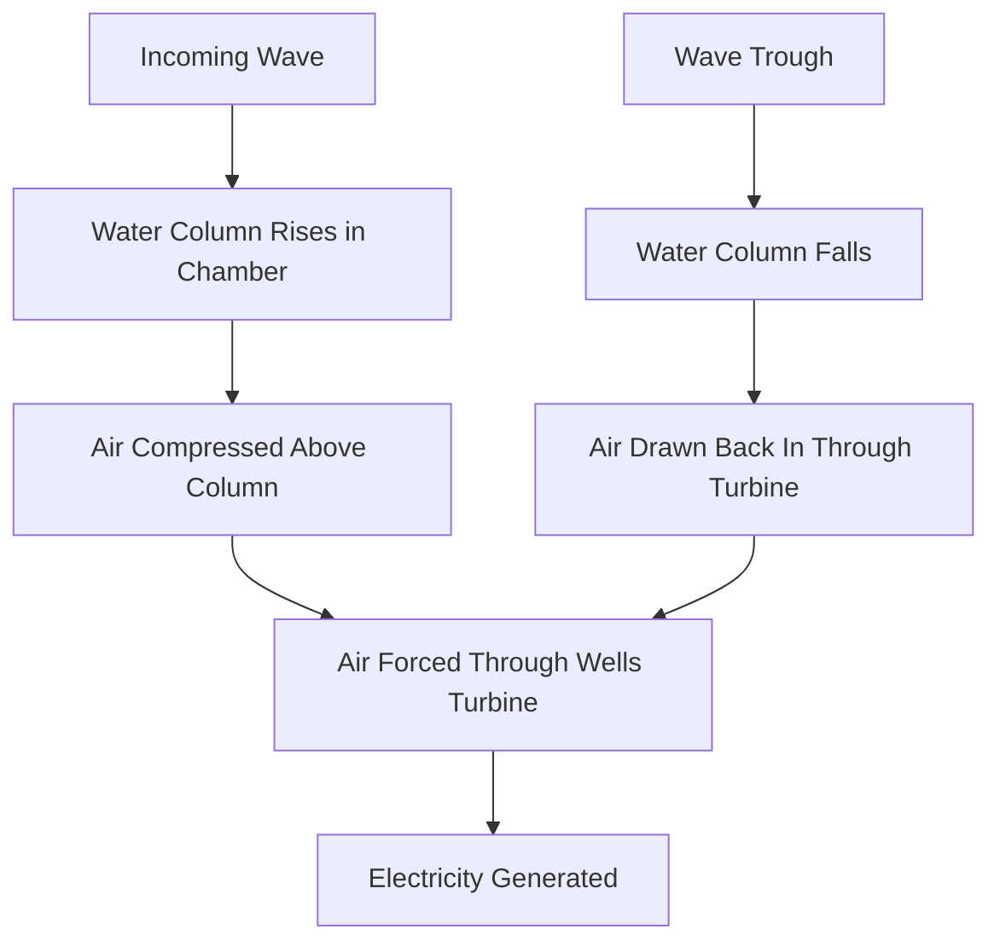
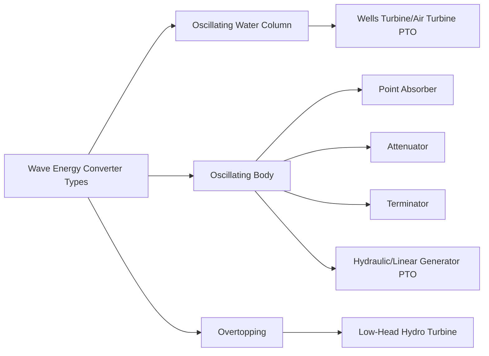

## Wave Energy Conversion

### Overview

Wave energy conversion extracts power from the oscillatory motion of ocean surface waves, which are generated by wind acting on the sea surface over long fetch distances. Unlike tidal energy, which follows predictable astronomical cycles, wave energy is driven by weather patterns and is therefore more variable and less precisely predictable, though wave forecasting on timescales of hours to a few days is reasonably reliable [Inference: forecast reliability depends on regional weather patterns and forecasting model sophistication]. Wave energy converters (WECs) encompass a highly diverse range of device concepts, reflecting the technology's relative immaturity compared to wind and conventional hydropower.

### Wave Energy Resource Characteristics

The power available per unit width of wave crest (wave power flux) for deep-water waves is approximated by:

$$P = \frac{\rho g^2}{64\pi} H_s^2 T_e$$

where $H_s$ is significant wave height, $T_e$ is energy period, $\rho$ is seawater density, and $g$ is gravitational acceleration. This relationship shows that wave power scales with the square of wave height and linearly with wave period, meaning energy-rich sites combine both large waves and long periods — conditions typically found in exposed, deep-water coastal locations at mid-to-high latitudes with long wind fetch (e.g., the North Atlantic, Pacific Northwest, and Southern Ocean-facing coasts).

### Wave Energy Converter Classification

Wave energy converters are commonly classified by operating principle and by deployment location relative to shore.

#### By Deployment Location

| Category | Description |
| --- | --- |
| Shoreline | Fixed to or built into the coastline; easiest access for installation/maintenance, but limited to the (generally lower) wave energy available in shallow nearshore water |
| Nearshore | Located in relatively shallow water close to shore, often bottom-mounted or bottom-referenced |
| Offshore | Located in deep water where wave energy is highest; floating devices moored to the seabed, facing the most challenging survivability and access conditions |

#### By Operating Principle

##### Oscillating Water Column (OWC)

- A partially submerged chamber open to the sea below the waterline; wave action causes the water column inside to rise and fall, alternately compressing and decompressing air trapped above it
- The oscillating airflow drives a turbine, typically a **Wells turbine**, which is specifically designed to rotate in the same direction regardless of airflow direction (a self-rectifying turbine), avoiding the need for flow-reversing valves
- Can be implemented as shoreline (fixed) or floating offshore structures

##### Oscillating Body Systems

- **Point absorbers**: Small, typically axisymmetric floating buoys that respond to wave motion in one or more degrees of freedom (commonly heave, the vertical bobbing motion), driving a power take-off (PTO) mechanism (hydraulic, direct linear generator, or mechanical) relative to a fixed reference (seabed-anchored) or reaction mass
- **Attenuators**: Long, multi-segment floating structures oriented parallel to the direction of wave travel, generating power from the relative flexing motion between segments as waves pass along their length (e.g., the historical Pelamis concept)
- **Terminators**: Devices oriented perpendicular to the wave direction, designed to physically intercept the oncoming wave front and extract energy from the direct force of wave impact

##### Overtopping Devices

- Structure captures wave water into an elevated reservoir as waves run up a ramp, then releases the collected water through low-head turbines back to sea level, operating on essentially the same energy principle as conventional low-head hydropower
- Can be shore-based or floating offshore structures with a reservoir integrated into the platform

### Power Take-Off (PTO) Systems

The power take-off converts the mechanical motion captured by the primary WEC structure into electricity, and represents a key technical differentiator between competing device concepts.

- **Hydraulic PTO**: Mechanical motion drives a hydraulic piston/cylinder system, pressurizing fluid that drives a hydraulic motor coupled to a generator; allows some decoupling of irregular wave-driven input motion from smoother generator operation via accumulator storage
- **Direct-drive linear generator**: Wave-driven linear motion directly drives a linear electrical generator without intermediate mechanical conversion, reducing mechanical complexity and potential failure points, at the cost of generator design challenges for handling low-speed, high-force, reversing linear motion
- **Air turbine (Wells or impulse turbine)**: Used specifically in OWC devices to convert oscillating pneumatic power into rotational mechanical power
- **Mechanical drivetrain (rack-and-pinion, ball-screw)**: Converts linear or rotational wave-driven motion into a form suitable for a conventional rotating generator, used in some point absorber and attenuator designs

### Survivability and Reliability Challenges

- WECs must survive extreme storm wave conditions that can be an order of magnitude more energetic than average operating conditions, creating a fundamental design tension between optimizing for efficient energy capture at typical wave conditions and structural survival at extreme conditions
- Many historical WEC concepts have incorporated some form of storm protection: submerging below the wave-affected zone, reconfiguring to a low-profile "survival mode," or mechanically decoupling the PTO during extreme events [Inference: specific survival strategies are highly device-specific and represent an active area of ongoing design iteration across the sector]
- Corrosion, biofouling, and mechanical fatigue from continuous cyclic loading (waves arrive far more frequently than, for example, tidal cycles) present significant long-term reliability challenges distinct from other marine renewable technologies
- The wave energy sector has experienced a comparatively high rate of device concept turnover and company attrition relative to wind and tidal technology, reflecting the technology's earlier stage of convergence toward dominant designs [Inference: this is a widely observed industry pattern, though the pace and causes of specific company outcomes are case-specific]

### Grid Connection and Array Deployment

- Similar in principle to tidal stream and offshore wind: individual devices connect via inter-array subsea cabling to a common export cable and onshore grid connection
- Wave farms must account for wave shadowing effects between devices (analogous to wake effects in wind/tidal arrays), where upstream devices reduce wave energy available to downstream devices
- Given the current early-stage deployment scale of most wave technologies, many installations remain at demonstration or pre-commercial array scale rather than full commercial wind-farm-equivalent scale [Unverified: commercial deployment scale is evolving and varies significantly by technology and region at the time of writing]

### Comparison with Tidal Energy

| Characteristic | Wave | Tidal |
| --- | --- | --- |
| Predictability | Weather-dependent (hours-days forecast) | Astronomically precise (years ahead) |
| Driving mechanism | Wind-generated surface waves | Gravitational (lunar/solar) tidal forces |
| Device diversity | Very high (no dominant design has emerged) | Lower (horizontal-axis turbines and barrages dominate) |
| Resource variability | High, weather-driven | Cyclical but zero-crossing at slack tide |

### Example: Wave Power Flux Estimation

For a site with significant wave height $H_s = 2\ \text{m}$ and energy period $T_e = 8\ \text{s}$, using seawater density $\rho = 1025\ \text{kg/m}^3$ and $g = 9.81\ \text{m/s}^2$:

$$P = \frac{\rho g^2}{64\pi} H_s^2 T_e = \frac{1025 \times (9.81)^2}{64\pi} \times (2)^2 \times 8$$

$$P \approx \frac{1025 \times 96.24}{201.06} \times 4 \times 8 \approx 490.7 \times 32 \approx 15{,}700\ \text{W/m}$$

This result (approximately 15.7 kW per meter of wave crest width) illustrates why device capture width and array density are central design considerations: a device or array must intercept sufficient crest width to achieve meaningful total power output, since power flux is expressed per unit width rather than per unit area as with wind.

### Diagram: Oscillating Water Column Mechanism (svg_diagram)

<svg xmlns="http://www.w3.org/2000/svg" viewBox="0 0 850 400">
\<style\>
.box { fill: #e6f2f5; stroke: #1a5c66; stroke-width: 1.5; }
.water { fill: #7fb8c9; }
.air { fill: #f5f0e0; }
.lbl { font-family: sans-serif; font-size: 13px; fill: #1a1a1a; }
.title { font-family: sans-serif; font-size: 16px; font-weight: bold; fill: #1a1a1a; }
.wave { stroke: #1a5c66; stroke-width: 2; fill: none; }
\</style\>
<text x="280" y="25" class="title">Oscillating Water Column - OWC (svg_diagram)</text>
<path d="M0,280 Q50,260 100,280 T200,280 T300,280" class="wave" />
<rect x="300" y="150" width="180" height="200" class="box" />
<rect x="320" y="250" width="140" height="100" class="water" />
<rect x="320" y="170" width="140" height="80" class="air" />
<text x="390" y="200" class="lbl" text-anchor="middle">Trapped Air</text>
<text x="390" y="300" class="lbl" text-anchor="middle">Water Column</text>
<rect x="480" y="140" width="60" height="40" fill="#c47a2a" stroke="#1a5c66" />
<text x="510" y="130" class="lbl" text-anchor="middle" font-size="11">Wells Turbine</text>
<path d="M460,190 L480,160" class="wave" marker-end="url(#arrowowc)" />
<text x="390" y="370" class="lbl" text-anchor="middle">Rising wave compresses air, driving turbine; falling wave draws air back</text>

</svg>

**Related Topics:**

- Tidal Energy Conversion
- Marine Power Take-Off System Design
- Offshore Wind Energy Systems (mooring and survivability parallels)
- Ocean Thermal Energy Conversion (OTEC)
- Marine Renewable Energy Grid Integration
- Materials and Corrosion Engineering for Marine Energy Devices