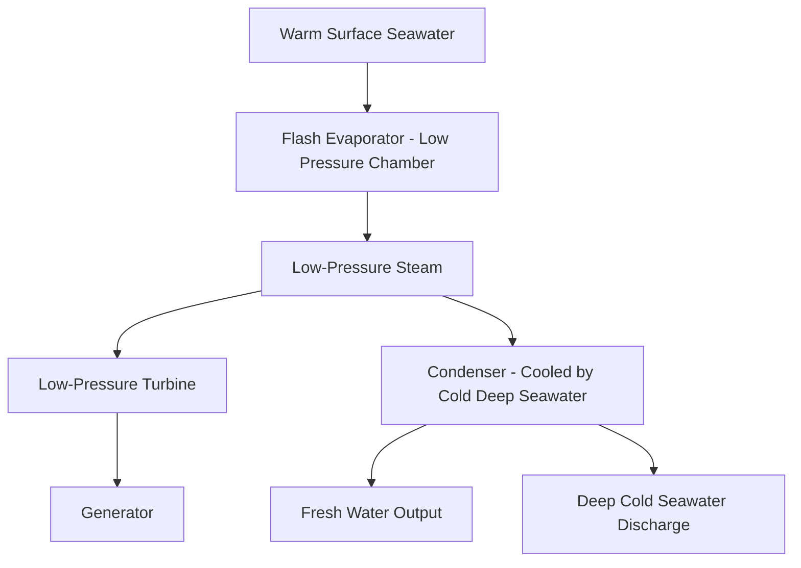
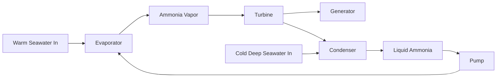

## Ocean Thermal Energy Conversion

### Overview

Ocean Thermal Energy Conversion (OTEC) generates electricity by exploiting the natural temperature difference between warm surface seawater and cold deep seawater in tropical and subtropical oceans. This temperature differential drives a thermodynamic heat engine cycle, analogous in principle to any low-temperature-differential power cycle. OTEC is unique among ocean energy technologies in operating on a continuous thermodynamic (thermal) principle rather than direct mechanical wave/current/tidal motion, and is generally more relevant to power engineering and thermodynamics curricula due to its direct basis in heat engine cycle analysis.

### Thermodynamic Basis

OTEC exploits the temperature difference $\Delta T$ between warm surface water (typically 25–29°C in favorable tropical locations) and cold deep water drawn from depths of roughly 800–1000 m (typically around 4–6°C). This is a fundamentally low-grade heat source with a small temperature differential (commonly cited as needing at least approximately 20°C differential for viable operation) [Inference: the specific minimum viable temperature differential depends on plant design, cycle efficiency targets, and economic assumptions].

The theoretical maximum (Carnot) efficiency for a heat engine operating between these temperatures is:

$$\eta_{Carnot} = 1 - \frac{T_C}{T_H}$$

where $T_H$ and $T_C$ are the absolute (Kelvin) temperatures of the warm and cold reservoirs respectively. For $T_H = 300\ \text{K}$ (27°C) and $T_C = 278\ \text{K}$ (5°C):

$$\eta_{Carnot} = 1 - \frac{278}{300} \approx 0.073 \text{ or } 7.3\%$$

This inherently low Carnot efficiency ceiling — a direct consequence of the small absolute temperature difference relative to the high absolute temperature base — means actual achievable cycle efficiencies are considerably lower still (a few percent) once real-cycle irreversibilities, pump/turbine losses, and parasitic loads for seawater pumping are accounted for. This low net efficiency is OTEC's defining thermodynamic constraint, distinguishing it from higher-temperature-differential thermal power cycles.

### OTEC Cycle Types

#### Open-Cycle OTEC

- Warm seawater is flash-evaporated in a low-pressure chamber, producing low-pressure steam directly from seawater itself (since lowering pressure sufficiently allows water to boil even at ambient warm-seawater temperature)
- Steam drives a low-pressure turbine, then is condensed using cold deep seawater
- A key advantage: the condensed steam is desalinated fresh water, since the flash-evaporation process leaves salts behind — enabling combined electricity and freshwater production
- Requires very large-diameter, low-pressure turbines due to the low steam density and pressure involved, presenting significant engineering scale challenges

#### Closed-Cycle OTEC

- Uses a working fluid with a low boiling point (commonly ammonia, or other refrigerants) in a sealed Rankine-type cycle, analogous in structure to an Organic Rankine Cycle (ORC) used in other low-grade heat recovery applications
- Warm seawater vaporizes the working fluid in an evaporator (heat exchanger); vapor drives a conventional turbine; cold deep seawater condenses the vapor back to liquid in a condenser; a pump returns the liquid to the evaporator, closing the cycle
- Higher power density than open-cycle due to higher working fluid pressures, allowing more compact turbine and heat exchanger equipment, but requires efficient heat exchangers to transfer heat between seawater and working fluid across the small temperature differential

#### Hybrid Cycle

- Combines open and closed-cycle elements: warm seawater is flash-evaporated (as in open-cycle) to produce steam, but that steam is then used to vaporize a closed-cycle working fluid (rather than directly driving a turbine), which then drives a conventional closed-cycle turbine
- Aims to capture both the freshwater co-production benefit of open-cycle and the compact turbine advantage of closed-cycle operation

### Key System Components

#### Cold Water Pipe (CWP)

- Large-diameter pipe (potentially several meters in diameter and up to roughly 1 km in length) extending from the surface platform down to the cold-water intake depth
- Represents one of the most significant engineering and cost challenges in OTEC plant design, given the combination of large diameter, substantial length, and the need to withstand ocean currents, wave-induced platform motion, and thermal/mechanical stress at the pipe-platform interface [Inference: specific CWP engineering challenges and cost proportion vary by plant scale and site conditions]
- Pipe material selection (commonly high-density polyethylene, HDPE, or fiberglass-reinforced composites) and mounting/suspension design must accommodate platform motion without inducing excessive fatigue stress at the connection point

#### Heat Exchangers (Closed-Cycle)

- Evaporator and condenser heat exchangers must transfer substantial heat flow across a very small temperature differential, requiring large heat transfer surface area
- Biofouling of heat exchanger surfaces from seawater organisms is a significant operational concern, progressively degrading heat transfer performance and requiring periodic cleaning or antifouling treatment

#### Working Fluid Loop (Closed-Cycle)

- Ammonia is the most commonly referenced working fluid due to favorable thermodynamic properties at the relevant temperature range, though other refrigerants have also been studied [Inference: specific working fluid selection involves trade-offs between thermodynamic performance, safety/toxicity handling requirements, and environmental considerations that are plant- and design-specific]

#### Platform

- OTEC plants can be land-based (onshore, drawing warm surface water and piping cold water from an offshore point), shelf-based (mounted on a platform anchored to the continental shelf near shore), or floating (moored offshore in deep water, closer to the ideal cold-water resource but requiring more complex platform and mooring engineering plus subsea power export cabling)

### Site Requirements

- Requires access to both warm surface water and cold deep water in relatively close geographic proximity, favoring tropical/subtropical locations where the seabed drops steeply close to shore (reducing the required cold water pipe length for a given depth)
- Most favorable sites are located between roughly 20°N and 20°S latitude, where consistent year-round warm surface temperatures and access to cold deep water are found [Inference: exact favorable latitude band and specific site viability depend on detailed local bathymetry and oceanographic data]

### Co-Product Applications

- **Desalinated water** (open/hybrid cycle): A valuable co-product particularly relevant to water-scarce island and coastal communities
- **Deep-water cooling**: The cold deep seawater discharge, after passing through the OTEC cycle, can be used for district cooling or air conditioning applications (sometimes called Seawater Air Conditioning, SWAC) as a secondary use of the pumped cold water resource
- **Aquaculture and nutrient-rich water applications**: Deep seawater is nutrient-rich, and some concepts explore using OTEC-pumped deep water to support mariculture operations

### Economic and Technical Challenges

- The large parasitic power load required to pump both warm and cold seawater at high volumetric flow rates (necessary given the low $\Delta T$ and correspondingly low per-unit-mass energy extraction) significantly reduces net plant output relative to gross cycle output [Inference: exact parasitic load fraction is plant-design-specific but is consistently cited as a major factor limiting OTEC net efficiency]
- High capital cost, particularly associated with the cold water pipe and heat exchanger systems, has historically limited OTEC to demonstration and pilot-scale deployment rather than widespread commercial deployment [Unverified: commercial deployment scale and cost trajectory continue to evolve and are not settled at the time of writing]
- Baseload-like output characteristic (since ocean thermal stratification is relatively stable and continuous, unlike wind/wave/solar) is frequently cited as a key potential advantage of OTEC relative to other renewable ocean energy sources, differentiating its potential grid role from variable renewables

### Comparison with Other Ocean Energy Technologies

| Characteristic | OTEC | Tidal | Wave |
| --- | --- | --- | --- |
| Underlying principle | Thermodynamic (heat engine) | Gravitational/kinetic | Wind-driven kinetic |
| Output profile | Continuous/baseload-like | Cyclical (predictable) | Variable (weather-driven) |
| Geographic constraint | Tropical/subtropical, deep water access | Specific tidal range/current sites | Exposed, high-energy coastlines |
| Key engineering challenge | Cold water pipe, low-ΔT heat exchange | Turbine/foundation design | Survivability, PTO diversity |

### Example: Working Fluid Cycle Efficiency Illustration

For a closed-cycle OTEC plant with warm water inlet at 26°C (299 K) and cold water inlet at 6°C (279 K), the Carnot limit is:

$$\eta_{Carnot} = 1 - \frac{279}{299} \approx 0.0669 \text{ or } 6.7\%$$

If the actual closed Rankine-type cycle achieves a second-law (exergetic) efficiency of roughly 30% relative to this Carnot limit [Inference: this second-law efficiency figure is illustrative; actual achieved second-law efficiencies vary by specific plant design and are an active area of engineering optimization], the approximate net thermal efficiency would be:

$$\eta_{actual} \approx 0.30 \times 0.0669 \approx 0.020 \text{ or about } 2\%$$

This illustrates concretely why OTEC plants require very large seawater flow rates per unit of net electrical output compared to conventional higher-temperature-differential thermal power plants, directly motivating the emphasis on minimizing parasitic pumping loads in OTEC system design.

### Diagram: Closed-Cycle OTEC System Schematic (svg_diagram)

<svg xmlns="http://www.w3.org/2000/svg" viewBox="0 0 850 420">
\<style\>
.box { fill: #eaf2f0; stroke: #1e5c4a; stroke-width: 1.5; }
.warm { fill: #f2c9a0; }
.cold { fill: #a8d0e6; }
.lbl { font-family: sans-serif; font-size: 13px; fill: #1a1a1a; }
.title { font-family: sans-serif; font-size: 16px; font-weight: bold; fill: #1a1a1a; }
.pipe { stroke: #1e5c4a; stroke-width: 3; fill: none; }
\</style\>
<text x="260" y="25" class="title">Closed-Cycle OTEC Schematic (svg_diagram)</text>
<rect x="50" y="180" width="120" height="60" class="warm" />
<text x="110" y="215" class="lbl" text-anchor="middle">Warm Surface</text>
<text x="110" y="230" class="lbl" text-anchor="middle">Seawater ~27°C</text>
<path d="M170,210 L250,210" class="pipe" />
<rect x="250" y="180" width="100" height="60" class="box" />
<text x="300" y="205" class="lbl" text-anchor="middle">Evaporator</text>
<text x="300" y="222" class="lbl" text-anchor="middle">(NH3 vaporizes)</text>
<path d="M350,195 L430,150" class="pipe" />
<rect x="430" y="120" width="90" height="50" fill="#c47a2a" stroke="#1e5c4a" />
<text x="475" y="150" class="lbl" text-anchor="middle">Turbine</text>
<path d="M520,145 L580,145" class="pipe" />
<rect x="580" y="120" width="80" height="50" class="box" />
<text x="620" y="150" class="lbl" text-anchor="middle">Generator</text>
<path d="M475,170 L475,260" class="pipe" />
<rect x="425" y="260" width="100" height="60" class="box" />
<text x="475" y="285" class="lbl" text-anchor="middle">Condenser</text>
<text x="475" y="302" class="lbl" text-anchor="middle">(NH3 liquefies)</text>
<path d="M600,290 L700,290" class="pipe" />
<rect x="700" y="260" width="120" height="60" class="cold" />
<text x="760" y="285" class="lbl" text-anchor="middle">Cold Deep</text>
<text x="760" y="300" class="lbl" text-anchor="middle">Seawater ~5°C</text>
<path d="M425,290 L350,240" class="pipe" />
<rect x="250" y="330" width="100" height="40" class="box" />
<text x="300" y="355" class="lbl" text-anchor="middle">Pump</text>
<path d="M300,330 L300,240" class="pipe" />

<text x="475" y="400" class="lbl" text-anchor="middle">Ammonia (NH3) closed loop between evaporator and condenser</text>

</svg>

**Related Topics:**

- Rankine Cycle and Organic Rankine Cycle (ORC) Fundamentals
- Tidal Energy Conversion
- Wave Energy Conversion Technologies
- Second-Law (Exergy) Analysis of Low-Grade Heat Engines
- Desalination Technologies and Combined Power-Water Systems
- Marine Renewable Energy Grid Integration