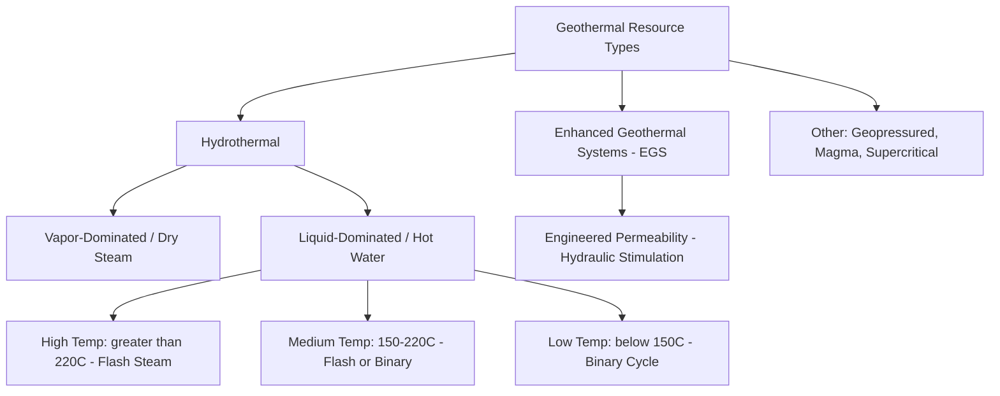

## Geothermal Resource Types and Reservoirs

### Overview

Geothermal energy exploits heat stored within the Earth's crust, originating primarily from the decay of radioactive isotopes and residual heat from planetary formation. Unlike wind, solar, and most ocean energy sources, geothermal is derived from the Earth's internal thermal energy rather than solar-driven atmospheric or oceanic processes, giving it a fundamentally different resource characteristic: continuous, largely weather-independent availability, but constrained to locations with favorable subsurface geological conditions.

### The Geothermal Gradient

Earth's temperature increases with depth at an average rate (the geothermal gradient) of approximately 25–30°C per km in typical continental crust, though this varies substantially by location [Inference: gradient values are regionally variable and depend on local crustal composition, tectonic setting, and heat flow characteristics]. In most locations, this gradient is too gradual to reach commercially useful temperatures at economically drillable depths. Economically viable geothermal resources therefore concentrate in regions with anomalously elevated heat flow — typically associated with tectonic plate boundaries, volcanic activity, or localized crustal thinning.

$$T(z) = T_0 + \frac{dT}{dz} \cdot z$$

where $T_0$ is surface temperature, $\frac{dT}{dz}$ is the local geothermal gradient, and $z$ is depth. High-grade geothermal areas exhibit gradients substantially steeper than the continental average, sometimes exceeding 100°C/km in active volcanic or rift settings.

### Classification by Resource Type

#### Hydrothermal Resources

- Naturally occurring combination of heat, permeable rock, and water (or steam) that together form a usable geothermal reservoir without requiring engineered permeability enhancement
- The most technically mature and widely exploited geothermal resource category, underlying the large majority of currently operating geothermal power plants globally [Inference: exact proportion of installed capacity attributable to hydrothermal versus other resource types shifts over time as EGS and other technologies mature]
- Subdivided by the dominant phase present in the reservoir:

##### Vapor-Dominated (Dry Steam) Systems

- Reservoir produces predominantly dry or slightly superheated steam directly at the wellhead
- Relatively rare globally but highly favorable for power generation since steam can be routed directly to a turbine with minimal processing
- Classic examples include The Geysers (California) and Larderello (Italy) [Inference: these are commonly cited reference examples; current operational status and capacity should be verified against current data if precision is required]

##### Liquid-Dominated (Hot Water) Systems

- Reservoir produces a mixture of hot liquid water and steam, or predominantly liquid water at reservoir pressure that flashes to steam as pressure drops during production
- More common globally than vapor-dominated systems
- Further subdivided by reservoir temperature, which determines the appropriate power conversion technology

#### Resource Temperature Classification

| Category | Temperature Range | Typical Conversion Technology |
| --- | --- | --- |
| High temperature | Greater than 220°C | Flash steam or dry steam |
| Medium temperature | 150–220°C | Flash steam or binary cycle |
| Low temperature | Below 150°C | Binary cycle (Organic Rankine Cycle) |

[Inference: exact temperature boundaries between categories vary somewhat across different classification schemes and are not universally standardized.]

#### Enhanced (Engineered) Geothermal Systems (EGS)

- Targets hot, dry rock formations that possess sufficient heat but lack the natural permeability or fluid content needed for a conventional hydrothermal reservoir
- Permeability is artificially created or enhanced through hydraulic stimulation (fracturing), allowing injected water to circulate through the fractured rock, absorb heat, and be produced from a second well as hot water/steam
- Significantly expands the geographic and depth range of exploitable geothermal resources beyond naturally occurring hydrothermal systems, since EGS does not depend on a pre-existing natural reservoir configuration
- Involves technical challenges including induced seismicity risk from hydraulic stimulation, achieving sufficient fracture network connectivity and longevity, and managing water losses within the fractured reservoir [Inference: the specific magnitude of induced seismicity risk and mitigation effectiveness is site-specific and an active area of ongoing research and regulatory attention]

#### Supercritical and Superhot Geothermal Resources

- Targets fluids at temperatures and pressures beyond the critical point of water (374°C, 22.1 MPa), where fluid properties (density, viscosity) differ substantially from subcritical steam or liquid water
- Potentially offers substantially higher power output per well due to the higher energy content of supercritical fluid, motivating research interest in deep drilling into these conditions, though this remains a technically demanding and less commercially mature frontier compared to conventional hydrothermal and EGS resources [Unverified: commercial viability and deployment timeline for supercritical geothermal remain under active research and are not established at the time of writing]

#### Geopressured Resources

- Deep sedimentary formations containing water at both elevated temperature and abnormally high pressure, often also containing dissolved methane
- Represents a combined resource potentially offering thermal energy, mechanical (pressure) energy, and methane fuel value, though technical and economic complexity has limited historical development relative to conventional geothermal resources [Inference: development history reflects specific historical technical/economic assessments rather than a fixed permanent conclusion about future viability]

### Reservoir Engineering Fundamentals

#### Permeability and Porosity

- Natural or engineered fracture networks and rock porosity determine how effectively fluid can circulate through the reservoir to transport heat from rock to the produced fluid
- Reservoir productivity depends on the combination of adequate permeability (allowing sufficient flow rate) and sufficient reservoir volume/heat content (allowing sustained thermal output over the plant's operating lifetime)

#### Reservoir Recharge and Sustainability

- Geothermal reservoirs can experience pressure and temperature decline over time if fluid withdrawal exceeds natural or engineered recharge
- **Reinjection**: Spent geothermal fluid (after heat extraction) is commonly reinjected into the reservoir rather than discharged at surface, serving multiple purposes: maintaining reservoir pressure, providing partial thermal recharge over time, and managing produced fluid disposal (which often contains dissolved minerals and gases)
- Reservoir management aims to balance production rate against long-term sustainability, since overproduction can lead to premature thermal decline requiring reduced output or additional well drilling [Inference: sustainable production rates are reservoir-specific and determined through detailed reservoir modeling]

#### Exploration and Resource Assessment

- Geothermal exploration integrates geological mapping, geochemical surveying (analyzing surface hot springs/fumaroles for indications of subsurface reservoir characteristics), and geophysical methods (resistivity surveys, seismic surveys) to identify and characterize prospective resources before committing to exploratory drilling
- Exploratory and confirmation well drilling represents a substantial upfront capital cost and technical risk component of geothermal project development, since subsurface reservoir characteristics cannot be fully confirmed without drilling [Inference: resource risk profile and mitigation approaches vary by project stage and are actively managed through phased exploration/drilling programs in industry practice]

### Direct Use Applications (Non-Electric)

While this topic and chapter emphasize power generation, geothermal resources — particularly lower-temperature resources unsuitable for efficient electricity generation — are also widely used directly for heat:

- District heating systems
- Greenhouse and agricultural heating
- Industrial process heat
- Aquaculture
- Ground-source (geothermal) heat pumps, which exploit the relatively stable shallow-subsurface temperature rather than deep geothermal gradients

### Example: Reservoir Temperature and Depth Estimation

For a site with surface temperature $T_0 = 20°C$ and a locally elevated geothermal gradient of 60°C/km (typical of a favorable volcanic-associated setting), the estimated temperature at 3 km depth is:

$$T(3\ \text{km}) = 20 + 60 \times 3 = 200°C$$

A reservoir at approximately 200°C would fall within the medium-temperature classification, making it a candidate for either flash steam or binary cycle power conversion depending on specific fluid chemistry and flow rate characteristics — illustrating how gradient and depth data are used in early-stage resource screening before detailed reservoir characterization.

### Diagram: Geothermal Resource Classification by Temperature and Technology (svg_diagram)

<svg xmlns="http://www.w3.org/2000/svg" viewBox="0 0 850 400">
\<style\>
.box { fill: #fbe9e0; stroke: #8a3a1e; stroke-width: 1.5; }
.lbl { font-family: sans-serif; font-size: 13px; fill: #1a1a1a; }
.title { font-family: sans-serif; font-size: 16px; font-weight: bold; fill: #1a1a1a; }
.bar { stroke: #8a3a1e; stroke-width: 2; }
\</style\>
<text x="260" y="25" class="title">Geothermal Resource Temperature Classification (svg_diagram)</text>
<line x1="100" y1="350" x2="750" y2="350" stroke="#333" stroke-width="2" />
<text x="425" y="380" class="lbl" text-anchor="middle">Reservoir Temperature (°C) - increasing left to right</text>
<rect x="100" y="290" width="200" height="60" class="box" />
<text x="200" y="320" class="lbl" text-anchor="middle">Below 150°C</text>
<text x="200" y="338" class="lbl" text-anchor="middle">Binary Cycle (ORC)</text>
<rect x="320" y="220" width="220" height="60" class="box" />
<text x="430" y="250" class="lbl" text-anchor="middle">150-220°C</text>
<text x="430" y="268" class="lbl" text-anchor="middle">Flash Steam or Binary</text>
<rect x="560" y="150" width="200" height="60" class="box" />
<text x="660" y="180" class="lbl" text-anchor="middle">Greater than 220°C</text>
<text x="660" y="198" class="lbl" text-anchor="middle">Flash or Dry Steam</text>
<line x1="200" y1="290" x2="200" y2="350" class="bar" />
<line x1="430" y1="220" x2="430" y2="350" class="bar" />
<line x1="660" y1="150" x2="660" y2="350" class="bar" />

<text x="430" y="90" class="lbl" text-anchor="middle">Higher temperature generally correlates with</text>

<text x="430" y="108" class="lbl" text-anchor="middle">higher conversion efficiency and simpler plant design</text>

</svg>

**Related Topics:**

- Geothermal Power Plant Cycles: Dry Steam, Flash, and Binary Systems
- Enhanced Geothermal Systems (EGS) Engineering and Induced Seismicity
- Organic Rankine Cycle Fundamentals
- Ground-Source Heat Pump Systems
- Ocean Thermal Energy Conversion (thermodynamic cycle parallels)
- Geothermal Well Drilling and Completion Engineering