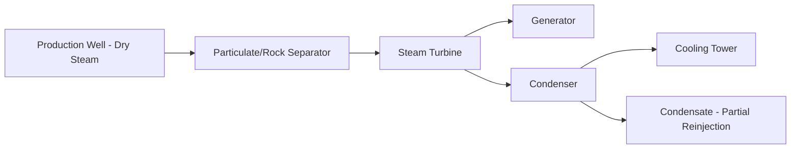
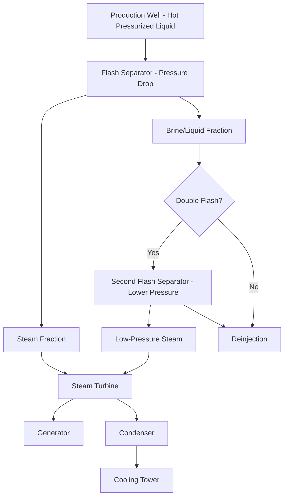
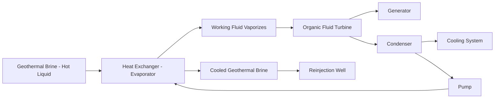

## Dry-Steam, Flash, and Binary Geothermal Power Plants

### Overview

Geothermal power plants convert the thermal energy of geothermal fluid into electricity using one of three principal cycle configurations, selected primarily based on reservoir fluid temperature and phase (steam vs. liquid): **dry-steam** plants, **flash steam** plants (single or multiple flash), and **binary cycle** plants. Each configuration represents a different engineering approach to extracting maximum useful work from geothermal fluid while managing the practical challenges of mineral-laden, sometimes corrosive geothermal fluids.

### Dry-Steam Power Plants

#### Operating Principle

Dry-steam plants are the simplest and oldest geothermal power plant configuration, applicable only to the relatively rare vapor-dominated reservoirs that naturally produce dry or slightly superheated steam directly at the wellhead.

- Steam is passed through a rock/particulate separator to remove solid debris before entering the turbine, protecting turbine blades from erosion
- Steam drives a conventional steam turbine directly, without the flashing process required in liquid-dominated systems
- Condensate from the turbine exhaust is typically cooled via a cooling tower, with a portion often reinjected into the reservoir
- Represents the simplest geothermal cycle from a process standpoint, but is geographically limited since vapor-dominated reservoirs are uncommon globally [Inference: prevalence of vapor-dominated systems relative to global geothermal capacity is a well-established but time-varying figure]

#### Key Design Considerations

- Non-condensable gases (commonly CO2 and hydrogen sulfide, H2S) are frequently present in geothermal steam and must be removed from the condenser via gas ejectors or vacuum pumps to maintain condenser vacuum and turbine backpressure performance
- H2S abatement systems are often required for environmental/regulatory compliance given the gas's characteristic odor and toxicity at higher concentrations

### Flash Steam Power Plants

#### Operating Principle

Flash steam plants are used for liquid-dominated (hot water) reservoirs at high-to-medium temperatures. As high-pressure, high-temperature geothermal liquid rises from the reservoir toward the surface (where pressure is lower), a portion of it spontaneously vaporizes ("flashes") into steam. This flashed steam is separated from the remaining liquid and used to drive a turbine.

#### Single Flash

- Geothermal liquid enters a single flash separator vessel where a pressure drop causes a fraction of the liquid to flash into steam
- Separated steam drives the turbine; remaining liquid (brine) is typically reinjected into the reservoir
- Simpler and lower-cost than double flash, but extracts less of the fluid's available energy since only a single-stage pressure/temperature drop is utilized

#### Double (or Multiple) Flash

- Remaining brine from the first flash separator is directed to a second flash separator operating at lower pressure, producing additional lower-pressure steam that is fed into a lower-pressure stage of the turbine (or a separate low-pressure turbine)
- Extracts additional useful energy from the same geothermal fluid flow compared to single flash, improving overall plant power output and thermal efficiency, at the cost of increased plant complexity (additional separator vessel, low-pressure steam piping, and typically a dual-admission or multi-stage turbine)
- The energy gain from adding additional flash stages exhibits diminishing returns, so most commercial designs use single or double flash rather than higher-order multi-flash configurations [Inference: this reflects a general engineering trade-off pattern; the specific economic optimum flash stage count depends on reservoir fluid properties and plant economics]

#### Scaling and Fluid Chemistry Challenges

- Geothermal brine often contains dissolved minerals (silica, calcium carbonate, and others) that can precipitate and form scale deposits on separator, piping, and heat exchanger surfaces as temperature and pressure drop, requiring periodic mechanical cleaning or chemical inhibition treatment
- Corrosive or highly mineralized brine chemistry can significantly influence material selection for wellbore casing, piping, and separator vessels

### Binary Cycle Power Plants

#### Operating Principle

Binary cycle plants are used for lower-temperature geothermal resources (roughly below 150–180°C) that lack sufficient enthalpy for efficient direct flash steam generation, or are selected even at moderate temperatures where minimizing fluid loss/emissions is prioritized. The geothermal fluid never contacts the turbine directly; instead, it transfers heat via a heat exchanger to a secondary ("binary") working fluid with a lower boiling point, which drives the turbine in a closed loop.

- The working fluid loop operates on an **Organic Rankine Cycle (ORC)** principle, using organic fluids (e.g., isobutane, isopentane, or various refrigerants) or, in some designs, ammonia-water mixtures (Kalina cycle) selected for favorable boiling characteristics at the relevant temperature range
- Since the geothermal fluid remains in a closed loop from wellbore to reinjection well (never flashing to atmosphere or contacting the turbine), binary plants effectively eliminate direct emissions of non-condensable gases and minimize water loss, and are well suited to fluids with problematic scaling chemistry since the fluid can be kept at pressure without flashing

#### Kalina Cycle Variant

- Uses a variable-composition ammonia-water mixture as the working fluid instead of a pure organic compound
- The changing boiling point of the ammonia-water mixture during phase change (unlike a pure-component fluid, which boils at constant temperature at fixed pressure) allows better thermal matching to the geothermal fluid's temperature glide during heat exchange, improving overall cycle thermodynamic efficiency compared to a standard ORC operating between the same temperature limits [Inference: the magnitude of efficiency improvement is design- and application-specific and depends on the actual temperature glide characteristics of the heat source]
- Adds mixture-composition control complexity relative to standard single-component ORC systems

#### Working Fluid Selection Considerations

- Fluid critical temperature and pressure must be compatible with the available geothermal resource temperature to achieve efficient heat exchange without excessive irreversibility
- Environmental and safety properties (flammability for hydrocarbon-based organic fluids, ozone depletion/global warming potential for some refrigerants) factor into fluid selection alongside pure thermodynamic performance
- Binary plants are the standard technology choice for the majority of new lower-temperature geothermal resource development, given their applicability across a broader temperature range than flash technology and their reduced environmental fluid-handling requirements [Inference: this represents current general industry practice, and technology selection remains resource- and project-specific]

### Comparative Summary

| Plant Type | Reservoir Requirement | Turbine Fluid | Emissions/Fluid Loss | Complexity |
| --- | --- | --- | --- | --- |
| Dry steam | Vapor-dominated | Natural geothermal steam | Some NCG emissions | Lowest |
| Single flash | High-temp liquid-dominated | Flashed geothermal steam | Some NCG emissions, brine reinjection | Moderate |
| Double flash | High-temp liquid-dominated | Flashed geothermal steam (2 stages) | Some NCG emissions | Higher |
| Binary (ORC/Kalina) | Low-to-medium temp, any chemistry | Secondary organic/ammonia-water fluid | Minimal (closed loop) | Higher (heat exchangers, secondary loop) |

### Efficiency and Output Considerations

- Geothermal plant thermal efficiency is fundamentally constrained by the relatively low resource temperature compared to fossil fuel or nuclear thermal plants, following the same Carnot-limit logic discussed for OTEC, though geothermal resource temperatures (often 150–300°C+) are considerably higher than OTEC's ocean-derived temperature differential, yielding correspondingly higher practical conversion efficiencies than OTEC
- Net plant output must account for parasitic loads including production/injection well pumping (where reservoir pressure is insufficient for natural flow), cooling system fans/pumps, and non-condensable gas removal system power consumption

### Example: Flash Fraction Estimation

For geothermal liquid entering a flash separator at 200°C (with liquid enthalpy at saturation of approximately 852 kJ/kg) and flashing to a lower pressure corresponding to a saturation temperature of 150°C (with saturated liquid enthalpy of approximately 632 kJ/kg and latent heat of vaporization of approximately 2114 kJ/kg at that pressure), the flash fraction $x$ can be estimated via an energy balance:

$$x = \frac{h_{in} - h_{f,out}}{h_{fg,out}}$$

$$x = \frac{852 - 632}{2114} \approx 0.104 \text{ or about } 10.4\%$$

This illustrates that only a modest fraction of the total geothermal fluid mass flow actually converts to usable steam in a single flash stage, with the majority remaining as liquid brine — the basis for the double-flash approach of recovering additional steam from this remaining brine fraction at a further reduced pressure. [Inference: this is an illustrative calculation using representative steam table values; exact enthalpy values depend on precise pressure/temperature conditions and should be obtained from steam tables for engineering design purposes.]

### Diagram: Geothermal Plant Type Selection Logic (svg_diagram)

<svg xmlns="http://www.w3.org/2000/svg" viewBox="0 0 850 380">
\<style\>
.box { fill: #fdeee0; stroke: #8a3a1e; stroke-width: 1.5; }
.lbl { font-family: sans-serif; font-size: 13px; fill: #1a1a1a; }
.title { font-family: sans-serif; font-size: 16px; font-weight: bold; fill: #1a1a1a; }
.flow { stroke: #8a3a1e; stroke-width: 2; fill: none; marker-end: url(#arrg); }
\</style\>
<text x="260" y="25" class="title">Geothermal Plant Type Selection (svg_diagram)</text>
<rect x="340" y="40" width="180" height="45" class="box" />
<text x="430" y="67" class="lbl" text-anchor="middle">Reservoir Fluid Phase</text>
<path d="M400,85 L200,140" class="flow" />
<path d="M460,85 L660,140" class="flow" />
<rect x="100" y="140" width="200" height="45" class="box" />
<text x="200" y="167" class="lbl" text-anchor="middle">Vapor-Dominated: Dry Steam</text>
<rect x="560" y="140" width="200" height="45" class="box" />
<text x="660" y="167" class="lbl" text-anchor="middle">Liquid-Dominated</text>
<path d="M620,185 L500,240" class="flow" />
<path d="M700,185 L750,240" class="flow" />
<rect x="380" y="240" width="180" height="45" class="box" />
<text x="470" y="267" class="lbl" text-anchor="middle">Greater than 150-180°C: Flash</text>
<rect x="640" y="240" width="180" height="45" class="box" />
<text x="730" y="267" class="lbl" text-anchor="middle">Below 150-180°C: Binary</text>

<text x="430" y="330" class="lbl" text-anchor="middle">Binary can also be used at higher temperatures</text>

<text x="430" y="348" class="lbl" text-anchor="middle">to minimize emissions or manage scaling-prone fluid chemistry</text>

</svg>

**Related Topics:**

- Geothermal Resource Types and Reservoirs
- Organic Rankine Cycle and Kalina Cycle Thermodynamics
- Geothermal Well Drilling and Completion Engineering
- Non-Condensable Gas Management and H2S Abatement
- Ocean Thermal Energy Conversion (comparative cycle analysis)
- Biomass Power Generation Technologies