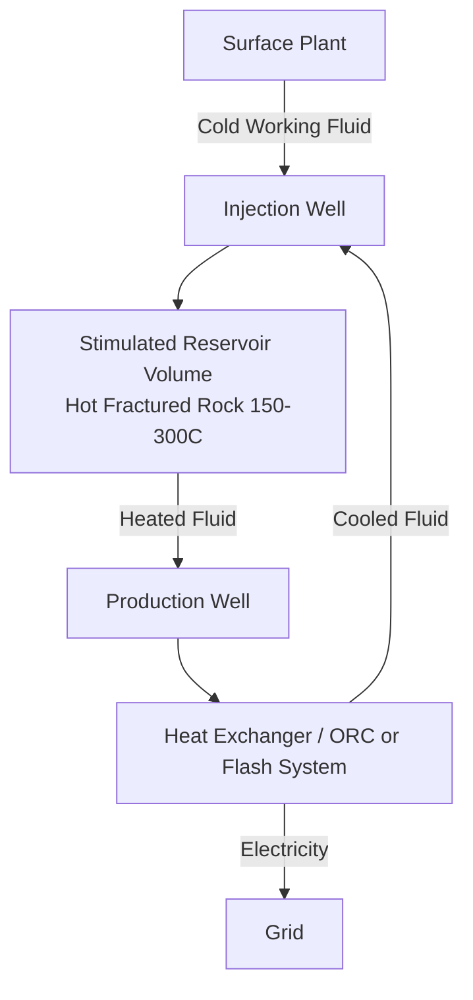

## Enhanced Geothermal Systems

### Overview

Enhanced Geothermal Systems (EGS) are engineered reservoirs created in hot rock formations that lack the natural permeability, fluid content, or porosity needed for conventional hydrothermal power generation. Where conventional geothermal plants rely on naturally occurring combinations of heat, permeability, and water, EGS artificially creates or enhances one or more of these elements—typically permeability—to extract heat from otherwise unproductive hot dry rock (HDR) formations. This allows geothermal power generation in regions without natural hydrothermal resources, vastly expanding the geographic and technical potential of geothermal energy.

### Fundamental Concept

The core principle is straightforward thermodynamically: subsurface rock temperature increases with depth according to the geothermal gradient, typically around 25–30 °C/km in normal continental crust, though this varies significantly by tectonic setting. At sufficient depth (commonly 3–10 km), rock temperatures reach 150–300 °C, sufficient for electricity generation, but the rock is often crystalline (granite, gneiss) and has low intrinsic permeability, meaning water cannot flow through it to extract heat efficiently.

EGS addresses this by:

1. Drilling into hot rock at depth
2. Creating or enhancing a fracture network to increase permeability
3. Circulating a working fluid (typically water) through the fracture network to absorb heat
4. Extracting the heated fluid via a production well
5. Using the thermal energy to generate electricity, then reinjecting the cooled fluid

### System Architecture

**Well Configuration**

A typical EGS installation uses a doublet or multi-well configuration:

- **Injection well(s):** Pump working fluid down into the stimulated rock volume
- **Production well(s):** Extract heated fluid back to the surface
- **Stimulated Reservoir Volume (SRV):** The engineered fracture network connecting injection and production wells at depth

**Reservoir Stimulation Methods**

- **Hydraulic stimulation:** High-pressure fluid injection to open, extend, and connect pre-existing microfractures (distinct from oil/gas hydraulic fracturing in that it primarily reopens existing joints rather than creating new fracture planes through intact rock, and uses no proppants or chemical additives in most implementations)
- **Hydro-shearing:** Lower-pressure injection that induces shear slip along natural fracture planes, creating permanent, self-propping permeability enhancement because shear displacement causes fracture surface asperities to mismatch upon closure
- **Thermal stimulation:** Circulating cool fluid through hot rock induces thermal contraction stresses that can open microfractures
- **Chemical stimulation:** Acid or chelating agent injection to dissolve mineral deposits and enhance near-wellbore permeability

### Thermodynamic Basis

The extractable thermal power from an EGS reservoir can be approximated by:

$$\dot{Q} = \dot{m} \, c_p \, (T_{production} - T_{injection})$$

Where $\dot{m}$ is the mass flow rate of the working fluid, $c_p$ is the specific heat capacity of the fluid, and $T_{production} - T_{injection}$ is the temperature differential achieved across the reservoir.

Electrical conversion efficiency depends on the resource temperature and the conversion technology:

- **Binary/Organic Rankine Cycle (ORC) plants:** Used for lower-temperature resources (100–180 °C), employing a secondary working fluid with a lower boiling point than water
- **Flash steam systems:** Used for higher-temperature resources (>180 °C) where fluid is flashed to steam to drive a turbine directly

The theoretical maximum (Carnot) efficiency is bounded by:

$$\eta_{Carnot} = 1 - \frac{T_{sink}}{T_{source}}$$

with temperatures in Kelvin. In practice, actual EGS binary cycle efficiencies range roughly from 10–15% due to irreversibilities, pump/pumping parasitic loads, and heat exchanger pinch-point limitations—well below Carnot due to the moderate resource temperatures relative to typical heat sink temperatures.

### Key Engineering Challenges

**Induced Seismicity**

Hydraulic stimulation injects fluid at pressures that can trigger microseismic events, and in some cases felt seismic events. Notable examples include the Basel, Switzerland EGS project (2006), which was suspended following a magnitude 3.4 event, and the Pohang, South Korea project, linked to a magnitude 5.5 earthquake in 2017. [Inference: the causal link at Pohang, while supported by multiple scientific investigations, involves site-specific fault interactions that are not fully generalizable to all EGS sites.] Modern projects mitigate this through traffic-light protocols, real-time microseismic monitoring, and adaptive injection rate control.

**Short-Circuiting / Thermal Breakthrough**

If the fracture network creates a low-resistance pathway between injection and production wells, cold injected fluid can "break through" prematurely, causing a rapid decline in production temperature and shortening the economically useful reservoir lifetime. Reservoir engineering aims to maximize flow path length and heat exchange surface area to delay breakthrough.

**Water Loss**

A fraction of injected fluid is typically lost to the surrounding rock mass rather than returning to the production well, requiring continuous water makeup, which can be a constraint in arid regions.

**Drilling Costs**

Drilling into deep, hard crystalline rock is the dominant capital cost of EGS projects, often 40–60% of total project cost. Conventional oil and gas drilling techniques are less efficient in hard rock, driving interest in advanced drilling methods.

### Emerging Technologies and Approaches

**Closed-Loop EGS (Advanced Geothermal Systems, AGS)**

Rather than circulating fluid through an open fracture network, AGS designs (such as those pursued by companies like Eavor) use sealed underground pipe loops (often multilateral horizontal wells connected at depth) so the working fluid never contacts the rock directly, relying on thermosiphon (density-driven) circulation rather than pumps. This eliminates water loss and induced seismicity risk from fluid injection into fractures, at the cost of relying purely on rock thermal conductivity (rather than convective fluid flow through fractures) for heat transfer, which is a comparatively slower mechanism.

**Superhot Rock / Supercritical Geothermal**

Research efforts target drilling to depths where rock exceeds 374 °C and water reaches supercritical conditions, where enthalpy per unit mass is dramatically higher, potentially enabling far greater power output per well. [Speculation: commercial viability depends on unresolved drilling material and well-integrity challenges at these temperatures and pressures, and timelines remain uncertain.]

**Advanced Drilling Techniques**

- **Millimeter-wave/plasma drilling:** Non-mechanical rock destruction methods (e.g., Quaise Energy's approach) aimed at reducing hard-rock drilling costs and reaching greater depths than conventional rotary drilling
- **Percussive and hybrid drilling:** Combining rotary and percussive mechanisms to improve rate of penetration in crystalline formations

**Multi-Zonal/Distributed EGS**

Using multiple lateral wells with distributed stimulation zones to increase the effective heat exchange area without proportionally increasing surface footprint.

### Comparison: Conventional Hydrothermal vs. EGS

| Characteristic | Conventional Hydrothermal | EGS |
| --- | --- | --- |
| Natural permeability | Sufficient | Insufficient (engineered) |
| Natural fluid | Present | Often absent (injected) |
| Depth | Typically 1–3 km | Typically 3–10+ km |
| Geographic applicability | Limited to specific geologic zones | Broadly applicable |
| Development cost | Lower | Higher (drilling-dominated) |
| Induced seismicity risk | Low | Moderate, requires monitoring |

### Worked Example

**Given:** An EGS doublet circulates water at $\dot{m} = 80\ \text{kg/s}$, with production temperature $T_p = 180°C$ and injection temperature $T_i = 70°C$. Specific heat capacity of water $c_p \approx 4.2\ \text{kJ/kg·K}$.

**Thermal power extracted:**

$$\dot{Q} = \dot{m} \, c_p \, \Delta T = 80 \times 4.2 \times (180 - 70) = 36{,}960\ \text{kW} \approx 37\ \text{MW}_{th}$$

**Electrical output (assuming a representative 12% binary cycle conversion efficiency):**

$$\dot{W}_{elec} = 0.12 \times 37\ \text{MW} \approx 4.4\ \text{MW}_e$$

This illustrates the characteristic low conversion efficiency of moderate-temperature binary geothermal systems relative to the large thermal energy extracted, and explains why EGS economics depend heavily on achieving high flow rates and sustained temperature differentials over the reservoir's operating lifetime.

### Illustrative Reservoir Schematic (svg_diagram)

<svg xmlns="http://www.w3.org/2000/svg" viewBox="0 0 640 420" font-family="sans-serif">
<text x="320" y="24" font-size="16" text-anchor="middle" fill="#222">EGS Reservoir Cross-Section (svg_diagram)</text>
<rect x="20" y="40" width="600" height="360" fill="#f4ede1" stroke="#333" stroke-width="1" />
<rect x="20" y="40" width="600" height="100" fill="#d9c9a3" />
<text x="30" y="60" font-size="11" fill="#333">Surface / Near-surface (low temp)</text>
<rect x="20" y="140" width="600" height="120" fill="#c69a6d" />
<text x="30" y="160" font-size="11" fill="#333">Intermediate crust</text>
<rect x="20" y="260" width="600" height="140" fill="#a85c32" />
<text x="30" y="280" font-size="11" fill="#fff">Crystalline hot rock (150-300C)</text>
<line x1="150" y1="45" x2="150" y2="330" stroke="#2255aa" stroke-width="6" />
<text x="100" y="40" font-size="11" fill="#2255aa">Injection Well</text>
<line x1="450" y1="45" x2="450" y2="330" stroke="#aa2222" stroke-width="6" />
<text x="420" y="40" font-size="11" fill="#aa2222">Production Well</text>
<path d="M150,330 C200,360 250,300 300,340 C350,380 400,300 450,330" stroke="#555" stroke-width="3" fill="none" stroke-dasharray="4,3" />
<path d="M150,310 C220,340 260,290 330,320 C380,345 410,290 450,310" stroke="#555" stroke-width="2" fill="none" stroke-dasharray="4,3" />
<text x="230" y="400" font-size="11" fill="#333">Stimulated Reservoir Volume (fracture network)</text>
</svg>

**Related Topics**

- Hot Dry Rock (HDR) geothermal historical development (Fenton Hill Project)
- Organic Rankine Cycle (ORC) thermodynamic design
- Microseismic monitoring and traffic-light protocols
- Closed-loop/Advanced Geothermal Systems (AGS) engineering
- Supercritical geothermal fluid properties
- Geothermal well drilling economics and cost modeling
- Reservoir heat transfer modeling (fracture-flow vs. conduction-dominated)
- Comparison with petrothermal vs. hydrothermal resource classification