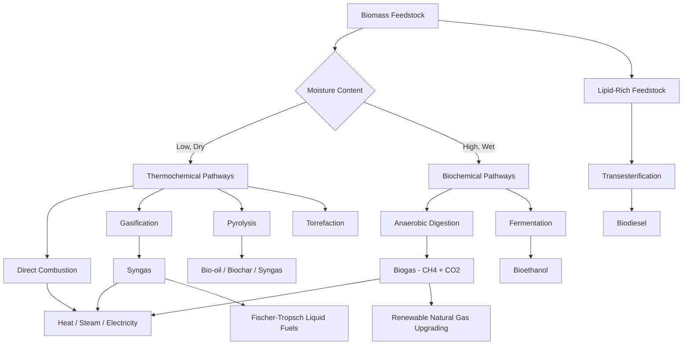

## Biomass Feedstocks and Conversion Pathways

### Overview

Biomass energy conversion encompasses the transformation of organic material—derived from plants, agricultural residues, forestry byproducts, algae, and organic waste streams—into usable heat, electricity, or fuels. Unlike geothermal energy, biomass is a chemically stored form of solar energy captured via photosynthesis, making its conversion pathways fundamentally thermochemical, biochemical, or physicochemical in nature rather than purely thermodynamic extraction processes. The selection of a conversion pathway depends heavily on feedstock moisture content, composition, and desired end product.

### Feedstock Classification

**By Source**

- **Virgin biomass:** Purpose-grown energy crops (switchgrass, miscanthus, short-rotation woody crops like willow and poplar)
- **Agricultural residues:** Crop residues (corn stover, wheat straw, rice husks, bagasse)
- **Forestry residues:** Logging slash, sawmill byproducts, wood chips, bark
- **Municipal solid waste (MSW):** Organic fraction of household and commercial waste
- **Animal waste:** Manure, poultry litter
- **Algal biomass:** Micro- and macroalgae, notable for high lipid content and non-competition with arable land
- **Industrial/food processing residues:** Fats, oils, greases (FOG), spent grains, molasses

**By Composition (relevant to conversion pathway selection)**

| Category | Key Constituents | Preferred Pathway |
| --- | --- | --- |
| Lignocellulosic (dry) | Cellulose, hemicellulose, lignin | Thermochemical (combustion, gasification, pyrolysis) |
| Wet/high-moisture | High water content, low lignin | Biochemical (anaerobic digestion, fermentation) |
| Lipid-rich | Triglycerides, fatty acids | Transesterification (biodiesel) |
| Sugar/starch-rich | Simple sugars, starch | Fermentation (bioethanol) |

**Moisture Content Threshold**

A commonly cited rule of thumb is that feedstocks with moisture content above roughly 50% (wet basis) are generally better suited to biochemical conversion pathways, since drying wet biomass sufficiently for efficient thermochemical conversion incurs a significant energy penalty. [Inference: exact thresholds vary by specific feedstock and reactor design, and this is a general engineering heuristic rather than a fixed physical law.]

### Conversion Pathway Taxonomy

### Thermochemical Conversion Pathways

**1. Direct Combustion**

The oxidation of biomass in excess air to produce heat, typically used to raise steam for a Rankine cycle in biomass power plants. The overall reaction for a generic cellulosic feedstock approximates:

$$\text{Biomass} (C, H, O) + O_2 \rightarrow CO_2 + H_2O + \text{Heat}$$

Combustion efficiency is governed by feedstock heating value, moisture content, and combustion technology (fixed-bed grate, fluidized bed, or pulverized/suspension firing). The higher heating value (HHV) of typical dry woody biomass is approximately 18–20 MJ/kg, notably lower than coal (24–35 MJ/kg) due to biomass's higher oxygen content and lower carbon fraction.

**2. Gasification**

Partial oxidation of biomass at high temperature (700–1000 °C) with a controlled, substoichiometric oxygen (or steam/air) supply, converting solid biomass into a combustible gas mixture called syngas (or producer gas), primarily composed of CO, H₂, CH₄, CO₂, and N₂ (if air-blown).

$$C_nH_mO_p + \text{(limited O}_2\text{ or steam)} \rightarrow CO + H_2 + CO_2 + CH_4 + \text{tar}$$

Syngas can be:

- Combusted directly in a gas engine or turbine for power generation
- Used as feedstock for Fischer-Tropsch synthesis to produce liquid hydrocarbon fuels
- Converted to methanol or other chemical intermediates

Gasifier types include fixed-bed (updraft, downdraft) and fluidized-bed reactors, with downdraft configurations generally producing lower tar content suitable for engine applications.

**3. Pyrolysis**

Thermal decomposition of biomass in the absence (or near-absence) of oxygen, typically at 400–600 °C, producing three co-products in ratios dependent on process conditions:

- **Bio-oil (liquid):** A complex, oxygenated, acidic liquid usable as a combustion fuel or upgraded to transportation fuels
- **Biochar (solid):** A carbon-rich solid usable as a soil amendment or solid fuel
- **Syngas (gas):** Non-condensable gases, often recycled to supply process heat

Process variants are distinguished by residence time and heating rate:

| Process Type | Temperature | Residence Time | Primary Product |
| --- | --- | --- | --- |
| Slow pyrolysis | 300–500 °C | Minutes to hours | Biochar |
| Fast pyrolysis | 400–600 °C | Seconds | Bio-oil (up to ~75% yield) |
| Flash pyrolysis | 700–1000 °C | <1 second | Bio-oil, gas |

**4. Torrefaction**

A mild pyrolysis process (200–300 °C) in an inert atmosphere that partially decomposes hemicellulose, producing a solid, hydrophobic, energy-densified product ("bio-coal") with improved grindability and storage stability, commonly used as a coal co-firing substitute.

### Biochemical Conversion Pathways

**1. Anaerobic Digestion**

A microbial process occurring in the absence of oxygen, in which complex organic matter is broken down in sequential stages by different microbial consortia:

1. **Hydrolysis:** Complex polymers (carbohydrates, proteins, lipids) broken into monomers
2. **Acidogenesis:** Monomers converted to volatile fatty acids, alcohols, CO₂, H₂
3. **Acetogenesis:** Intermediate products converted to acetate, H₂, CO₂
4. **Methanogenesis:** Methanogenic archaea convert acetate and H₂/CO₂ into methane

$$\text{Organic matter} \xrightarrow{\text{anaerobic bacteria}} CH_4 + CO_2 + \text{trace gases}$$

The resulting biogas is typically 50–70% CH₄ and 30–45% CO₂, usable directly for combined heat and power (CHP) or upgraded (via water scrubbing, pressure swing adsorption, or membrane separation) to renewable natural gas (RNG) for pipeline injection or vehicle fuel.

Key operating parameters include hydraulic retention time (HRT), organic loading rate (OLR), and mesophilic (~35 °C) versus thermophilic (~55 °C) temperature regimes, with thermophilic digestion generally offering faster kinetics but requiring more process heat input and being more sensitive to process upsets.

**2. Fermentation (Bioethanol Production)**

Sugar- or starch-based feedstocks undergo microbial (typically yeast, *Saccharomyces cerevisiae*) conversion of fermentable sugars to ethanol:

$$C_6H_{12}O_6 \xrightarrow{\text{yeast}} 2\,C_2H_5OH + 2\,CO_2$$

- **First-generation (1G) ethanol:** Uses food-based feedstocks (corn starch, sugarcane), requiring an enzymatic hydrolysis/saccharification step for starch feedstocks to first convert starch to fermentable glucose
- **Second-generation (2G) cellulosic ethanol:** Uses lignocellulosic feedstocks, requiring an additional pretreatment step (acid, steam explosion, or ammonia fiber expansion) to break down lignin and expose cellulose/hemicellulose to enzymatic hydrolysis, since lignin's recalcitrant structure otherwise resists microbial and enzymatic attack

### Transesterification (Biodiesel)

Lipid-rich feedstocks (vegetable oils, animal fats, waste cooking oil, algal lipids) react with an alcohol (typically methanol) in the presence of a catalyst (commonly NaOH or KOH) to produce fatty acid methyl esters (FAME, i.e., biodiesel) and glycerol as a co-product:

$$\text{Triglyceride} + 3\,CH_3OH \xrightarrow{\text{catalyst}} 3\,\text{FAME} + \text{Glycerol}$$

### Comparative Energy Metrics

| Pathway | Typical Feedstock | Product | Approx. Energy Conversion Efficiency |
| --- | --- | --- | --- |
| Direct combustion (Rankine) | Dry woody biomass | Electricity | 20–25% |
| Gasification + gas engine | Dry biomass | Electricity | 25–30% |
| Gasification + CHP | Dry biomass | Heat + Power | Up to 80% (combined) |
| Anaerobic digestion + CHP | Wet organic waste | Heat + Power | 35–40% (electrical) |
| Fast pyrolysis | Dry biomass | Bio-oil | 60–75% (energy yield to liquid) |

[Inference: these efficiency ranges are representative figures aggregated from typical commercial-scale installations; actual plant performance varies with feedstock quality, plant scale, and equipment vintage.]

### Worked Example

**Given:** An anaerobic digester processes 50 tonnes/day of food waste with a biogas yield of 100 m³ biogas per tonne of feedstock, at 60% CH₄ content. The lower heating value (LHV) of methane is approximately 35.8 MJ/m³.

**Daily biogas volume:**

$$V_{biogas} = 50\ \text{t/day} \times 100\ \text{m}^3/\text{t} = 5{,}000\ \text{m}^3/\text{day}$$

**Methane volume:**

$$V_{CH_4} = 5{,}000 \times 0.60 = 3{,}000\ \text{m}^3/\text{day}$$

**Energy content:**

$$E = 3{,}000\ \text{m}^3 \times 35.8\ \text{MJ/m}^3 = 107{,}400\ \text{MJ/day} \approx 29.8\ \text{MWh}_{th}/\text{day}$$

**Electrical output** (assuming a 38% electrical efficiency CHP engine):

$$W_{elec} = 0.38 \times 29.8\ \text{MWh} \approx 11.3\ \text{MWh}_e/\text{day}$$

This demonstrates how wet organic waste streams, unsuitable for combustion without extensive drying, are efficiently valorized through the biochemical anaerobic digestion pathway.

### Feedstock-to-Pathway Decision Schematic (svg_diagram)

<svg xmlns="http://www.w3.org/2000/svg" viewBox="0 0 640 360" font-family="sans-serif">
<text x="320" y="24" font-size="16" text-anchor="middle" fill="#222">Feedstock Selection Logic (svg_diagram)</text>
<rect x="260" y="40" width="120" height="40" rx="6" fill="#e8dcc3" stroke="#333" />
<text x="320" y="65" font-size="11" text-anchor="middle">Biomass Input</text>
<line x1="320" y1="80" x2="150" y2="130" stroke="#555" />
<line x1="320" y1="80" x2="320" y2="130" stroke="#555" />
<line x1="320" y1="80" x2="490" y2="130" stroke="#555" />
<rect x="70" y="130" width="160" height="40" rx="6" fill="#c69a6d" stroke="#333" />
<text x="150" y="155" font-size="11" text-anchor="middle">Dry Lignocellulosic</text>
<rect x="250" y="130" width="140" height="40" rx="6" fill="#a8c6a0" stroke="#333" />
<text x="320" y="155" font-size="11" text-anchor="middle">Wet Organic</text>
<rect x="420" y="130" width="150" height="40" rx="6" fill="#e0c68c" stroke="#333" />
<text x="495" y="155" font-size="11" text-anchor="middle">Lipid-Rich</text>
<line x1="150" y1="170" x2="150" y2="220" stroke="#555" />
<line x1="320" y1="170" x2="320" y2="220" stroke="#555" />
<line x1="495" y1="170" x2="495" y2="220" stroke="#555" />
<rect x="50" y="220" width="200" height="50" rx="6" fill="#f4ede1" stroke="#333" />
<text x="150" y="240" font-size="11" text-anchor="middle">Combustion / Gasification</text>
<text x="150" y="256" font-size="11" text-anchor="middle">/ Pyrolysis</text>
<rect x="240" y="220" width="160" height="50" rx="6" fill="#f4ede1" stroke="#333" />
<text x="320" y="240" font-size="11" text-anchor="middle">Anaerobic</text>
<text x="320" y="256" font-size="11" text-anchor="middle">Digestion</text>
<rect x="420" y="220" width="150" height="50" rx="6" fill="#f4ede1" stroke="#333" />
<text x="495" y="240" font-size="11" text-anchor="middle">Transesterification</text>
<text x="495" y="256" font-size="11" text-anchor="middle">(Biodiesel)</text>
</svg>

**Related Topics**

- Fischer-Tropsch synthesis for biomass-to-liquid fuels
- Biogas upgrading technologies (RNG production)
- Combined heat and power (CHP) systems for biomass plants
- Lignin valorization and pretreatment chemistry
- Life-cycle carbon accounting for biomass energy
- Co-firing biomass with coal in existing power plants
- Algal biofuel production systems
- Biomass supply chain logistics and feedstock preprocessing (pelletization, densification)