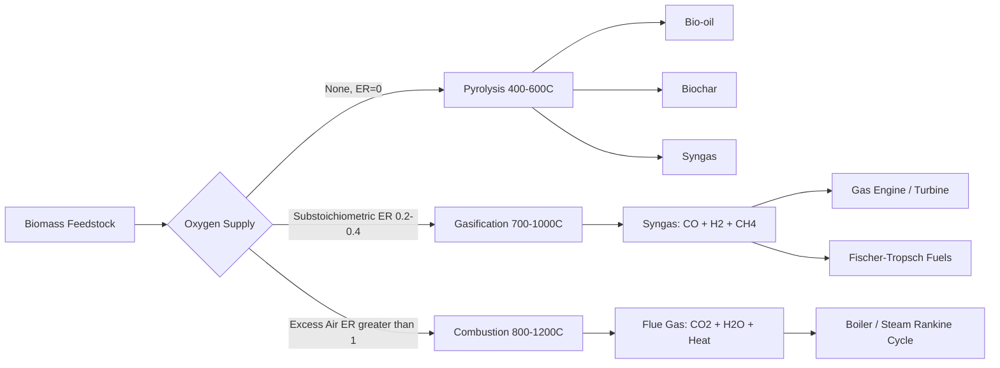

## Biomass Combustion, Gasification, and Pyrolysis

### Overview

Combustion, gasification, and pyrolysis represent the three principal thermochemical pathways for converting solid biomass into usable energy, distinguished primarily by the amount of oxygen present during thermal processing and the resulting product distribution. These processes exist along a continuum of stoichiometric oxygen ratio (equivalence ratio, $\phi$): combustion operates with excess oxygen ($\phi < 1$, oxygen supplied above stoichiometric demand... conventionally expressed as air-fuel ratio above stoichiometric), gasification with substoichiometric oxygen (partial oxidation), and pyrolysis with essentially no oxygen (thermal decomposition only).

### Process Continuum and Equivalence Ratio

The equivalence ratio (ER) is defined as the actual air (or oxygen) supplied divided by the stoichiometric air required for complete combustion:

$$ER = \frac{(\text{Air/Fuel})_{actual}}{(\text{Air/Fuel})_{stoichiometric}}$$

| Process | Equivalence Ratio (ER) | Primary Product |
| --- | --- | --- |
| Pyrolysis | 0 (no oxidant) | Bio-oil, biochar, syngas |
| Gasification | 0.2–0.4 | Syngas (CO, H₂, CH₄) |
| Combustion | ≥1 (excess air) | Heat (CO₂, H₂O) |

### Combustion

**Process Description**

Direct combustion oxidizes biomass fully in the presence of excess air, releasing heat used to generate steam for a Rankine power cycle or to provide direct process heat. Combustion proceeds through distinct sequential stages as a fuel particle heats:

1. **Drying:** Free and bound moisture evaporates (energy sink, no heat release)
2. **Devolatilization/pyrolysis:** Volatile matter (30–80% of biomass dry mass) is driven off as the particle heats above ~200–300 °C
3. **Volatile combustion:** Released volatiles ignite and burn in the gas phase
4. **Char combustion:** Remaining fixed carbon burns heterogeneously (solid-gas reaction), typically the slowest and rate-limiting stage

**Reactor Technologies**

- **Fixed-bed/grate combustion:** Fuel rests on a moving or stationary grate; simplest and most tolerant of heterogeneous, high-moisture, or high-ash fuels; common in small-to-medium scale plants (<50 MWth)
- **Fluidized-bed combustion (FBC):** Fuel is suspended in a bed of inert sand/material fluidized by an air stream, providing excellent heat transfer and fuel mixing, and tolerating a wider range of fuel particle sizes and moisture content
  - **Bubbling fluidized bed (BFB):** Lower gas velocities, bed material remains largely in the combustion chamber
  - **Circulating fluidized bed (CFB):** Higher velocities entrain bed material, which is separated by a cyclone and recirculated, offering better combustion efficiency and fuel flexibility at larger scale
- **Pulverized/suspension firing:** Finely ground biomass is combusted in suspension, similar to pulverized coal firing; requires dry, low-ash fuel with small particle size

**Governing Combustion Energy Balance**

The net calorific value available for steam generation accounts for the latent heat lost to moisture evaporation:

$$LHV_{wb} = HHV_{db} \times (1 - MC) - 2.44 \times MC$$

Where $LHV_{wb}$ is the lower heating value on a wet basis (MJ/kg), $HHV_{db}$ is the higher heating value on a dry basis, $MC$ is moisture content (fraction, wet basis), and 2.44 MJ/kg is approximately the latent heat of vaporization of water. This relationship illustrates why high-moisture feedstocks (>50% MC) suffer severe combustion efficiency penalties, since a large fraction of released chemical energy is consumed evaporating water rather than being available as usable heat.

### Gasification

**Process Description**

Gasification partially oxidizes biomass at high temperature with a controlled, substoichiometric supply of an oxidant (air, oxygen, or steam), converting solid carbon and volatiles into a combustible gas mixture (syngas or producer gas). The process involves four overlapping zones within a gasifier:

1. **Drying zone:** Moisture removal (~100–200 °C)
2. **Pyrolysis zone:** Devolatilization produces char, tar, and gases (~200–600 °C)
3. **Oxidation zone:** Partial combustion of char/volatiles supplies process heat (~800–1200 °C, highest local temperature)
4. **Reduction zone:** Endothermic char-gas reactions (Boudouard reaction, water-gas reaction) convert CO₂ and H₂O into CO and H₂ (~800–1000 °C)

**Key Reduction Zone Reactions**

Boudouard reaction (endothermic):

$$C + CO_2 \rightleftharpoons 2\,CO$$

Water-gas reaction (endothermic):

$$C + H_2O \rightleftharpoons CO + H_2$$

Water-gas shift reaction:

$$CO + H_2O \rightleftharpoons CO_2 + H_2$$

Methanation (exothermic):

$$C + 2\,H_2 \rightleftharpoons CH_4$$

**Reactor Configurations**

| Type | Gas Flow vs. Fuel Flow | Characteristics |
| --- | --- | --- |
| Updraft (countercurrent) | Gas flows up, fuel moves down | High tar content in product gas (unsuitable for engines without extensive cleanup); high thermal efficiency; tolerates high-moisture fuel |
| Downdraft (co-current) | Gas and fuel flow downward together | Lower tar content (gas passes through hot oxidation zone); preferred for small-scale engine applications |
| Fluidized bed | Fuel suspended in fluidizing medium | Good for larger scale, fuel-flexible, moderate tar; more complex |
| Entrained flow | Fine fuel particles carried by gas flow | High temperature, very low tar, requires finely ground feedstock |

**Syngas Quality and Heating Value**

The heating value of the syngas depends strongly on the gasifying agent:

- **Air-blown gasification:** Produces low-heating-value gas (~4–7 MJ/Nm³) due to nitrogen dilution
- **Oxygen-blown gasification:** Produces medium-heating-value gas (~10–15 MJ/Nm³), avoiding nitrogen dilution but requiring an air separation unit
- **Steam gasification:** Produces higher hydrogen content gas, useful when H₂-rich syngas is desired for synthesis applications

**Tar Formation and Management**

Tars (condensable organic compounds, primarily aromatic hydrocarbons) are a major operational challenge, capable of fouling downstream equipment (engines, filters, heat exchangers) through condensation and polymerization. Tar management approaches include:

- **Primary methods:** Optimizing reactor design/operating conditions (e.g., downdraft configuration, catalytic bed materials like dolomite or olivine) to minimize tar formation in-situ
- **Secondary methods:** Downstream physical (scrubbing, filtration) or catalytic (thermal/catalytic cracking) tar removal

### Pyrolysis

**Process Description**

Pyrolysis thermally decomposes biomass in the absence of oxygen, breaking down cellulose, hemicellulose, and lignin into a mixture of solid (char), liquid (bio-oil), and gaseous (syngas) products. Product distribution is highly sensitive to heating rate, peak temperature, vapor residence time, and feedstock particle size.

**Process Classification**

| Type | Heating Rate | Peak Temp | Vapor Residence Time | Dominant Product |
| --- | --- | --- | --- | --- |
| Slow (conventional) | Low (<1 °C/s) | 300–500 °C | Minutes–hours | Biochar (~35%) |
| Fast | High (10–200 °C/s) | 400–600 °C | <2 seconds | Bio-oil (up to ~75%) |
| Flash | Very high (>1000 °C/s) | 700–1000 °C | <0.5 seconds | Bio-oil, gas |
| Intermediate | Moderate | 400–500 °C | Seconds–minutes | Balanced char/oil/gas |

**Fast Pyrolysis Requirements**

High bio-oil yield in fast pyrolysis requires:

- Very high heating rates, necessitating small feedstock particle sizes (typically <2–3 mm) for adequate heat transfer into the particle
- Short vapor residence time (rapid quenching of pyrolysis vapors before secondary cracking reactions can occur, which would otherwise reduce liquid yield in favor of gas and char)
- Moderate temperature (~500 °C is often cited as optimal for maximizing liquid yield for many lignocellulosic feedstocks) [Unverified: exact optimum varies by feedstock composition, particularly lignin content]

Common fast pyrolysis reactor types include fluidized bed, circulating fluidized bed, ablative, and auger/screw reactors, each offering different trade-offs in heat transfer rate, scalability, and mechanical complexity.

**Bio-oil Properties**

Pyrolysis bio-oil is chemically distinct from petroleum-derived fuel oil:

- High oxygen content (35–40 wt%), resulting in lower heating value (~16–19 MJ/kg vs. ~42–45 MJ/kg for diesel)
- Acidic (pH ~2–3, primarily from acetic and formic acid content), causing corrosivity concerns for storage and handling equipment
- Thermally unstable, prone to polymerization/viscosity increase during storage ("aging")
- Immiscible with petroleum fuels without upgrading

Upgrading pathways to convert bio-oil into drop-in transportation fuels include hydrodeoxygenation (HDO, catalytic removal of oxygen via hydrogen addition) and zeolite cracking.

**Biochar Applications**

The solid co-product, biochar, has applications extending beyond direct combustion as a fuel:

- Soil amendment for carbon sequestration and soil water/nutrient retention improvement
- Activated carbon precursor
- Solid fuel (comparable in some respects to low-grade coal)

### Comparative Summary

| Parameter | Combustion | Gasification | Pyrolysis |
| --- | --- | --- | --- |
| Oxygen environment | Excess | Substoichiometric | Absent |
| Temperature range | 800–1200 °C | 700–1000 °C | 300–600 °C |
| Primary product | Heat | Syngas | Bio-oil/char/gas |
| End use | Steam/power (Rankine) | Engine/turbine power, chemical synthesis | Liquid fuel, soil amendment |
| Feedstock moisture tolerance | Low tolerance (efficiency penalty) | Moderate | Requires drying (<10% MC typical) |

### Worked Example

**Given:** A downdraft gasifier processes dry wood chips (10% moisture, HHV = 19 MJ/kg dry basis) at a feed rate of 200 kg/h, producing syngas with an LHV of 5.5 MJ/Nm³ at a specific gas yield of 2.2 Nm³/kg feedstock.

**Syngas volumetric flow rate:**

$$\dot{V}_{syngas} = 200\ \text{kg/h} \times 2.2\ \text{Nm}^3/\text{kg} = 440\ \text{Nm}^3/\text{h}$$

**Syngas thermal power:**

$$\dot{Q}_{syngas} = 440\ \text{Nm}^3/\text{h} \times 5.5\ \text{MJ/Nm}^3 = 2{,}420\ \text{MJ/h} \approx 672\ \text{kW}_{th}$$

**Cold gas efficiency** (ratio of syngas chemical energy output to feedstock chemical energy input):

Feedstock thermal input:

$$\dot{Q}_{feed} = 200\ \text{kg/h} \times 19\ \text{MJ/kg} = 3{,}800\ \text{MJ/h} \approx 1{,}056\ \text{kW}_{th}$$

$$\eta_{cold gas} = \frac{672}{1{,}056} \approx 63.6\%$$

This cold gas efficiency figure is consistent with typical downdraft gasifier performance reported in the literature, and illustrates the intrinsic energy loss associated with the partial oxidation step (heat consumed in the oxidation zone that does not transfer into syngas chemical energy).

### Reactor Configuration Schematic (svg_diagram)

<svg xmlns="http://www.w3.org/2000/svg" viewBox="0 0 640 380" font-family="sans-serif">
<text x="320" y="24" font-size="16" text-anchor="middle" fill="#222">Downdraft Gasifier Zones (svg_diagram)</text>
<rect x="220" y="40" width="200" height="300" fill="none" stroke="#333" stroke-width="2" />
<rect x="220" y="40" width="200" height="60" fill="#f0e6cc" />
<text x="320" y="75" font-size="11" text-anchor="middle">Drying (100-200C)</text>
<rect x="220" y="100" width="200" height="70" fill="#e0c68c" />
<text x="320" y="140" font-size="11" text-anchor="middle">Pyrolysis (200-600C)</text>
<rect x="220" y="170" width="200" height="70" fill="#c07840" />
<text x="320" y="210" font-size="11" text-anchor="middle" fill="#fff">Oxidation (800-1200C)</text>
<text x="320" y="224" font-size="9" text-anchor="middle" fill="#fff">Air/O2 inlet</text>
<rect x="220" y="240" width="200" height="100" fill="#a85c32" />
<text x="320" y="290" font-size="11" text-anchor="middle" fill="#fff">Reduction (800-1000C)</text>
<line x1="150" y1="200" x2="220" y2="200" stroke="#333" stroke-width="3" />
<text x="100" y="196" font-size="10">Air in</text>
<line x1="320" y1="340" x2="320" y2="370" stroke="#333" stroke-width="3" />
<text x="320" y="360" font-size="10" text-anchor="end">Syngas out</text>
<line x1="320" y1="20" x2="320" y2="40" stroke="#333" stroke-width="3" />
<text x="320" y="15" font-size="10" text-anchor="middle">Biomass feed</text>
</svg>

**Related Topics**

- Tar cracking catalysts (dolomite, olivine, nickel-based)
- Fischer-Tropsch synthesis from syngas
- Bio-oil hydrodeoxygenation and upgrading
- Fluidized bed reactor hydrodynamics
- Producer gas cleaning and conditioning trains
- Torrefaction as a pyrolysis pre-treatment
- Combined heat and power (CHP) integration with gasification
- Biochar soil sequestration and carbon credit methodologies