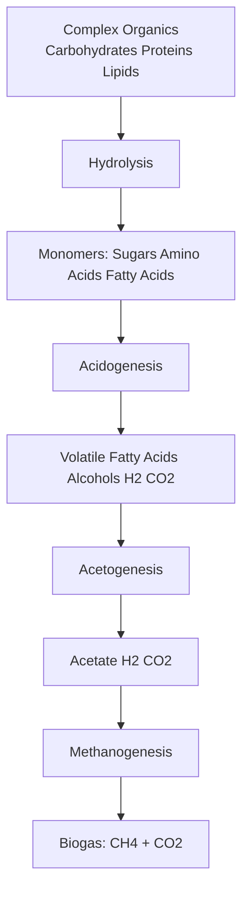
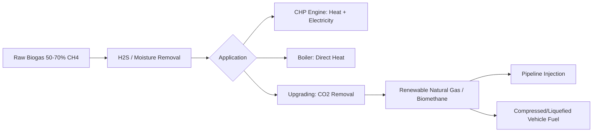

## Biogas and Anaerobic Digestion Systems

### Overview

Anaerobic digestion (AD) is a biochemical conversion process in which microbial communities decompose organic matter in the absence of oxygen, producing biogas—a mixture primarily of methane and carbon dioxide—along with a nutrient-rich digestate byproduct. AD is the dominant conversion pathway for high-moisture organic feedstocks that are poorly suited to thermochemical processing, including livestock manure, food waste, sewage sludge, and certain agricultural residues.

### Microbiological Process Stages

Anaerobic digestion proceeds through four sequential, interdependent biochemical stages, each carried out by distinct microbial populations with different environmental sensitivities:

**1. Hydrolysis**

Extracellular enzymes secreted by hydrolytic bacteria break down complex polymers (cellulose, hemicellulose, proteins, lipids) into soluble monomers (simple sugars, amino acids, long-chain fatty acids). This stage is frequently rate-limiting for lignocellulosic or particulate feedstocks, since lignin encapsulation of cellulose resists enzymatic access.

**2. Acidogenesis**

Fermentative (acidogenic) bacteria convert hydrolysis products into volatile fatty acids (VFAs, such as acetic, propionic, and butyric acid), alcohols, hydrogen, and carbon dioxide. This stage typically proceeds rapidly relative to hydrolysis.

**3. Acetogenesis**

Acetogenic bacteria convert longer-chain VFAs and alcohols into acetate, hydrogen, and carbon dioxide—substrates usable directly by methanogens. This stage exists in a thermodynamically delicate syntrophic relationship with methanogenesis: acetogenic reactions are often only thermodynamically favorable (negative Gibbs free energy) when hydrogen partial pressure is kept low by hydrogen-consuming methanogens, a relationship termed interspecies hydrogen transfer.

**4. Methanogenesis**

Methanogenic archaea convert acetate, and hydrogen plus carbon dioxide, into methane via two principal pathways:

Acetoclastic methanogenesis (typically the dominant pathway, responsible for ~60–70% of methane produced in most digesters):

$$CH_3COOH \rightarrow CH_4 + CO_2$$

Hydrogenotrophic methanogenesis:

$$CO_2 + 4\,H_2 \rightarrow CH_4 + 2\,H_2O$$

Methanogens are strict anaerobes with slow growth rates and narrow environmental tolerances (pH, temperature, ammonia concentration), making methanogenesis the most sensitive and frequently rate-limiting stage of the overall digestion process, and the stage most vulnerable to process upset from shock loading, pH excursions, or toxic inhibitors.

### Key Process Parameters

**Temperature Regimes**

| Regime | Temperature | Characteristics |
| --- | --- | --- |
| Psychrophilic | <20 °C | Slow kinetics, minimal heating cost, uncommon industrially |
| Mesophilic | 30–38 °C | Most common; stable, moderate kinetics, lower process heat demand |
| Thermophilic | 50–57 °C | Faster kinetics, greater pathogen destruction, higher process heat input required, generally less stable/more sensitive to disturbance |

**Hydraulic Retention Time (HRT) and Organic Loading Rate (OLR)**

HRT is the average time feedstock remains in the digester:

$$HRT = \frac{V_{reactor}}{\dot{V}_{feed}}$$

Typical mesophilic digesters operate at HRTs of 15–30 days, though thermophilic systems can achieve comparable stabilization at shorter HRTs due to faster reaction kinetics.

Organic loading rate expresses the mass of volatile solids (VS) fed per unit reactor volume per day:

$$OLR = \frac{\dot{m}_{VS}}{V_{reactor}}$$

Exceeding the digester's tolerable OLR risks VFA accumulation and process souring (a self-reinforcing pH drop as methanogens, which are more sensitive to low pH than acidogens, are inhibited faster than acid production continues).

**pH and Alkalinity**

Methanogens function optimally within a narrow pH range of approximately 6.8–7.2, and are strongly inhibited below pH ~6.5. Sufficient buffering capacity (alkalinity, typically from bicarbonate) is required to resist pH depression from VFA accumulation; the alkalinity-to-VFA ratio is a commonly monitored process stability indicator.

**C:N Ratio**

An optimal carbon-to-nitrogen ratio (commonly cited around 20:1 to 30:1) balances microbial carbon (energy) needs against nitrogen requirements for cell synthesis. Excessively low C:N ratios (nitrogen-rich feedstocks like manure or food waste alone) risk ammonia accumulation, which is toxic to methanogens at elevated concentrations, particularly as un-ionized free ammonia (NH₃), whose fraction increases with both pH and temperature.

### Digester Configurations

**Continuously Stirred Tank Reactor (CSTR)**

The most common configuration for agricultural and industrial AD, consisting of a continuously mixed tank maintaining homogeneous conditions throughout the reactor volume, suited to feedstocks with moderate-to-high solids content (manure slurries, energy crops, co-digestion mixtures).

**Plug Flow Reactor**

An elongated reactor (often horizontal) in which feedstock moves through in a largely unmixed, first-in-first-out manner, commonly used for high-solids dairy manure digestion where the feedstock's own viscosity provides plug-flow characteristics.

**Upflow Anaerobic Sludge Blanket (UASB)**

A high-rate reactor design in which wastewater flows upward through a blanket of anaerobic granular sludge, achieving substantially shorter HRTs (hours rather than weeks) than conventional CSTR systems, widely used for high-strength industrial wastewater treatment (food and beverage processing effluents). Performance depends on maintaining well-settling granular biomass, and the configuration is generally unsuitable for feedstocks with high suspended solids content that would wash out or clog the sludge blanket.

**Covered Lagoon**

A low-cost, low-technology configuration commonly used for dilute livestock manure, consisting of an earthen lagoon covered with an impermeable membrane to capture biogas, typically operating at ambient (psychrophilic to low-mesophilic) temperature with correspondingly lower gas yields per unit feedstock.

**Dry (High-Solids) Digestion**

Handles feedstocks with total solids content above ~15–20% (as opposed to conventional "wet" digestion below ~10–15% TS) using batch or continuous plug-flow/garage-type systems, suited to energy crops, organic MSW fraction, and other feedstocks where dilution to wet-digestion consistency would be impractical or would require excessive water addition.

### Co-Digestion

Combining multiple feedstocks (e.g., manure with food waste, or agricultural residues with energy crops) is a widely applied strategy to balance C:N ratio, dilute potential inhibitors, improve nutrient balance, and increase overall biogas yield per unit reactor volume relative to mono-digestion of any single low-yield substrate (such as dilute manure alone). Co-digestion economics also benefit from tipping fees often paid by waste generators for accepting high-strength organic waste streams.

### Biogas Composition and Yield

Typical raw biogas composition:

| Component | Typical Range |
| --- | --- |
| CH₄ | 50–70% |
| CO₂ | 30–45% |
| H₂S | 0–2% (varies widely by feedstock sulfur content) |
| Trace (N₂, O₂, NH₃, siloxanes) | <1% typically |

Biochemical methane potential (BMP) varies substantially by feedstock:

| Feedstock | Approx. Biogas Yield (m³/tonne VS) | Approx. CH₄ Content |
| --- | --- | --- |
| Cattle manure | 200–300 | 55–60% |
| Food waste | 400–600 | 60–70% |
| Fats, oils, greases (FOG) | 800–1000+ | 65–70% |
| Energy crops (maize silage) | 500–650 | 50–55% |
| Sewage sludge | 250–350 | 60–65% |

FOG feedstocks exhibit notably higher methane yields per unit VS due to the high energy density of lipids relative to carbohydrates and proteins, though they also carry greater risk of inhibition (long-chain fatty acid toxicity) if not properly managed within the feed blend.

### Biogas Utilization Pathways

**Combined Heat and Power (CHP)**

Biogas combusted in a reciprocating gas engine or micro-turbine to co-generate electricity and recoverable heat, the latter often used to maintain digester process temperature, improving overall system energy efficiency.

**Upgrading to Biomethane/RNG**

CO₂ (and trace contaminants) is removed to raise methane content to pipeline-quality specifications (typically >95–97% CH₄), via:

- **Water scrubbing:** CO₂ preferentially absorbed into water under pressure, exploiting CO₂'s higher aqueous solubility relative to CH₄
- **Pressure swing adsorption (PSA):** CO₂ selectively adsorbed onto molecular sieve material under pressure, then desorbed upon pressure release
- **Membrane separation:** Selective permeation of CO₂ through polymeric membranes
- **Chemical (amine) scrubbing:** CO₂ chemically absorbed by an amine solution, later regenerated by heating

Upgraded biomethane is chemically near-identical to fossil natural gas, permitting direct pipeline injection or use as compressed (CBG) or liquefied (LBG) vehicle fuel.

### Digestate Management

The residual solid/liquid fraction remaining after digestion (digestate) retains most of the feedstock's nutrient content (nitrogen, phosphorus, potassium), commonly separated into liquid and solid fractions for application as liquid fertilizer and soil amendment respectively, representing an important co-product value stream for agricultural AD systems.

### Worked Example

**Given:** A CSTR digester with a working volume of 3,000 m³ is fed a co-digestion mixture at an OLR of 3.0 kg VS/m³·day, yielding 450 m³ biogas per tonne VS destroyed at 62% CH₄ content, with a VS destruction efficiency of 55%.

**Daily VS feed mass:**

$$\dot{m}_{VS} = OLR \times V_{reactor} = 3.0 \times 3{,}000 = 9{,}000\ \text{kg VS/day} = 9\ \text{t VS/day}$$

**VS destroyed:**

$$\dot{m}_{VS,destroyed} = 9 \times 0.55 = 4.95\ \text{t VS/day}$$

**Daily biogas production:**

$$\dot{V}_{biogas} = 4.95\ \text{t} \times 450\ \text{m}^3/\text{t} = 2{,}227.5\ \text{m}^3/\text{day}$$

**Daily methane production:**

$$\dot{V}_{CH_4} = 2{,}227.5 \times 0.62 \approx 1{,}381\ \text{m}^3/\text{day}$$

**Thermal energy content** (using LHV of CH₄ ≈ 35.8 MJ/m³):

$$\dot{Q} = 1{,}381 \times 35.8 \approx 49{,}440\ \text{MJ/day} \approx 13.7\ \text{MWh}_{th}/\text{day}$$

This corresponds to approximately 571 kW of continuous thermal energy availability, illustrating how OLR, VS destruction efficiency, and feedstock-specific biogas yield jointly determine digester energy output for a given reactor volume.

### Anaerobic Digestion System Schematic (svg_diagram)

<svg xmlns="http://www.w3.org/2000/svg" viewBox="0 0 640 380" font-family="sans-serif">
<text x="320" y="24" font-size="16" text-anchor="middle" fill="#222">CSTR Anaerobic Digestion System (svg_diagram)</text>
<rect x="60" y="150" width="80" height="60" fill="#d9c9a3" stroke="#333" />
<text x="100" y="185" font-size="10" text-anchor="middle">Feedstock</text>
<text x="100" y="197" font-size="10" text-anchor="middle">Prep Tank</text>
<line x1="140" y1="180" x2="200" y2="180" stroke="#333" stroke-width="2" />
<ellipse cx="320" cy="190" rx="120" ry="100" fill="#c69a6d" stroke="#333" stroke-width="2" />
<text x="320" y="180" font-size="12" text-anchor="middle">CSTR Digester</text>
<text x="320" y="196" font-size="10" text-anchor="middle">35-38C, HRT 20-25d</text>
<circle cx="320" cy="120" r="5" fill="#555" />
<line x1="320" y1="90" x2="320" y2="115" stroke="#333" stroke-width="3" />
<text x="320" y="80" font-size="10" text-anchor="middle">Mixer</text>
<line x1="440" y1="140" x2="500" y2="100" stroke="#333" stroke-width="2" />
<rect x="500" y="60" width="100" height="50" fill="#e8dcc3" stroke="#333" />
<text x="550" y="80" font-size="10" text-anchor="middle">Biogas</text>
<text x="550" y="93" font-size="10" text-anchor="middle">Storage</text>
<line x1="440" y1="230" x2="500" y2="270" stroke="#333" stroke-width="2" />
<rect x="500" y="270" width="100" height="50" fill="#a8c6a0" stroke="#333" />
<text x="550" y="290" font-size="10" text-anchor="middle">Digestate</text>
<text x="550" y="303" font-size="10" text-anchor="middle">Separation</text>
<line x1="600" y1="85" x2="640" y2="85" stroke="#333" stroke-width="2" />
<text x="620" y="75" font-size="9" text-anchor="middle">CHP</text>
</svg>

**Related Topics**

- Biogas upgrading technology comparison (PSA vs. membrane vs. scrubbing)
- Ammonia and sulfide inhibition thresholds in AD
- Co-digestion feedstock blending strategies
- UASB reactor granulation and startup
- Digestate nutrient recovery (struvite precipitation)
- Landfill gas capture systems
- Biomethane grid injection standards
- CHP engine selection for biogas fuel quality