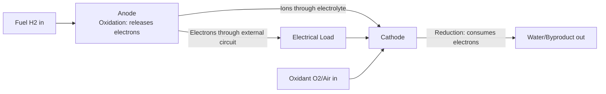
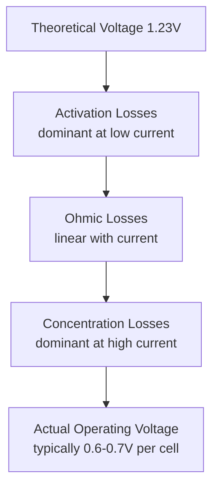

## Fuel Cell Principles and Types

### Overview

Fuel cells are electrochemical devices that directly convert the chemical energy of a fuel (typically hydrogen, though some types accept hydrocarbons or alcohols) into electrical energy through electrochemical oxidation, bypassing the intermediate combustion and mechanical work stages required by heat-engine-based power generation. Because fuel cells are not constrained by the Carnot efficiency limit that bounds heat engines, they can theoretically achieve higher energy conversion efficiencies, particularly at partial load, though this practical outcome depends on cell type, operating conditions, and balance-of-plant losses.

### Fundamental Operating Principle

A fuel cell consists of two electrodes (anode and cathode) separated by an electrolyte that conducts ions but not electrons, forcing electrons to travel through an external circuit and thereby do electrical work.

**Generic Half-Reactions (Hydrogen-Oxygen Fuel Cell)**

Anode (oxidation, hydrogen split into protons and electrons):

$$H_2 \rightarrow 2\,H^+ + 2\,e^-$$

Cathode (reduction, oxygen combines with protons and electrons):

$$\frac{1}{2}O_2 + 2\,H^+ + 2\,e^- \rightarrow H_2O$$

Overall cell reaction:

$$H_2 + \frac{1}{2}O_2 \rightarrow H_2O$$

This is the reverse of water electrolysis, and fuel cells and electrolyzers are, in principle, thermodynamically related devices; some systems (regenerative fuel cells) can operate in both directions.

### Thermodynamics of Fuel Cell Operation

**Theoretical (Reversible) Cell Voltage**

The maximum theoretical voltage a fuel cell can produce is derived from the Gibbs free energy change of the overall reaction:

$$E_0 = \frac{-\Delta G}{nF}$$

Where $\Delta G$ is the Gibbs free energy change of reaction (J/mol), $n$ is the number of electrons transferred per mole of fuel (2 for hydrogen), and $F$ is Faraday's constant (96,485 C/mol).

For the hydrogen-oxygen reaction at standard conditions (298 K, liquid water product), $\Delta G \approx -237.1$ kJ/mol, giving a theoretical standard cell potential:

$$E_0 = \frac{237{,}100}{2 \times 96{,}485} \approx 1.23\ \text{V}$$

**Maximum Theoretical Efficiency**

Unlike heat engines, fuel cell theoretical efficiency is bounded by the ratio of Gibbs free energy to enthalpy of reaction, not by Carnot considerations:

$$\eta_{max} = \frac{\Delta G}{\Delta H}$$

For hydrogen oxidation with liquid water product, $\Delta H \approx -285.8$ kJ/mol, giving:

$$\eta_{max} = \frac{237.1}{285.8} \approx 83\%$$

This theoretical maximum efficiency is a thermodynamic ceiling; achieved practical efficiencies are substantially lower due to the irreversibilities described below.

**Voltage Losses (Polarization)**

Actual operating cell voltage falls below the theoretical value due to three cumulative loss mechanisms that dominate at different current density regions:

$$V_{cell} = E_0 - \eta_{activation} - \eta_{ohmic} - \eta_{concentration}$$

- **Activation polarization:** Energy barrier associated with the electrochemical reaction kinetics at the electrode surface, dominant at low current density
- **Ohmic polarization:** Resistive losses through the electrolyte, electrodes, and interconnects, scaling roughly linearly with current density
- **Concentration (mass transport) polarization:** Losses from reactant depletion at the electrode surface at high current density, becoming severe as current approaches the limiting current density

### Major Fuel Cell Types

Fuel cells are classified primarily by electrolyte type, which determines operating temperature, ion transported, tolerable fuel purity, and application domain.

**1. Proton Exchange Membrane Fuel Cell (PEMFC)**

- **Electrolyte:** Solid polymer membrane (commonly a perfluorosulfonic acid polymer such as Nafion), conducting H⁺ ions
- **Operating temperature:** 60–80 °C (low-temperature); high-temperature PEMFC variants operate at 120–180 °C
- **Fuel:** High-purity hydrogen required; CO poisons the platinum catalyst at low-temperature operation, generally requiring feed CO concentrations below roughly 10–50 ppm
- **Applications:** Automotive propulsion, portable power, small-scale stationary CHP
- **Advantages:** Fast startup, high power density, low operating temperature enabling rapid transient response
- **Challenges:** Requires expensive platinum-group-metal catalysts, water management (membrane must remain hydrated for adequate proton conductivity while avoiding flooding), CO sensitivity

**2. Solid Oxide Fuel Cell (SOFC)**

- **Electrolyte:** Solid ceramic (commonly yttria-stabilized zirconia, YSZ), conducting O²⁻ ions
- **Operating temperature:** 600–1000 °C
- **Fuel:** Highly fuel-flexible; can internally reform natural gas, biogas, or other hydrocarbons directly at the anode due to high operating temperature, and is generally tolerant of CO (which can act as fuel rather than poison at SOFC operating temperatures)
- **Applications:** Stationary power generation, combined heat and power, potential for hybrid SOFC-gas turbine systems
- **Advantages:** High electrical efficiency (potentially 50–60%+ in simple cycle, higher in hybrid configurations), fuel flexibility, high-quality exhaust heat suitable for cogeneration or bottoming cycles
- **Challenges:** Slow startup/thermal cycling due to high operating temperature, materials degradation and thermal stress management, higher capital cost for high-temperature-tolerant components

**3. Molten Carbonate Fuel Cell (MCFC)**

- **Electrolyte:** Molten alkali carbonate salt (typically lithium/potassium carbonate) retained in a ceramic matrix, conducting CO₃²⁻ ions
- **Operating temperature:** ~600–650 °C
- **Fuel:** Tolerant of CO and can internally reform hydrocarbon fuels; notably, requires CO₂ recycled to the cathode as part of the carbonate ion transport mechanism
- **Applications:** Large-scale stationary power generation, industrial CHP
- **Advantages:** High efficiency, fuel flexibility, can utilize CO₂ from combustion sources
- **Challenges:** Corrosive molten electrolyte causes material degradation, slower startup than PEMFC, relatively niche commercial deployment relative to SOFC and PEMFC

**4. Alkaline Fuel Cell (AFC)**

- **Electrolyte:** Aqueous potassium hydroxide (KOH) solution, conducting OH⁻ ions
- **Operating temperature:** 60–90 °C typically
- **Fuel:** Requires very high-purity hydrogen and oxygen; highly intolerant of CO₂ (including atmospheric CO₂), since CO₂ reacts with the alkaline electrolyte to form carbonate precipitates that degrade performance
- **Applications:** Historically significant for aerospace (notably NASA Apollo and Space Shuttle programs, where pure reactant supply was feasible)
- **Advantages:** Fast reaction kinetics at low temperature, high theoretical efficiency, can use non-precious-metal catalysts in some designs
- **Challenges:** CO₂ intolerance severely limits use of ambient air as oxidant, largely restricting AFC to applications with purified reactant supply

**5. Phosphoric Acid Fuel Cell (PAFC)**

- **Electrolyte:** Liquid phosphoric acid retained in a matrix, conducting H⁺ ions
- **Operating temperature:** ~150–200 °C
- **Fuel:** More CO-tolerant than PEMFC (tolerates roughly 1–2% CO) due to elevated operating temperature
- **Applications:** One of the earliest commercialized stationary fuel cell technologies, used in distributed CHP applications
- **Advantages:** Mature, relatively simple technology, moderate fuel tolerance, usable waste heat for cogeneration
- **Challenges:** Lower efficiency than SOFC/MCFC, corrosive electrolyte, largely superseded commercially by PEMFC and SOFC in newer deployments

**6. Direct Methanol Fuel Cell (DMFC)**

- **Electrolyte:** Proton exchange membrane (similar to PEMFC), but fed liquid or vaporized methanol directly at the anode rather than hydrogen
- **Operating temperature:** 50–120 °C
- **Applications:** Portable electronics, small mobile power, niche applications where hydrogen storage/logistics are impractical relative to liquid methanol's higher energy density and easier handling
- **Advantages:** Avoids hydrogen storage/distribution infrastructure challenges, liquid fuel handling convenience
- **Challenges:** Lower efficiency than hydrogen PEMFC due to sluggish methanol oxidation kinetics and methanol crossover through the membrane (fuel loss and mixed-potential effects reducing cell voltage)

### Comparative Summary Table

| Type | Electrolyte | Ion Carrier | Temp Range | CO Tolerance | Primary Application |
| --- | --- | --- | --- | --- | --- |
| PEMFC | Polymer membrane | H⁺ | 60–80 °C | Very low | Transportation, portable |
| SOFC | Ceramic (YSZ) | O²⁻ | 600–1000 °C | High | Stationary power, CHP |
| MCFC | Molten carbonate | CO₃²⁻ | 600–650 °C | High | Large stationary/industrial |
| AFC | Aqueous KOH | OH⁻ | 60–90 °C | None (CO₂ intolerant) | Aerospace, specialty |
| PAFC | Phosphoric acid | H⁺ | 150–200 °C | Moderate | Distributed CHP |
| DMFC | Polymer membrane | H⁺ | 50–120 °C | N/A (liquid fuel) | Portable electronics |

### The Nernst Equation and Operating Condition Effects

Actual reversible cell voltage under non-standard conditions (pressure, temperature, reactant concentration) deviates from $E_0$ according to the Nernst equation:

$$E = E_0 - \frac{RT}{nF}\ln\left(\frac{a_{products}}{a_{reactants}}\right)$$

Practically, this means increasing reactant partial pressure (e.g., operating at elevated pressure or using pure oxygen rather than air) increases achievable cell voltage, while increasing temperature generally decreases theoretical voltage $E_0$ for the hydrogen-oxygen reaction (since $\Delta G$ becomes less negative at higher temperature for this particular reaction), even though higher temperature typically improves reaction kinetics and reduces activation losses, illustrating a practical trade-off between thermodynamic and kinetic considerations in high-temperature fuel cell design.

### Stack Configuration

Individual fuel cells produce a relatively low voltage (practically around 0.6–0.8 V under load), so practical systems connect many cells electrically in series into a "stack" to reach usable system voltages, with bipolar plates serving the dual function of separating adjacent cells' reactant gas flows and providing electrical series connection between them.

### Worked Example

**Given:** A PEMFC stack of 90 cells in series operates at an average cell voltage of 0.65 V under load, drawing a current of 150 A.

**Stack voltage:**

$$V_{stack} = 90 \times 0.65 = 58.5\ \text{V}$$

**Electrical power output:**

$$P = V_{stack} \times I = 58.5 \times 150 = 8{,}775\ \text{W} \approx 8.8\ \text{kW}$$

**Voltage efficiency** (relative to theoretical 1.23 V):

$$\eta_{voltage} = \frac{0.65}{1.23} \approx 52.8\%$$

Actual system (net) electrical efficiency will be somewhat below this voltage efficiency figure once balance-of-plant parasitic loads (air compressor, cooling pumps, humidification system) and Faradaic (current) efficiency losses are accounted for, though voltage efficiency remains the dominant efficiency-determining factor in most PEMFC operating regimes.

### Polarization Curve Schematic (svg_diagram)

<svg xmlns="http://www.w3.org/2000/svg" viewBox="0 0 640 400" font-family="sans-serif">
<text x="320" y="24" font-size="16" text-anchor="middle" fill="#222">Fuel Cell Polarization Curve (svg_diagram)</text>
<line x1="80" y1="350" x2="80" y2="50" stroke="#333" stroke-width="2" />
<line x1="80" y1="350" x2="580" y2="350" stroke="#333" stroke-width="2" />
<text x="30" y="60" font-size="11">1.23V</text>
<text x="30" y="200" font-size="11">Voltage</text>
<text x="550" y="375" font-size="11">Current Density</text>
<path d="M80,70 C120,90 150,130 200,150 C300,180 400,200 480,260 C520,300 550,330 570,345" stroke="#a85c32" stroke-width="3" fill="none" />
<text x="130" y="100" font-size="9" fill="#555">Activation loss</text>
<line x1="130" y1="95" x2="130" y2="70" stroke="#888" stroke-dasharray="2,2" />
<text x="300" y="215" font-size="9" fill="#555">Ohmic loss (linear)</text>
<text x="480" y="290" font-size="9" fill="#555">Concentration loss</text>
<line x1="80" y1="70" x2="580" y2="70" stroke="#999" stroke-dasharray="4,3" />
<text x="500" y="65" font-size="9" fill="#999">Theoretical E0</text>
</svg>

**Related Topics**

- Fuel cell catalyst layer design and platinum-group-metal loading reduction
- Balance-of-plant systems (compressors, humidifiers, thermal management)
- SOFC-gas turbine hybrid cycles
- Hydrogen production and storage infrastructure
- Reversible/regenerative fuel cells (fuel cell + electrolyzer combined systems)
- Fuel cell degradation mechanisms and durability testing
- Proton exchange membrane material chemistry (Nafion and alternatives)
- Fuel cell vehicle powertrain integration