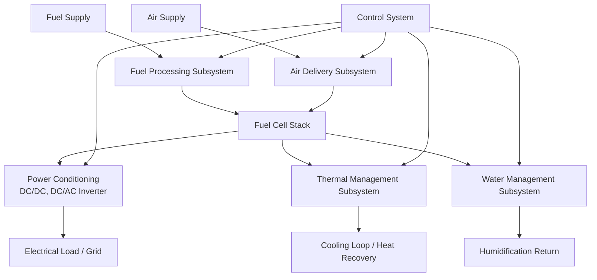

## Fuel Cell System Design and Balance of Plant

### Overview

A functioning fuel cell power system extends well beyond the electrochemical stack itself. Balance of plant (BOP) refers to the collection of auxiliary subsystems—fuel processing, air/oxidant supply, thermal management, water management, power conditioning, and control—that enable the stack to operate reliably, safely, and efficiently under real-world conditions. In many practical fuel cell systems, BOP components account for a substantial share of total system cost and parasitic power consumption, and BOP design decisions often determine net system efficiency and durability as much as the stack chemistry itself.

### System Architecture Overview

### Fuel Processing Subsystem

**Purpose**

Converts the available fuel supply (natural gas, propane, liquid fuels, or stored hydrogen) into a form usable by the stack, meeting purity requirements specific to the fuel cell type.

**Reforming Technologies**

For non-hydrogen fuel cell systems (or lower-purity hydrogen feeds to high-temperature stacks), a fuel processor converts hydrocarbon fuel into a hydrogen-rich reformate stream:

- **Steam methane reforming (SMR):** The dominant industrial hydrogen production method, reacting methane with steam over a nickel catalyst at high temperature (700–1000 °C):

  $$CH_4 + H_2O \rightarrow CO + 3\,H_2 \quad (\text{endothermic})$$

  followed by the water-gas shift reaction to convert CO to additional H₂ and CO₂:

  $$CO + H_2O \rightarrow CO_2 + H_2 \quad (\text{exothermic})$$
- **Partial oxidation (POX):** Substoichiometric combustion of fuel with oxygen/air, exothermic and faster-starting than SMR but yielding lower hydrogen concentration per unit fuel
- **Autothermal reforming (ATR):** A hybrid combining SMR and POX reactions in a single reactor, using the exothermic POX reaction to supply heat for the endothermic SMR reaction, improving thermal self-sufficiency and startup response relative to SMR alone
- **Internal reforming (SOFC/MCFC specific):** High-temperature stacks can perform reforming directly at or near the anode, using the stack's own waste heat to drive the endothermic reforming reaction, reducing or eliminating the need for a separate external reformer, though this places additional thermal and carbon-deposition management demands on the stack itself

**Fuel Cleanup**

Downstream of reforming, gas cleanup stages remove contaminants harmful to the stack:

- **CO cleanup (PEMFC-critical):** Preferential oxidation (PROX) or additional water-gas shift stages reduce CO concentration to the low parts-per-million levels PEMFC catalysts require, since even trace CO strongly adsorbs onto platinum active sites, blocking hydrogen oxidation kinetics
- **Sulfur removal:** Sulfur compounds (naturally present in natural gas as odorants, or as trace contaminants) poison both reforming catalysts and fuel cell catalysts, typically removed via adsorption beds (e.g., zinc oxide) upstream of the reformer
- **Desulfurization is required regardless of stack type**, since sulfur compounds degrade nickel-based reforming catalysts even for high-temperature stacks that otherwise tolerate CO well

### Air/Oxidant Delivery Subsystem

**Air Compressor/Blower**

Supplies pressurized air to the cathode. For PEMFC systems, air compressors are a major parasitic load, often consuming 10–20% of gross stack power output, since higher cathode air pressure improves cell voltage (per the Nernst relationship) and mass transport but at increasing compressor energy cost, creating a system-level optimization trade-off between stack efficiency gain and BOP parasitic loss.

**Air Filtration**

Removes particulates and, in some cases, trace contaminants (e.g., sulfur compounds in urban air) that could otherwise degrade catalyst performance over the system's operating lifetime.

**Stoichiometric Ratio Control**

Air (and fuel) flow is typically supplied in excess of the exact stoichiometric requirement, characterized by a stoichiometric ratio $\lambda$ (actual flow / stoichiometric flow), commonly $\lambda \approx 1.5$–2.5 for air in PEMFC systems, ensuring adequate reactant concentration across the full active area of the cell and mitigating local starvation at high current density, though excess air flow also increases parasitic blower/compressor load.

### Thermal Management Subsystem

**Purpose**

Maintains stack operating temperature within its design window, removes waste heat generated by cell inefficiency, and in cogeneration applications, recovers usable heat.

**Low-Temperature Stacks (PEMFC, AFC, PAFC)**

Typically use a liquid coolant loop (often deionized water or water-glycol mixture, since coolant must not be electrically conductive to avoid stack short-circuiting or corrosion) circulated through cooling channels integrated into the bipolar plates, rejecting heat via a radiator or heat exchanger.

**High-Temperature Stacks (SOFC, MCFC)**

Waste heat management is more integral to system design, since:

- Excess air flow through the stack often serves the dual purpose of both supplying oxidant and providing convective cooling
- High-grade waste heat (600 °C+) is valuable for bottoming cycles (steam or gas turbine combined cycles) or industrial process heat, substantially improving overall system utilization of fuel energy content
- Thermal cycling management is critical, since ceramic stack components are susceptible to thermal stress cracking from rapid or uneven temperature changes, generally requiring slow, controlled startup and shutdown procedures

### Water Management Subsystem (PEMFC-specific)

**The Central PEMFC Water Balance Challenge**

The polymer electrolyte membrane requires adequate hydration to maintain proton conductivity, yet excess liquid water can flood the catalyst layer and gas diffusion electrodes, blocking reactant transport to active sites. Effective water management must therefore balance:

- **Membrane hydration:** Often achieved via external humidification of the incoming reactant gases (particularly at the anode inlet, since dry inlet gas draws water from the membrane, and electro-osmotic drag carries water with protons from anode to cathode during operation) or via internal water transport management strategies
- **Flooding prevention:** Product water generated at the cathode must be removed at a rate matching production, commonly through careful gas flow channel design (serpentine or interdigitated flow field geometries) that promotes water droplet removal, alongside gas diffusion layer hydrophobic treatments (e.g., PTFE) that discourage liquid water accumulation
- **Water recovery:** In systems without an external water supply, product water is often condensed and recycled to supply humidification needs, reducing net water consumption

### Power Conditioning Subsystem

**DC/DC Conversion**

Stack output voltage varies substantially with load current (per the polarization curve behavior) and stack sizing, so a DC/DC converter is commonly used to regulate output to a stable DC bus voltage suitable for downstream use or inversion.

**DC/AC Inversion**

For grid-connected or AC-load applications, an inverter converts the stack's DC output to grid-synchronized AC, incorporating power quality management (harmonic filtering, power factor correction) and, for grid-tied systems, anti-islanding protection to prevent the system from continuing to energize a de-energized grid segment during outages.

**Hybridization with Energy Storage**

Many fuel cell systems, particularly in transportation and backup power applications, pair the fuel cell stack with a battery or supercapacitor bank to buffer transient load demands the stack alone responds to relatively slowly, improving overall system responsiveness, extending stack lifetime by smoothing load-following transients (which are associated with accelerated stack degradation), and enabling regenerative braking energy capture in vehicle applications.

### Control System

Coordinates all BOP subsystems in response to load demand and stack health monitoring, managing:

- Startup and shutdown sequencing (particularly critical for high-temperature stacks, where uncontrolled thermal transients risk component damage)
- Load-following response coordination across fuel, air, and thermal subsystems
- Safety interlocks (hydrogen leak detection, overtemperature protection, overcurrent protection)
- Diagnostic monitoring of stack health indicators (individual cell voltage monitoring, pressure differentials, temperature distribution)

### Net System Efficiency

The overall system (net) electrical efficiency accounts for both stack voltage efficiency and BOP parasitic losses:

$$\eta_{system} = \eta_{stack} \times \eta_{fuel utilization} \times \left(1 - \frac{P_{parasitic}}{P_{gross}}\right)$$

Where fuel utilization efficiency accounts for unreacted fuel exiting the stack (not all supplied fuel is electrochemically converted, particularly given excess stoichiometric supply), and parasitic loss accounts for BOP component power consumption (compressors, pumps, control electronics).

### Worked Example

**Given:** A SOFC-based CHP system produces 250 kW gross DC electrical power from the stack. BOP parasitic loads (air blower, fuel processing pumps, control systems) consume 22 kW. The DC/AC inverter operates at 96% conversion efficiency.

**Net DC power after parasitic loads:**

$$P_{net,DC} = 250 - 22 = 228\ \text{kW}$$

**Net AC power delivered:**

$$P_{net,AC} = 228 \times 0.96 = 218.9\ \text{kW}$$

**BOP parasitic loss fraction:**

$$\frac{22}{250} = 8.8\%$$

If the fuel input to the system corresponds to 500 kW of fuel chemical energy (LHV basis), the overall net electrical efficiency is:

$$\eta_{net,elec} = \frac{218.9}{500} \approx 43.8\%$$

If the system additionally recovers 150 kW of usable heat from stack exhaust for a cogeneration application, total (CHP) energy utilization efficiency becomes:

$$\eta_{CHP} = \frac{218.9 + 150}{500} \approx 73.8\%$$

This illustrates the substantial efficiency gain achievable through heat recovery in high-temperature fuel cell CHP applications, relative to electrical-only efficiency figures.

### Balance of Plant System Diagram (svg_diagram)

<svg xmlns="http://www.w3.org/2000/svg" viewBox="0 0 680 420" font-family="sans-serif">
<text x="340" y="24" font-size="16" text-anchor="middle" fill="#222">Fuel Cell System with BOP (svg_diagram)</text>
<rect x="40" y="180" width="110" height="60" fill="#d9c9a3" stroke="#333" />
<text x="95" y="205" font-size="10" text-anchor="middle">Fuel</text>
<text x="95" y="218" font-size="10" text-anchor="middle">Processor</text>
<line x1="150" y1="210" x2="220" y2="210" stroke="#333" stroke-width="2" />
<rect x="40" y="60" width="110" height="60" fill="#c8d9e8" stroke="#333" />
<text x="95" y="85" font-size="10" text-anchor="middle">Air Blower/</text>
<text x="95" y="98" font-size="10" text-anchor="middle">Compressor</text>
<line x1="150" y1="90" x2="220" y2="180" stroke="#333" stroke-width="2" />
<rect x="220" y="140" width="160" height="140" fill="#c69a6d" stroke="#333" stroke-width="2" />
<text x="300" y="205" font-size="12" text-anchor="middle">Fuel Cell</text>
<text x="300" y="220" font-size="12" text-anchor="middle">Stack</text>
<line x1="380" y1="210" x2="450" y2="210" stroke="#333" stroke-width="2" />
<rect x="450" y="180" width="110" height="60" fill="#e0c68c" stroke="#333" />
<text x="505" y="205" font-size="10" text-anchor="middle">Power</text>
<text x="505" y="218" font-size="10" text-anchor="middle">Conditioning</text>
<line x1="560" y1="210" x2="620" y2="210" stroke="#333" stroke-width="2" />
<text x="650" y="215" font-size="10" text-anchor="middle">Load</text>
<line x1="300" y1="140" x2="300" y2="100" stroke="#333" stroke-width="2" />
<rect x="245" y="40" width="110" height="60" fill="#a8c6a0" stroke="#333" />
<text x="300" y="65" font-size="10" text-anchor="middle">Thermal Mgmt</text>
<text x="300" y="78" font-size="10" text-anchor="middle">/ Heat Recovery</text>
<line x1="300" y1="280" x2="300" y2="320" stroke="#333" stroke-width="2" />
<rect x="245" y="320" width="110" height="60" fill="#f0d0d0" stroke="#333" />
<text x="300" y="345" font-size="10" text-anchor="middle">Water Mgmt /</text>
<text x="300" y="358" font-size="10" text-anchor="middle">Humidification</text>
</svg>

**Related Topics**

- Steam methane reforming catalyst design
- PEMFC gas diffusion layer and flow field engineering
- SOFC-gas turbine hybrid system integration
- Hydrogen fuel quality standards (SAE J2719)
- Stack degradation modes and BOP-induced stress factors
- Anti-islanding protection for grid-tied inverters
- Fuel cell system startup/shutdown thermal cycling protocols
- Hybrid fuel cell-battery powertrain control strategies