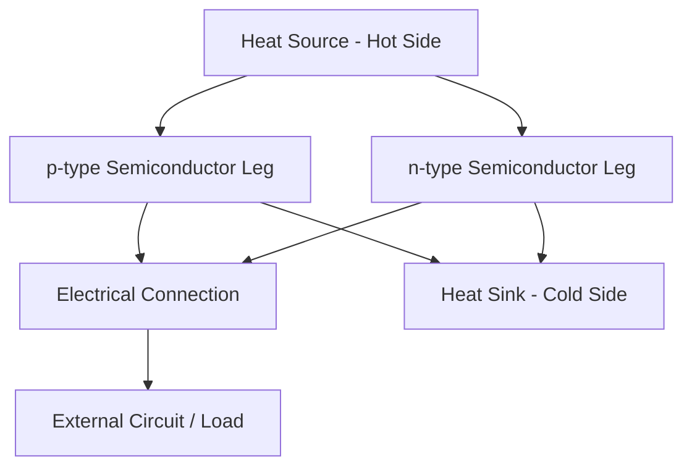

## Thermoelectric Power Generation

### Overview

Thermoelectric power generation converts a temperature gradient directly into electrical energy through solid-state semiconductor devices, with no moving parts, working fluid, or combustion process. The technology exploits the Seebeck effect, in which a temperature difference across certain materials induces a voltage. Thermoelectric generators (TEGs) are valued for their mechanical simplicity, reliability, and scalability, though they are constrained by relatively low conversion efficiency compared to most heat-engine-based technologies.

### Fundamental Thermoelectric Effects

**Seebeck Effect**

When a temperature gradient exists across a conductor or semiconductor, charge carriers (electrons or holes) diffuse from the hot side toward the cold side, establishing an electric field that opposes further diffusion and produces a measurable open-circuit voltage:

$$V = S \, \Delta T$$

Where $S$ is the Seebeck coefficient (V/K) of the material, and $\Delta T$ is the temperature difference between the hot and cold junctions. The Seebeck coefficient is a material-specific property, and its sign indicates whether the majority charge carriers are electrons (n-type, negative $S$) or holes (p-type, positive $S$).

**Peltier Effect**

The reciprocal effect: passing an electric current through a junction of two dissimilar conductors causes heat absorption at one junction and heat release at the other, forming the basis of thermoelectric cooling (Peltier coolers) rather than power generation, though the underlying physics is closely related.

**Thomson Effect**

A less commonly exploited effect describing reversible heat absorption or release when current flows through a single conductor with a temperature gradient along its length.

### Device Architecture

A practical thermoelectric module consists of many p-type and n-type semiconductor legs (pellets) arranged electrically in series (to accumulate voltage) and thermally in parallel (each leg spans the same hot-to-cold temperature gradient), sandwiched between ceramic substrate plates that provide electrical insulation while allowing heat flow through the module.

### Figure of Merit and Material Performance

**Dimensionless Figure of Merit (ZT)**

Thermoelectric material performance is characterized by the dimensionless figure of merit:

$$ZT = \frac{S^2 \sigma}{\kappa} T$$

Where $S$ is the Seebeck coefficient, $\sigma$ is electrical conductivity, $\kappa$ is thermal conductivity, and $T$ is absolute temperature. A higher $ZT$ indicates better thermoelectric performance, requiring the material to simultaneously exhibit high electrical conductivity (to minimize resistive losses), high Seebeck coefficient (to maximize voltage per unit temperature difference), and low thermal conductivity (to sustain the temperature gradient across the device rather than allowing heat to short-circuit through conduction).

These three properties are not independent in most conventional materials—electrical and thermal conductivity are typically correlated (per the Wiedemann-Franz law for the electronic contribution to thermal conductivity), making simultaneous optimization of all three parameters a central and persistent challenge in thermoelectric materials research.

**Common Thermoelectric Materials by Temperature Range**

| Material System | Effective Temperature Range | Approx. Peak ZT | Notes |
| --- | --- | --- | --- |
| Bismuth telluride (Bi₂Te₃) | Near room temperature (up to ~250 °C) | ~1.0–1.2 | Most widely commercialized material |
| Lead telluride (PbTe) | Mid-range (~300–500 °C) | ~1.4–2.0 | Common in mid-temperature waste heat recovery |
| Silicon-germanium (SiGe) | High temperature (>600 °C) | ~0.8–1.3 | Used in radioisotope thermoelectric generators (RTGs) |
| Skutterudites | Mid-to-high (~400–700 °C) | ~1.0–1.7 | Active research area, complex crystal structure enables phonon scattering |
| Half-Heusler alloys | Mid-to-high (~400–700 °C) | ~0.8–1.5 | Good mechanical/thermal stability, active research area |

[Inference: reported peak ZT values vary considerably across the literature depending on doping, nanostructuring approach, and measurement conditions; the ranges above represent broadly cited figures rather than universally agreed constants.]

### Thermodynamic Conversion Efficiency

The theoretical maximum thermoelectric conversion efficiency is bounded by the Carnot efficiency (since a TEG is fundamentally a heat engine operating between two temperature reservoirs, despite lacking mechanical moving parts), modified by a material-dependent factor incorporating ZT:

$$\eta_{max} = \frac{T_H - T_C}{T_H} \times \frac{\sqrt{1 + ZT_{avg}} - 1}{\sqrt{1 + ZT_{avg}} + \frac{T_C}{T_H}}$$

Where $T_H$ and $T_C$ are the hot and cold side absolute temperatures, and $ZT_{avg}$ is the average figure of merit over the operating temperature range. As $ZT \rightarrow \infty$, this expression approaches the Carnot limit; at typical commercial $ZT$ values of approximately 1, actual achievable efficiency is substantially below Carnot, commonly in the range of 5–8% for moderate temperature differentials with bismuth telluride modules.

This equation illustrates why thermoelectric efficiency is fundamentally limited by two independent factors: the Carnot term (governed purely by the temperature differential available) and the material figure-of-merit term (governed by how good the semiconductor material is at sustaining a gradient while conducting current efficiently).

### System-Level Considerations

**Thermal Matching and Heat Exchanger Design**

Because a TEG's performance is fundamentally governed by the temperature differential across the module, effective heat exchanger design on both hot and cold sides is critical; poor thermal contact or inadequate heat sinking on the cold side can substantially erode the effective $\Delta T$ available to the semiconductor legs, regardless of the intrinsic material ZT.

**Electrical Load Matching**

Maximum power transfer from a TEG (as with any real voltage source with internal resistance) occurs when the external load resistance matches the module's internal electrical resistance, though this operating point does not necessarily coincide with maximum conversion efficiency, requiring a design trade-off depending on whether the application prioritizes maximum power output or maximum fuel/heat utilization efficiency.

**Module Degradation**

Sustained operation at high temperature can cause degradation mechanisms including thermal expansion mismatch stress between semiconductor legs and ceramic substrates, dopant diffusion altering material properties over time, and interconnect oxidation, all of which factor into long-term reliability design for TEG applications, particularly those requiring multi-decade unattended operation.

### Key Applications

**Waste Heat Recovery**

Industrial processes, automotive exhaust systems, and power plant flue gas streams reject substantial thermal energy; TEGs can recover a fraction of this otherwise-wasted heat as electricity without requiring moving parts or working fluid maintenance, though the relatively low conversion efficiency and material cost have historically limited large-scale industrial adoption relative to other waste heat recovery approaches (e.g., organic Rankine cycle systems) for higher-grade heat sources.

**Radioisotope Thermoelectric Generators (RTGs)**

A specialized and historically significant application pairing thermoelectric conversion with a radioisotope heat source (commonly plutonium-238), used extensively in deep space missions (Voyager, Cassini, Curiosity/Perseverance rovers) where solar power is impractical due to distance from the sun or mission duration requirements. RTGs are valued in this context for their extreme reliability and multi-decade operational lifetime without maintenance, despite low conversion efficiency, since the alternative (no power source at all in deep space environments) makes even modest conversion efficiency highly valuable.

**Remote and Off-Grid Power**

Small-scale TEG systems, sometimes paired with combustion-based heat sources, provide low-maintenance power for remote sensing equipment, pipeline monitoring, and similar applications where grid connection is impractical and system reliability is prioritized over conversion efficiency or upfront cost.

**Wearable and Body Heat Harvesting**

Emerging applications exploit the small temperature differential between human body heat and ambient environment to power low-power wearable electronics and sensors, though achievable power output is necessarily very low given the small available $\Delta T$.

### Worked Example

**Given:** A bismuth telluride TEG module operates with a hot-side temperature of 200 °C (473 K) and cold-side temperature of 30 °C (303 K), with an average ZT of 1.0 across this range.

**Carnot efficiency limit:**

$$\eta_{Carnot} = \frac{473 - 303}{473} = \frac{170}{473} \approx 36.0\%$$

**Material-limited thermoelectric efficiency:**

$$\eta_{max} = 0.360 \times \frac{\sqrt{1+1} - 1}{\sqrt{1+1} + \frac{303}{473}} = 0.360 \times \frac{1.414 - 1}{1.414 + 0.6405} = 0.360 \times \frac{0.414}{2.055}$$

$$\eta_{max} \approx 0.360 \times 0.2015 \approx 7.3\%$$

This demonstrates the substantial gap between the Carnot limit (36%) and the achievable thermoelectric efficiency (~7.3%) at a practically representative ZT of 1.0, underscoring why continued materials research toward higher-ZT thermoelectric materials remains the primary lever for improving TEG competitiveness against alternative heat-to-power conversion technologies.

### Thermoelectric Module Cross-Section (svg_diagram)

<svg xmlns="http://www.w3.org/2000/svg" viewBox="0 0 640 360" font-family="sans-serif">
<text x="320" y="24" font-size="16" text-anchor="middle" fill="#222">Thermoelectric Module Structure (svg_diagram)</text>
<rect x="100" y="60" width="440" height="30" fill="#c07840" />
<text x="320" y="80" font-size="11" text-anchor="middle" fill="#fff">Hot Side - Ceramic Substrate (TH)</text>
<rect x="130" y="90" width="40" height="140" fill="#e8dcc3" stroke="#333" />
<text x="150" y="165" font-size="10" text-anchor="middle">p</text>
<rect x="190" y="90" width="40" height="140" fill="#c8d9e8" stroke="#333" />
<text x="210" y="165" font-size="10" text-anchor="middle">n</text>
<rect x="250" y="90" width="40" height="140" fill="#e8dcc3" stroke="#333" />
<text x="270" y="165" font-size="10" text-anchor="middle">p</text>
<rect x="310" y="90" width="40" height="140" fill="#c8d9e8" stroke="#333" />
<text x="330" y="165" font-size="10" text-anchor="middle">n</text>
<rect x="370" y="90" width="40" height="140" fill="#e8dcc3" stroke="#333" />
<text x="390" y="165" font-size="10" text-anchor="middle">p</text>
<rect x="430" y="90" width="40" height="140" fill="#c8d9e8" stroke="#333" />
<text x="450" y="165" font-size="10" text-anchor="middle">n</text>
<rect x="100" y="230" width="440" height="30" fill="#2255aa" />
<text x="320" y="250" font-size="11" text-anchor="middle" fill="#fff">Cold Side - Ceramic Substrate (TC)</text>
<line x1="170" y1="90" x2="230" y2="90" stroke="#888" stroke-width="4" />
<line x1="290" y1="90" x2="350" y2="90" stroke="#888" stroke-width="4" />
<line x1="130" y1="230" x2="130" y2="230" stroke="#888" stroke-width="4" />
<line x1="230" y1="230" x2="270" y2="230" stroke="#888" stroke-width="4" />
<line x1="350" y1="230" x2="430" y2="230" stroke="#888" stroke-width="4" />
<line x1="130" y1="230" x2="90" y2="290" stroke="#333" stroke-width="2" />
<text x="70" y="305" font-size="10">-</text>
<line x1="470" y1="230" x2="510" y2="290" stroke="#333" stroke-width="2" />
<text x="505" y="305" font-size="10">+</text>
</svg>

**Related Topics**

- Nanostructured thermoelectric materials (superlattices, quantum dots)
- Radioisotope thermoelectric generator design (RTG)
- Automotive exhaust waste heat recovery systems
- Skutterudite and half-Heusler alloy development
- Thermoelectric cooling (Peltier device) applications
- Phonon engineering for thermal conductivity reduction
- Segmented and cascaded TEG designs for wide temperature ranges
- Comparison with organic Rankine cycle waste heat recovery