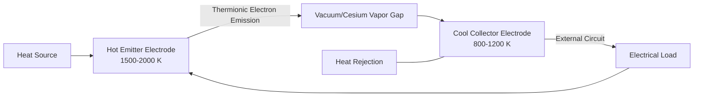

## Thermionic Energy Conversion

### Overview

Thermionic energy conversion is a direct heat-to-electricity conversion technology that exploits thermionic emission—the phenomenon in which electrons are emitted from a heated metal or semiconductor surface once thermal energy imparted to electrons exceeds the material's work function. Like thermoelectric generation, thermionic conversion has no moving parts and operates as a solid-state (or near-vacuum) heat engine, but it requires substantially higher source temperatures than thermoelectric devices to achieve meaningful electron emission rates, positioning it as a high-temperature niche technology rather than a broadly deployed one.

### Fundamental Principle

**Thermionic Emission**

When a metal or semiconductor is heated, the thermal energy distribution of conduction electrons broadens (following Fermi-Dirac statistics), and a fraction of electrons acquire sufficient kinetic energy to overcome the material's work function—the energy barrier confining electrons within the material—and escape from the surface into vacuum or a low-pressure gas gap.

**Richardson-Dushman Equation**

The thermionic emission current density from a heated emitter is described by:

$$J = A T^2 e^{-\frac{\phi}{k_B T}}$$

Where $J$ is emission current density (A/m²), $A$ is the Richardson constant (a material-dependent parameter, theoretically around $1.2 \times 10^6\ \text{A/m}^2\text{K}^2$ for free electrons, though actual material values differ due to surface and band structure effects), $\phi$ is the material work function (eV), $k_B$ is the Boltzmann constant, and $T$ is absolute emitter temperature.

This exponential temperature dependence explains why thermionic converters require very high emitter temperatures (typically 1500–2000 K) to achieve practically useful emission current densities, since emission current increases exponentially with temperature but only as $T^2$ pre-exponentially.

### Device Architecture

A basic thermionic converter consists of two electrodes separated by a narrow gap (typically fractions of a millimeter to a few millimeters):

- **Emitter (cathode):** The hot electrode, heated to high temperature by the heat source, from which electrons are thermionically emitted
- **Collector (anode):** The cooler electrode, at substantially lower temperature, which collects emitted electrons
- **Interelectrode gap:** The space between emitter and collector, which may be vacuum or filled with a low-pressure cesium vapor

The electron flow from hot emitter to cool collector, driven purely by the thermal emission process, constitutes the useful electrical current when the circuit is closed through an external load.

### The Space Charge Problem and Cesium Vapor Solution

**Space Charge Limitation**

In a pure vacuum gap, electrons emitted from the hot emitter accumulate in the interelectrode space faster than they can be collected, forming a negative space charge cloud that repels subsequently emitted electrons back toward the emitter. This space charge effect severely limits achievable current density and net power output in a simple vacuum-gap design, particularly as gap spacing increases.

**Cesium Vapor Neutralization**

The practical solution, used in essentially all functional thermionic converters, introduces low-pressure cesium vapor into the interelectrode gap. Cesium atoms, having a low ionization potential, become thermally ionized (surface ionization at the hot emitter, and to a lesser extent volume ionization in the gap), producing positive cesium ions that partially neutralize the electron space charge, substantially improving achievable current density relative to a vacuum-gap design. Cesium vapor additionally serves a second function: cesium adsorption onto the electrode surfaces lowers the effective work function of both emitter and collector materials, further improving emission characteristics.

### Thermodynamic Efficiency Considerations

**Conversion Efficiency Factors**

Thermionic conversion efficiency depends on:

- The output voltage achievable (governed by the difference between emitter and collector work functions, modified by the "motive" or barrier distribution across the interelectrode gap, including the space-charge-related barrier)
- Radiative heat loss from the hot emitter to the cooler collector (a significant loss mechanism given the high absolute temperatures involved, since radiative heat transfer scales with the fourth power of temperature)
- Electron back-emission from the collector (typically small if the collector work function and temperature are well below the emitter's)

**Theoretical vs. Practical Efficiency**

Like thermoelectric conversion, a thermionic converter is fundamentally bounded by the Carnot efficiency between emitter and collector temperatures, but practical achieved efficiencies are considerably lower due to the combined effects of electrode work function limitations, radiative heat losses, and cesium-related voltage drop (the "cesium drop," an inherent voltage loss associated with the ionization/neutralization mechanism required to overcome space charge). Reported practical thermionic converter efficiencies in experimental and demonstrated systems have generally fallen in the range of roughly 5–15%, though this depends strongly on emitter/collector temperature differential and electrode material selection. [Unverified: efficiency figures reported across different research programs and eras vary considerably, and thermionic conversion has seen limited large-scale commercial deployment relative to thermoelectric technology, so representative "typical" efficiency figures should be treated as illustrative rather than a settled industry benchmark.]

### Comparison with Thermoelectric Conversion

| Characteristic | Thermionic | Thermoelectric |
| --- | --- | --- |
| Operating temperature | Very high (1500–2000 K emitter) | Moderate (typically <1300 K) |
| Conversion mechanism | Electron emission across a gap | Solid-state charge carrier diffusion |
| Physical form | Vacuum/vapor gap device | Solid semiconductor legs |
| Typical efficiency | ~5–15% (application-dependent) | ~5–8% (commercial Bi₂Te₃ modules) |
| Power density | Potentially high at high temperature | Generally lower |
| Commercial maturity | Limited, largely niche/research/specialty | More commercially mature (Bi₂Te₃ modules widely available) |
| Primary historical application | Space power (nuclear-thermionic), high-temp industrial | Space power (RTGs), waste heat recovery |

### Key Applications

**Space Nuclear Power**

Thermionic conversion has historically been of particular interest for space nuclear power systems, where the high emitter temperatures required align relatively well with nuclear reactor core temperatures, and the technology's simplicity (no moving parts, no working fluid) suits the reliability requirements of unattended space operation. Notable historical programs include Soviet-era TOPAZ space nuclear reactor systems, which employed in-core thermionic conversion.

**High-Temperature Industrial Waste Heat**

Because thermionic conversion requires very high source temperatures to be effective, its industrial waste heat recovery applicability is limited to high-grade heat sources (e.g., certain furnace or combustion applications) rather than the broader range of moderate-temperature waste heat streams thermoelectric or Rankine-cycle-based recovery technologies can address.

**Concentrated Solar Thermionic Systems**

Research interest exists in combining concentrated solar thermal collectors (capable of reaching the high temperatures thermionic emitters require) with thermionic conversion as an alternative or complement to photovoltaic or solar-thermal-Rankine approaches, though this remains a comparatively less mature research area relative to established concentrated solar power technologies. [Speculation: commercial viability and deployment timelines for solar-thermionic hybrid systems remain uncertain given the technology's overall developmental stage.]

### Advanced/Hybrid Configurations

**Thermionic-Thermoelectric Hybrid (Multi-stage) Systems**

Since thermionic converters require very high hot-side temperatures but reject heat at temperatures still well above ambient, cascading a thermionic converter's rejected heat into a secondary thermoelectric (or other lower-temperature conversion) stage is a design approach explored to extract additional useful work from the overall temperature drop, improving total system utilization of the available temperature differential.

**Photon-Enhanced Thermionic Emission (PETE)**

A more recent hybrid concept combining photovoltaic and thermionic effects: photon absorption in a semiconductor emitter both generates electron-hole pairs (as in conventional photovoltaics) and elevates emitter temperature, with the combined photo-excitation and thermal excitation together enhancing electron emission over the material's work function barrier, potentially enabling higher combined conversion efficiency than either photovoltaic or thermionic conversion alone at very high operating temperatures. [Inference: PETE remains predominantly a research-stage concept, and reported efficiency improvements are based on theoretical modeling and early experimental demonstrations rather than established commercial-scale performance.]

### Worked Example

**Given:** A cesium vapor thermionic converter has an emitter temperature of 1800 K, collector temperature of 1000 K, emitter work function (with cesium coverage) of 1.6 eV, and an output voltage of 0.7 V under load.

**Carnot efficiency limit:**

$$\eta_{Carnot} = \frac{1800 - 1000}{1800} = \frac{800}{1800} \approx 44.4\%$$

**Emission current density** (illustrative calculation using the Richardson-Dushman equation, with $A = 1.2 \times 10^6\ \text{A/m}^2\text{K}^2$, $k_B = 8.617 \times 10^{-5}\ \text{eV/K}$):

$$\frac{\phi}{k_B T} = \frac{1.6}{8.617 \times 10^{-5} \times 1800} \approx \frac{1.6}{0.1551} \approx 10.31$$

$$J = 1.2 \times 10^6 \times (1800)^2 \times e^{-10.31}$$

$$J \approx 1.2 \times 10^6 \times 3.24 \times 10^6 \times 3.32 \times 10^{-5} \approx 1.29 \times 10^8 \times 3.32 \times 10^{-5} \approx 4{,}300\ \text{A/m}^2$$

This illustrates the strongly nonlinear (exponential) sensitivity of achievable emission current density to both emitter temperature and work function, underscoring why practical thermionic converter design centers heavily on emitter material and cesium coverage optimization to minimize effective work function at the chosen operating temperature. [Inference: this is a simplified illustrative calculation using the idealized Richardson-Dushman relation; actual achieved current density in a real cesium-vapor device deviates from this ideal-emission figure due to space-charge effects, surface non-uniformity, and cesium coverage-dependent work function variation not captured in this basic formula.]

### Thermionic Converter Schematic (svg_diagram)

<svg xmlns="http://www.w3.org/2000/svg" viewBox="0 0 640 340" font-family="sans-serif">
<text x="320" y="24" font-size="16" text-anchor="middle" fill="#222">Cesium Vapor Thermionic Converter (svg_diagram)</text>
<rect x="100" y="60" width="80" height="200" fill="#c07840" stroke="#333" stroke-width="2" />
<text x="140" y="150" font-size="10" text-anchor="middle" fill="#fff" transform="rotate(-90 140 150)">Emitter 1800K</text>
<rect x="180" y="60" width="120" height="200" fill="#e8dcc3" stroke="#333" stroke-width="1" stroke-dasharray="3,2" />
<text x="240" y="100" font-size="9" text-anchor="middle">Cs vapor</text>
<text x="240" y="115" font-size="9" text-anchor="middle">gap</text>
<circle cx="220" cy="150" r="3" fill="#2255aa" />
<circle cx="260" cy="170" r="3" fill="#2255aa" />
<circle cx="230" cy="200" r="3" fill="#2255aa" />
<text x="240" y="230" font-size="8" text-anchor="middle">e- flow</text>
<rect x="300" y="60" width="80" height="200" fill="#2255aa" stroke="#333" stroke-width="2" />
<text x="340" y="150" font-size="10" text-anchor="middle" fill="#fff" transform="rotate(-90 340 150)">Collector 1000K</text>
<line x1="140" y1="260" x2="140" y2="300" stroke="#333" stroke-width="2" />
<line x1="140" y1="300" x2="500" y2="300" stroke="#333" stroke-width="2" />
<line x1="500" y1="300" x2="500" y2="150" stroke="#333" stroke-width="2" />
<line x1="500" y1="150" x2="380" y2="150" stroke="#333" stroke-width="2" />
<rect x="450" y="280" width="50" height="40" fill="none" stroke="#333" stroke-width="2" />
<text x="475" y="303" font-size="9" text-anchor="middle">Load</text>
</svg>

**Related Topics**

- Cesium reservoir design and vapor pressure control
- TOPAZ and SP-100 space nuclear-thermionic reactor programs
- Photon-enhanced thermionic emission (PETE) research
- Work function engineering and electrode surface coatings
- Radiative heat transfer minimization in high-temperature converters
- Comparison of direct energy conversion technologies (thermoelectric vs. thermionic vs. fuel cells)
- Concentrated solar thermal-thermionic hybrid systems
- Space charge mitigation techniques in vacuum electron devices