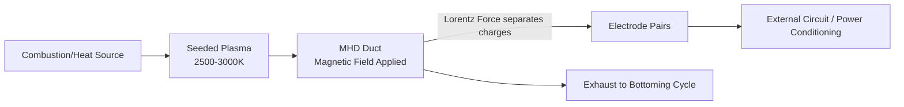
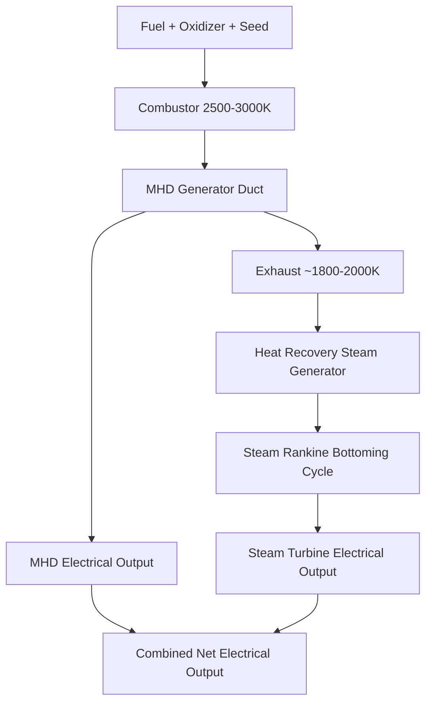

## Magnetohydrodynamic Power Generation

### Overview

Magnetohydrodynamic (MHD) power generation converts the kinetic energy of a high-velocity, electrically conductive fluid directly into electrical energy by passing the fluid through a magnetic field, inducing an electromotive force per Faraday's law of electromagnetic induction. Unlike conventional turbogenerators, which require a mechanical rotor and bearings, MHD generators have no moving mechanical parts in the power conversion stage itself, enabling operation at gas temperatures well beyond the metallurgical limits of turbine blades, which is the technology's principal thermodynamic advantage.

### Fundamental Operating Principle

**Faraday's Law Applied to a Moving Conductive Fluid**

When an electrically conductive fluid (typically an ionized gas, or plasma) moves with velocity $\vec{u}$ through a magnetic field $\vec{B}$, the free charge carriers experience a Lorentz force that separates positive and negative charges, generating an electric field:

$$\vec{E} = \vec{u} \times \vec{B}$$

This induced electric field drives current through electrodes placed in the flow, delivering power to an external circuit in essentially the same physical mechanism as a conventional rotating generator, except that the "rotor" is the flowing conductive fluid itself rather than a solid mechanical structure.

### Electrical Conductivity and Seeding

**The Conductivity Challenge**

For the Lorentz force mechanism to generate meaningfully useful current, the working fluid must possess sufficient electrical conductivity, which in turn requires a meaningful density of free charge carriers (ions and electrons). Ordinary combustion gas at typical flame temperatures has very low electrical conductivity, since thermal ionization of common combustion product molecules (CO₂, H₂O, N₂) is negligible at these temperatures.

**Seed Material**

Practical MHD generators address this by introducing a small quantity of an easily ionized "seed" material—commonly potassium carbonate or cesium compounds—into the working gas stream. Alkali metals like potassium and cesium have comparatively low first ionization energies, allowing them to thermally ionize at gas temperatures the surrounding combustion products themselves would not, substantially raising the bulk mixture's electrical conductivity even though the seed material constitutes only a small mass fraction (typically around 1% by mass) of the total working fluid.

**Conductivity-Temperature Relationship**

Plasma electrical conductivity increases strongly with temperature (following approximately an exponential dependence related to the Saha ionization equation governing thermal ionization equilibrium), which is why MHD generators require very high working fluid temperatures, typically in the range of 2500–3000 K, substantially above the temperature limits of conventional gas turbine blade materials, to achieve conductivity levels sufficient for practical power extraction.

### Generator Configurations

**Faraday Generator**

The simplest configuration, using continuous electrodes along the top and bottom (or sides) of the duct, perpendicular to both flow direction and magnetic field, collecting the Hall-effect-free component of induced current directly. A practical limitation is that the Hall effect (current deflection caused by the magnetic field acting on the already-flowing current, in addition to the fluid) causes non-uniform current distribution along the electrode length in a simple continuous-electrode Faraday design, motivating segmented electrode approaches.

**Segmented Faraday Generator**

Divides the electrode surfaces into multiple electrically isolated segments along the flow direction, each connected to its own external load, mitigating the current short-circuiting effects the Hall effect would otherwise cause between different points along a continuous electrode, at the cost of increased electrical and mechanical complexity.

**Hall Generator**

Configured to intentionally exploit rather than suppress the Hall effect, collecting current along the flow direction (rather than perpendicular to it) using electrodes at the duct's upstream and downstream ends, offering a simpler electrical output configuration (effectively producing a single output voltage rather than requiring management of many segmented electrode pairs) at some efficiency trade-off relative to an ideally segmented Faraday design.

### Thermodynamic Cycle Integration

**MHD Topping Cycle**

MHD generators are generally conceived not as standalone power plants but as a "topping cycle" operating at the highest temperature stage of a combined power system, with the still-hot exhaust from the MHD duct (having given up only a portion of its thermal energy to the MHD conversion process) subsequently directed into a conventional steam Rankine bottoming cycle to extract additional useful work from the remaining thermal energy before final heat rejection.

This topping-cycle configuration is thermodynamically attractive because the MHD stage effectively extends the peak cycle temperature well beyond conventional gas turbine material limits, and since overall combined-cycle efficiency benefits strongly from a higher peak cycle temperature (per general Rankine/Brayton combined cycle thermodynamic principles), MHD topping has historically been proposed as a pathway to substantially higher overall thermal-to-electric conversion efficiency than either an MHD or a conventional steam cycle alone could achieve. [Inference: while the underlying thermodynamic argument for MHD topping cycles is well-established in the literature, the technology has seen very limited actual commercial-scale deployment, so claimed combined-cycle efficiency improvements remain largely based on theoretical and pilot-scale studies rather than extensive operational data.]

### Power Output Estimation

**Simplified Power Density Relation**

The power extracted per unit volume of MHD duct can be approximated as:

$$\frac{P}{V} \approx \sigma u^2 B^2 K(1-K)$$

Where $\sigma$ is plasma electrical conductivity, $u$ is flow velocity, $B$ is magnetic flux density, and $K$ is the "loading factor" (ratio of actual electrode voltage to the open-circuit induced voltage $uB$, analogous to load matching), with maximum power density occurring at $K = 0.5$ in this simplified relation, though optimizing for maximum efficiency rather than maximum power typically favors a different operating point.

This relationship illustrates the strong sensitivity of MHD power density to both flow velocity and magnetic field strength (both appearing squared), explaining the historical interest in high-velocity (often supersonic) flow designs and strong superconducting magnet systems for MHD generator development.

### Key Engineering Challenges

**Electrode Erosion and Materials**

The combination of extremely high gas temperature, corrosive seed material (particularly potassium/cesium compounds and their combustion byproducts), and high current density at the electrode surface creates a severe materials challenge; electrode erosion and degradation have historically been among the most persistent obstacles to achieving long-duration commercial MHD generator operation.

**Magnet System Requirements**

Achieving practically useful power density requires strong magnetic fields (often requiring superconducting magnet technology for the field strengths of interest), adding substantial capital cost and system complexity, including cryogenic cooling infrastructure for the superconducting coils.

**Seed Material Recovery**

Because seed material represents an ongoing operating cost and, if released to atmosphere, an emissions concern, practical MHD plant designs generally require seed recovery and recycling systems downstream of the MHD duct and bottoming cycle, adding further system complexity.

**Scale and Duct Design**

MHD duct geometry (typically diverging along the flow direction to accommodate gas expansion and deceleration as static pressure decreases) must balance flow velocity, magnetic field geometry, and electrode configuration across the duct length, representing a complex multi-physics design problem coupling fluid dynamics, plasma physics, and electromagnetic field interactions.

### Application Domains

**Central Station Power Generation (Coal/Fossil-Fired)**

Historically the primary envisioned application, using open-cycle combustion of coal or other fossil fuel with seeded combustion products as the MHD working fluid, coupled to a steam bottoming cycle. Significant pilot-scale research programs were pursued in the United States, Soviet Union, and Japan from the 1960s through the 1990s, though commercial-scale deployment has not materialized, primarily due to the persistent electrode durability and overall system cost challenges relative to increasingly efficient combined-cycle gas turbine alternatives.

**Pulsed/Explosive MHD Power (Specialty)**

A distinct application area using explosively or chemically driven high-velocity plasma pulses to generate very high instantaneous power for short-duration specialty applications (such as certain military or scientific pulsed-power research applications), a substantially different engineering regime from continuous central-station power generation.

**Closed-Cycle (Liquid Metal or Noble Gas) MHD**

An alternative configuration using a closed-loop working fluid (liquid metal, or a noble gas seeded with an easily ionized additive) rather than open-cycle combustion products, of interest for certain space power and specialized high-temperature nuclear-coupled power concepts, offering potentially reduced electrode erosion relative to combustion-seeded open-cycle designs, though this remains a comparatively less mature technology path. [Speculation: practical deployment timelines and ultimate technical viability for closed-cycle MHD concepts remain uncertain given the limited scale of demonstration to date.]

### Worked Example

**Given:** An MHD duct section has plasma conductivity $\sigma = 10\ \text{S/m}$, flow velocity $u = 800\ \text{m/s}$, magnetic flux density $B = 4\ \text{T}$, operating at the maximum power density loading factor $K = 0.5$, over a duct volume of 2 m³.

**Power density:**

$$\frac{P}{V} = \sigma u^2 B^2 K(1-K) = 10 \times (800)^2 \times (4)^2 \times 0.5 \times 0.5$$

$$\frac{P}{V} = 10 \times 640{,}000 \times 16 \times 0.25 = 10 \times 640{,}000 \times 4 = 25{,}600{,}000\ \text{W/m}^3$$

$$\frac{P}{V} = 25.6\ \text{MW/m}^3$$

**Total power extracted:**

$$P = 25.6\ \text{MW/m}^3 \times 2\ \text{m}^3 = 51.2\ \text{MW}$$

This illustrates the theoretically high power density achievable in an MHD duct given adequate conductivity, velocity, and magnetic field strength, though achieving and sustaining the plasma conductivity value assumed here in practice depends critically on maintaining sufficient seed ionization and gas temperature throughout the duct, which represents a substantial practical engineering challenge distinct from this idealized power density calculation.

### MHD Generator Duct Schematic (svg_diagram)

<svg xmlns="http://www.w3.org/2000/svg" viewBox="0 0 680 340" font-family="sans-serif">
<text x="340" y="24" font-size="16" text-anchor="middle" fill="#222">Segmented Faraday MHD Duct (svg_diagram)</text>
<path d="M80,120 L560,100 L560,220 L80,240 Z" fill="#c07840" fill-opacity="0.5" stroke="#333" stroke-width="2" />
<text x="320" y="175" font-size="11" text-anchor="middle">Seeded Plasma Flow →</text>
<rect x="120" y="95" width="60" height="15" fill="#333" />
<rect x="120" y="230" width="60" height="15" fill="#333" />
<rect x="220" y="95" width="60" height="15" fill="#333" />
<rect x="220" y="230" width="60" height="15" fill="#333" />
<rect x="320" y="100" width="60" height="15" fill="#333" />
<rect x="320" y="230" width="60" height="15" fill="#333" />
<rect x="420" y="102" width="60" height="15" fill="#333" />
<rect x="420" y="225" width="60" height="15" fill="#333" />
<text x="60" y="85" font-size="10">N</text>
<text x="60" y="255" font-size="10">S</text>
<line x1="40" y1="90" x2="40" y2="250" stroke="#2255aa" stroke-width="2" marker-end="url(#arrow)" />
<text x="600" y="80" font-size="10">B field into page</text>
<text x="150" y="280" font-size="9">Segment 1</text>
<text x="250" y="280" font-size="9">Segment 2</text>
<text x="350" y="280" font-size="9">Segment 3</text>
<text x="450" y="280" font-size="9">Segment 4</text>
</svg>

**Related Topics**

- Combustion MHD topping cycle plant designs (historical pilot programs)
- Superconducting magnet systems for MHD applications
- Alkali metal seed recovery and recycling
- Hall effect and plasma electrode interaction physics
- Combined-cycle power plant thermodynamics
- Closed-cycle liquid metal MHD for space power
- Plasma electrical conductivity and Saha ionization equation
- Pulsed power and explosive MHD generator systems