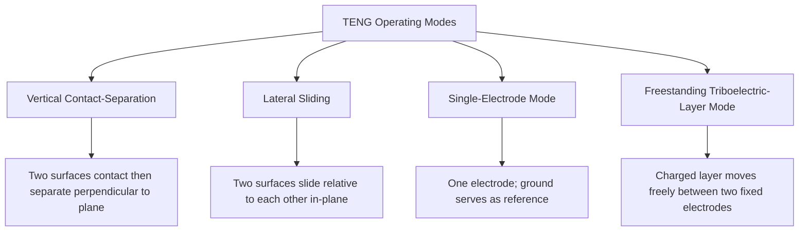

## Piezoelectric and Triboelectric Energy Harvesting

### Overview

Piezoelectric and triboelectric energy harvesting are two distinct mechanical-to-electrical direct energy conversion technologies that convert ambient mechanical energy—vibration, pressure, strain, or friction—into usable electrical energy. Unlike heat-engine or thermally-driven direct conversion technologies, both mechanisms operate at or near room temperature and typically address low-power applications (microwatts to milliwatts, occasionally higher in specialized designs), most commonly self-powered sensors, wearable electronics, and structural health monitoring systems, rather than grid-scale power generation.

### Piezoelectric Energy Harvesting

**Fundamental Principle**

The piezoelectric effect describes the generation of an electric charge (or voltage) in certain crystalline and ceramic materials in response to applied mechanical stress, and conversely, mechanical deformation in response to an applied electric field (the converse piezoelectric effect). This behavior arises from the asymmetric, non-centrosymmetric crystal structure of piezoelectric materials, in which mechanical deformation shifts the relative positions of positive and negative charge centers within the unit cell, producing a net electric dipole moment and corresponding surface charge.

**Constitutive Relations**

Piezoelectric behavior is described by coupled electromechanical constitutive equations relating mechanical stress/strain to electrical displacement/field:

$$D = d \cdot T + \varepsilon^T E$$

$$S = s^E \cdot T + d \cdot E$$

Where $D$ is electric displacement, $T$ is mechanical stress, $E$ is electric field, $S$ is mechanical strain, $d$ is the piezoelectric charge constant (coupling coefficient), $\varepsilon^T$ is permittivity at constant stress, and $s^E$ is mechanical compliance at constant electric field. The piezoelectric charge constant $d$ (commonly expressed in pC/N) is a primary figure of merit determining the electrical output achievable for a given mechanical input.

**Common Piezoelectric Materials**

| Material | Type | Notes |
| --- | --- | --- |
| Lead zirconate titanate (PZT) | Ceramic | High piezoelectric coefficient, widely used industrially, contains lead (environmental/regulatory concern in some applications) |
| Polyvinylidene fluoride (PVDF) | Polymer | Flexible, lower coupling coefficient than PZT, well-suited to conformal/wearable applications |
| Quartz | Natural crystal | Very stable, low coupling coefficient, historically important for precision timing and sensing rather than power harvesting |
| Lead-free ceramics (e.g., BaTiO₃, KNN-based) | Ceramic | Developed to address environmental concerns with lead-containing PZT, generally with somewhat lower coupling coefficients than PZT to date |
| Zinc oxide (ZnO) | Semiconductor/piezoelectric | Used in nanostructured (nanowire/nanogenerator) harvesting devices |

**Device Configurations**

- **Cantilever beam harvesters:** A piezoelectric layer bonded to a flexible cantilever beam, often with a tip mass added to tune the resonant frequency toward the ambient vibration source, converting bending strain into charge; this is the most common configuration for vibration energy harvesting
- **Stack/multilayer harvesters:** Multiple piezoelectric layers stacked and electrically connected in parallel or series, used for direct compressive force harvesting (e.g., footstep or pressure-based harvesting)
- **Bimorph configurations:** Two piezoelectric layers bonded on opposite sides of a central shim, allowing one layer to be in tension while the other is in compression during bending, increasing charge output relative to a single (unimorph) layer for the same deflection

**Resonance and Bandwidth**

Cantilever-type piezoelectric harvesters achieve maximum power output when the ambient vibration frequency matches the device's mechanical resonant frequency, giving these devices inherently narrow effective operating bandwidth—a significant practical limitation, since real-world vibration sources (machinery, structural vibration, human motion) often exhibit variable or broadband frequency content rather than a single steady frequency. Broadband and frequency-tunable harvester designs (using nonlinear stiffness elements, multi-modal beam geometries, or mechanically adjustable resonant frequency) are an active area of design effort to address this limitation.

### Triboelectric Energy Harvesting

**Fundamental Principle**

The triboelectric effect describes the generation of surface electric charge when two dissimilar materials come into contact and then separate, arising from differences in the materials' relative tendency to gain or lose electrons (their position on the triboelectric series). Triboelectric nanogenerators (TENGs) exploit this contact electrification effect in combination with electrostatic induction: as charged surfaces move relative to a pair of electrodes, the changing charge distribution induces a corresponding current flow in an external circuit connecting those electrodes.

**Triboelectric Series**

Materials can be ranked along a triboelectric series, from strongly electron-donating (tending to become positively charged upon contact, e.g., certain fabrics, glass) to strongly electron-accepting (tending to become negatively charged, e.g., PTFE/Teflon, certain fluoropolymers). Selecting a material pair with a large separation on the triboelectric series generally increases the magnitude of charge transfer and resulting electrical output achievable from a given TENG design.

**TENG Operating Modes**

TENGs are commonly classified into four fundamental operating modes based on device geometry and relative motion:

- **Vertical contact-separation mode:** Two triboelectric layers periodically contact and separate along the direction perpendicular to their interface, generating an alternating current as the gap distance (and thus induced charge on the electrodes) cyclically changes
- **Lateral sliding mode:** Two surfaces in continuous contact slide relative to each other in-plane, generating charge through the changing contact area/overlap between complementary electrode patterns
- **Single-electrode mode:** Uses only one electrode on the device itself, with the surrounding environment (or ground) serving as the reference for the induced current, useful for applications where attaching a second electrode to a moving external object is impractical (e.g., harvesting energy from a person's footsteps via a device attached only to their shoe)
- **Freestanding triboelectric-layer mode:** A charged dielectric layer moves freely between two fixed, separated electrodes, inducing alternating current without requiring the moving layer itself to be electrically connected to the circuit

**Output Characteristics**

TENGs are generally characterized by high output voltage (often hundreds of volts to low kilovolts under open-circuit conditions) but comparatively low output current, resulting in high internal source impedance; this characteristic strongly shapes power conditioning circuit design requirements (rectification and impedance matching/power management circuitry) for practical TENG-based systems.

### Comparative Summary

| Characteristic | Piezoelectric | Triboelectric |
| --- | --- | --- |
| Underlying mechanism | Bulk crystal/ceramic polarization under stress | Surface contact electrification + electrostatic induction |
| Typical output voltage | Low to moderate | High (often hundreds of V) |
| Typical output current | Relatively higher (of the two) | Low |
| Source impedance | Moderate | Very high |
| Frequency response | Best near mechanical resonance (narrowband) | Can operate effectively across a broader range of motion frequencies and types |
| Material cost/availability | PZT ceramics and manufacturing infrastructure well established | Simple, often low-cost polymer/metal material pairs |
| Common application niches | Vibration harvesting, structural sensors, some footstep/pavement harvesting | Wearables, self-powered sensors, blue energy (wave) harvesting research |

**Hybrid Piezoelectric-Triboelectric Devices**

Because the two mechanisms respond somewhat differently to mechanical input characteristics (piezoelectric response tends to favor strain-inducing deformation, while triboelectric response favors contact-separation or sliding motion), hybrid nanogenerator designs combining both mechanisms within a single device structure have been explored as a way to capture complementary aspects of the same mechanical input and improve overall harvested power relative to either mechanism alone. [Inference: reported performance improvements from hybridization are generally demonstrated at laboratory/prototype scale in the literature, and the degree of benefit is design- and application-specific rather than a universal multiplier.]

### Power Conditioning and Management

Because both piezoelectric and triboelectric harvesters typically produce low-power, variable-amplitude AC output (and TENGs in particular present very high source impedance), practical harvesting systems generally require dedicated power management circuitry:

- **Rectification:** AC-to-DC conversion, commonly using a full-bridge rectifier, though the high-impedance, pulsed nature of TENG output in particular has motivated specialized rectifier and impedance-matching circuit topologies beyond simple diode bridges
- **Impedance matching:** Since maximum power transfer requires the electrical load impedance to be matched to the harvester's (often high and reactive) source impedance, dedicated impedance-matching or maximum-power-point-tracking circuits are commonly used to improve net energy extraction relative to a fixed, unmatched load
- **Energy storage buffering:** Given the typically intermittent, variable-amplitude nature of ambient mechanical energy sources, harvested energy is commonly buffered in a supercapacitor or rechargeable battery before being made available to the end application, smoothing the mismatch between harvesting and load power profiles

### Key Applications

**Self-Powered Wireless Sensor Nodes**

Both technologies are widely explored for powering low-duty-cycle wireless sensors (structural health monitoring, environmental sensing, condition monitoring on rotating machinery) in locations where battery replacement is impractical or where energy harvesting can substantially extend maintenance intervals relative to a battery-only power source.

**Wearable and Biomechanical Energy Harvesting**

Harvesting energy from human motion (walking, joint movement, respiration) for wearable electronics and implantable medical device power, an application area particularly suited to triboelectric devices given their favorable output characteristics for the relatively low-frequency, variable motion patterns characteristic of human biomechanics.

**Structural and Infrastructure Sensing**

Piezoelectric harvesters embedded in or attached to bridges, pavement, and other infrastructure to power self-contained structural health monitoring sensors from ambient traffic-induced vibration or, in some pavement harvesting concepts, direct pressure from vehicle loading.

**Blue Energy (Ocean Wave) Harvesting Research**

TENG networks have been proposed as a potential approach to harvesting distributed, low-frequency ocean wave energy at scale, motivated by TENGs' favorable response to the relatively low-frequency, irregular motion characteristic of ocean waves relative to piezoelectric harvesters' narrowband resonant response. [Speculation: large-scale, economically competitive deployment of TENG-based wave energy harvesting remains at an early research and demonstration stage, and its ultimate viability relative to established wave energy conversion technologies is not yet established.]

### Worked Example (Piezoelectric Cantilever)

**Given:** A PZT cantilever harvester has a piezoelectric charge constant $d_{31} = 190\ \text{pC/N}$, is subjected to an effective applied stress of $2\times10^6\ \text{N/m}^2$ over an active electrode area of $2\times10^{-4}\ \text{m}^2$, and the device capacitance is 15 nF.

**Generated charge:**

Using the simplified relation $Q = d_{31} \times F$, where force $F = \text{stress} \times \text{area}$:

$$F = 2\times10^6 \times 2\times10^{-4} = 400\ \text{N}$$

$$Q = 190\times10^{-12}\ \text{C/N} \times 400\ \text{N} = 7.6\times10^{-8}\ \text{C} = 76\ \text{nC}$$

**Open-circuit voltage:**

$$V = \frac{Q}{C} = \frac{7.6\times10^{-8}}{15\times10^{-9}} \approx 5.07\ \text{V}$$

This illustrates the typically modest voltage output of a single piezoelectric element under realistic mechanical loading, underscoring why practical harvester designs often incorporate multiple elements (series/parallel stacking) or dedicated voltage step-up power management circuitry to reach voltage levels useful for charging storage elements or powering downstream electronics. [Inference: this is a simplified static-loading calculation; actual dynamic (vibration-driven) piezoelectric harvester output additionally depends on resonant amplification and mechanical damping effects not captured in this basic charge-constant relation.]

### Piezoelectric and Triboelectric Device Schematics (svg_diagram)

<svg xmlns="http://www.w3.org/2000/svg" viewBox="0 0 680 380" font-family="sans-serif">
<text x="340" y="24" font-size="16" text-anchor="middle" fill="#222">Harvester Mechanisms (svg_diagram)</text>
<text x="170" y="55" font-size="12" text-anchor="middle" font-weight="bold">Piezoelectric Cantilever</text>
<rect x="80" y="80" width="180" height="10" fill="#c8d9e8" stroke="#333" />
<rect x="80" y="90" width="180" height="6" fill="#a85c32" />
<rect x="60" y="70" width="20" height="40" fill="#555" />
<circle cx="250" cy="70" r="12" fill="#888" />
<path d="M80,96 Q170,150 250,96" stroke="#999" stroke-width="1" fill="none" stroke-dasharray="3,2" />
<text x="170" y="130" font-size="9" text-anchor="middle">Bending strain -&gt; charge</text>
<text x="510" y="55" font-size="12" text-anchor="middle" font-weight="bold">Triboelectric (Contact-Sep)</text>
<rect x="420" y="80" width="180" height="20" fill="#e8dcc3" stroke="#333" />
<text x="510" y="94" font-size="9" text-anchor="middle">Electrode + Dielectric A</text>
<rect x="420" y="150" width="180" height="20" fill="#c07840" stroke="#333" />
<text x="510" y="164" font-size="9" text-anchor="middle">Electrode + Dielectric B</text>
<line x1="510" y1="100" x2="510" y2="150" stroke="#333" stroke-width="1" stroke-dasharray="4,3" />
<text x="530" y="128" font-size="9">gap</text>
<line x1="600" y1="90" x2="640" y2="90" stroke="#2255aa" stroke-width="2" />
<line x1="600" y1="160" x2="640" y2="160" stroke="#2255aa" stroke-width="2" />
<line x1="640" y1="90" x2="640" y2="160" stroke="#2255aa" stroke-width="2" />
<rect x="620" y="115" width="30" height="20" fill="none" stroke="#333" />
<text x="635" y="128" font-size="8" text-anchor="middle">Load</text>
</svg>

**Related Topics**

- Piezoelectric material figures of merit and coupling coefficients
- TENG output rectification and impedance-matching circuit design
- Wearable and implantable medical device energy harvesting
- Vibration energy harvesting resonant frequency tuning techniques
- Triboelectric series material selection
- Structural health monitoring self-powered sensor networks
- Comparison with electromagnetic (Faraday-induction) vibration harvesters
- Blue energy / ocean wave triboelectric harvesting networks