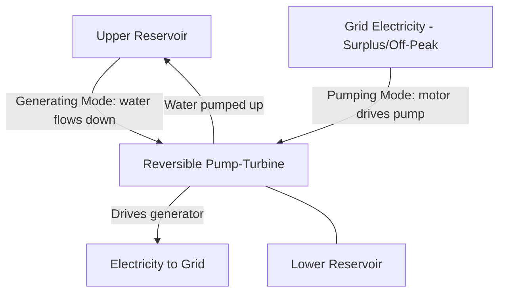

## Pumped-Hydro Energy Storage

### Overview

Pumped-hydro energy storage (PHS), also known as pumped-storage hydropower (PSH), is the most mature and, by installed capacity, the dominant large-scale electrical energy storage technology in the world. PHS stores energy in the form of gravitational potential energy by pumping water from a lower reservoir to an upper reservoir during periods of surplus or low-cost electricity, then releasing that water back through turbines to generate electricity during periods of high demand or high electricity price. The technology functions essentially as a large-scale mechanical battery, exploiting the same basic hydropower principle as conventional hydroelectric generation, but with the addition of a pumping mode that enables net energy storage rather than purely one-directional generation from a natural water inflow.

### Fundamental Operating Principle

**Energy Storage Mechanism**

The stored energy is gravitational potential energy, given by:

$$E = m \, g \, h = \rho \, V \, g \, h$$

Where $m$ is the mass of water moved (kg), $g$ is gravitational acceleration (9.81 m/s²), $h$ is the effective head (elevation difference between reservoirs, m), $\rho$ is water density (~1000 kg/m³), and $V$ is water volume (m³). This straightforward relationship underlies the two dominant design levers for PHS project capacity: reservoir volume and head height, with higher-head sites generally allowing smaller reservoir volumes (and correspondingly smaller land/environmental footprint) for a given energy storage capacity.

### System Components

**Reversible Pump-Turbine Unit**

Modern PHS installations predominantly use reversible pump-turbine units, single machines capable of operating in either turbine mode (generating electricity from downward water flow) or pump mode (consuming electricity to move water upward), by reversing the direction of rotation and, correspondingly, the flow direction through the machine. This single-unit reversible design is generally more capital-cost-efficient than installing separate dedicated pump and turbine units, though at some cost in optimizing each mode's individual hydraulic efficiency relative to a purpose-built single-function machine.

**Common Pump-Turbine Types**

- **Francis-type reversible pump-turbines:** The most widely deployed configuration for conventional PHS, suited to medium-to-high head applications (roughly 100–700 m), operating efficiently in both generating and pumping modes with appropriate blade/runner design
- **Ternary units:** A configuration using a separate pump and turbine, both mechanically coupled to a single motor-generator shaft (rather than a single reversible pump-turbine), offering operational flexibility advantages including faster mode-switching and the ability to operate in a hydraulic short-circuit mode (simultaneous pumping and generating for fine frequency regulation), at higher capital cost and mechanical complexity than a simple reversible unit

**Motor-Generator**

Coupled to the pump-turbine shaft, operating as a generator when the turbine drives it (generating mode) or as a motor driving the pump (pumping mode). Increasingly, variable-speed motor-generator technology (as opposed to traditional fixed-speed synchronous machines) is being adopted in new PHS projects, since variable-speed operation allows the pump-turbine to operate closer to its optimal efficiency point across a range of head and flow conditions, and additionally enables the unit to provide fast, continuously adjustable power output in pumping mode—a capability fixed-speed pumping units lack, since fixed-speed pumps consume essentially constant power once started.

**Reservoirs**

Two water storage reservoirs at different elevations, connected by a penstock (typically a large-diameter pressurized conduit). Reservoirs may be:

- **Conventional (open-loop):** Connected to a natural waterway, river, or existing water body
- **Closed-loop:** Not connected to a natural flowing water system, using purpose-built or repurposed reservoirs (including some using former open-pit mines as one or both reservoirs), generally offering reduced ecological impact relative to open-loop systems that interact with natural river systems and their associated aquatic ecosystems

### Round-Trip Efficiency

**Efficiency Chain**

Overall PHS round-trip efficiency (ratio of electrical energy recovered during generation to electrical energy consumed during pumping) reflects the cumulative product of losses at each conversion stage:

$$\eta_{RT} = \eta_{pump} \times \eta_{motor} \times \eta_{penstock,pumping} \times \eta_{penstock,generating} \times \eta_{turbine} \times \eta_{generator}$$

Modern PHS installations commonly achieve round-trip efficiencies in the range of approximately 70–85%, among the higher efficiency figures achieved by any grid-scale energy storage technology, with variable-speed units and well-optimized penstock hydraulic design (minimizing friction losses) generally achieving efficiencies toward the upper end of this range.

**Penstock Losses**

Frictional head loss in the penstock connecting the two reservoirs scales with flow velocity and pipe length, and is a significant efficiency factor in overall system design; the Darcy-Weisbach relation is commonly used to estimate this loss:

$$h_f = f \frac{L}{D} \frac{v^2}{2g}$$

Where $f$ is the Darcy friction factor, $L$ is penstock length, $D$ is penstock diameter, and $v$ is flow velocity, illustrating why penstock design (diameter sizing, length minimization where feasible, and surface roughness control) is an important lever for minimizing round-trip efficiency losses independent of the pump-turbine machine's own efficiency.

### Siting Considerations

**Head and Topography**

Practical PHS site selection strongly favors locations offering substantial elevation difference over relatively short horizontal distance, since this combination minimizes penstock length (and associated friction losses and capital cost) relative to the achievable head, while also minimizing reservoir surface area (and associated land use and evaporation losses) needed to store a given energy quantity, given the direct proportionality between stored energy and head shown in the energy equation above.

**Geological and Water Resource Requirements**

Suitable sites require geological conditions supporting reservoir construction and long-term structural stability (particularly relevant for upper reservoirs, which may be entirely artificial rather than natural water bodies), along with an adequate water source for initial reservoir filling and ongoing makeup water to offset evaporation and any seepage losses, though closed-loop systems substantially reduce ongoing water consumption relative to open systems with continuous natural inflow/outflow.

**Emerging Site Types**

- **Seawater PHS:** Using ocean water as the lower reservoir (with an upper reservoir on adjacent elevated coastal terrain), expanding potential siting options to coastal locations lacking suitable freshwater reservoir sites, though requiring materials and equipment resistant to seawater corrosion
- **Abandoned mine PHS:** Repurposing former open-pit or underground mine voids as one or both reservoirs, potentially reducing new land disturbance and construction cost relative to greenfield reservoir excavation
- **Underground PHS:** Using excavated underground caverns as the lower reservoir paired with a surface upper reservoir, of particular interest in locations with limited suitable surface topography for a conventional two-surface-reservoir configuration

### Grid Services Provided

**Energy Arbitrage**

The foundational economic function: pumping (consuming) electricity during low-price periods (historically often overnight, though increasingly also during high solar-output midday periods in grids with substantial solar penetration) and generating during high-price periods, capturing the price spread as the primary revenue source.

**Frequency Regulation**

PHS units, particularly variable-speed and ternary configurations, can provide fast-responding frequency regulation service by rapidly adjusting output (or pumping consumption) in response to grid frequency deviations, a service value that has grown in importance alongside declining system inertia in grids with increasing shares of inverter-based renewable generation.

**Black Start Capability**

Many PHS facilities are designed with black-start capability (the ability to start generating without requiring external grid power), a valuable grid resilience attribute for restoring grid operation following a widespread outage.

**Reserve Capacity and Load Following**

PHS's relatively fast start-up time (particularly in generating mode, commonly on the order of minutes) and large power rating make it well-suited to providing spinning/non-spinning reserve capacity and load-following ramping support, complementing the more limited ramping flexibility of some thermal generation technologies.

### Comparison with Other Grid-Scale Storage

| Characteristic | Pumped Hydro | Lithium-Ion Battery Storage |
| --- | --- | --- |
| Typical discharge duration | Hours to days | Typically 1–4 hours (though longer-duration systems exist) |
| Round-trip efficiency | ~70–85% | ~85–95% |
| Site dependency | High (requires specific topography/geology) | Low (siting flexibility) |
| Capital cost structure | High upfront civil works cost, long asset life (decades) | Lower upfront cost, shorter asset life, module replacement over time |
| Response time | Minutes (fast, but generally slower than batteries) | Milliseconds to seconds |
| Scale | Very large (hundreds of MW to multiple GW typical) | Flexible, scalable from small to large |

[Inference: these are representative comparative figures; actual performance and economics for any specific project depend heavily on site-specific and technology-specific factors not captured in this general comparison.]

### Worked Example

**Given:** A PHS facility has an upper reservoir with a usable volume of $3 \times 10^6\ \text{m}^3$, an effective head of 400 m, and an overall round-trip efficiency of 78%.

**Gross stored potential energy:**

$$E = \rho V g h = 1000 \times (3\times10^6) \times 9.81 \times 400$$

$$E = 1000 \times 3\times10^6 \times 9.81 \times 400 = 1.1772 \times 10^{13}\ \text{J}$$

Converting to more conventional energy units:

$$E = \frac{1.1772\times10^{13}\ \text{J}}{3.6\times10^9\ \text{J/MWh}} \approx 3{,}270\ \text{MWh} \approx 3.27\ \text{GWh}$$

**Recoverable electrical energy on discharge** (accounting for round-trip efficiency, applied here as the generating-side portion of total round-trip loss for illustrative purposes):

$$E_{recoverable} \approx 3{,}270\ \text{MWh} \times \sqrt{0.78} \approx 3{,}270 \times 0.883 \approx 2{,}888\ \text{MWh}$$

[Inference: this worked example applies round-trip efficiency in a simplified illustrative manner; a rigorous plant-specific calculation would separately track pumping-side energy input requirements and generating-side energy output based on the specific efficiency curves of the installed pump-turbine equipment at actual operating head and flow conditions, which vary somewhat from the nominal design point.]

This example illustrates the very large absolute energy storage capacity achievable at utility-scale PHS sites, which is a primary reason PHS remains the dominant technology by installed energy storage capacity globally, despite the technology's strict site-suitability requirements limiting where new capacity can be developed relative to more siting-flexible technologies like battery storage.

### Pumped-Hydro System Schematic (svg_diagram)

<svg xmlns="http://www.w3.org/2000/svg" viewBox="0 0 640 400" font-family="sans-serif">
<text x="320" y="24" font-size="16" text-anchor="middle" fill="#222">Pumped-Hydro Storage Configuration (svg_diagram)</text>
<path d="M60,60 L260,60 L260,120 L60,120 Z" fill="#7fa8c9" stroke="#333" stroke-width="2" />
<text x="160" y="95" font-size="11" text-anchor="middle">Upper Reservoir</text>
<path d="M60,60 L260,60 L200,20 L120,20 Z" fill="#a85c32" />
<line x1="220" y1="120" x2="380" y2="280" stroke="#555" stroke-width="14" />
<text x="330" y="200" font-size="10" text-anchor="middle" transform="rotate(58 330 200)">Penstock</text>
<rect x="350" y="280" width="60" height="50" fill="#e8dcc3" stroke="#333" stroke-width="2" />
<text x="380" y="300" font-size="9" text-anchor="middle">Pump-</text>
<text x="380" y="312" font-size="9" text-anchor="middle">Turbine</text>
<path d="M410,330 L550,330 L550,370 L410,370 Z" fill="#7fa8c9" stroke="#333" stroke-width="2" />
<text x="480" y="355" font-size="11" text-anchor="middle">Lower Reservoir</text>
<text x="380" y="270" font-size="9" text-anchor="middle">↑ Pump mode</text>
<text x="380" y="345" font-size="9" text-anchor="middle" fill="#fff">↓ Generate mode</text>
<line x1="415" y1="305" x2="450" y2="270" stroke="#333" stroke-width="2" />
<text x="460" y="265" font-size="9">Generator</text>
</svg>

**Related Topics**

- Reversible pump-turbine hydraulic design and efficiency curves
- Variable-speed pump-turbine control systems
- Seawater and abandoned-mine PHS site development
- Grid frequency regulation and inertia services from PHS
- Comparison of long-duration vs. short-duration grid storage technologies
- Environmental impact assessment for reservoir-based storage projects
- Closed-loop vs. open-loop PHS ecological considerations
- Pumped-hydro project financing and long-asset-life economics