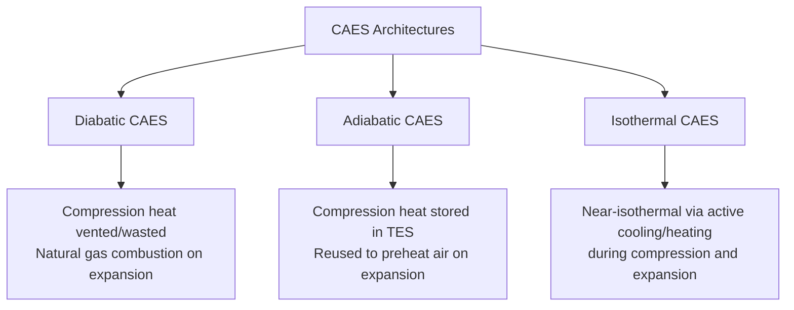

## Compressed Air Energy Storage

### Overview

Compressed air energy storage (CAES) stores electrical energy by using it to compress air, which is held under pressure in an underground cavern or surface vessel, and later released through an expansion process to generate electricity. CAES is one of the few grid-scale storage technologies, alongside pumped-hydro, capable of storing very large energy quantities (hundreds of MWh to multi-GWh) with discharge durations extending to many hours, though its round-trip efficiency and thermodynamic behavior are considerably more complex than pumped-hydro's largely mechanical energy storage mechanism, since CAES inherently involves substantial thermal energy exchange during both compression and expansion.

### Fundamental Thermodynamic Principle

**The Core Challenge: Compression and Expansion Heat**

Compressing air is thermodynamically an approximately adiabatic (or polytropic) process in the absence of active cooling, meaning compression work input raises the air temperature substantially. Conversely, expanding compressed air to extract work causes substantial cooling. This heat management challenge—what to do with the heat generated during compression, and how to supply heat during expansion to avoid excessive cooling and associated efficiency loss (and practical issues like ice formation in machinery)—is the central design differentiator between different CAES architectures.

**Isothermal vs. Adiabatic Idealized Limits**

For a given pressure ratio, the work required for isothermal compression (with continuous heat rejection to maintain constant temperature) is less than for adiabatic compression (no heat rejection during the process), since isothermal compression avoids the additional work needed to compress air against elevated pressure caused by its own temperature rise:

$$W_{isothermal} = nRT\ln\left(\frac{P_2}{P_1}\right)$$

$$W_{adiabatic} = \frac{nRT_1}{\gamma - 1}\left[\left(\frac{P_2}{P_1}\right)^{\frac{\gamma-1}{\gamma}} - 1\right]$$

Where $n$ is moles of gas, $R$ is the universal gas constant, $T_1$ is initial temperature, $P_1$ and $P_2$ are initial and final pressure, and $\gamma$ is the specific heat ratio of air (~1.4). This thermodynamic distinction underlies the different CAES architecture families described below, each representing a different practical strategy for managing the compression/expansion heat.

### CAES Architecture Types

**Diabatic CAES**

The original and only commercially operated large-scale CAES configuration to date (notably the Huntorf, Germany plant commissioned in 1978, and the McIntosh, Alabama plant commissioned in 1991). In diabatic CAES, compression heat is rejected to the environment (typically via intercoolers between compression stages) rather than captured and reused, and natural gas combustion is used during the expansion (generating) phase to reheat the compressed air before or between expansion turbine stages, both increasing achievable expansion work and preventing excessive cooling/icing during expansion. Because diabatic CAES relies on natural gas combustion during discharge, it functions partly as a hybrid storage-plus-generation asset rather than a pure electricity-to-electricity storage system, and its round-trip electrical storage efficiency accounting must account for this fuel energy input, commonly reported using a "heat rate" metric analogous to a conventional gas turbine plant rather than a pure round-trip efficiency figure.

**Adiabatic CAES (A-CAES)**

Captures and stores the heat generated during compression in a dedicated thermal energy storage (TES) medium (such as a packed bed of rock/ceramic material, or a molten salt system), then returns that stored heat to preheat the compressed air during the expansion phase, eliminating (or substantially reducing) the need for supplemental fuel combustion during discharge. This architecture aims to achieve meaningfully higher round-trip electrical efficiency than diabatic CAES while avoiding fuel consumption and associated emissions during discharge, at the cost of the added capital complexity and thermal engineering challenge of the TES subsystem, which must reliably store and deliver heat across the temperature swings and cycling patterns the compression/expansion process produces.

**Isothermal CAES (I-CAES)**

Aims to approximate true isothermal compression and expansion through active heat exchange (such as water or liquid spray injection during compression to absorb heat near-instantaneously, or specialized heat exchanger designs) that continuously removes compression heat (and supplies expansion heat) throughout the process rather than only at discrete intercooling/reheating stages, targeting higher theoretical efficiency than either diabatic or (in principle) staged adiabatic designs, though practical isothermal CAES has historically been pursued primarily at smaller, distributed scale rather than the large underground-cavern scale characteristic of the commercially demonstrated diabatic plants. [Inference: I-CAES commercial deployment at utility scale remains comparatively limited relative to diabatic CAES's decades of operational history, so claimed efficiency advantages, while thermodynamically well-grounded, should be considered alongside the technology's earlier stage of large-scale commercial validation.]

### Air Storage Reservoir Options

**Underground Salt Caverns**

The storage medium used at both operating commercial-scale diabatic CAES plants (Huntorf and McIntosh), created by solution mining (dissolving salt formations with water to hollow out a cavity). Salt caverns are favored for their structural stability under repeated pressure cycling, low gas permeability (minimizing air leakage), and the relatively controlled, predictable process of cavern creation via solution mining.

**Depleted Natural Gas/Oil Reservoirs and Aquifers**

Alternative underground storage options, potentially offering greater siting flexibility than salt formations (which are geographically limited to specific geological regions), though generally requiring more extensive site-specific characterization of reservoir sealing integrity and air-rock/air-water interaction behavior than the relatively well-understood solution-mined salt cavern approach.

**Hard Rock Caverns**

Excavated (rather than solution-mined) underground caverns in stable rock formations, offering another potential siting option, generally at higher construction cost than solution-mined salt caverns given the mechanical excavation process required.

**Surface Vessels/Pipes**

For smaller-scale CAES systems, or in locations lacking suitable underground geology, compressed air can be stored in engineered surface pressure vessels or buried pipe arrays, trading the essentially unlimited scale of underground cavern storage for reduced site-dependency and applicability to a broader range of locations, at correspondingly smaller typical storage capacity and higher capital cost per unit storage volume than underground options.

### Round-Trip Efficiency Considerations

Round-trip efficiency for diabatic CAES, when accounted purely on an electricity-in/electricity-out basis without crediting the natural gas fuel energy input, is generally lower than pumped-hydro or battery storage; however, because diabatic CAES's discharge process also consumes fuel to generate additional electricity (functioning partly as a peaking gas turbine with reduced fuel consumption relative to a conventional simple-cycle gas turbine, since the compressed air feed reduces the compressor work the turbine's own shaft would otherwise need to supply), a pure round-trip efficiency comparison somewhat understates the technology's overall value proposition relative to storage technologies that do not involve any supplemental fuel input. Adiabatic CAES designs, by eliminating fuel input, target notably higher round-trip electrical efficiency, with various adiabatic CAES concept and pilot studies reporting target efficiencies in a range broadly comparable to, though generally still somewhat below, mature pumped-hydro and battery storage round-trip efficiencies. [Unverified: specific adiabatic CAES efficiency figures in the literature vary considerably by study and design assumption, and given the technology's more limited large-scale commercial operating history relative to diabatic CAES, reported figures should be treated as design targets and pilot-scale results rather than an established commercial-scale benchmark.]

### System Components

**Multi-Stage Compressor Train**

Large-scale CAES compression is typically performed in multiple stages with intercooling between stages, both to manage compression heat (particularly important for diabatic and adiabatic designs where that heat is either rejected or captured for later reuse) and because staged compression with intercooling reduces total compression work relative to a single-stage compression to the same final pressure, a standard result from compressor thermodynamics.

**Expansion Turbine Train**

For diabatic CAES, typically a multi-stage turbine train with combustion reheat stages interspersed (a high-pressure turbine followed by combustion reheat, then a low-pressure turbine, in the Huntorf/McIntosh configuration), extracting work from the expanding compressed air (supplemented by combustion products) across successive pressure drops.

**Thermal Energy Storage (Adiabatic CAES specific)**

A packed-bed or other thermal storage medium sized to capture the full compression heat load and later deliver it back during the discharge/expansion phase, requiring careful thermal engineering to manage the temperature stratification and cycling behavior of the storage medium across repeated charge/discharge cycles.

### Comparative Positioning

| Characteristic | Diabatic CAES | Adiabatic CAES | Pumped Hydro |
| --- | --- | --- | --- |
| Fuel input required | Yes (natural gas) | No (in principle) | No |
| Round-trip electrical efficiency | Lower (fuel-supplemented) | Higher than diabatic, target-dependent | ~70–85% |
| Commercial operating history | Decades (since 1978) | Limited/pilot scale | Extensive, over a century |
| Site dependency | High (requires suitable underground cavern geology) | High (same geological requirement) | High (requires suitable topography) |
| Discharge duration | Hours | Hours | Hours to days |

### Worked Example

**Given:** A diabatic CAES plant compresses air to 70 bar, storing $3\times10^5\ \text{m}^3$ (at storage pressure/temperature conditions) in a salt cavern, then releases it through a turbine train that, combined with natural gas reheat, delivers a net generating output of 290 MW for 4 hours while the compression phase, performed separately over 8 hours, consumes 60 MW of grid electricity.

**Electrical energy consumed during charging:**

$$E_{charge} = 60\ \text{MW} \times 8\ \text{h} = 480\ \text{MWh}$$

**Electrical energy delivered during discharge:**

$$E_{discharge} = 290\ \text{MW} \times 4\ \text{h} = 1{,}160\ \text{MWh}$$

Because $E_{discharge}$ substantially exceeds $E_{charge}$, a naive ratio would suggest efficiency greater than 100%; this arises because a significant portion of the discharge energy originates from natural gas combustion during the reheat stages rather than from the stored compressed air's mechanical energy alone. This illustrates precisely why diabatic CAES performance is more appropriately characterized using a heat-rate-style metric (fuel energy plus charging electricity, per unit electricity delivered) analogous to conventional thermal generation accounting, rather than a simple round-trip efficiency ratio appropriate for purely electricity-in/electricity-out storage technologies like pumped hydro or batteries.

### CAES Plant Schematic (svg_diagram)

<svg xmlns="http://www.w3.org/2000/svg" viewBox="0 0 680 380" font-family="sans-serif">
<text x="340" y="24" font-size="16" text-anchor="middle" fill="#222">Diabatic CAES Plant Configuration (svg_diagram)</text>
<rect x="40" y="60" width="90" height="50" fill="#c8d9e8" stroke="#333" stroke-width="2" />
<text x="85" y="80" font-size="9" text-anchor="middle">Compressor</text>
<text x="85" y="92" font-size="9" text-anchor="middle">Train</text>
<line x1="130" y1="85" x2="200" y2="85" stroke="#333" stroke-width="2" />
<text x="165" y="78" font-size="8" text-anchor="middle">Intercooling</text>
<rect x="200" y="60" width="90" height="50" fill="#e0c68c" stroke="#333" stroke-width="2" />
<text x="245" y="80" font-size="9" text-anchor="middle">Motor</text>
<text x="245" y="92" font-size="9" text-anchor="middle">(charging)</text>
<line x1="85" y1="110" x2="85" y2="180" stroke="#333" stroke-width="3" />
<path d="M40,180 Q85,260 130,180 L130,240 Q85,320 40,240 Z" fill="#d9c9a3" stroke="#333" stroke-width="2" />
<text x="85" y="215" font-size="9" text-anchor="middle">Salt Cavern</text>
<text x="85" y="228" font-size="9" text-anchor="middle">70 bar air</text>
<line x1="130" y1="200" x2="380" y2="200" stroke="#333" stroke-width="3" />
<rect x="380" y="175" width="90" height="50" fill="#c07840" stroke="#333" stroke-width="2" />
<text x="425" y="195" font-size="9" text-anchor="middle" fill="#fff">Combustor</text>
<text x="425" y="207" font-size="9" text-anchor="middle" fill="#fff">(NG reheat)</text>
<line x1="470" y1="200" x2="540" y2="200" stroke="#333" stroke-width="3" />
<rect x="540" y="175" width="100" height="50" fill="#a8c6a0" stroke="#333" stroke-width="2" />
<text x="590" y="195" font-size="9" text-anchor="middle">Turbine</text>
<text x="590" y="207" font-size="9" text-anchor="middle">Train</text>
<line x1="590" y1="225" x2="590" y2="280" stroke="#333" stroke-width="2" />
<text x="590" y="300" font-size="9" text-anchor="middle">Electricity Out</text>
</svg>

**Related Topics**

- Adiabatic CAES thermal energy storage material design
- Salt cavern solution mining and geomechanical stability
- Huntorf and McIntosh plant operational history and performance
- Isothermal compression via liquid-piston and spray-injection techniques
- CAES heat rate accounting and hybrid storage-generation economics
- Depleted reservoir and aquifer gas storage geology
- Small-scale and modular CAES for distributed applications
- Comparative economics of long-duration grid storage technologies