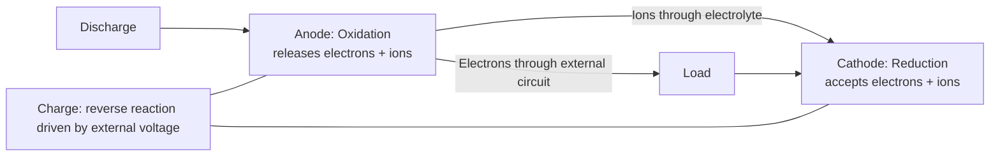
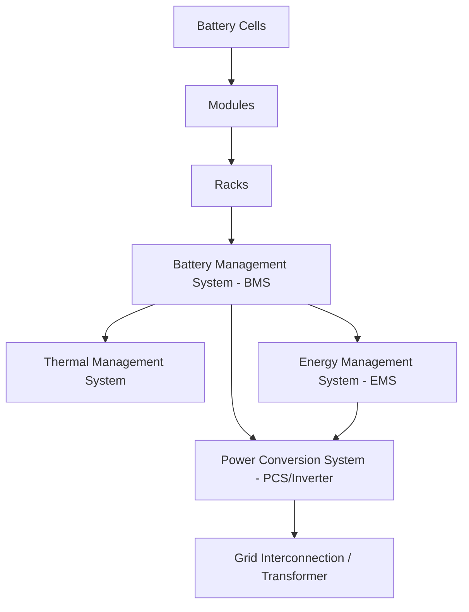

## Battery Energy Storage Systems

### Overview

Battery energy storage systems (BESS) store electrical energy through reversible electrochemical reactions, converting electrical energy to chemical potential energy during charging and back to electrical energy during discharging. BESS has become the fastest-growing grid-scale storage technology category in recent years, driven by rapidly declining lithium-ion battery costs, high round-trip efficiency, fast response time, and substantial siting flexibility relative to topographically-constrained technologies like pumped-hydro and CAES.

### Electrochemical Fundamentals

**Basic Cell Operation**

A battery cell consists of a positive electrode (cathode), negative electrode (anode), and an electrolyte enabling ion transport between them, with the electrode materials undergoing reversible reduction-oxidation (redox) reactions during charge and discharge:

**Key Cell-Level Parameters**

- **Cell voltage:** Determined by the difference in electrochemical potential between cathode and anode materials, a thermodynamic property of the specific chemistry
- **Specific energy (Wh/kg) and energy density (Wh/L):** Determine how much energy storage capacity is achievable per unit mass/volume, critical for mobile applications but generally a secondary consideration (behind cost and cycle life) for stationary grid-scale BESS
- **Specific power (W/kg):** Determines maximum charge/discharge rate capability
- **Coulombic efficiency:** Ratio of discharge capacity to charge capacity in a single cycle, reflecting side reactions and other charge-accounting losses within the cell

### Major Battery Chemistries for Grid-Scale Storage

**Lithium-Ion (Li-ion)**

The dominant chemistry family for grid-scale BESS deployment, encompassing several distinct cathode chemistries with materially different performance and cost trade-offs:

| Chemistry | Cathode Material | Notes |
| --- | --- | --- |
| LFP (Lithium Iron Phosphate) | LiFePO₄ | Lower energy density than NMC, but generally longer cycle life, improved thermal stability, and lower reliance on cobalt/nickel; has become the dominant chemistry choice for stationary grid-scale BESS in recent years given its favorable cost, safety, and longevity profile for stationary applications where energy density is a secondary concern |
| NMC (Nickel Manganese Cobalt Oxide) | LiNiMnCoO₂ | Higher energy density than LFP, historically more common in EV applications and earlier-generation grid storage deployments, generally somewhat shorter cycle life and higher cost (partly reflecting cobalt/nickel content) than LFP |
| NCA (Nickel Cobalt Aluminum Oxide) | LiNiCoAlO₂ | High energy density, used prominently in some EV applications, less common in stationary grid-scale deployment relative to LFP |

**Flow Batteries**

Store energy in liquid electrolytes contained in external tanks (rather than within the electrode structure itself as in conventional lithium-ion cells), with the electrochemical "stack" and the energy-storing electrolyte physically separated, allowing energy capacity (tank size) and power capacity (stack size) to be scaled largely independently of one another—a structural advantage for long-duration storage applications, since energy capacity can be increased simply by adding more electrolyte volume/tank capacity without a proportional increase in the more expensive power-conversion stack hardware.

- **Vanadium redox flow batteries (VRFB):** The most commercially mature flow battery chemistry, using vanadium ions in different oxidation states in both half-cells, which offers the advantage of avoiding cross-contamination degradation issues that can arise when different elements are used in each half-cell, since any electrolyte crossover through the membrane involves the same element on both sides
- Flow batteries generally offer very long cycle life (many thousands of cycles with limited capacity fade) and inherent design suitability for longer discharge durations, at the cost of lower round-trip efficiency and lower energy density than lithium-ion, along with generally higher system complexity (pumps, tanks, membrane management)

**Sodium-Ion**

An emerging chemistry family of increasing commercial interest for stationary storage, using sodium rather than lithium as the primary charge carrier. Sodium's much greater elemental abundance relative to lithium is the primary strategic motivation, potentially offering a cost and supply-chain diversification advantage for grid-scale deployment, generally at somewhat lower energy density than comparable lithium-ion chemistries. [Inference: as a comparatively newer chemistry entering grid-scale commercial deployment, sodium-ion's long-term cycle life and degradation characteristics at scale are less extensively validated by long-duration field data than mature lithium-ion chemistries, so claimed performance parity or advantages should be considered alongside this earlier stage of large-scale commercial track record.]

**Other Emerging/Niche Chemistries**

- **Sodium-sulfur (NaS):** A high-temperature molten-electrode chemistry with an established (though comparatively smaller relative to lithium-ion) history of grid-scale deployment, notably in Japan, offering good energy density and cycle life but requiring maintained high operating temperature
- **Lead-acid:** A mature, low-cost chemistry with extensive historical deployment in smaller-scale and backup power applications, generally less competitive against lithium-ion for new large-scale grid deployments given lithium-ion's superior cycle life and energy density, though it remains relevant in certain cost-sensitive or specific application niches

### Battery Energy Storage System Architecture

**Cell-Module-Rack Hierarchy**

Individual cells are assembled into modules (typically tens of cells connected in series/parallel to reach a target module voltage and capacity), modules assembled into racks, and racks aggregated to reach the full system power and energy rating, with each level of the hierarchy typically incorporating its own monitoring and protection features.

**Battery Management System (BMS)**

Monitors and controls individual cell (or cell-group) voltage, current, and temperature, performing critical safety and performance functions including:

- **Cell balancing:** Correcting for manufacturing and degradation-driven variation in individual cell state of charge within a series string, since an unbalanced string's usable capacity and safe operating range are constrained by its weakest/most divergent cell
- **State of charge (SOC) and state of health (SOH) estimation:** Algorithmic estimation of remaining charge and overall degradation state, since these quantities cannot be measured directly and must be inferred from voltage, current, and temperature history using models specific to the cell chemistry
- **Safety protection:** Enforcing voltage, current, and temperature limits to prevent conditions that could lead to accelerated degradation or, in more severe cases, thermal runaway

**Power Conversion System (PCS)**

The bidirectional inverter/converter interfacing the DC battery system with the AC grid, converting DC to AC during discharge and AC to DC during charging, while also typically providing grid-supportive functions (reactive power support, frequency response, ride-through capability) as configured by the system's grid-interconnection requirements.

**Thermal Management System**

Maintains battery cells within their optimal operating temperature range, since battery degradation rate, achievable power output, and (in extreme cases) safety are all strongly temperature-dependent; approaches range from passive air cooling (simpler, lower cost, suited to less demanding climates/duty cycles) to active liquid cooling (more precise temperature control, better suited to high-power applications or challenging ambient conditions).

**Energy Management System (EMS)**

The overarching control system that dispatches the BESS according to its intended application(s)—arbitrage, frequency regulation, capacity/peaking support—optimizing charge/discharge scheduling against electricity price signals, grid service requirements, and battery degradation considerations.

### Degradation Mechanisms

**Calendar Aging**

Capacity fade and internal resistance increase that occurs over time even without active cycling, driven primarily by side reactions at the electrode-electrolyte interface (notably solid-electrolyte interphase, or SEI, layer growth on the anode in lithium-ion cells), and accelerated by elevated storage temperature and high state of charge.

**Cycle Aging**

Additional degradation accumulated through active charge/discharge cycling, driven by mechanical stress from electrode material expansion/contraction, continued SEI growth, and other cycling-associated degradation mechanisms, generally accelerated by high charge/discharge rates (C-rates), wide depth-of-discharge cycling, and operation at temperature extremes.

**Depth of Discharge (DoD) and Cycle Life Trade-off**

Cycle life (the number of charge/discharge cycles a battery can undergo before capacity fades to a specified threshold, commonly 80% of original capacity) is strongly influenced by the depth of discharge used in each cycle, with shallower DoD cycling generally extending achievable cycle count relative to full (100%) DoD cycling, an important consideration in BESS sizing and operational strategy design for applications where total lifetime energy throughput, rather than absolute peak capacity utilization, is the primary economic driver.

### Round-Trip Efficiency

Lithium-ion BESS typically achieve round-trip efficiencies (AC-to-AC, accounting for PCS conversion losses on both charge and discharge in addition to the battery's own electrochemical efficiency) in the range of approximately 85–95%, among the highest of major grid-scale storage technologies, with variation depending on chemistry, C-rate, and thermal management system parasitic load.

$$\eta_{RT} = \eta_{PCS,charge} \times \eta_{battery} \times \eta_{PCS,discharge}$$

### Key Grid Applications

**Frequency Regulation**

BESS's very fast response time (milliseconds to seconds) makes it particularly well-suited to frequency regulation service, generally outperforming the response speed of conventional thermal generation and even pumped-hydro in this specific application.

**Energy Arbitrage**

Charging during low electricity price periods and discharging during high price periods, similar in economic function to pumped-hydro arbitrage but with BESS's typically shorter discharge duration (commonly 1–4 hours for standard grid-scale deployments, though longer-duration systems are increasingly deployed) shaping the specific arbitrage opportunities addressable.

**Capacity/Resource Adequacy**

Providing firm capacity value to help meet peak demand, particularly valuable in grids with substantial solar generation where BESS can shift midday solar surplus to cover evening demand peaks (the "solar-plus-storage" or "duck curve management" use case).

**Renewable Integration and Smoothing**

Mitigating short-term variability in wind and solar output, and enabling renewable generation to better match grid demand patterns through time-shifting.

**Transmission and Distribution Deferral**

Strategically sited BESS can reduce peak loading on specific transmission or distribution infrastructure, potentially deferring the need for capital-intensive grid infrastructure upgrades by managing local peak demand.

### Worked Example

**Given:** A grid-scale LFP BESS is rated at 100 MW / 400 MWh (4-hour duration), with a round-trip efficiency of 88%, cycling once per day at 80% depth of discharge.

**Usable energy per cycle:**

$$E_{usable} = 400\ \text{MWh} \times 0.80 = 320\ \text{MWh}$$

**Charging energy required** (to deliver 320 MWh of discharge, accounting for round-trip efficiency):

$$E_{charge} = \frac{E_{usable}}{\sqrt{\eta_{RT}}} \quad \text{or, applied simply as a single round-trip factor:} \quad E_{charge} = \frac{320}{0.88} \approx 364\ \text{MWh}$$

**Round-trip energy loss per cycle:**

$$E_{loss} = 364 - 320 = 44\ \text{MWh}$$

**Annual cycle count (assuming one full cycle per day):**

$$N_{cycles,annual} = 365$$

This level of annual cycling, sustained over the system's design lifetime (commonly targeted in the range of several thousand cycles to a specified end-of-life capacity threshold for grid-scale LFP systems), illustrates why cycle life and degradation-aware operational strategy are central considerations in BESS project economics, since achievable lifetime energy throughput directly determines the system's revenue-generating capability over its operational life relative to its capital cost.

### BESS Architecture Schematic (svg_diagram)

<svg xmlns="http://www.w3.org/2000/svg" viewBox="0 0 640 360" font-family="sans-serif">
<text x="320" y="24" font-size="16" text-anchor="middle" fill="#222">Grid-Scale BESS Architecture (svg_diagram)</text>
<rect x="40" y="60" width="140" height="200" fill="#e8dcc3" stroke="#333" stroke-width="2" />
<text x="110" y="80" font-size="10" text-anchor="middle">Battery Racks</text>
<rect x="55" y="95" width="45" height="30" fill="#c8d9e8" stroke="#333" />
<rect x="110" y="95" width="45" height="30" fill="#c8d9e8" stroke="#333" />
<rect x="55" y="135" width="45" height="30" fill="#c8d9e8" stroke="#333" />
<rect x="110" y="135" width="45" height="30" fill="#c8d9e8" stroke="#333" />
<rect x="55" y="175" width="45" height="30" fill="#c8d9e8" stroke="#333" />
<rect x="110" y="175" width="45" height="30" fill="#c8d9e8" stroke="#333" />
<text x="110" y="235" font-size="9" text-anchor="middle">+ BMS</text>
<line x1="180" y1="160" x2="240" y2="160" stroke="#333" stroke-width="2" />
<rect x="240" y="120" width="100" height="80" fill="#c07840" stroke="#333" stroke-width="2" />
<text x="290" y="155" font-size="10" text-anchor="middle" fill="#fff">PCS</text>
<text x="290" y="168" font-size="10" text-anchor="middle" fill="#fff">Inverter</text>
<line x1="340" y1="160" x2="400" y2="160" stroke="#333" stroke-width="2" />
<rect x="400" y="130" width="100" height="60" fill="#a8c6a0" stroke="#333" stroke-width="2" />
<text x="450" y="165" font-size="10" text-anchor="middle">Transformer</text>
<line x1="500" y1="160" x2="560" y2="160" stroke="#333" stroke-width="2" />
<text x="590" y="165" font-size="10" text-anchor="middle">Grid</text>
<line x1="290" y1="120" x2="290" y2="80" stroke="#333" stroke-width="1" stroke-dasharray="3,2" />
<text x="290" y="70" font-size="9" text-anchor="middle">EMS Control</text>
</svg>

**Related Topics**

- Lithium-ion cell manufacturing and cathode chemistry trade-offs
- Vanadium redox flow battery system design
- Battery management system state estimation algorithms
- Thermal runaway propagation and fire safety design
- Second-life EV battery repurposing for stationary storage
- Sodium-ion battery commercialization pathway
- BESS revenue stacking and multi-service dispatch optimization
- Battery recycling and end-of-life material recovery