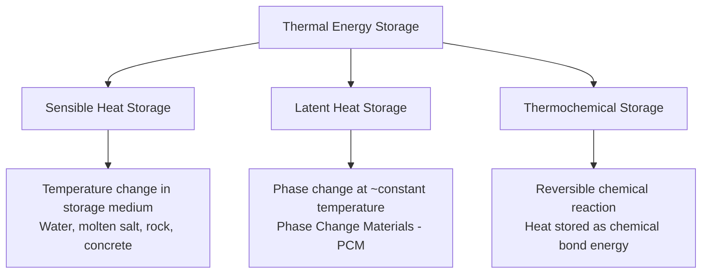

## Thermal Energy Storage: Sensible, Latent, and Thermochemical

### Overview

Thermal energy storage (TES) stores energy in the form of heat (or cold), later released to provide heating, cooling, or, in power generation contexts, to drive a thermodynamic power cycle. Unlike electrochemical or mechanical storage technologies, TES stores energy in essentially the same form (thermal) it will ultimately deliver, which can eliminate one or more energy conversion stages relative to storing energy electrically and later converting it back to heat, and correspondingly avoid the associated conversion losses. TES technologies are broadly classified by their underlying storage mechanism into three categories: sensible heat, latent heat, and thermochemical storage.

### Classification Overview

### Sensible Heat Storage

**Fundamental Principle**

Sensible heat storage stores thermal energy by raising the temperature of a storage medium, with the stored energy given directly by the medium's heat capacity and the achieved temperature change:

$$Q = m \, c_p \, \Delta T$$

Where $Q$ is stored thermal energy (J), $m$ is mass of storage medium (kg), $c_p$ is specific heat capacity (J/kg·K), and $\Delta T$ is the temperature change across the charge/discharge cycle. This is the conceptually simplest TES mechanism, relying only on well-characterized bulk material thermal properties rather than phase transition or chemical reaction behavior.

**Common Sensible Heat Storage Media**

| Medium | Approx. $c_p$ (kJ/kg·K) | Typical Temperature Range | Notes |
| --- | --- | --- | --- |
| Water | ~4.18 | Up to ~100 °C (higher under pressure) | High specific heat, low cost, widely used for building/district heating TES |
| Molten nitrate salts (e.g., 60% NaNO₃/40% KNO₃) | ~1.5 | ~290–565 °C | Dominant medium for concentrated solar power (CSP) TES; freezing point management is a key operational constraint |
| Rock/gravel (packed bed) | ~0.8–0.9 | Wide range, application-dependent | Low cost, used in packed-bed regenerator-style TES and some adiabatic CAES designs |
| Concrete | ~0.85–1.0 | Wide range | Used in some solid-media high-temperature TES concepts, benefiting from established construction industry familiarity and cost structure |
| Thermal oils (synthetic heat transfer fluids) | ~2.0–2.5 | Up to ~400 °C (oil-specific upper limit) | Used in some CSP designs, generally at lower maximum temperature than molten salt |

**Concentrated Solar Power (CSP) Molten Salt TES**

The most prominent large-scale commercial application of sensible heat TES, in which molten nitrate salt is heated by the CSP field's concentrated solar receiver during sunlight hours, stored in an insulated hot tank, then circulated through a steam generator to drive a conventional Rankine power cycle during periods without sufficient direct solar input (including after sunset), enabling CSP plants to extend dispatchable generation hours well beyond direct sun availability—a significant advantage over photovoltaic solar, which lacks this same integrated thermal storage pathway without a separate battery system.

**Two-Tank vs. Thermocline Configurations**

- **Two-tank system:** Uses physically separate hot and cold storage tanks, with salt pumped between them during charging (cold tank to hot tank, heated via the solar receiver) and discharging (hot tank to cold tank, giving up heat to the power cycle), avoiding thermal mixing between hot and cold salt but requiring two full-capacity tank vessels
- **Thermocline (single-tank) system:** Uses a single tank with a vertical temperature gradient (thermocline) separating hot salt (upper region) from cold salt (lower region), often incorporating a lower-cost filler material to occupy volume the salt would otherwise fill, reducing total salt inventory and tank cost relative to a two-tank system, at the cost of some thermocline degradation (blending) over repeated cycling that can gradually reduce effective usable capacity

### Latent Heat Storage

**Fundamental Principle**

Latent heat storage exploits the substantial energy absorbed or released during a material's phase change (most commonly solid-liquid melting/freezing, though solid-solid and liquid-gas transitions are also studied), storing energy at a nearly constant temperature corresponding to the material's phase transition point:

$$Q = m \, L$$

Where $L$ is the material's latent heat of fusion (or other relevant transition, J/kg). Because latent heat of fusion for many candidate phase change materials (PCMs) substantially exceeds the sensible heat storable over a modest, practically achievable temperature swing in the same material, latent heat storage can achieve considerably higher energy storage density (per unit volume or mass) than sensible heat storage using a comparable material, particularly advantageous where compact storage volume is a priority.

**Phase Change Material (PCM) Categories**

- **Organic PCMs (paraffins, fatty acids):** Generally exhibit good chemical stability over repeated cycling, minimal supercooling, and non-corrosive behavior toward common containment materials, though typically lower thermal conductivity (requiring careful heat exchanger design to achieve adequate charge/discharge rates) and lower latent heat per unit volume than inorganic PCMs
- **Inorganic PCMs (salt hydrates, molten salts):** Generally offer higher latent heat per unit volume and better thermal conductivity than organic PCMs, but are often subject to supercooling (the material remaining liquid below its nominal freezing point, requiring nucleating agents to reliably initiate solidification) and, for salt hydrate PCMs specifically, phase segregation over repeated cycling that can degrade performance over the system's operational life
- **Eutectic mixtures:** Combinations of two or more PCM components engineered to melt/freeze at a single specific temperature (rather than over a range), allowing the phase transition temperature to be tuned to a specific application's requirements

**Thermal Conductivity Enhancement**

A persistent practical challenge for many PCMs, particularly organic PCMs, is relatively low thermal conductivity, which limits the rate at which heat can be charged into or discharged from the storage medium. Common enhancement approaches include embedding metal fins or foam matrices within the PCM, encapsulating PCM in small capsules or spheres to increase surface-area-to-volume ratio for heat exchange, and dispersing high-conductivity additives (such as graphite or metal particles) throughout the PCM matrix.

**Applications**

- **Building thermal comfort/HVAC load shifting:** PCM integrated into building materials or dedicated storage units to absorb daytime cooling load or store off-peak thermal energy, shifting HVAC electrical demand away from peak periods
- **Cold chain and refrigerated transport:** PCM-based cold storage packs maintaining temperature-controlled conditions during transport without continuous active refrigeration
- **Solar thermal and waste heat buffering:** Compact thermal buffering in applications where sensible-heat storage volume would be impractically large for the available space

### Thermochemical Storage

**Fundamental Principle**

Thermochemical storage stores energy in the chemical bonds of a reversible reaction, charging the system by driving an endothermic reaction (absorbing heat to decompose or transform the storage material) and discharging by allowing the reverse exothermic reaction to proceed, releasing the stored heat:

$$AB + \text{Heat} \rightleftharpoons A + B$$

Because energy is stored as chemical potential rather than sensible or latent thermal energy, thermochemical storage can, in principle, achieve substantially higher energy storage density than either sensible or latent heat storage, and critically, the reaction products ($A$ and $B$ in the generic scheme above) can often be stored separately at near-ambient temperature with minimal ongoing heat loss, in contrast to sensible and latent TES, which generally require ongoing thermal insulation to limit self-discharge (heat loss) over extended storage duration.

**Common Thermochemical Reaction Systems**

- **Metal hydroxide/oxide systems (e.g., calcium hydroxide/calcium oxide):** $Ca(OH)_2 \rightleftharpoons CaO + H_2O$, an endothermic dehydration reaction on charging and exothermic hydration on discharging, studied for high-temperature applications including CSP integration
- **Salt hydration/dehydration systems:** Various hydrated salts that reversibly absorb/release water vapor, generally operating at lower temperatures than metal oxide systems, of interest for building heating applications
- **Ammonia-based systems:** Reversible ammonia synthesis/decomposition reactions, of interest partly due to ammonia's relatively well-established industrial handling infrastructure, though requiring careful safety management given ammonia's toxicity

**Practical Status**

Thermochemical storage remains, relative to sensible and latent heat storage, considerably earlier in commercial maturity, with most demonstrated systems at pilot or laboratory scale rather than widespread commercial deployment. [Inference: the fundamental thermodynamic energy density advantage of thermochemical storage is well-established, but practical system-level energy density and round-trip efficiency are also shaped by reactor design, reaction kinetics, and heat/mass transfer engineering challenges that are less mature and less extensively field-validated than the comparatively simple physical mechanisms underlying sensible and latent heat storage.]

### Comparative Summary

| Characteristic | Sensible Heat | Latent Heat | Thermochemical |
| --- | --- | --- | --- |
| Storage mechanism | Temperature change | Phase transition | Reversible chemical reaction |
| Typical energy density | Lowest of the three | Moderate (higher than sensible) | Highest (theoretically) |
| Storage temperature | Varies with charge state | Nearly constant at transition point | Can be stored near ambient (separated reactants) |
| Self-discharge/heat loss over time | Present, requires insulation | Present, requires insulation | Minimal, if reactants stored separately |
| Commercial maturity | High (established, e.g., CSP molten salt) | Moderate (established in niche applications) | Low (largely pilot/research stage) |
| System complexity | Relatively simple | Moderate (PCM containment, conductivity enhancement) | Higher (reactor design, reactant handling) |

### Worked Example (Comparing Storage Densities)

**Given:** Compare the volumetric energy storage density of (a) sensible heat storage in molten nitrate salt heated through a $\Delta T = 275°C$ swing (290 °C to 565 °C), density $\rho \approx 1800\ \text{kg/m}^3$, $c_p \approx 1.5\ \text{kJ/kg·K}$, against (b) latent heat storage in a PCM with latent heat of fusion $L = 250\ \text{kJ/kg}$ and density $\rho \approx 1500\ \text{kg/m}^3$.

**(a) Sensible heat volumetric energy density:**

$$\frac{Q}{V} = \rho \, c_p \, \Delta T = 1800 \times 1.5 \times 275 = 742{,}500\ \text{kJ/m}^3 \approx 206\ \text{kWh/m}^3$$

**(b) Latent heat volumetric energy density:**

$$\frac{Q}{V} = \rho \, L = 1500 \times 250 = 375{,}000\ \text{kJ/m}^3 \approx 104\ \text{kWh/m}^3$$

In this particular comparison, the sensible-heat molten salt system operating over a large 275 °C temperature swing actually achieves higher volumetric density than the illustrative PCM example, underscoring that the commonly cited generalization "latent heat storage has higher energy density than sensible heat storage" depends heavily on the specific magnitude of temperature swing achievable in the sensible system being compared against; the advantage of latent storage is most pronounced when the practically achievable sensible-heat temperature swing in a comparable application is small, such that the phase-change energy substantially exceeds what a modest temperature swing alone could store. [Inference: this worked comparison uses illustrative representative property values; actual comparative density depends on the specific materials and achievable temperature ranges in any real system design.]

### Thermal Storage Mechanism Schematic (svg_diagram)

<svg xmlns="http://www.w3.org/2000/svg" viewBox="0 0 680 340" font-family="sans-serif">
<text x="340" y="24" font-size="16" text-anchor="middle" fill="#222">TES Mechanisms Compared (svg_diagram)</text>
<text x="120" y="55" font-size="11" text-anchor="middle" font-weight="bold">Sensible</text>
<line x1="50" y1="250" x2="50" y2="80" stroke="#333" stroke-width="2" />
<line x1="50" y1="250" x2="190" y2="250" stroke="#333" stroke-width="2" />
<line x1="60" y1="220" x2="180" y2="110" stroke="#c07840" stroke-width="3" />
<text x="30" y="250" font-size="8">T1</text>
<text x="30" y="90" font-size="8">T2</text>
<text x="340" y="55" font-size="11" text-anchor="middle" font-weight="bold">Latent</text>
<line x1="270" y1="250" x2="270" y2="80" stroke="#333" stroke-width="2" />
<line x1="270" y1="250" x2="410" y2="250" stroke="#333" stroke-width="2" />
<path d="M280,220 L330,170 L390,170 L400,110" stroke="#a85c32" stroke-width="3" fill="none" />
<text x="360" y="185" font-size="8" text-anchor="middle">flat region = phase change</text>
<text x="560" y="55" font-size="11" text-anchor="middle" font-weight="bold">Thermochemical</text>
<rect x="480" y="130" width="70" height="50" fill="#e8dcc3" stroke="#333" />
<text x="515" y="160" font-size="9" text-anchor="middle">AB</text>
<text x="560" y="160" font-size="16" text-anchor="middle">⇄</text>
<rect x="580" y="120" width="35" height="30" fill="#c8d9e8" stroke="#333" />
<text x="597" y="140" font-size="8" text-anchor="middle">A</text>
<rect x="580" y="160" width="35" height="30" fill="#a8c6a0" stroke="#333" />
<text x="597" y="180" font-size="8" text-anchor="middle">B</text>
<text x="555" y="220" font-size="8" text-anchor="middle">separated, near-ambient storage</text>
</svg>

**Related Topics**

- CSP two-tank vs. thermocline molten salt system trade-offs
- PCM encapsulation and thermal conductivity enhancement techniques
- Calcium hydroxide/oxide thermochemical storage pilot systems
- Building-integrated PCM for HVAC load shifting
- High-temperature packed-bed rock/ceramic TES for adiabatic CAES
- District heating seasonal thermal storage
- Salt hydrate supercooling mitigation strategies
- Comparative round-trip efficiency of TES vs. electrochemical storage in power cycle applications