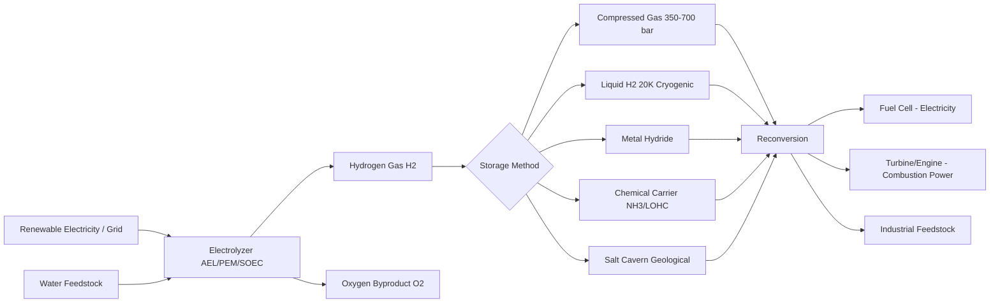

## Hydrogen Production and Storage for Power Applications

### Overview

Hydrogen serves as an energy carrier rather than a primary energy source — it must be produced using energy input from another source (fossil fuel, electricity, or heat), then stored, transported, and eventually reconverted to usable power or work. Its appeal in power applications rests on high gravimetric energy density (~120–142 MJ/kg, roughly 3x gasoline by mass), zero point-of-use carbon emissions (water is the only combustion/reaction byproduct), and versatility across sectors (electricity, transport, industrial heat, chemical feedstock). Its drawbacks are equally consequential: low volumetric energy density in gaseous form, production energy penalties, and infrastructure immaturity.

### Thermodynamic Fundamentals

**Higher and Lower Heating Value**

Hydrogen combustion: $H_2 + \frac{1}{2}O_2 \rightarrow H_2O$

- Higher Heating Value (HHV): 141.8 MJ/kg (liquid water product) — relevant for fuel cells where water condenses
- Lower Heating Value (LHV): 119.9 MJ/kg (water vapor product) — relevant for combustion/turbine applications

The ~18% gap between HHV and LHV is the latent heat of vaporization of water, and which value to use depends on whether the downstream process recovers that condensation enthalpy.

**Gibbs Free Energy of Water Splitting**

Electrolysis is the reverse reaction: $H_2O \rightarrow H_2 + \frac{1}{2}O_2$

$$\Delta G = \Delta H - T\Delta S$$

At standard conditions (25°C, 1 atm):

- $\Delta H = 285.8$ kJ/mol (total energy required, thermoneutral voltage basis)
- $\Delta G = 237.2$ kJ/mol (minimum electrical work required)
- $T\Delta S = 48.6$ kJ/mol (heat that can theoretically be supplied thermally rather than electrically)

This yields two key voltage thresholds per electrolysis cell:

$$E_{rev} = \frac{\Delta G}{nF} = 1.23\ \text{V (reversible/minimum voltage)}$$

$$E_{tn} = \frac{\Delta H}{nF} = 1.48\ \text{V (thermoneutral voltage, no external heat needed)}$$

where $n = 2$ (electrons transferred) and $F = 96{,}485$ C/mol (Faraday constant). Real electrolyzers operate above 1.48 V (typically 1.6–2.2 V) due to overpotentials (activation, ohmic, concentration losses), which is why practical efficiency is always well below 100%.

### Hydrogen Production Methods

**1. Steam Methane Reforming (SMR) — "Grey/Blue Hydrogen"**

Dominant industrial method (~95% of current global production).

$$CH_4 + H_2O \rightarrow CO + 3H_2 \quad (\Delta H = +206\ \text{kJ/mol, endothermic})$$

$$CO + H_2O \rightarrow CO_2 + H_2 \quad (\Delta H = -41\ \text{kJ/mol, water-gas shift})$$

- Operating conditions: 700–1000°C, 3–25 bar, nickel catalyst
- Efficiency: 70–85% (LHV basis)
- Emits ~9–12 kg CO₂ per kg H₂
- "Blue hydrogen" = SMR + carbon capture and storage (CCS), capturing 85–95% of CO₂, reducing but not eliminating lifecycle emissions

**2. Electrolysis — "Green Hydrogen" (if powered by renewables)**

*Alkaline Electrolysis (AEL)*

- Mature, lowest capital cost (~$500–1000/kW)
- KOH or NaOH electrolyte (25–30 wt%), nickel electrodes
- Efficiency: 60–70% (LHV)
- Slower dynamic response — less ideal for variable renewable input
- Current density: 0.2–0.4 A/cm²

*Proton Exchange Membrane (PEM) Electrolysis*

- Solid polymer electrolyte (Nafion-type membrane)
- Faster response, higher current density (1–2 A/cm²), compact
- Efficiency: 65–78% (LHV)
- Higher cost due to platinum-group catalysts (Ir, Pt)
- Better suited to coupling with variable solar/wind

*Solid Oxide Electrolysis (SOEC)*

- High-temperature (700–850°C) ceramic electrolyte
- Highest efficiency (up to 85–90%) because part of the energy input is thermal (exploiting $T\Delta S$) rather than electrical
- Least mature commercially; degradation and thermal cycling remain challenges

**3. Other Production Routes**

- **Pyrolysis (Turquoise Hydrogen):** $CH_4 \rightarrow C_{(s)} + 2H_2$ — produces solid carbon instead of CO₂, avoiding capture infrastructure; still early-stage
- **Biomass gasification:** partial oxidation of biomass feedstock; carbon-neutral if feedstock is sustainably sourced
- **Photoelectrochemical/photocatalytic splitting:** direct solar-to-hydrogen; low TRL, efficiency currently <20%
- **Thermochemical cycles (e.g., sulfur-iodine cycle):** paired with nuclear or concentrated solar heat sources for high-temperature water splitting

### Color Classification Reference

| Color | Method | Carbon Intensity |
| --- | --- | --- |
| Green | Electrolysis via renewables | ~0 kg CO₂/kg H₂ |
| Pink/Red | Electrolysis via nuclear | ~0 kg CO₂/kg H₂ |
| Blue | SMR + CCS | ~3–4 kg CO₂/kg H₂ |
| Grey | SMR, no capture | ~9–12 kg CO₂/kg H₂ |
| Turquoise | Methane pyrolysis | Depends on carbon byproduct fate |
| Black/Brown | Coal gasification | ~19–26 kg CO₂/kg H₂ |

**[Unverified]** Exact carbon-intensity figures vary substantially by source, feedstock, grid mix, and system boundary assumptions; treat the above as representative order-of-magnitude values rather than fixed constants.

### Hydrogen Storage Methods

Storage is the central engineering bottleneck for hydrogen in power applications, since H₂ has very low volumetric energy density at ambient conditions (~0.01 MJ/L vs. gasoline's ~32 MJ/L).

**1. Compressed Gas Storage (CGH2)**

- Standard: 350 bar (Type III/IV tanks, industrial/bus) or 700 bar (Type IV, light-duty vehicles)
- Type III: metal liner + carbon-fiber composite wrap
- Type IV: polymer liner + carbon-fiber composite wrap (lighter, more common now)
- Volumetric density at 700 bar: ~1.3 MJ/L (still ~25x lower than gasoline)
- Compression itself consumes 10–15% of the hydrogen's energy content

**2. Liquid Hydrogen (LH2)**

- Cryogenic storage at 20 K (-253°C), atmospheric pressure
- Volumetric density: ~8.5 MJ/L (much better than compressed gas)
- Liquefaction is highly energy-intensive: 25–35% of H₂'s energy content is lost to liquefaction
- Boil-off losses (~0.1–1%/day) from imperfect insulation are unavoidable in real systems — relevant for long-duration storage and shipping
- Used in aerospace (e.g., rocket propellant) and increasingly for heavy-duty transport and maritime shipping

**3. Material-Based Storage**

*Metal Hydrides*

$$M + \frac{x}{2}H_2 \leftrightarrow MH_x$$

- Hydrogen absorbed into a metal lattice (e.g., LaNi₅, TiFe, Mg-based alloys)
- High volumetric density, operates near ambient pressure
- Drawbacks: heavy (low gravimetric density, typically 1–7 wt% H₂), slow kinetics, requires thermal management for charge/discharge (absorption exothermic, desorption endothermic)

*Chemical Hydrogen Carriers*

- **Ammonia (NH₃):** H₂ content ~17.8 wt%; established global shipping/storage infrastructure from fertilizer industry; requires cracking (~400–600°C) to release H₂ for power use; itself combustible as a fuel in modified engines/turbines
- **Liquid Organic Hydrogen Carriers (LOHC):** e.g., toluene/methylcyclohexane or dibenzyltoluene systems; hydrogenation/dehydrogenation cycle allows storage at ambient conditions using existing liquid fuel infrastructure; dehydrogenation is endothermic and energy-intensive
- **Methanol:** synthesized from H₂ + CO₂, liquid at ambient conditions, reformed on-demand

*Adsorption-Based (Physisorption)*

- Activated carbon, metal-organic frameworks (MOFs), carbon nanotubes
- Weak van der Waals binding, typically requires cryogenic temperatures for meaningful capacity
- **[Inference]** Remains primarily a research-stage technology for practical power-scale storage, given capacity and temperature constraints reported in the literature to date

**4. Underground/Geological Storage**

- Salt caverns: proven at scale (existing UK/US sites store H₂ for industrial use), low leakage, good for large seasonal buffering
- Depleted gas reservoirs and aquifers: under evaluation, with concerns about microbial H₂ consumption and reservoir integrity
- Relevant for grid-scale seasonal energy storage, analogous to natural gas storage but with hydrogen's smaller molecule size increasing leakage and material-embrittlement risk

### Storage Method Comparison

| Method | Volumetric Density | Gravimetric Density | Key Limitation |
| --- | --- | --- | --- |
| Compressed gas (700 bar) | ~1.3 MJ/L | High | Tank weight/cost, compression energy |
| Liquid H2 (20 K) | ~8.5 MJ/L | High | Liquefaction energy, boil-off |
| Metal hydride | High (varies) | Low (1–7 wt%) | System mass, thermal management |
| Ammonia | ~12.7 MJ/L (as NH3) | Moderate | Cracking energy, toxicity handling |
| LOHC | ~depends on carrier | Moderate | Dehydrogenation energy, catalyst cost |
| Salt cavern | N/A (bulk) | N/A | Geology-dependent, geographic limits |

### Round-Trip Efficiency for Power Applications

For hydrogen used as grid-scale energy storage (Power-to-Gas-to-Power), the full chain matters:

$$\eta_{RTE} = \eta_{electrolysis} \times \eta_{storage} \times \eta_{reconversion}$$

Typical figures:

- Electrolysis (PEM/AEL): 60–75%
- Compression/storage losses: 90–95% retained
- Reconversion via fuel cell: 45–60%
- Reconversion via H₂ turbine/combustion: 35–45%

**[Inference]** Combining representative midpoint values across this chain, round-trip efficiency for hydrogen-based electricity storage typically falls in a 25–40% range — substantially below lithium-ion batteries (~85–95%) or pumped hydro (~70–85%). This makes hydrogen more competitive for long-duration/seasonal storage or sector-coupling (where the H₂ serves industry, transport, or heat rather than being reconverted to electricity) than for short-cycle grid balancing.

### Power Applications

**Fuel Cells (Electrochemical Reconversion)**

$$\text{Anode: } H_2 \rightarrow 2H^+ + 2e^-$$

$$\text{Cathode: } \frac{1}{2}O_2 + 2H^+ + 2e^- \rightarrow H_2O$$

- PEM fuel cells: most common for transport and distributed power, operate at 60–80°C, efficiency 40–60%
- Solid Oxide Fuel Cells (SOFC): 600–1000°C operation, higher efficiency (up to 60%), fuel-flexible (can also use natural gas/biogas with internal reforming), well-suited for combined heat and power (CHP) due to high-grade waste heat

**Hydrogen Combustion for Power**

- Gas turbines: modified combustors handle H₂'s wider flammability range, higher flame speed, and higher NOx formation tendency compared to natural gas; blending (up to ~20–30% by volume with natural gas) is a near-term transition pathway before 100% H₂ capability
- Reciprocating engines: retrofit potential for backup/distributed generation

**Grid-Scale Applications**

- Seasonal storage buffering renewable variability (weeks-to-months timescale, where battery storage is not economical)
- Sector coupling: excess renewable electricity converted to H₂ for use in industry (steelmaking, ammonia synthesis) or transport, avoiding curtailment
- Backup power for critical infrastructure via stationary fuel cells

### Worked Example: Electrolyzer Sizing

**Problem:** Size a PEM electrolyzer to produce 100 kg H₂/day, assuming 65% efficiency (LHV basis) and 80% capacity factor.

**Solution:**

Energy content of hydrogen (LHV): $100\ \text{kg} \times 119.9\ \text{MJ/kg} = 11{,}990\ \text{MJ}$

Electrical energy required at 65% efficiency:

$$E_{elec} = \frac{11{,}990\ \text{MJ}}{0.65} = 18{,}446\ \text{MJ} = 5{,}124\ \text{kWh/day}$$

Required continuous power rating accounting for 80% capacity factor (i.e., the electrolyzer runs at rated power only 80% of the day, e.g., to match variable solar availability):

$$P_{rated} = \frac{5{,}124\ \text{kWh}}{24\ \text{h} \times 0.80} = 267\ \text{kW}$$

A roughly 270 kW PEM electrolyzer stack would be specified, with upstream renewable generation and storage buffering sized separately to match the capacity factor assumption.

### Process Flow Diagram

### Energy Flow Diagram (svg_diagram)

<svg xmlns="http://www.w3.org/2000/svg" viewBox="0 0 720 320">
\<style\>
.box { fill: #eef3fb; stroke: #2c5282; stroke-width: 1.5; }
.lbl { font-family: Arial, sans-serif; font-size: 13px; fill: #1a202c; }
.arrow { stroke: #4a5568; stroke-width: 2; marker-end: url(#arrowhead); fill: none; }
.loss { font-family: Arial, sans-serif; font-size: 11px; fill: #c53030; }
.title { font-family: Arial, sans-serif; font-size: 14px; fill: #1a202c; font-weight: bold; }
\</style\>
<text x="360" y="20" text-anchor="middle" class="title">Power-to-Gas-to-Power Energy Cascade (svg_diagram)</text>
<rect x="20" y="50" width="120" height="50" class="box" rx="4" />
<text x="80" y="80" text-anchor="middle" class="lbl">Electricity</text>
<line x1="140" y1="75" x2="200" y2="75" class="arrow" />
<text x="145" y="65" class="loss">65-78% eff.</text>
<rect x="200" y="50" width="120" height="50" class="box" rx="4" />
<text x="260" y="80" text-anchor="middle" class="lbl">Electrolysis</text>
<line x1="320" y1="75" x2="380" y2="75" class="arrow" />
<text x="322" y="65" class="loss">90-95%</text>
<rect x="380" y="50" width="120" height="50" class="box" rx="4" />
<text x="440" y="80" text-anchor="middle" class="lbl">H2 Storage</text>
<line x1="500" y1="75" x2="560" y2="75" class="arrow" />
<text x="502" y="65" class="loss">45-60%</text>
<rect x="560" y="50" width="120" height="50" class="box" rx="4" />
<text x="620" y="80" text-anchor="middle" class="lbl">Fuel Cell</text>
<line x1="620" y1="100" x2="620" y2="140" class="arrow" />
<rect x="560" y="140" width="120" height="50" class="box" rx="4" />
<text x="620" y="170" text-anchor="middle" class="lbl">Electricity Out</text>

<text x="360" y="230" text-anchor="middle" class="lbl" font-style="italic">Overall round-trip efficiency: ~25-40% (representative range)</text>

<text x="360" y="255" text-anchor="middle" class="lbl">Compare: Li-ion battery RTE ~85-95%, Pumped hydro ~70-85%</text>

</svg>

### Key Challenges

- **Embrittlement:** hydrogen diffuses into metal lattices (especially high-strength steels), causing cracking over time — affects pipelines, tanks, and turbine components; requires specialized alloys or coatings
- **Leakage:** H₂'s small molecular size makes sealing harder than for natural gas; leaked H₂ is also an indirect greenhouse gas (extends atmospheric methane lifetime)
- **Boil-off (LH2):** unavoidable cryogenic losses during storage and transport
- **Infrastructure cost:** dedicated pipelines, refueling stations, and cavern storage require substantial capital investment; retrofitting natural gas pipelines for high-H₂ blends has material compatibility limits
- **Energy penalty:** every conversion step (production, compression/liquefaction, reconversion) loses energy, compounding across the full chain

**Key Points**

- Hydrogen is an energy carrier, not a primary source — total lifecycle efficiency depends on the production method and the full storage-reconversion chain.
- Electrolysis efficiency (SOEC > PEM > AEL) trades off against capital cost and technology maturity.
- Storage method selection is dominated by the volumetric vs. gravimetric density trade-off; no single method is optimal across all use cases.
- Round-trip efficiency for power storage (~25–40%) is markedly lower than batteries or pumped hydro, favoring hydrogen for long-duration/seasonal storage and sector coupling over short-cycle grid balancing.

**Related Topics**

- Fuel Cell Types and Electrochemistry (PEMFC, SOFC, AFC comparison)
- Power-to-X and Sector Coupling
- Ammonia as a Marine and Power Generation Fuel
- Hydrogen Gas Turbine Combustor Design and NOx Control
- Compressed Air Energy Storage (CAES) as a Comparative Technology
- Battery Energy Storage Systems (BESS) — Lithium-ion and Flow Batteries
- Pumped Hydro Storage Thermodynamics
- Carbon Capture and Storage (CCS) Integration with Blue Hydrogen
- Levelized Cost of Storage (LCOS) Methodology