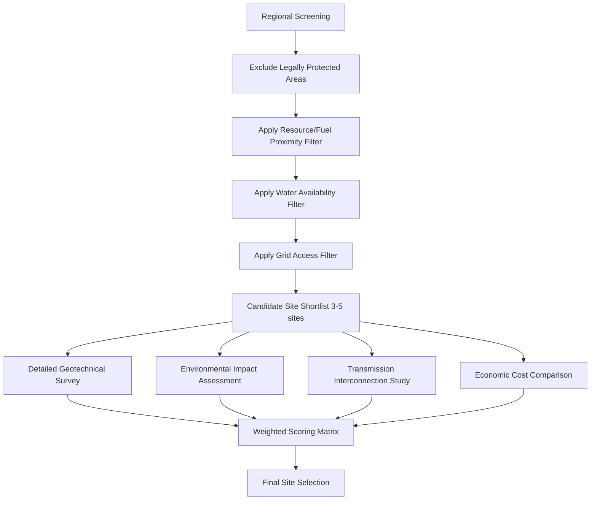
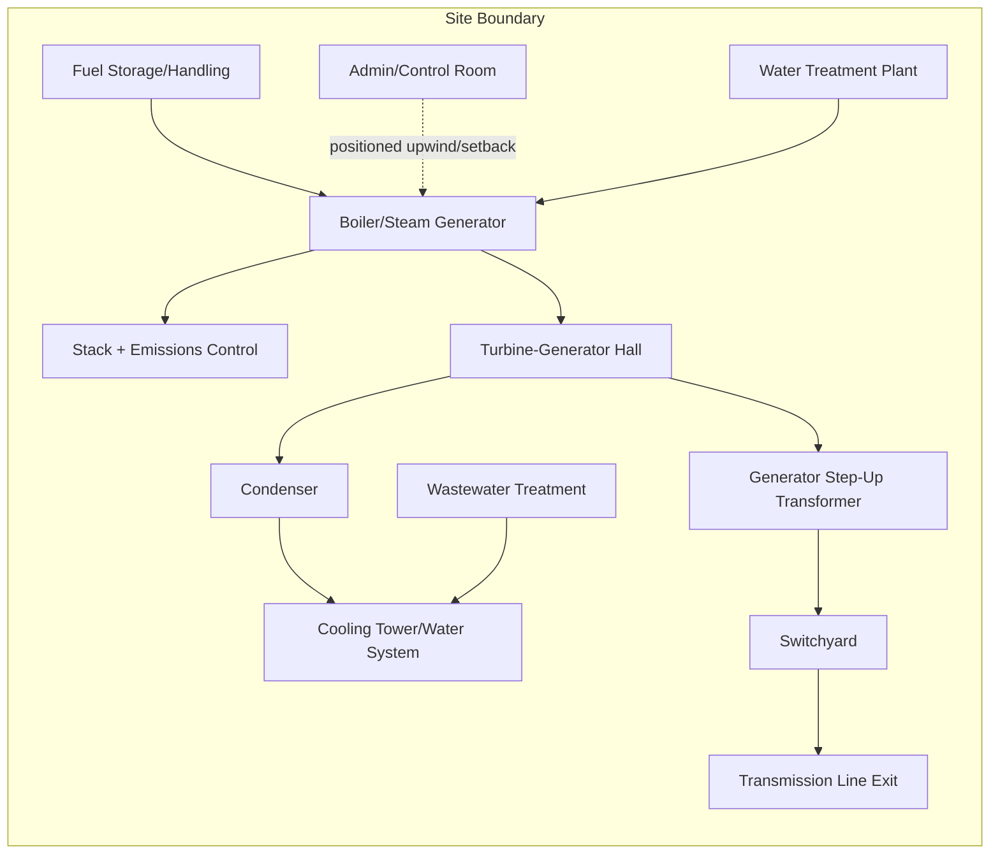

## Site Selection and Plant Layout

### Overview

Site selection and plant layout are foundational decisions in power plant engineering that determine capital cost, operational efficiency, safety envelope, environmental impact, and long-term expandability. Site selection is a multi-criteria evaluation of geographic, environmental, infrastructural, regulatory, and economic factors, while plant layout translates the selected site's constraints into a physical arrangement of process units, structures, and support systems. Both decisions are made early in project lifecycle and are extremely costly to reverse once construction begins, making them high-leverage engineering activities.

### Site Selection Criteria

**1. Fuel/Resource Availability**

- Thermal plants (coal, gas, nuclear): proximity to fuel source or transport corridor (rail, pipeline, port) to minimize fuel logistics cost
- Renewable plants: resource quality is the dominant siting driver — solar irradiance (GHI/DNI), wind speed/capacity factor, hydraulic head and flow, geothermal gradient
- Fuel transport cost scales with distance and mode; pipeline-delivered gas or on-site/mine-mouth coal plants minimize this cost component

**2. Water Availability**

Water is often the single most site-constraining factor for thermal plants due to cooling requirements.

- Once-through cooling: requires large, reliable water body (river, lake, sea) with adequate flow to limit thermal discharge impact
- Wet cooling towers (recirculating): still require significant makeup water (2–4 L/kWh typical for evaporative loss) but far less than once-through
- Dry cooling (air-cooled condensers): minimal water use but higher capital cost and reduced efficiency, especially in hot climates — used where water is severely constrained
- Water quality also matters: boiler feedwater requires treatment, and intake water chemistry affects heat exchanger fouling and corrosion

**3. Transmission and Grid Interconnection**

- Proximity to existing high-voltage transmission infrastructure significantly reduces interconnection cost
- Grid interconnection studies assess: available transfer capacity, need for new substations or line upgrades, and short-circuit/stability impact on the existing network
- Renewable plants in remote high-resource areas (e.g., offshore wind, desert solar) often face the largest transmission cost premiums, sometimes requiring dedicated new transmission corridors

**4. Geotechnical and Seismic Conditions**

- Soil bearing capacity must support heavy structures (boilers, turbine-generator foundations, cooling towers) without excessive settlement
- Seismic zone classification governs foundation design, structural bracing, and equipment anchoring requirements (per codes such as ASCE 7 or IBC in the US, or equivalent national standards)
- Flood plain status, groundwater table depth, and slope stability are assessed via geotechnical borings and hydrological studies
- Avoidance of fault lines, subsidence-prone areas (e.g., over mined-out zones), and karst/sinkhole-prone geology

**5. Environmental and Regulatory Constraints**

- Environmental Impact Assessment (EIA) requirements: air quality attainment status, protected species habitat, wetlands, cultural/archaeological sites
- Air dispersion modeling to confirm stack emissions comply with ambient air quality standards at the property boundary and nearby receptors
- Noise ordinances and setback distances from residential areas
- Permitting timeline and jurisdictional complexity (local, state/provincial, and national approvals) directly affects project schedule risk

**6. Accessibility and Logistics**

- Road/rail/port access for heavy equipment delivery (transformers, turbine rotors, generator stators can weigh hundreds of tons and require specialized transport)
- Construction workforce availability and housing/commuting distance
- Proximity to population centers: balances load-serving benefit (shorter transmission) against public opposition and safety buffer requirements

**7. Land Cost and Availability**

- Land acquisition cost, ownership complexity (eminent domain considerations in some jurisdictions), and future expansion land banking
- Topography affecting grading/earthwork cost — flat sites minimize civil works, but drainage must still be engineered

**8. Climate and Ambient Conditions**

- Ambient temperature affects gas turbine output (power output derates as inlet air temperature rises, following manufacturer correction curves) and cooling system sizing
- Extreme weather exposure (hurricanes, tornadoes, extreme cold) drives structural design margins
- Elevation affects air density and therefore combustion turbine performance and cooling tower efficiency

### Multi-Criteria Site Screening Process

A typical site selection workflow proceeds through progressively finer filtering:

**Weighted Scoring Matrix Example**

A common decision tool assigns weights to each criterion and scores candidate sites, selecting the highest weighted total.

| Criterion | Weight | Site A Score | Site B Score | Site C Score |
| --- | --- | --- | --- | --- |
| Fuel/resource access | 0.20 | 8 | 6 | 9 |
| Water availability | 0.20 | 7 | 9 | 5 |
| Grid interconnection | 0.15 | 6 | 8 | 7 |
| Environmental risk | 0.15 | 8 | 5 | 7 |
| Land cost | 0.10 | 9 | 6 | 8 |
| Geotechnical suitability | 0.10 | 7 | 8 | 6 |
| Accessibility | 0.10 | 6 | 7 | 8 |

Weighted total for Site A: $(8 \times 0.20) + (7 \times 0.20) + (6 \times 0.15) + (8 \times 0.15) + (9 \times 0.10) + (7 \times 0.10) + (6 \times 0.10) = 7.3$

**[Inference]** Scoring weights and scale values in such matrices are project-specific judgment calls set by the owner/engineer team based on strategic priorities, not standardized industry constants — the method above illustrates the general approach rather than a fixed formula.

### Plant Layout Principles

**1. Process Flow Logic**

Layout should follow the natural sequence of the thermodynamic/process cycle to minimize piping runs, pressure drops, and construction cost:

For a fossil-fuel Rankine cycle plant, the general flow is: fuel receiving/storage → fuel handling → boiler/steam generator → turbine-generator building → condenser → cooling system → switchyard, with coal/ash handling and emissions control (baghouse, FGD, SCR) integrated along the flue gas path.

**2. Safety Zoning and Separation Distances**

- Fuel storage (especially flammable liquids/gases) is separated from ignition sources and occupied buildings per applicable codes (e.g., NFPA standards in the US)
- Hazardous area classification (electrical equipment ratings) applies around fuel handling and any area with potential flammable vapor accumulation
- Blast/fire separation distances between major equipment (transformers, fuel storage, control room) limit cascading failure risk
- Control room and administration buildings positioned to maximize distance from highest-hazard equipment while retaining operational sightlines/access

**3. Prevailing Wind Consideration**

- Stack and emission sources positioned considering prevailing wind direction relative to control rooms, administration buildings, and site boundary to minimize personnel exposure and optimize dispersion
- Cooling tower plume (visible moisture) placement considered relative to switchyard (fog/icing can affect electrical equipment) and roadways (fog-related visibility hazards)

**4. Equipment Arrangement — Outdoor vs. Indoor**

- Temperate/mild climates: many components (transformers, some pumps, switchyard equipment) are outdoor-rated, reducing building footprint and cost
- Cold/harsh climates: greater enclosure of equipment required, increasing building cost but improving reliability and maintenance access
- Turbine hall typically enclosed regardless of climate, due to precision equipment and maintenance crane requirements

**5. Maintenance Access and Laydown Areas**

- Crane access paths for major component removal (generator rotor, turbine casings, transformer replacement) must be preserved in the layout — this is frequently the layout constraint that drives building bay spacing
- Laydown areas for maintenance staging and temporary equipment during outages
- Adequate spacing between equipment rows for personnel walkways and mobile equipment (forklifts, cranes)

**6. Future Expansion**

- Layout often reserves land and infrastructure capacity (transmission bay positions, water intake sizing, fuel handling capacity) for future additional generating units
- "Greenfield" master planning typically phases site development, with common infrastructure (switchyard, water treatment, administration) sized for eventual full build-out from the start to avoid costly retrofits

**7. Utility and Auxiliary Systems Layout**

- Water treatment plant, wastewater/blowdown treatment, compressed air system, fire protection system (water storage tank, pump house, hydrant network) positioned for short interconnecting runs to main process equipment
- Electrical distribution: auxiliary transformers and switchgear positioned to minimize cable run lengths from generator step-up transformer to plant loads

### Typical Plant Layout Diagram (Fossil Thermal Plant)

### Site Layout Considerations by Plant Type

**Solar PV Plants**

- Land area dominated by panel field spacing (row-to-row distance set by shading/sun-angle calculations for the site latitude), not equipment footprint
- Inverter/transformer stations distributed across the field to minimize DC cable losses (string/central inverter architecture trade-off)
- Substation and grid interconnection point typically at one corner/edge, with medium-voltage collector circuits routed through the field

**Wind Plants**

- Turbine micrositing driven by wake-loss minimization (turbine spacing typically 3–10 rotor diameters depending on prevailing wind direction and turbulence)
- Access road network must support blade/nacelle transport (large turning radii, load limits)
- Collector substation positioned centrally to minimize medium-voltage collection cable length

**Nuclear Plants**

- Exclusion zone and emergency planning zone requirements are typically far larger and more stringently regulated than for other plant types (site-specific regulatory framework)
- Seismic and flood design basis is typically evaluated to a higher standard than for conventional thermal plants, reflecting the consequence severity of failure
- Redundant/physically separated safety systems (multiple independent trains) require layout that preserves physical separation to prevent common-cause failure — this is a defining nuclear-specific layout driver

**[Unverified]** Specific numerical setback distances, exclusion zone radii, and design-basis parameters for nuclear facilities vary by national regulatory body (e.g., NRC in the US, IAEA guidance internationally) and should be verified against the applicable jurisdiction's current regulations rather than treated as universal figures.

### Economic Trade-offs in Site/Layout Decisions

- **Compact layout** reduces piping, cabling, and land cost but increases congestion, complicates maintenance access, and can raise fire/safety risk concentration
- **Spread-out layout** improves safety separation and maintenance access but increases interconnecting infrastructure cost (pipe runs, cable trenches, roads)
- Remote high-resource sites (e.g., excellent wind/solar resource but far from grid) trade lower LCOE from resource quality against higher transmission capital cost — project economics require balancing these against each other via levelized cost modeling
- Brownfield sites (former industrial/power sites) can offer existing transmission and water infrastructure, reducing capital cost, but may carry contamination remediation liability

### Worked Example: Cooling Water Approach Check

**Problem:** A 500 MW coal plant with 38% thermal efficiency considers once-through cooling. Estimate the cooling water flow required if the river can accept a maximum $\Delta T$ of 8°C across the condenser, and confirm generation capacity versus environmental discharge limits.

**Solution:**

Heat rejected to cooling water:

$$Q_{rejected} = P_{elec} \times \left(\frac{1 - \eta}{\eta}\right) = 500\ \text{MW} \times \left(\frac{1 - 0.38}{0.38}\right) = 815.8\ \text{MW}_{th}$$

Required cooling water mass flow rate using $Q = \dot{m} c_p \Delta T$:

$$\dot{m} = \frac{Q_{rejected}}{c_p \times \Delta T} = \frac{815{,}800\ \text{kW}}{4.186\ \text{kJ/kg°C} \times 8°C} = 24{,}365\ \text{kg/s}$$

Converting to volumetric flow (water density ≈ 1000 kg/m³):

$$\dot{V} \approx 24.4\ \text{m}^3/\text{s} \approx 24{,}365\ \text{L/s}$$

This flow requirement (~24.4 m³/s, or roughly 2.1 million m³/day) must be checked against the river's minimum seasonal flow (typically a regulatory requirement that the plant's withdrawal not exceed some fraction of low-flow conditions) — if the river cannot reliably sustain this withdrawal without unacceptable ecological or downstream-user impact, the plant must shift to recirculating wet cooling or dry cooling, which directly changes both the site's water criteria score and the physical footprint of the layout (cooling towers require significant additional land and height clearance).

### Key Challenges

- **Conflicting criteria:** the best resource site (fuel/wind/solar) is frequently not the best grid-access or water-access site, requiring genuine trade-off optimization rather than a dominant "best" location
- **Regulatory/permitting risk:** environmental and community opposition can materially delay or block otherwise technically sound sites — increasingly a first-order project risk in many jurisdictions
- **Climate change considerations:** historical hydrology, flood plain maps, and extreme weather statistics used in site selection are increasingly treated with added margin, since past climate records are considered less reliable as predictors of future site risk in many current engineering practices
- **Cumulative infrastructure lock-in:** once major infrastructure (switchyard, water intake, rail spur) is built, subsequent plant additions/retrofits are constrained by the original layout's assumptions

**Key Points**

- Site selection is a multi-criteria trade-off across fuel/resource access, water availability, transmission proximity, geotechnical/seismic suitability, environmental/regulatory constraints, accessibility, land cost, and climate.
- Plant layout follows process flow logic while integrating safety zoning, prevailing wind, maintenance access, and expansion planning.
- Water availability and cooling system choice (once-through, wet tower, dry cooling) is frequently the most site-constraining decision for thermal plants and directly shapes both siting and layout footprint.
- Weighted scoring matrices provide a structured but ultimately judgment-based method for comparing candidate sites across incommensurable criteria.

**Related Topics**

- Cooling System Design: Wet, Dry, and Hybrid Cooling Towers
- Environmental Impact Assessment (EIA) Methodology for Power Projects
- Transmission Interconnection Studies and Grid Impact Analysis
- Seismic Design Considerations for Power Plant Structures
- Fuel Handling and Storage System Design
- Plant Economics: Capital Cost Estimation and LCOE
- Emissions Control Systems (FGD, SCR, Baghouse) Layout Integration
- Balance of Plant (BOP) System Design