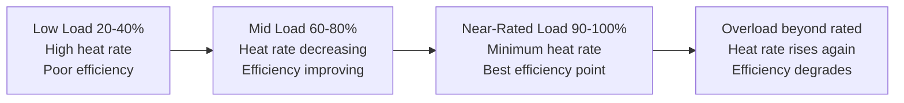

## Plant Efficiency, Heat Rate, and Capacity Factor

### Overview

Plant efficiency, heat rate, and capacity factor are the three core performance metrics used to characterize how well a power plant converts input energy into delivered electricity and how intensively that capacity is utilized over time. Efficiency and heat rate are thermodynamic performance measures describing conversion quality at a given operating point; capacity factor is a utilization measure describing how much of a plant's theoretical maximum output is actually realized over a period. Together they drive fuel cost, emissions intensity, and the economics that determine whether a plant is dispatched, retired, or built in the first place.

### Thermal Efficiency

**Definition**

$$\eta = \frac{W_{net}}{Q_{in}} \times 100\%$$

where $W_{net}$ is net electrical output (gross generation minus auxiliary/parasitic load) and $Q_{in}$ is the thermal energy input from fuel.

**Gross vs. Net Efficiency**

- Gross efficiency: uses gross generator output before subtracting plant auxiliary loads (pumps, fans, coal mills, cooling system, control systems)
- Net efficiency: uses net output after auxiliary loads are subtracted — this is the figure relevant to actual power delivered to the grid and is always lower than gross efficiency
- Auxiliary/parasitic load typically consumes 3–8% of gross output for fossil thermal plants (higher for plants with FGD, SCR, and other emissions control equipment; lower for simple-cycle gas turbines)

**HHV vs. LHV Basis**

Efficiency figures must specify whether fuel energy input is calculated on Higher Heating Value (HHV, includes latent heat of water vapor condensation) or Lower Heating Value (LHV, excludes it).

- US convention typically reports efficiency/heat rate on HHV basis
- European and much of the rest of the world typically use LHV basis
- For natural gas, the HHV/LHV difference is roughly 10%, meaning the same plant reports a lower efficiency number on HHV basis than LHV basis
- **[Unverified]** Exact regional convention practices vary by utility and reporting standard; always confirm which basis is being used when comparing published efficiency figures across sources

**Theoretical Efficiency Limits**

Carnot efficiency sets the theoretical upper bound for any heat engine operating between a heat source and heat sink:

$$\eta_{Carnot} = 1 - \frac{T_{cold}}{T_{hot}}$$

with temperatures in absolute units (Kelvin). Real cycles achieve only a fraction of Carnot efficiency due to irreversibilities (finite temperature-difference heat transfer, friction, combustion irreversibility), but the Carnot limit explains why higher steam/combustion temperatures consistently drive higher achievable efficiency across cycle types.

### Heat Rate

**Definition and Relationship to Efficiency**

Heat rate expresses the same information as efficiency, inverted and in energy-per-unit-output terms — it is the fuel energy input required to produce one unit of electrical output.

$$HR = \frac{Q_{in}}{W_{net}}$$

Commonly expressed in Btu/kWh (US) or kJ/kWh (SI/metric):

$$HR_{Btu/kWh} = \frac{3412\ \text{Btu/kWh}}{\eta}$$

$$HR_{kJ/kWh} = \frac{3600\ \text{kJ/kWh}}{\eta}$$

where 3412 Btu/kWh and 3600 kJ/kWh are the conversion factors for one kWh of electrical energy expressed in thermal units.

**Example:** A plant with 40% net efficiency (LHV basis):

$$HR = \frac{3412}{0.40} = 8{,}530\ \text{Btu/kWh}$$

Lower heat rate = better performance (less fuel per unit of electricity), which is the inverse relationship of efficiency (where higher = better) — this inversion is a frequent source of confusion and worth stating explicitly when interpreting reported figures.

**Typical Heat Rate / Efficiency Ranges by Technology**

| Technology | Net Efficiency (LHV) | Heat Rate (Btu/kWh) |
| --- | --- | --- |
| Simple-cycle gas turbine | 30–40% | 8,500–11,400 |
| Combined-cycle gas turbine (CCGT) | 50–62% | 5,500–6,800 |
| Supercritical coal | 38–42% | 8,100–9,000 |
| Subcritical coal | 33–37% | 9,200–10,300 |
| Ultra-supercritical coal | 42–45% | 7,600–8,100 |
| Nuclear (PWR/BWR) | 32–37% | 9,200–10,700 |
| Combined heat and power (CHP) | up to 80–90% (total) | varies — see note below |

**[Inference]** These ranges reflect commonly cited industry figures for modern, well-maintained units; individual plant performance varies with age, ambient conditions, load level, and maintenance state, so a specific unit's guaranteed or tested heat rate should be obtained from its performance test data rather than assumed from generic ranges.

For CHP, the very high total efficiency reflects that both electrical output and useful thermal output (steam/hot water for industrial or district heating use) are counted in $W_{net}$-equivalent terms, unlike electricity-only plants where rejected heat is a pure loss.

**Heat Rate Curve (Part-Load Behavior)**

Heat rate is not constant across load — it varies with output level, generally following a characteristic curve:

This characteristic shape occurs because fixed thermal losses (radiation, unburned fuel, auxiliary power draw) are a larger fraction of a smaller output at low load, while at very high/overload conditions, component performance (e.g., turbine blade efficiency, combustion completeness) degrades from design-optimum conditions. This is a key reason grid dispatch tends to favor running efficient baseload units near their best-efficiency point rather than cycling them across wide load ranges when avoidable.

**Heat Rate Degradation Over Time**

- Component fouling (heat exchanger surfaces, turbine blades), seal wear, and instrumentation drift cause gradual heat rate degradation between overhauls
- Typical degradation is on the order of 1–3% over an operating interval between major overhauls, recovered (partially or fully) at the next major maintenance outage
- **[Inference]** Specific degradation rates are highly plant- and technology-specific and should be tracked via the plant's own performance monitoring program rather than assumed from generic figures

### Capacity Factor

**Definition**

$$CF = \frac{E_{actual}}{E_{max\ possible}} \times 100\% = \frac{E_{actual}}{P_{rated} \times 8760\ \text{h}} \times 100\%$$

where $E_{actual}$ is actual energy generated over a period (typically one year), $P_{rated}$ is the plant's nameplate/rated capacity, and 8760 is the number of hours in a non-leap year (8784 in a leap year).

**Typical Capacity Factors by Technology**

| Technology | Typical Capacity Factor |
| --- | --- |
| Nuclear | 85–93% |
| Coal (baseload) | 40–60% (declining in many grids due to renewables displacement) |
| Combined-cycle gas | 45–65% |
| Simple-cycle gas (peaker) | 5–15% |
| Onshore wind | 30–45% |
| Offshore wind | 40–55% |
| Utility-scale solar PV | 15–30% (strongly latitude/climate dependent) |
| Hydroelectric | 30–50% (varies with hydrology and reservoir management) |

**[Unverified]** These figures are broadly representative but vary significantly by region, market design, resource quality, and dispatch order; current-year statistics for a specific grid or fleet should be verified against that grid operator's published data rather than assumed from generic global averages.

**Distinguishing Capacity Factor from Related Terms**

- **Capacity factor** measures energy delivered against theoretical maximum — captures both availability and dispatch/resource limitations
- **Availability factor** measures the fraction of time a plant is capable of operating (not forced offline by outage), regardless of whether it was actually dispatched:

  $$AF = \frac{\text{Hours available}}{\text{Total hours in period}} \times 100\%$$
- **Utilization factor** (less commonly used) measures actual output against the plant's actual available capacity rather than nameplate rating

A plant can have high availability but low capacity factor if it is available but not economically dispatched (e.g., a peaker plant that is mechanically ready most of the time but only called upon during peak demand). Conversely, variable renewable plants have capacity factor limited primarily by resource availability rather than mechanical availability — a wind farm can have >95% availability but only 35% capacity factor because the wind simply isn't blowing at rated speed most of the time.

**Capacity Factor Drivers**

- **Dispatchable thermal/nuclear plants:** capacity factor driven by merit-order economics (fuel cost, must-run status), planned maintenance outage schedule, and forced outage rate
- **Variable renewables:** capacity factor driven primarily by resource quality at the specific site (wind speed distribution, solar irradiance, hydrological year) and secondarily by curtailment (grid operator reducing output due to transmission constraints or oversupply)
- **Baseload vs. peaking role:** plants designed and contracted as baseload target high capacity factor by design; peaking plants are intentionally built for high flexibility and low capacity factor, with economics based on capacity payments/scarcity pricing rather than energy volume

### Interrelationship Between the Three Metrics

These metrics interact to determine overall plant economics:

$$\text{Annual Fuel Cost} = \frac{P_{rated} \times CF \times 8760 \times HR \times \text{Fuel Price}}{\text{Fuel heating value units}}$$

- Higher efficiency (lower heat rate) reduces fuel cost per MWh generated but does not by itself determine how often the plant runs
- Higher capacity factor spreads fixed capital costs over more generated MWh, reducing the capital cost component of levelized cost of electricity (LCOE), independent of efficiency
- A highly efficient plant with low capacity factor (e.g., an efficient CCGT used only for peaking) may have higher LCOE than a less efficient plant with very high capacity factor (e.g., baseload coal), because capital cost amortization dominates in the former case

### Worked Example: Combined Metric Calculation

**Problem:** A 600 MW combined-cycle gas plant generates 3,942,000 MWh over one year, consuming natural gas with a heat input of 43,200,000 GJ (LHV basis) over the same period. Calculate net efficiency, heat rate (kJ/kWh), and capacity factor.

**Solution:**

**Step 1 — Net efficiency:**

Convert generation to energy in GJ: $3{,}942{,}000\ \text{MWh} \times 3.6\ \text{GJ/MWh} = 14{,}191{,}200\ \text{GJ}$

$$\eta = \frac{W_{net}}{Q_{in}} = \frac{14{,}191{,}200\ \text{GJ}}{43{,}200{,}000\ \text{GJ}} = 0.3285 = 32.85\%$$

**[Inference]** This resulting efficiency (~33%) is notably below the typical 50–62% range cited for combined-cycle plants; in a real engineering context this would prompt a check of the input data (e.g., possible unit inconsistency or an atypically poor-performing/derated unit) — included here as a numeric check step, not a claim about typical CCGT performance.

**Step 2 — Heat rate:**

$$HR = \frac{Q_{in}}{W_{net}} = \frac{43{,}200{,}000\ \text{GJ} \times 1000}{3{,}942{,}000\ \text{MWh}} = 10{,}959\ \text{MJ/MWh} = 10{,}959\ \text{kJ/kWh}$$

Cross-check via efficiency: $HR = 3600 / 0.3285 = 10{,}960$ kJ/kWh ✓ (consistent within rounding)

**Step 3 — Capacity factor:**

$$E_{max} = 600\ \text{MW} \times 8760\ \text{h} = 5{,}256{,}000\ \text{MWh}$$

$$CF = \frac{3{,}942{,}000}{5{,}256{,}000} \times 100\% = 75.0\%$$

**Interpretation:** the plant ran at a high 75% capacity factor (consistent with baseload/near-baseload dispatch) but with an efficiency figure well below typical modern CCGT performance — in practice this combination would prompt investigation into whether the plant is an older/smaller-frame unit, is operating with unusually high auxiliary load, or whether one of the input figures reflects a different basis or reporting period than assumed.

### Efficiency Improvement Strategies

- **Combined-cycle configuration:** using gas turbine exhaust heat to raise steam for a secondary steam turbine (Brayton-Rankine combined cycle) substantially raises overall efficiency versus either cycle alone, since it approaches the theoretical benefit of operating across a wider effective temperature range
- **Higher steam temperature/pressure (supercritical, ultra-supercritical):** raising $T_{hot}$ increases the Carnot-limited ceiling and typically raises achievable Rankine cycle efficiency, at the cost of requiring more advanced (costlier) materials to withstand higher pressure/temperature
- **Reheat and regenerative feedwater heating:** intermediate reheat between turbine stages and feedwater preheating using extraction steam both reduce cycle irreversibility and raise efficiency versus a basic Rankine cycle
- **Combined heat and power (cogeneration):** capturing rejected heat for industrial or district heating use raises overall (though not strictly electrical) conversion efficiency
- **Reducing auxiliary/parasitic load:** more efficient pumps, fans, and control systems narrow the gap between gross and net efficiency
- **Maintenance and fouling control:** regular cleaning of heat exchanger surfaces, turbine blade washing/reblading, and instrumentation calibration limit heat rate degradation over the maintenance cycle

### Key Challenges

- **Ambient condition sensitivity:** gas turbine output and efficiency derate with rising ambient temperature and altitude, meaning site climate directly affects both metrics — manufacturer correction curves are used to translate site-specific expected performance from standard ISO-rated conditions
- **Cycling duty degrading heat rate:** plants originally designed for steady baseload operation but increasingly cycled to accommodate variable renewable integration experience faster heat rate degradation and thermal fatigue than their original duty-cycle design assumed
- **Renewable capacity factor variability:** year-to-year weather/hydrology variation means a single year's capacity factor for wind, solar, or hydro can deviate meaningfully from long-term average, complicating both project financial forecasting and grid planning
- **Metric basis inconsistency:** comparing efficiency/heat rate figures across sources without confirming HHV vs. LHV basis, and gross vs. net output basis, is a common source of misleading comparison

**Key Points**

- Efficiency and heat rate express the same thermodynamic performance inversely: higher efficiency corresponds to lower (better) heat rate.
- Always confirm HHV/LHV basis and gross/net basis before comparing published efficiency or heat rate figures across sources.
- Capacity factor measures utilization, not thermodynamic performance — it is driven by dispatch economics for thermal/nuclear plants and by resource availability for variable renewables.
- Efficiency, heat rate, and capacity factor jointly determine fuel cost and capital cost amortization, and therefore overall levelized cost of electricity.

**Related Topics**

- Rankine and Brayton Cycle Thermodynamics
- Combined-Cycle Gas Turbine (CCGT) Configuration and Performance
- Supercritical and Ultra-Supercritical Steam Cycle Design
- Levelized Cost of Electricity (LCOE) Methodology
- Power Plant Dispatch and Merit Order Economics
- Combined Heat and Power (CHP) System Design
- Plant Performance Testing and Degradation Monitoring
- Renewable Resource Assessment (Wind/Solar) Methodology