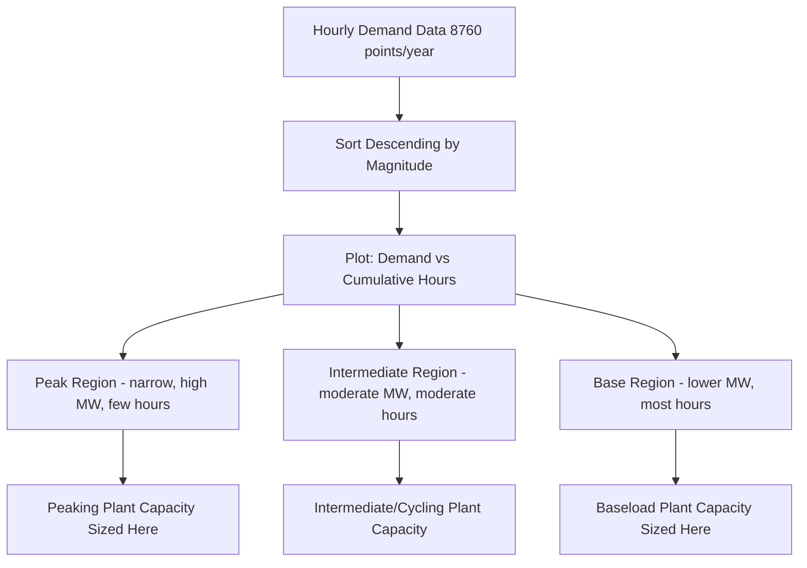
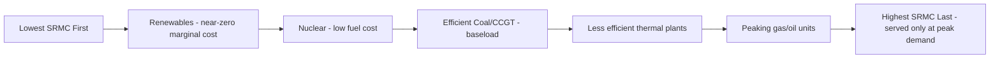

## Load Curves, Dispatch, and Part-Load Operation

### Overview

Load curves, dispatch, and part-load operation together describe how electrical demand varies over time and how a fleet of generating plants is scheduled and operated to meet that demand economically and reliably. Load curves characterize the shape of demand; dispatch is the process of deciding which plants run, when, and at what output; part-load operation covers how individual plants behave thermodynamically and mechanically when running below rated capacity. These three concepts connect system-level planning with unit-level engineering performance.

### Load Curves

**Daily Load Curve**

A plot of system demand (MW) versus time of day, typically showing:

- Overnight minimum ("base load" trough), often 60–70% of daily peak
- Morning ramp as commercial/industrial activity and residential usage increase
- Daytime plateau or secondary peak
- Evening peak (residential cooking, lighting, HVAC), typically the daily maximum in most grids
- Late-night decline back toward the overnight minimum

**Load Duration Curve (LDC)**

The load duration curve reorders the same demand data by magnitude rather than by time — plotting demand against the number of hours per year that demand level is equaled or exceeded, sorted from highest to lowest. This transformation is central to generation planning because it directly informs how much capacity of each type is economically justified.

The area under the full load duration curve equals total annual energy consumption (MWh), while the peak value equals system peak demand (MW). The curve's shape — specifically how steeply it falls from peak — determines the relative proportion of baseload, intermediate, and peaking capacity a system needs.

**Load Factor**

$$LF = \frac{\text{Average Load}}{\text{Peak Load}} \times 100\% = \frac{\text{Total Energy (MWh)} / 8760\ \text{h}}{\text{Peak Demand (MW)}} \times 100\%$$

- High load factor (flatter demand curve) means capacity is used more consistently, improving asset utilization economics
- Low load factor (peaky demand) means significant capacity sits idle most of the year, needed only to serve infrequent peaks — this capacity is expensive per MWh delivered since its capital cost is spread over few operating hours
- Typical utility system load factors run roughly 55–70%, though this varies substantially by climate, industrial mix, and demand-side management programs

**Seasonal and Weather-Driven Variation**

- Summer-peaking systems: driven by air conditioning load, peak typically mid-afternoon on hot days
- Winter-peaking systems: driven by heating load (electric resistance or heat pump), peak typically morning/evening on cold days
- A system's peak season determines which generation and maintenance scheduling assumptions apply (e.g., planned outages are scheduled for the system's low-demand season)

### Generation Dispatch

**Merit Order Dispatch**

The fundamental dispatch principle in most electricity markets and vertically-integrated utility operations: plants are called upon in order of increasing short-run marginal cost (SRMC) until demand is met.

$$SRMC \approx \text{Fuel Cost} \times \text{Heat Rate} + \text{Variable O\&M}$$

- Plants with lowest SRMC (typically renewables with zero fuel cost, then nuclear, then efficient baseload thermal) are dispatched first and run continuously when available
- Progressively higher-SRMC plants are added to meet rising demand through the day
- The last (most expensive) unit dispatched to meet demand at any moment sets the market clearing price in many wholesale electricity markets (marginal pricing/locational marginal pricing systems)

**Unit Commitment vs. Economic Dispatch**

These are distinct, sequential optimization problems in system operations:

- **Unit commitment:** the longer-horizon (day-ahead to week-ahead) decision of which plants to start up, keep online, or shut down, accounting for startup costs, minimum up/down time constraints, and forecast demand/renewable output
- **Economic dispatch:** the shorter-horizon (real-time to hour-ahead) decision of how much output each already-committed online plant should produce to meet demand at minimum cost, subject to transmission and operating constraints

Both are typically solved as constrained optimization problems by system operators (independent system operators, regional transmission organizations, or utility dispatch centers), incorporating transmission limits, reserve margin requirements, and increasingly, variable renewable forecast uncertainty.

**Must-Run and Reliability Constraints**

- Some units are dispatched outside pure economic merit order due to reliability needs: voltage support, local reactive power requirements, or transmission constraint relief (a plant may be needed to run regardless of its cost position because it is the only source in a transmission-constrained area)
- Spinning reserve and operating reserve requirements mean some capacity must be held back (running at part-load or on standby) rather than fully dispatched, to cover sudden generation loss or demand spikes
- Minimum stable generation limits for thermal units set a floor below which a unit cannot operate stably without shutting down, affecting how low it can be dispatched during low-demand periods

**Impact of Variable Renewables on Dispatch ("Duck Curve" Effect)**

High penetration of solar generation has changed the shape of the *net load* curve (demand minus variable renewable output) that conventional dispatchable plants must serve:

- Midday net demand drops sharply as solar output peaks, sometimes pushing net load to very low levels or requiring curtailment of renewable output
- A steep ramp is required in the late afternoon/early evening as solar output falls while demand remains high or rises toward the evening peak
- This steep ramp requirement drives demand for flexible, fast-ramping generation (gas peakers, batteries, pumped hydro) and increasingly for demand response and storage to manage the ramp economically
- **[Inference]** The severity of this ramp effect is specific to each grid's renewable penetration level and load shape; grids with different demand patterns or storage deployment will exhibit different net-load curve characteristics than the commonly cited "duck curve" pattern from high-solar-penetration systems

### Part-Load Operation

**Why Plants Operate Part-Load**

Beyond pure economic dispatch, plants run below rated capacity due to: following variable demand within the day, providing frequency regulation/load-following reserve, accommodating equipment derates (ambient temperature, fouling), or operating during startup/shutdown transients.

**Thermodynamic Effects of Part-Load Operation**

- **Heat rate penalty:** as covered in efficiency/heat rate topics, most thermal plants exhibit rising heat rate (falling efficiency) as load decreases from the best-efficiency point, because fixed losses become a larger fraction of reduced output
- **Gas turbine part-load behavior:** simple-cycle and combined-cycle gas turbines see a pronounced efficiency drop at part load because compressor and combustor performance is optimized for design-point airflow; inlet guide vane (IGV) modulation partially compensates by reducing airflow to maintain higher exhaust temperature at part load, improving part-load efficiency versus simple fuel-flow reduction alone
- **Steam turbine part-load behavior:** governed by valve position (throttle governing reduces pressure/flow via valve throttling, incurring throttling losses) or sliding pressure operation (boiler pressure reduced with load, avoiding throttling losses but requiring more complex control) — sliding pressure generally offers better part-load efficiency for units that operate across a wide load range regularly

**Mechanical and Material Effects**

- **Thermal cycling stress:** repeated startup/shutdown and load-following cycles induce thermal fatigue in thick-walled components (boiler drums, steam turbine rotors, headers) due to differential thermal expansion — this is a primary driver of maintenance cost and component life consumption for cycling units
- **Minimum load stability limits:** below a certain load (often 20–40% of rated capacity depending on technology and fuel), flame stability (for combustion units) or steam quality/circulation (for boilers) may become unreliable, setting a practical floor on dispatchable output
- **Startup time and cost:** hot starts (recent shutdown), warm starts (moderate downtime), and cold starts (extended downtime) have progressively longer startup times and higher startup fuel/wear costs — this directly factors into unit commitment decisions, since frequent cycling can make an otherwise low-SRMC unit less attractive if startup costs are high

**Flexibility Metrics**

- **Ramp rate:** MW/minute the unit can change output, critical for following net-load ramps (e.g., the evening solar-decline ramp)
- **Minimum stable generation (turndown ratio):** lowest load level at which the unit can operate continuously and stably
- **Startup time:** time from initiating startup to reaching minimum synchronized load, varies by prior downtime state (hot/warm/cold)

| Technology | Typical Ramp Rate | Min. Stable Load | Cold Start Time |
| --- | --- | --- | --- |
| Simple-cycle gas turbine (aeroderivative) | Very fast, minutes to full load | ~20-30% | ~10-20 min |
| Combined-cycle gas turbine | Moderate | ~30-40% | 2-4 hours |
| Supercritical coal | Slower | ~30-40% | 6-10+ hours |
| Nuclear | Very slow/limited by design | High (often near 100%, limited flexibility) | Days |
| Battery storage | Near-instantaneous | 0% (can go to zero or reverse) | Seconds |
| Hydro (with storage) | Very fast | Near 0% | Minutes |

**[Unverified]** These are representative order-of-magnitude ranges; specific unit flexibility depends heavily on design vintage, control system sophistication, and manufacturer-specific engineering — actual values should be obtained from unit-specific performance data or manufacturer specifications rather than treated as universal.

### Worked Example: Load Factor and Capacity Requirement

**Problem:** A utility system has annual energy consumption of 45,000,000 MWh and a system peak demand of 8,200 MW. Calculate the load factor, and estimate the capacity that operates at a low (<20%) capacity factor if the system's load duration curve indicates the top 15% of hours account for 22% of total energy above a "base" level.

**Solution:**

**Step 1 — Load factor:**

Average load: $\frac{45{,}000{,}000\ \text{MWh}}{8760\ \text{h}} = 5{,}137\ \text{MW}$

$$LF = \frac{5{,}137}{8{,}200} \times 100\% = 62.6\%$$

**Interpretation:** a 62.6% load factor indicates a moderately peaky system — average demand is about 63% of peak, meaning substantial capacity is needed to serve peak conditions that occur relatively infrequently over the year.

**Step 2 — Peaking capacity implication:**

The gap between peak (8,200 MW) and average (5,137 MW) demand — roughly 3,063 MW — represents capacity that, by definition of the load curve shape, is only fully utilized during the highest-demand hours of the year. Given the stated load duration curve characteristic (top 15% of hours carrying disproportionate but not overwhelming energy share), this reinforces that a meaningful block of the system's installed capacity is economically justified primarily by its role in serving infrequent peak conditions — consistent with the role peaking plants (with typical capacity factors in the 5–15% range) play in a generation portfolio, rather than by continuous baseload energy delivery.

**[Inference]** The precise MW split between "peaking-justified" and "baseload-justified" capacity requires the full load duration curve data and a formal generation expansion/reliability study (e.g., loss-of-load-probability analysis); the qualitative interpretation above illustrates the relationship between load factor and peaking capacity need rather than deriving an exact figure from the given summary statistic alone.

### Demand-Side and Storage Interaction with Dispatch

- **Demand response (DR):** programs that shift or reduce demand during peak periods (in exchange for compensation or rate incentives) effectively flatten the load duration curve, reducing the need for high-SRMC peaking capacity
- **Energy storage (batteries, pumped hydro):** charges during low-demand/low-price (often high-renewable-output) periods and discharges during peak/high-price periods, similarly flattening net load and can be dispatched with near-zero minimum load and very fast ramp rates, making it particularly effective for managing steep net-load ramps
- **Time-of-use and dynamic pricing:** price signals intended to shift discretionary demand away from peak periods, indirectly improving system load factor over time

### Key Challenges

- **Renewable variability forecasting error:** unit commitment and economic dispatch increasingly depend on accurate wind/solar forecasts; forecast error requires holding additional operating reserve, which has a direct cost implication
- **Cycling cost attribution:** as more baseload-designed thermal units are cycled to accommodate variable renewables, quantifying and properly attributing the resulting increased maintenance cost and reduced component life to dispatch decisions remains an active area of utility cost accounting and market design
- **Minimum load / negative pricing events:** in high-renewable-penetration systems, periods of oversupply relative to minimum stable thermal generation plus demand can produce negative wholesale prices or forced renewable curtailment, motivating storage deployment and thermal fleet flexibility retrofits
- **Reserve margin adequacy under changing load shape:** as electrification (EVs, heat pumps) and renewable penetration reshape load curves, traditional peak-demand-based capacity planning methods are increasingly supplemented with more granular reliability metrics (e.g., loss-of-load-expectation across many hours, not just the single annual peak hour)

**Key Points**

- The load duration curve, not the daily load curve, is the primary tool for determining how much baseload, intermediate, and peaking capacity a system needs.
- Merit order dispatch calls plants in order of increasing short-run marginal cost, with the last (marginal) unit typically setting wholesale price in energy-only markets.
- Part-load operation imposes both a thermodynamic efficiency penalty and a mechanical thermal-cycling cost, both of which factor into unit commitment decisions alongside pure fuel-cost economics.
- Rising variable renewable penetration reshapes net load (demand minus renewable output), increasing the value of fast-ramping and flexible resources such as gas peakers, storage, and demand response.

**Related Topics**

- Plant Efficiency, Heat Rate, and Capacity Factor
- Ancillary Services: Spinning Reserve, Regulation, and Frequency Response
- Generation Expansion Planning and Loss-of-Load-Probability Methods
- Wholesale Electricity Market Design and Locational Marginal Pricing
- Energy Storage Systems for Grid Applications
- Demand Response Program Design
- Combined-Cycle Gas Turbine Part-Load Control Strategies
- Grid Integration of Variable Renewable Energy