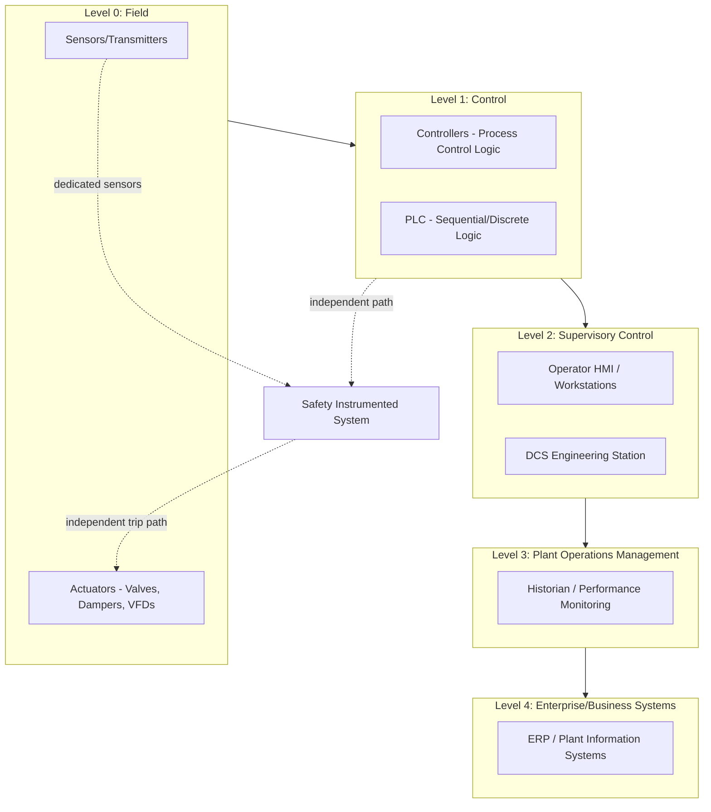

## Power Plant Control and Instrumentation

### Overview

Power plant control and instrumentation (C&I) encompasses the sensing, computation, and actuation systems that monitor plant conditions and automatically or semi-automatically regulate plant operation to meet output demand while maintaining safety, equipment protection, and efficiency. It spans field-level sensors and actuators, the distributed control system (DCS) that executes control logic, protective systems that respond to abnormal conditions, and the human-machine interfaces through which operators supervise the plant. As plants become more automated and more frequently cycled to accommodate variable renewables, C&I systems increasingly determine not just safety and efficiency but also a plant's operational flexibility.

### Instrumentation Fundamentals

**Core Measured Variables**

Power plant instrumentation continuously measures the physical parameters needed to characterize thermodynamic state and equipment health:

- **Temperature:** thermocouples (wide range, robust, lower accuracy) and resistance temperature detectors/RTDs (higher accuracy, narrower range) measure steam, flue gas, bearing, and winding temperatures
- **Pressure:** strain-gauge and capacitive transmitters measure steam pressure, condenser vacuum, and fuel supply pressure; differential pressure transmitters measure flow (via orifice plates/venturi) and level (via hydrostatic head)
- **Flow:** orifice plates, venturi meters, vortex meters, and increasingly ultrasonic/Coriolis meters measure steam, water, fuel, and air flow rates
- **Level:** differential pressure, capacitance, or radar-based level transmitters monitor boiler drum level, condenser hotwell level, and feedwater tank level — drum level is particularly safety-critical (both high and low level pose distinct hazards)
- **Vibration:** proximity probes and accelerometers on turbine and generator bearings detect mechanical imbalance, misalignment, or bearing degradation
- **Electrical parameters:** current/voltage transformers, watt/VAR transducers measure generator output, power factor, and grid synchronization parameters
- **Chemical/emissions:** continuous emissions monitoring systems (CEMS) measure stack NOx, SOx, CO, particulate, and opacity; water chemistry analyzers monitor boiler feedwater conductivity, pH, and dissolved oxygen to control corrosion

**Signal Transmission Standards**

- **4–20 mA analog current loop:** the long-established industrial standard; 4 mA represents the low end of range and 20 mA the high end, with the live-zero (non-zero minimum) allowing wire-break detection since 0 mA clearly indicates a fault rather than a valid low reading
- **HART protocol:** superimposes digital communication on the 4–20 mA analog signal, allowing diagnostic data and configuration alongside the primary analog measurement without replacing existing wiring
- **Fieldbus (FOUNDATION Fieldbus, Profibus):** fully digital, multi-drop communication allowing multiple devices on a single cable run with richer diagnostic and configuration data than 4–20 mA/HART
- **Fiber optic and Ethernet-based industrial protocols:** increasingly used for high-speed data (e.g., vibration monitoring, turbine control) and for integrating C&I with plant-wide information systems

### Control System Architecture

**Distributed Control System (DCS)**

The DCS is the central automation platform for continuous process plants, structured hierarchically:

This layered architecture (broadly following the ISA-95 automation pyramid model) separates real-time control (Level 1, executing on deterministic control loop cycles, typically sub-second) from supervisory and business systems (Levels 2–4, operating on slower timescales), with the Safety Instrumented System maintained as an independent path from the DCS for critical protective functions.

**Programmable Logic Controllers (PLC)**

- Handle discrete/sequential logic: equipment start/stop permissives, interlocks, sequencing of auxiliary systems
- Often integrated with or communicating to the DCS, though historically PLCs and DCS served somewhat distinct roles (PLC for discrete/batch logic, DCS for continuous process control) — modern platforms increasingly blend these capabilities
- Ladder logic and function block programming are the dominant programming paradigms, standardized broadly under IEC 61131-3

### Closed-Loop Control Fundamentals

**PID Control**

The proportional-integral-derivative controller remains the workhorse control algorithm for continuous process variables (temperature, pressure, level, flow):

$$u(t) = K_p e(t) + K_i \int_0^t e(\tau)\, d\tau + K_d \frac{de(t)}{dt}$$

where $u(t)$ is the controller output, $e(t) = SP - PV$ is the error between setpoint and process variable, and $K_p$, $K_i$, $K_d$ are the proportional, integral, and derivative gains respectively.

- **Proportional term:** provides immediate response proportional to current error; alone it leaves steady-state offset (droop)
- **Integral term:** eliminates steady-state offset by accumulating error over time, but excessive integral gain causes overshoot and oscillation
- **Derivative term:** provides anticipatory action based on rate of change of error, improving response to disturbances but is sensitive to measurement noise

**Key Power Plant Control Loops**

- **Boiler drum level (three-element control):** combines drum level, steam flow, and feedwater flow signals to anticipate "shrink and swell" effects (transient level changes caused by pressure changes affecting steam bubble volume in the water, which can mislead a level-only control scheme during load changes)
- **Combustion control:** coordinates fuel flow and airflow to maintain target excess air/oxygen level for complete combustion while minimizing excess air losses and NOx formation
- **Steam temperature control:** attemperation (spray water injection) regulates superheater/reheater outlet steam temperature to protect turbine components from thermal stress while maximizing cycle efficiency
- **Turbine speed/load control:** governor systems regulate steam or fuel flow to maintain grid frequency synchronization and respond to load demand changes
- **Condenser vacuum control:** manages non-condensable gas removal and cooling water flow to maintain optimal condenser backpressure

**Cascade and Feedforward Control**

- **Cascade control:** an outer (primary) control loop's output becomes the setpoint for an inner (secondary) loop, improving disturbance rejection — e.g., a temperature controller's output sets a flow controller's setpoint, so flow disturbances are corrected quickly by the fast inner loop before they propagate to affect temperature
- **Feedforward control:** anticipates the effect of a measured disturbance and adjusts control action proactively, rather than waiting for the disturbance to appear as error in the controlled variable — commonly combined with feedback (PID) trim correction for the residual error feedforward alone cannot perfectly cancel

### Coordinated Control Systems

For plants that must follow variable grid demand, a **Coordinated Control System (CCS)** integrates boiler and turbine control into a single overall control strategy:

- **Boiler-follow mode:** turbine control valve directly sets load in response to grid demand; the boiler control system adjusts firing rate to maintain steam pressure — fast electrical response but slower to fully stabilize thermal balance
- **Turbine-follow mode:** boiler firing rate directly sets load; turbine valve modulates to maintain steam pressure — favors boiler stability but slower electrical response
- **Coordinated mode:** both boiler and turbine control act together based on a unified load demand signal, using predictive/feedforward elements to balance fast electrical response against boiler thermal stability — this is the typical mode for units required to provide meaningful load-following or frequency-regulation service

### Safety Instrumented Systems (SIS)

**Purpose and Independence**

The SIS is architecturally and often physically separate from the DCS, providing an independent layer of protection that trips or shuts down equipment when process conditions exceed safe limits, regardless of whether the DCS is functioning correctly. This independence (separate sensors, separate logic solvers, separate final control elements where practical) is a core safety design principle, preventing a single failure mode from disabling both normal control and protective function.

**Safety Integrity Level (SIL)**

Per IEC 61508/61511 functional safety standards, safety instrumented functions are assigned a SIL rating (SIL 1 through SIL 4) based on required risk reduction, with SIL 4 representing the highest reliability/lowest failure probability requirement. Higher SIL ratings typically require redundant sensor/logic/actuator architectures (e.g., 2-out-of-3 voting) rather than single-channel protection.

**Common Power Plant Protective Functions**

- **Boiler drum high/low level trip:** protects against water carryover into steam lines (high level) or tube overheating from insufficient water (low level)
- **Turbine overspeed trip:** mechanical or electronic overspeed protection rapidly closes steam/fuel admission valves if rotor speed exceeds a safe threshold (relevant during load rejection events, when the mechanical driving torque suddenly exceeds electrical load)
- **Flame failure/combustion safeguard:** immediately cuts fuel supply if flame detection is lost, preventing unburned fuel accumulation and potential furnace explosion
- **Generator protection relays:** detect electrical faults (overcurrent, differential protection, loss of excitation, reverse power) and trip the generator breaker to protect the machine and grid
- **Low condenser vacuum trip:** protects turbine last-stage blades from operating outside their design backpressure envelope

### Human-Machine Interface (HMI) and Operator Interaction

- **Alarm management:** modern plants generate large volumes of alarm data; alarm rationalization (per standards such as ISA-18.2) prioritizes and filters alarms to prevent operator overload during upset conditions ("alarm flood"), a recognized contributor to historical operator-error incidents in complex process industries
- **Trend displays and mimic diagrams:** graphical representations of plant process flow with real-time overlaid data allow operators to maintain situational awareness of overall plant state, not just individual point values
- **Historian systems:** continuously log process data for post-event analysis, performance trending, regulatory reporting, and predictive maintenance analytics

### Startup, Shutdown, and Sequential Control

- **Automated startup sequencing:** modern DCS platforms increasingly automate multi-step startup sequences (auxiliary system starts, boiler light-off, turbine roll and synchronization) with built-in permissive interlocks, reducing startup time and operator workload compared to fully manual sequencing
- **Permissive interlocks:** prevent equipment operation or sequence advancement until prerequisite conditions are satisfied (e.g., preventing fuel valve opening until combustion air flow is confirmed established, per standard boiler purge/light-off safety sequences)
- **Runback and load-shed logic:** automatically reduces plant output or sheds non-critical auxiliary loads in response to equipment degradation or partial failure (e.g., a coal mill trip triggering an automatic runback to a load level sustainable on remaining mills), avoiding a full unit trip where a controlled reduction would preserve continued operation

### Advanced and Emerging Control Approaches

- **Model Predictive Control (MPC):** uses a dynamic process model to predict future behavior over a receding time horizon and optimizes control moves against multiple objectives and constraints simultaneously — increasingly applied to combustion optimization, steam temperature control, and coordinated boiler-turbine control where interacting variables make single-loop PID tuning suboptimal
- **Neural network / data-driven soft sensors:** used where direct measurement is difficult or costly (e.g., inferring NOx formation or unmeasured process states from correlated available measurements), supplementing rather than replacing safety-critical hardware instrumentation
- **Predictive maintenance analytics:** combining vibration, thermal, and historian trend data with machine learning models to forecast component degradation before failure, shifting maintenance strategy from purely time-based toward condition-based approaches
- **[Inference]** The maturity and deployment extent of advanced/AI-based control techniques varies considerably across the industry and by plant vintage; specific vendor platform capabilities should be verified against current documentation rather than assumed uniformly available across the installed fleet

### Worked Example: PID Tuning Check for a Level Control Loop

**Problem:** A boiler drum level controller uses proportional-only control with $K_p = 4$ (%output per % level error). The drum level setpoint is 50% and a step disturbance causes steam flow to increase, creating a sustained load requiring 8% more feedwater valve opening at new equilibrium. Determine the resulting steady-state level offset.

**Solution:**

For proportional-only control, steady-state offset is required to produce the necessary sustained controller output change, since a P-only controller's output is directly proportional to error — it cannot sustain a nonzero output at zero error.

$$\Delta u = K_p \times e_{ss}$$

$$e_{ss} = \frac{\Delta u}{K_p} = \frac{8\%}{4} = 2\%$$

The drum level will settle at a new steady state offset by 2% from the 50% setpoint (i.e., at 48% level, since increased steam demand requiring more feedwater flow is achieved by the controller "seeing" a persistent level error that drives the additional valve opening).

**Engineering interpretation:** this offset is exactly the structural limitation of proportional-only control referenced earlier — it demonstrates concretely why real drum level control loops use PI or three-element control rather than P-only: the drum could not maintain setpoint at varying load without either accepting a persistent offset (undesirable for a safety-relevant level) or adding integral action to drive the steady-state error to zero while the P-term continues to provide fast disturbance response.

### Key Challenges

- **Cybersecurity of industrial control systems:** as DCS and SIS platforms adopt more networked and Ethernet-based architectures for data availability, they become exposed to cybersecurity risks that were largely absent from legacy isolated analog/proprietary systems; standards such as IEC 62443 address industrial control system security, and air-gapping/network segmentation between IT and OT (operational technology) networks remains a core mitigation strategy
- **Legacy system integration:** many operating plants run older analog or first-generation digital control systems; integrating modern instrumentation, historian, and analytics capability with legacy DCS platforms (or planning full DCS replacement/migration) is a recurring capital planning challenge
- **Increased cycling demands on control systems:** as covered in load/dispatch topics, more frequent load-following and cycling duty places greater demands on coordinated control system tuning and startup sequence automation than these systems were often originally designed for
- **Alarm flood management during upset conditions:** even with rationalized alarm systems, rapidly cascading abnormal conditions can still generate alarm volumes that challenge operator response capacity, an ongoing focus of human factors engineering in control room design

**Key Points**

- The DCS/PLC/SIS architecture separates continuous process control, discrete sequencing, and independent safety protection into distinct but coordinated layers.
- PID control remains the foundational closed-loop control algorithm, with cascade, feedforward, and coordinated control strategies layered on top to address specific power plant dynamic challenges (drum level shrink/swell, boiler-turbine load coordination).
- Safety instrumented systems are deliberately architected as independent of the DCS, with SIL ratings per IEC 61508/61511 governing the required reliability of specific protective functions.
- Advanced techniques (MPC, data-driven soft sensors, predictive maintenance) are increasingly layered onto traditional control architectures, particularly to manage the added complexity of cycling operation and multi-variable interactions.

**Related Topics**

- Boiler Drum Level Control and Three-Element Control Strategy
- Turbine Governor Systems and Grid Frequency Response
- Combustion Control and NOx Optimization
- Safety Instrumented Systems and IEC 61508/61511 Functional Safety
- Industrial Control System Cybersecurity (IEC 62443)
- Model Predictive Control Applications in Power Generation
- Alarm Management and Human Factors in Control Room Design
- Load Curves, Dispatch, and Part-Load Operation