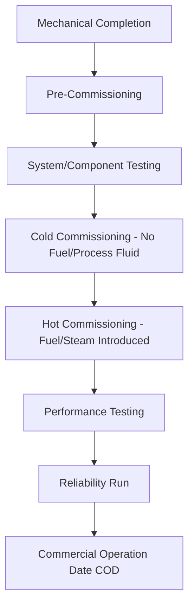
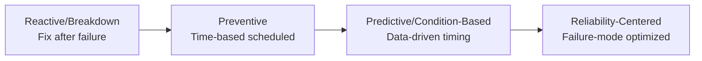

## Commissioning, Operation, and Maintenance

### Overview

Commissioning, operation, and maintenance (frequently abbreviated O&M, with commissioning as the preceding transitional phase) together cover the full lifecycle of a power plant from construction handover through decades of productive service. Commissioning verifies that installed systems perform as designed before commercial operation begins; operation encompasses the day-to-day and long-term running of the plant to deliver reliable, efficient output; maintenance encompasses the activities that preserve equipment condition and prevent or address degradation and failure. These phases are interdependent — commissioning quality directly affects early operational reliability, and maintenance strategy directly determines long-term availability and heat rate performance.

### Commissioning

**Purpose and Scope**

Commissioning is the structured, documented process of verifying that plant systems are installed correctly, function according to design intent, and are safe to operate — bridging the gap between mechanical construction completion and commercial operation.

**Commissioning Phases**

- **Pre-commissioning:** verification that installed equipment matches design (loop checks confirming instrument signals reach the DCS correctly, motor rotation checks, piping flushing/blowing to remove construction debris, electrical continuity and insulation resistance testing)
- **Cold commissioning:** functional testing of systems without introducing fuel, steam, or process fluids at operating conditions — e.g., water-filling and hydrostatic pressure testing of piping and pressure vessels, control loop functional tests, interlock and permissive verification
- **Hot commissioning:** introduction of actual process conditions — first fire/first steam, initial turbine roll, first synchronization to the grid — conducted under close supervision with heightened safety precautions given the introduction of high-energy conditions for the first time
- **Performance testing:** formal tests (often per standards such as ASME PTC — Performance Test Codes) to verify the plant meets contractual guarantees for output, heat rate/efficiency, and emissions, typically forming the basis for final payment milestones and warranty commencement in an EPC (engineering-procurement-construction) contract structure
- **Reliability run:** a sustained continuous operation period (commonly on the order of weeks) demonstrating the plant can run reliably at or near rated output before being formally declared in commercial operation

**Key Commissioning Activities by Discipline**

- **Mechanical:** rotating equipment alignment and vibration baseline testing, piping system flushing and cleanliness verification, valve stroke testing, relief valve set-point verification
- **Electrical:** protection relay testing and coordination verification, generator excitation system testing, switchgear functional testing, grounding system verification
- **Instrumentation and Control:** loop checks (verifying each sensor signal path from field device through to DCS display and any associated control action), control logic functional testing, SIS proof testing, alarm verification
- **Chemistry:** boiler/system chemical cleaning (removing mill scale and construction contaminants from steam-water circuit piping before operation), initial water chemistry conditioning, fuel quality verification

**Punch Lists and Handover**

Outstanding minor deficiencies identified during commissioning are typically tracked as punch list items, categorized (e.g., items preventing safe operation vs. items acceptable to complete post-startup) and tracked to closure as part of the formal handover from the construction/EPC contractor to the plant owner/operator.

### Operation

**Operating Modes**

- **Baseload operation:** continuous operation at or near rated capacity with minimal load variation, typical of nuclear and historically coal plants
- **Load-following operation:** output varies to track system demand or grid signals throughout the day, common for flexible gas and hydro plants and increasingly required of traditionally baseload units as renewable penetration increases
- **Peaking operation:** infrequent operation, typically only during high-demand periods, with emphasis on fast startup capability over sustained efficiency
- **Two-shifting:** a specific cycling pattern where a unit starts up each morning and shuts down each night, common for units serving daily peak demand without sufficient economic justification for continuous overnight operation

**Operator Roles and Responsibilities**

- **Control room operators:** continuously monitor plant parameters via the DCS/HMI, respond to alarms, execute routine control actions (load changes, equipment switching), and coordinate with system operators/grid dispatch for load instructions
- **Field/auxiliary operators:** perform physical rounds, local equipment checks, valve operations not automated, and visual inspections that complement remote instrumentation
- **Shift supervisors/plant management:** oversee overall shift operation, coordinate with maintenance for work permits, and manage abnormal condition response escalation

**Standard Operating Procedures (SOPs)**

Formal written procedures govern routine and non-routine operations: normal startup/shutdown sequences, load change procedures, equipment switching (e.g., transferring between redundant pumps), and abnormal/emergency response procedures. SOP adherence, combined with operator training and simulator practice (common for larger thermal and nuclear plants), is a primary defense against operational error.

**Operational Performance Monitoring**

- Continuous tracking of heat rate, capacity factor, and forced outage rate against targets/benchmarks
- Deviation analysis: investigating gaps between actual and expected performance (e.g., heat rate degradation trending) to identify developing equipment issues before they cause forced outages
- Regulatory and environmental compliance monitoring: continuous emissions monitoring system (CEMS) data, water discharge permit compliance, noise monitoring where applicable

### Maintenance Strategies

**Maintenance Philosophy Spectrum**

**1. Reactive (Breakdown) Maintenance**

Repair performed only after failure occurs. Lowest planning overhead but highest risk of unplanned outages, secondary/cascading damage, and safety incidents. Generally reserved for non-critical, low-consequence, low-cost-to-replace components rather than used as a primary strategy for major equipment.

**2. Preventive Maintenance (PM)**

Scheduled maintenance performed at fixed time or run-hour intervals regardless of actual equipment condition, based on statistical failure-rate data or manufacturer recommendations (e.g., lubricant changes at fixed intervals, filter replacement, periodic inspection).

- Advantage: predictable, plannable, avoids most catastrophic failures for well-characterized failure modes
- Disadvantage: can result in unnecessary maintenance on equipment still in good condition (over-maintenance), or fail to catch equipment degrading faster than the statistical average (under-maintenance for that specific unit)

**3. Predictive Maintenance (PdM) / Condition-Based Maintenance (CBM)**

Maintenance timing driven by actual measured equipment condition rather than fixed schedule, using techniques such as:

- **Vibration analysis:** detects bearing wear, misalignment, imbalance, and looseness in rotating equipment before failure
- **Oil analysis:** tracks lubricant degradation, contamination, and wear metal content as indicators of internal component condition
- **Thermography (infrared):** identifies electrical connection hot spots, insulation degradation, and mechanical friction points
- **Ultrasonic testing:** detects wall thinning (corrosion/erosion) in piping and pressure components, and can detect early-stage bearing defects and compressed air/steam leaks
- **Motor current signature analysis (MCSA):** detects rotor bar defects and mechanical issues in electric motors via analysis of current waveform characteristics

Predictive maintenance generally aims to reduce both unnecessary preventive work and unplanned failures by targeting maintenance timing to actual degradation trajectory, though it requires investment in monitoring instrumentation, data infrastructure, and analytical capability to be effective.

**4. Reliability-Centered Maintenance (RCM)**

A structured analytical methodology (originating from aviation industry practice, formalized in standards such as SAE JA1011) that systematically determines the optimal maintenance strategy for each component based on:

- Failure modes and their consequences (safety, environmental, operational, economic)
- Whether the failure is age-related (favoring time-based PM) or random (favoring condition-based monitoring or run-to-failure)
- The criticality of the function to overall plant operation and safety

RCM analysis often results in a mixed maintenance strategy across a plant — critical, age-related-failure components on scheduled PM; critical components with random or gradually-detectable failure modes on condition monitoring; and genuinely low-consequence components on run-to-failure — rather than applying a single strategy uniformly.

### Major Overhaul Planning

**Outage Types**

- **Minor/routine outages:** short-duration (days), addressing scheduled minor maintenance and inspection items, often without major disassembly
- **Major overhauls:** extended-duration (weeks to months), involving significant disassembly and inspection of major equipment (turbine internals, boiler pressure parts, generator rotor), typically scheduled on a multi-year interval (commonly cited ranges of roughly 3–6 years for major gas/steam turbine overhauls, though specific intervals are manufacturer- and duty-cycle-dependent)
- **Forced outages:** unplanned, resulting from equipment failure or protective trip, distinct from and generally more costly per event than planned outages due to lost generation revenue at unpredictable timing and often more extensive repair scope

**Outage Planning Considerations**

- Scheduling during the system's lower-demand season minimizes the reliability and economic impact of taking the unit offline
- Critical path scheduling coordinates the sequence of inspection, repair, and reassembly activities, since major overhauls involve numerous interdependent work streams (e.g., turbine casing cannot be reassembled until rotor inspection/repair and internal component work is complete)
- Spare parts and long-lead-time component procurement (e.g., replacement turbine blades, generator rotor rewind materials) must be planned well in advance given manufacturing lead times that can extend to many months
- **[Inference]** Specific overhaul intervals and scope vary considerably by original equipment manufacturer (OEM) recommendations, duty cycle severity (cycling units typically require more frequent inspection than steady baseload units), and site-specific operating experience — actual intervals should be established per the applicable OEM maintenance manual and the plant's own reliability history rather than a fixed universal number

### Key Performance and Reliability Metrics

| Metric | Definition | Purpose |
| --- | --- | --- |
| Equivalent Availability Factor (EAF) | Time available for service (adjusted for partial derates) / total period | Overall reliability including partial-capacity impacts |
| Forced Outage Rate (FOR) | Forced outage hours / (forced outage hours + service hours) | Unplanned reliability performance |
| Mean Time Between Failures (MTBF) | Average operating time between failures | Component/system reliability trending |
| Mean Time To Repair (MTTR) | Average time to restore service after failure | Maintenance responsiveness and effectiveness |
| Planned Outage Factor | Planned outage hours / total period hours | Scheduled maintenance burden |

These metrics are typically benchmarked against industry databases (e.g., generation availability data systems maintained by industry associations in various regions) to compare a given unit's performance against fleet-wide peers of similar technology and vintage.

### Worked Example: Maintenance Strategy Cost Comparison

**Problem:** A critical cooling water pump has a reactive-maintenance failure cost (including collateral damage and unplanned outage) of $180,000 per failure event, occurring on average once every 3 years under a reactive strategy. A predictive maintenance program (vibration monitoring) is estimated to cost $15,000/year and would allow planned replacement before failure, at a planned maintenance cost of $25,000, with failures reduced to a rare residual rate of once every 15 years. Compare annualized costs.

**Solution:**

**Reactive strategy annualized cost:**

$$C_{reactive} = \frac{\$180{,}000}{3\ \text{years}} = \$60{,}000/\text{year}$$

**Predictive strategy annualized cost:**

$$C_{predictive} = \$15{,}000\ (\text{monitoring}) + \frac{\$25{,}000}{X} + \frac{\$180{,}000}{15\ \text{years}}\ (\text{residual failure risk})$$

Assuming planned replacement is needed roughly once every 5 years based on condition data (illustrative planning assumption, since planned replacement frequency itself is a design input, not calculated from given data):

$$C_{predictive} = \$15{,}000 + \frac{\$25{,}000}{5} + \frac{\$180{,}000}{15} = \$15{,}000 + \$5{,}000 + \$12{,}000 = \$32{,}000/\text{year}$$

**Comparison:** the predictive strategy's estimated annualized cost ($32,000/year) is lower than the reactive strategy ($60,000/year), a difference of $28,000/year — illustrating the general economic case for predictive/condition-based maintenance on critical, high-failure-consequence equipment.

**[Inference]** This worked example uses assumed/illustrative cost and interval figures to demonstrate the annualized-cost comparison methodology; real maintenance strategy decisions require plant-specific failure data, monitoring program costs, and consequence-of-failure estimates rather than the illustrative values used here.

### Key Challenges

- **Balancing cycling duty against maintenance life:** as covered in dispatch and control topics, increased cycling to accommodate renewable variability accelerates component fatigue life consumption relative to original steady-baseload design assumptions, requiring maintenance interval and scope reassessment for units transitioning to more flexible duty
- **Aging fleet and obsolescence:** older plants face increasing difficulty sourcing OEM spare parts (particularly for discontinued equipment lines or DCS platforms), driving decisions between costly custom fabrication, platform upgrades, or unit retirement
- **Workforce and knowledge retention:** experienced operations and maintenance personnel retirement, combined with increasing automation, creates knowledge transfer challenges, particularly for less-common failure modes and legacy system troubleshooting
- **Commissioning schedule pressure:** commercial pressure to reach commercial operation date can create tension with commissioning thoroughness; inadequate commissioning is a recognized contributor to early-life reliability problems ("infant mortality" failure patterns) in the bathtub-curve reliability model
- **Data infrastructure for predictive maintenance:** realizing the benefits of condition-based/predictive strategies requires reliable sensor networks, data historians, and analytical capability — retrofitting this onto older plants not originally designed with extensive condition-monitoring instrumentation is a nontrivial capital and integration undertaking

**Key Points**

- Commissioning proceeds through pre-commissioning, cold commissioning, hot commissioning, and performance/reliability testing before commercial operation — thoroughness here directly affects early-life reliability.
- Maintenance strategy exists on a spectrum from reactive through preventive, predictive/condition-based, to reliability-centered maintenance, with RCM typically producing a mixed strategy tailored to each component's failure mode and consequence.
- Standard reliability metrics (EAF, FOR, MTBF, MTTR) provide the quantitative basis for benchmarking operational performance and justifying maintenance strategy investment.
- Increasing cycling duty from renewable integration is reshaping maintenance planning industry-wide, requiring reassessment of overhaul intervals and component life assumptions originally based on steady baseload operation.

**Related Topics**

- Reliability-Centered Maintenance (RCM) Methodology
- Plant Performance Testing per ASME PTC Standards
- Load Curves, Dispatch, and Part-Load Operation
- Power Plant Control and Instrumentation
- Turbine and Generator Vibration Monitoring
- EPC Contract Structures and Commissioning Milestones
- Plant Life Extension and Component Life Assessment
- Spare Parts and Outage Planning Logistics