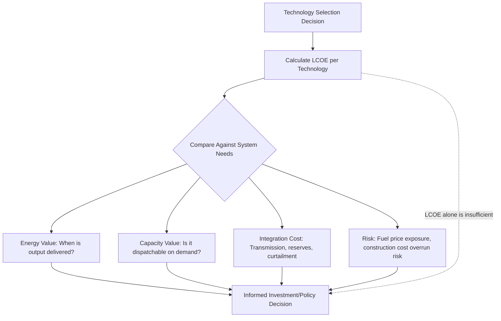

## Economic Analysis and the Levelized Cost of Electricity

### Overview

Economic analysis of power generation provides the financial framework for comparing technologies, evaluating investment decisions, and setting electricity pricing. The Levelized Cost of Electricity (LCOE) is the central metric in this framework — a single per-unit-energy cost figure that aggregates capital, financing, fuel, and operating costs over a plant's economic life into a comparable value across technologies with fundamentally different cost structures (e.g., high-capital/low-fuel renewables versus lower-capital/high-fuel-cost gas plants). While widely used, LCOE has well-recognized limitations that require careful interpretation alongside complementary economic metrics.

### Levelized Cost of Electricity (LCOE)

**Core Formula**

$$LCOE = \frac{\sum_{t=0}^{n} \dfrac{C_t + O\&M_t + F_t}{(1+r)^t}}{\sum_{t=0}^{n} \dfrac{E_t}{(1+r)^t}}$$

where $C_t$ is capital expenditure in year $t$, $O\&M_t$ is operations and maintenance cost, $F_t$ is fuel cost, $E_t$ is electricity generated (MWh), $r$ is the discount rate, and $n$ is the plant's economic life in years.

In essence, LCOE is the ratio of the present value of total lifetime costs to the present value of total lifetime energy output — expressed as a cost per unit of energy (e.g., $/MWh or ¢/kWh) that, if charged for every unit of electricity produced, would exactly recover all costs including the required return on capital.

**Simplified Annualized Form**

For a plant with roughly constant annual output and O&M cost after construction, a simplified form is often used:

$$LCOE = \frac{CRF \times CAPEX + Fixed\ O\&M}{CF \times 8760} + Variable\ O\&M + \frac{HR \times Fuel\ Price}{10^6}$$

where $CRF$ is the capital recovery factor (converting a lump-sum capital cost into an equivalent annual payment) and $CF$ is capacity factor.

**Capital Recovery Factor**

$$CRF = \frac{r(1+r)^n}{(1+r)^n - 1}$$

This factor annuitizes the initial capital investment — spreading it into a fixed annual payment (analogous to a mortgage payment) over the plant's economic life at the given discount rate, allowing it to be combined with ongoing annual costs in the simplified LCOE formula.

### Cost Components

**1. Capital Expenditure (CAPEX)**

- Overnight capital cost: the cost of building the plant "overnight" (ignoring financing/interest during construction), typically expressed in $/kW of installed capacity
- All-in capital cost: includes interest during construction (IDC), which can be substantial for long-construction-duration technologies (nuclear, large hydro) versus fast-build technologies (gas peakers, solar)
- Capital cost per kW varies enormously by technology, site conditions, and region

| Technology | Typical Overnight Capital Cost ($/kW) | Typical Construction Duration |
| --- | --- | --- |
| Utility-scale solar PV | 800–1,500 | 0.5–1.5 years |
| Onshore wind | 1,200–1,800 | 1–2 years |
| Offshore wind | 3,000–5,500 | 2–4 years |
| Combined-cycle gas (CCGT) | 900–1,300 | 2–3 years |
| Simple-cycle gas | 700–1,100 | 1–2 years |
| Coal (supercritical) | 2,000–3,500 | 4–6 years |
| Nuclear | 6,000–12,000+ | 6–12+ years |
| Battery storage (per kW, duration-dependent) | 300–1,500+ | 0.5–1 year |

**[Unverified]** Capital cost figures are highly volatile with commodity prices, supply chain conditions, regional labor costs, and financing conditions; these ranges are broadly representative but should be checked against current market data (e.g., NREL Annual Technology Baseline, IEA World Energy Investment reports, or region-specific utility filings) for any actual project evaluation, as they shift meaningfully year to year.

**2. Fixed Operations and Maintenance (Fixed O&M)**

- Costs independent of how much electricity is generated: staffing, routine inspections, insurance, property taxes, scheduled preventive maintenance base cost
- Typically expressed in $/kW-year

**3. Variable Operations and Maintenance (Variable O&M)**

- Costs that scale with generation output: consumables, wear-based maintenance tied to operating hours, water treatment chemicals
- Typically expressed in $/MWh

**4. Fuel Cost**

- Directly tied to heat rate (fuel consumption per MWh) and fuel price, as covered in efficiency/heat rate topics: $Fuel\ Cost\ (\$/MWh) = HR \times Fuel\ Price\ (\$/energy\ unit)$
- Zero for wind and solar (a defining structural advantage in LCOE comparisons), present but low for nuclear (fuel cost is a small fraction of nuclear generation cost, with capital dominating), and often the largest single component for fossil-fueled plants

**5. Discount Rate**

- Reflects the cost of capital (weighted average cost of debt and equity financing) and risk premium associated with the specific technology, market, and jurisdiction
- Higher discount rates disproportionately penalize capital-intensive, long-life technologies (nuclear, large hydro) relative to fuel-cost-dominated technologies, since a larger share of the former's cost is far in the future or front-loaded and thus more heavily discounted
- **[Inference]** Selecting an appropriate discount rate is one of the most consequential and most debated assumptions in any LCOE calculation, since it can shift relative technology rankings substantially; sensitivity analysis across a range of discount rates is standard practice for this reason

### Worked Example: LCOE Calculation for a Gas Plant

**Problem:** A 500 MW CCGT plant has overnight capital cost of $1,100/kW, fixed O&M of $15/kW-year, variable O&M of $3/MWh, heat rate of 6,400 Btu/kWh, natural gas price of $4.00/MMBtu, capacity factor of 55%, discount rate of 7%, and economic life of 25 years. Calculate LCOE.

**Solution:**

**Step 1 — Capital Recovery Factor:**

$$CRF = \frac{0.07(1.07)^{25}}{(1.07)^{25} - 1} = \frac{0.07 \times 5.427}{5.427 - 1} = \frac{0.3799}{4.427} = 0.0858$$

**Step 2 — Annualized capital cost per kW:**

$$Annual\ CAPEX = 0.0858 \times \$1{,}100/\text{kW} = \$94.4/\text{kW-year}$$

**Step 3 — Annual energy output per kW of capacity:**

$$E_{annual} = CF \times 8760\ \text{h} = 0.55 \times 8760 = 4{,}818\ \text{kWh/kW-year}$$

**Step 4 — Capital + Fixed O&M component of LCOE:**

$$LCOE_{capital+fixed} = \frac{\$94.4 + \$15}{4{,}818\ \text{kWh}} \times 1000 = \frac{\$109.4}{4.818\ \text{MWh}} = \$22.71/\text{MWh}$$

**Step 5 — Fuel cost component:**

$$Fuel\ Cost = HR \times Fuel\ Price = 6{,}400\ \text{Btu/kWh} \times \$4.00/\text{MMBtu} \times \frac{1\ \text{MMBtu}}{10^6\ \text{Btu}} \times 1000\ \text{kWh/MWh}$$

$$Fuel\ Cost = 6{,}400 \times 4.00 \times 10^{-3} = \$25.60/\text{MWh}$$

**Step 6 — Total LCOE:**

$$LCOE = \$22.71\ (\text{capital+fixed O\&M}) + \$3.00\ (\text{variable O\&M}) + \$25.60\ (\text{fuel}) = \$51.31/\text{MWh}$$

**Interpretation:** for this illustrative CCGT plant, fuel cost is the largest single LCOE component (~50% of total), consistent with the general pattern that gas plant economics are dominated by fuel price exposure rather than capital cost — the inverse of the typical cost structure for wind or solar, where capital cost dominates and fuel cost is zero.

### Limitations of LCOE

**1. Ignores Temporal Value of Generation**

LCOE treats all MWh as equally valuable regardless of when they are produced. In reality, electricity value varies significantly by time of day and season (as covered in load curve/dispatch topics) — a MWh delivered during system peak demand is typically worth more than one delivered during an overnight trough or, increasingly, during a midday solar glut. Variable renewables' LCOE advantage can therefore overstate their economic value if their generation profile poorly matches high-value demand periods (a phenomenon sometimes discussed as "value deflation" or the need for a value-adjusted LCOE).

**2. Ignores System Integration Costs**

LCOE is calculated at the individual plant level and does not capture costs imposed on the broader system by a given technology's characteristics — additional transmission needed for remote renewable resources, additional balancing/reserve capacity needed to manage variable output, or curtailment costs when renewable output exceeds what the grid can absorb at a given moment.

**3. Sensitive to Assumptions**

Discount rate, capacity factor, fuel price forecast, and economic life assumptions all materially affect LCOE, and reasonable analysts can select meaningfully different values for each — meaning LCOE comparisons should always be examined alongside their underlying assumptions rather than treated as objective, assumption-free figures.

**4. Doesn't Capture Reliability/Capacity Value**

A dispatchable plant that can be relied upon to generate on demand provides system value (capacity/reliability contribution) beyond its energy output that a purely energy-based LCOE metric does not capture — this is part of the motivation for capacity markets and capacity payments as a complement to energy-only market revenue in many jurisdictions.

### Complementary Economic Metrics

**Levelized Cost of Storage (LCOS)**

An analogous metric for storage technologies, accounting for round-trip efficiency losses, cycle life/degradation, and charging cost, since storage's economic role (time-shifting energy) differs fundamentally from generation's.

**Net Present Value (NPV) and Internal Rate of Return (IRR)**

Standard capital budgeting metrics applied to full project cash flows (including revenue, not just cost), used for investment decision-making rather than technology cost comparison:

$$NPV = \sum_{t=0}^{n} \frac{CF_t}{(1+r)^t}$$

where $CF_t$ is net cash flow (revenue minus costs) in year $t$. IRR is the discount rate at which NPV equals zero — the project's implied rate of return, compared against the investor's required hurdle rate to assess investment attractiveness.

**Value-Adjusted LCOE (VALCOE)**

An extension developed to address LCOE's temporal-value blindness, incorporating energy value (time-weighted by wholesale price), capacity value, and flexibility value alongside the traditional cost components — providing a more complete (though more complex and assumption-dependent) basis for cross-technology comparison.

**Payback Period**

Simple metric: time required for cumulative net cash flow to recover initial investment. Easy to communicate but ignores cash flows beyond the payback point and does not account for time value of money (unless a discounted payback period variant is used).

### LCOE Comparison Framework

### Financing Structure Impact

- **Debt-to-equity ratio (gearing):** higher debt financing typically lowers the weighted average cost of capital (since debt is usually cheaper than equity) but increases financial risk and sensitivity to interest rate and revenue variability
- **Power Purchase Agreements (PPAs):** long-term contracted revenue (fixed or indexed price) reduces revenue risk and can lower the achievable financing cost/discount rate compared to merchant (wholesale market-exposed) projects, directly lowering LCOE through the discount rate channel
- **Government incentives:** tax credits (e.g., investment tax credits, production tax credits in various jurisdictions), accelerated depreciation, and subsidized financing directly reduce effective capital or operating cost inputs to the LCOE calculation, and are a major reason "as-built" project economics can differ substantially from unsubsidized LCOE figures often cited in public comparisons

### Key Challenges

- **Forecasting long-lived cost inputs:** fuel price, especially for 20–40 year plant lives, is inherently uncertain; LCOE calculations typically use current prices or a forecast curve, both of which carry substantial long-term uncertainty
- **Comparing dispatchable and variable resources on a single metric:** the LCOE limitation regarding temporal/capacity value is not a minor technicality — it is increasingly recognized as a first-order issue for policy and planning decisions as variable renewable penetration grows, driving continued development of value-adjusted metrics
- **Regional cost variation:** labor cost, permitting timelines, interconnection costs, and available incentive structures vary enormously by region, meaning LCOE figures from one market/jurisdiction often transfer poorly to another without adjustment
- **Rapidly changing technology costs:** capital costs for solar, wind, and battery storage have historically declined rapidly (learning-curve effects), meaning LCOE comparisons can become outdated quickly if not periodically refreshed with current cost data

**Key Points**

- LCOE aggregates capital (via capital recovery factor), fixed O&M, variable O&M, and fuel cost into a single $/MWh figure using discounted cash flow principles.
- Discount rate assumptions disproportionately affect capital-intensive technologies and are among the most consequential and debated inputs to any LCOE calculation.
- LCOE's core limitation is that it treats all generated energy as equally valuable, ignoring when energy is delivered and whether the technology can be dispatched on demand — driving development of complementary metrics like VALCOE.
- LCOE should be interpreted alongside NPV/IRR (investment decision-making), system integration costs, and capacity/reliability value rather than used as a standalone technology comparison metric.

**Related Topics**

- Plant Efficiency, Heat Rate, and Capacity Factor
- Load Curves, Dispatch, and Part-Load Operation
- Capacity Markets and Resource Adequacy
- Power Purchase Agreement (PPA) Structures
- Discounted Cash Flow Analysis for Energy Projects
- Energy Storage Economics and Levelized Cost of Storage
- Renewable Energy Incentive Structures and Tax Policy
- Grid Integration Costs of Variable Renewable Energy